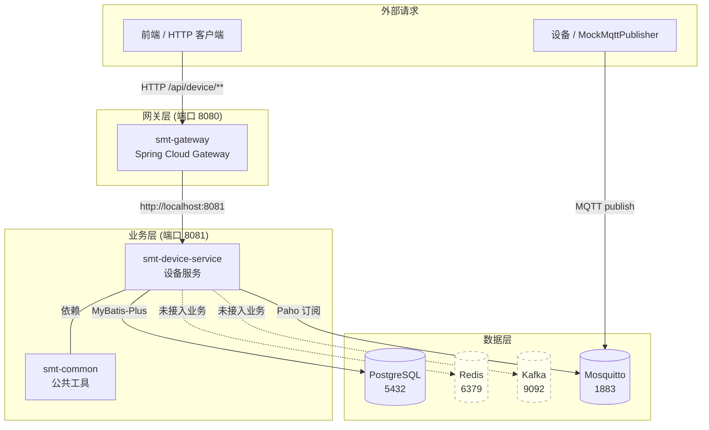
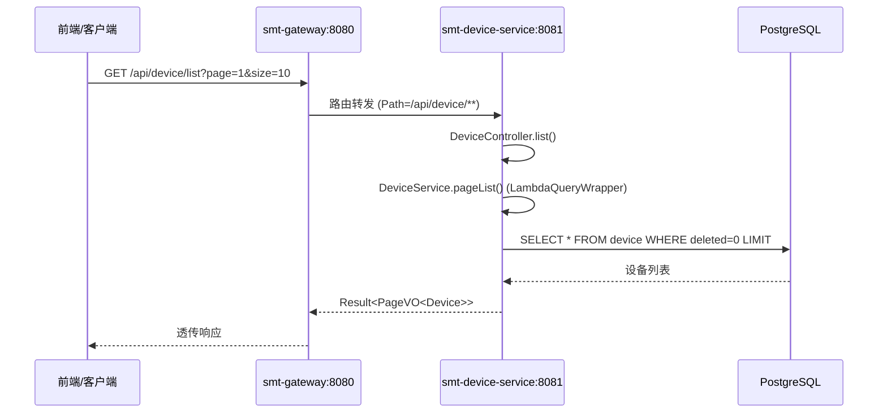
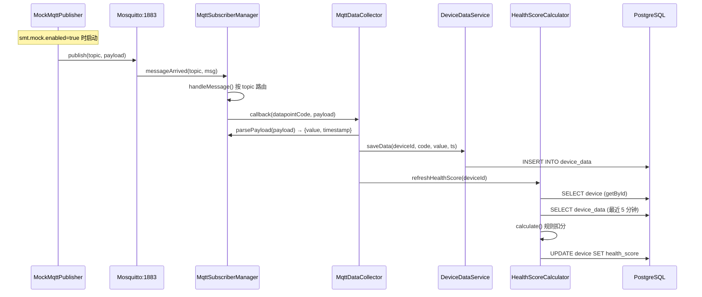
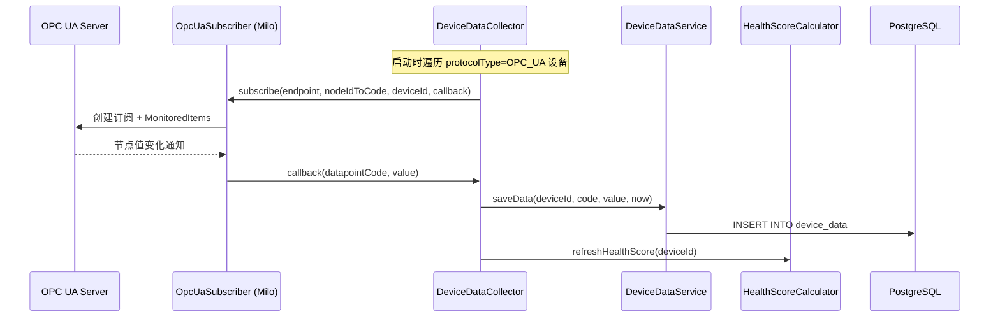
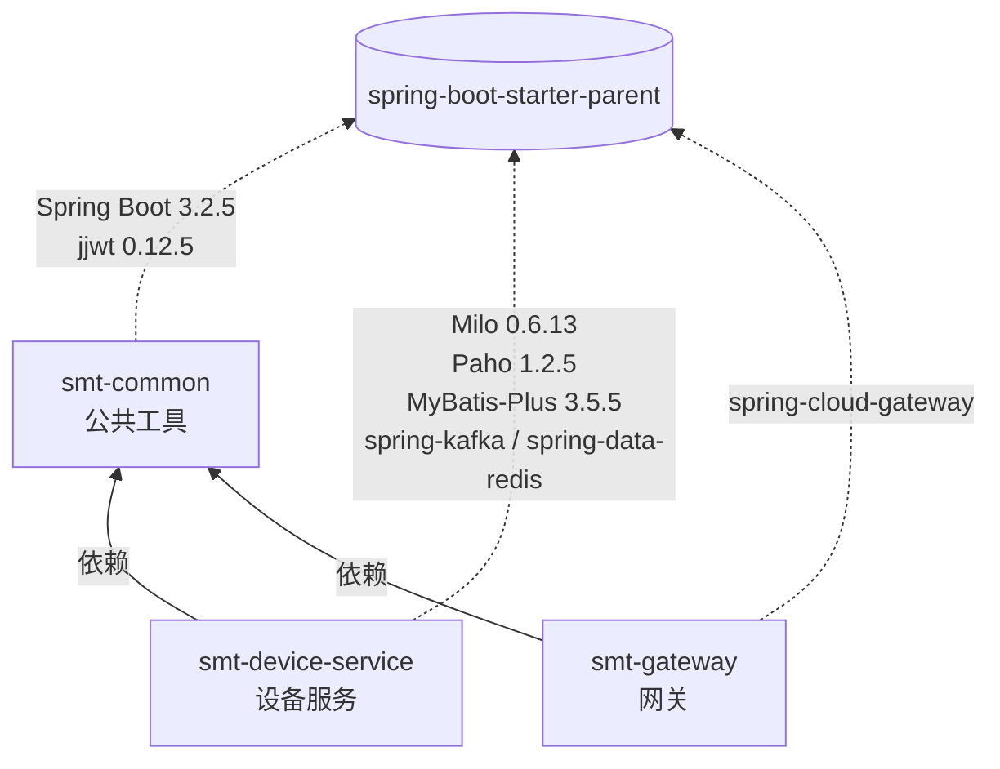
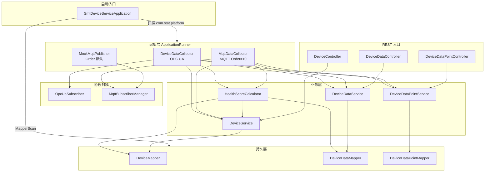
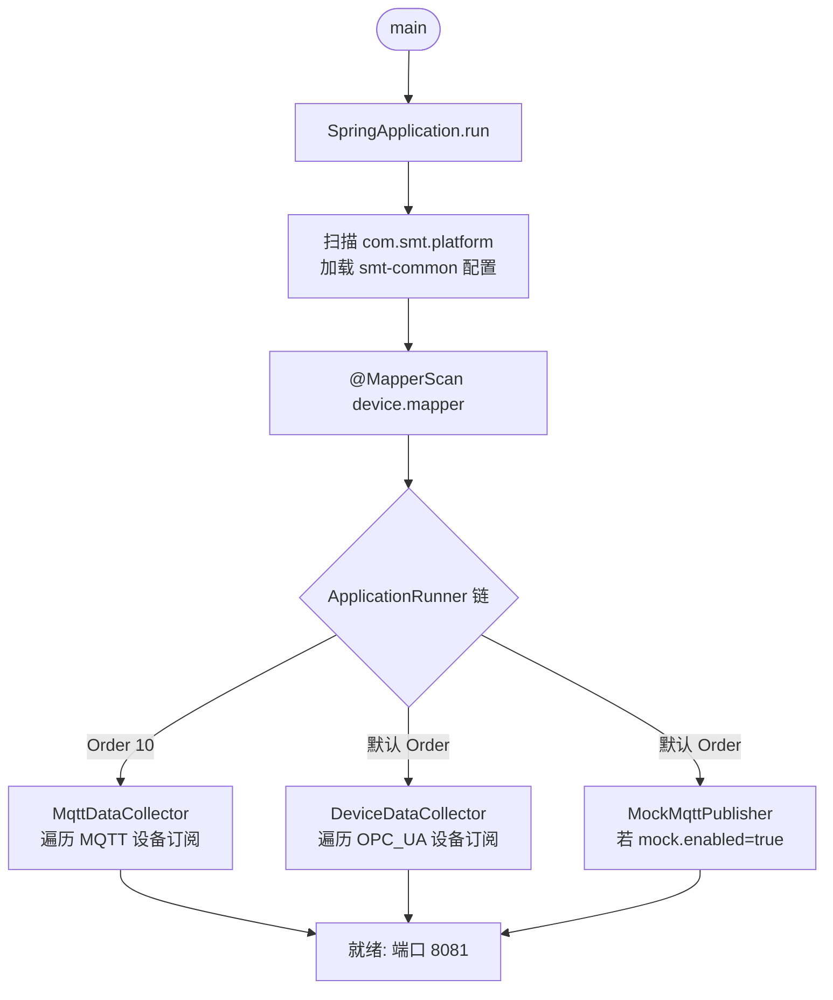

# SMT 贴片产线智能运维与调度平台 —— 项目说明报告（Phase 1）

| 项 | 值 |
|---|---|
| 项目名称 | `smt-agent-platform` —— SMT 贴片产线智能运维与调度系统 |
| 当前阶段 | Phase 1：Java 服务底座 + 设备数据接入（PRD 路线图第 1-2 月） |
| 报告日期 | 2026-06-28 |
| 报告范围 | 已交付代码（`java-backend/`、`docker-compose/`、`scripts/`、`docs/`、`api-contracts/`）+ 阶段进度 + 架构 + 调用逻辑 + 风险摘要 + 路线图 |
| 目标读者 | 项目内开发人员 |
| 对照基准 | [`docs/PRD.md`](file:///home/north30/projects/Personal/smt-agent-platform/docs/PRD.md)、[`docs/DIR.md`](file:///home/north30/projects/Personal/smt-agent-platform/docs/DIR.md)、[`.trae/specs/phase1-java-device-foundation/spec.md`](file:///home/north30/projects/Personal/smt-agent-platform/.trae/specs/phase1-java-device-foundation/spec.md) |
| Git 状态 | 分支 `feature/initial-scaffold`，8 次提交，未合并至 `main` |

---

## 一、总体概述

本项目定位为面向电子制造 SMT（表面贴装）生产线的工业智能体平台，通过多智能体协同实现"感知—决策—规划—执行"全链路运营闭环。完整规划为 5 个阶段、约 10 个月交付周期（详见 [PRD §6](file:///home/north30/projects/Personal/smt-agent-platform/docs/PRD.md)）。

**当前进度一句话**：Phase 1（Java 服务底座 + 设备数据接入）代码层面已基本交付完成，全量编译通过、47 个单元测试全绿；尚未合并至 `main` 分支，端到端运行验证因本机 Docker Hub 不可达而跳过。

**已交付**：Java Maven 多模块工程（`smt-common` / `smt-gateway` / `smt-device-service`）、PostgreSQL + Redis + Kafka + Mosquitto 中间件编排、设备台账 CRUD、采集点配置、OPC UA + MQTT 双通道数据接入、实时数据存储与历史查询、简易健康评分、Mock 数据生成器、OpenAPI 契约、数据库 DDL。

**未交付**（属后续阶段）：Python 智能体层（5 个 Agent）、C++ 原生层、前端可视化、`smt-order-service` / `smt-quality-service` / `smt-notification-service` / `smt-agent-router` 等 Java 微服务、Modbus 协议、Spring Security + RBAC、InfluxDB 时序库、Kafka 业务接入。

---

## 二、开发阶段与进度

### 2.1 路线图总览（PRD §6）

| 阶段 | 周期 | 核心交付 | 状态 |
|---|---|---|---|
| **Phase 1** | 第 1-2 月 | Java 服务底座 + 设备数据接入 | 🟡 代码完成，端到端验证待补 |
| Phase 2 | 第 3-4 月 | 知识助手 Agent（RAG）+ 设备运维 Agent | ⬜ 未启动 |
| Phase 3 | 第 5-6 月 | 质量分析 Agent + 调度 Agent | ⬜ 未启动 |
| Phase 4 | 第 7-8 月 | 执行协同 Agent + 全流程闭环 | ⬜ 未启动 |
| Phase 5 | 第 9-10 月 | 系统集成测试 + 产线试点 | ⬜ 未启动 |

### 2.2 Phase 1 详细进度

依据 [`.trae/specs/phase1-java-device-foundation/checklist.md`](file:///home/north30/projects/Personal/smt-agent-platform/.trae/specs/phase1-java-device-foundation/checklist.md)：

| # | 交付项 | 状态 | 备注 |
|---|---|---|---|
| 1 | 项目基础设施（`.gitignore`、`.editorconfig`、`docker-compose.yml`、`scripts/`） | ✅ | |
| 2 | docker-compose 启动 PG/Redis/Kafka/Zookeeper/Mosquitto | ⚠️ | 编排正确，本机 Docker Hub 不可达未实跑 |
| 3 | Java 父 POM + 三子模块编译通过 | ✅ | `mvn clean install -DskipTests` 通过 |
| 4 | `smt-common`（Result/BizException/JwtUtil/配置）+ 单测 | ✅ | |
| 5 | `smt-gateway` 路由 `/api/device/**` + CORS | ✅ | 直连 `localhost:8081`，未用服务发现 |
| 6 | 设备台账 CRUD + 分页筛选 + 软删除 | ✅ | |
| 7 | 采集点配置（新增/查询） | ✅ | |
| 8 | OPC UA 接入（Eclipse Milo） | ✅ | mock 验证回调路径 |
| 9 | MQTT 接入（Eclipse Paho） | ✅ | mock 验证回调与 payload 解析 |
| 10 | 实时数据写入 + 历史数据查询（升序） | ✅ | |
| 11 | 简易设备健康评分（0-100） | ✅ | 11 个测试用例 |
| 12 | Mock 数据生成器（`smt.mock.enabled` 开关） | ✅ | 默认 false |
| 13 | `api-contracts/openapi/device_api.yaml` | ✅ | 与 Controller 对齐 |
| 14 | `docs/database/init.sql`（三表 + 索引 + 中文注释） | ⚠️ | DDL 正确，未实跑验证 |
| 15 | 全量测试 `mvn test` | ✅ | 47 个用例全绿 |
| 16 | 端到端闭环验证（Mock→MQTT→存储→查询→评分） | ⚠️ | 本机中间件未拉起，代码层验证已通过 |
| 17 | 中文注释/文档/异常消息 | ✅ | |
| 18 | 遵循 AGENTS.md 代码规范 | ✅ | |

**Phase 1 收尾待办**（来自 [`prd-conformance-review-phase1.md`](file:///home/north30/projects/Personal/smt-agent-platform/.trae/reports/prd-conformance-review-phase1.md) 与 [`code-review-phase1.md`](file:///home/north30/projects/Personal/smt-agent-platform/.trae/reports/code-review-phase1.md)）：

- P0：Spring Security + JWT 过滤器 + RBAC 骨架；写操作 `@Transactional`；`CorsConfig` 加 `@Profile("dev")`；凭据环境变量化
- P1：OPC UA 采样参数配置化；`GlobalExceptionHandler` 补异常处理器；Collector 加 `@PreDestroy`；DTO 加 `@Pattern`/`@Size`；补关键路径测试
- 见 §六「已知问题与风险摘要」

### 2.3 Git 状态

```
* 396ed58 (HEAD -> feature/initial-scaffold) docs(agents): 新增报告输出规范章节
  0e7e7b9 chore: 初始化项目脚手架与基础设施
  0c3d965 (origin/main, main) Merge pull request #2 (revert)
  ...
```

- 当前分支 `feature/initial-scaffold`，已推至 `origin`，未合并 `main`
- `main` 分支受 AGENTS.md §5.1 约束禁止直接 push，须走 PR 合并

---

## 三、项目架构

### 3.1 四层架构：设计 vs 现状

PRD §3.1 设计了"交互层 / 智能体层 / 服务层 / 数据层"四层架构。Phase 1 仅交付**服务层的一部分**与**数据层基础**：

| 层 | 设计职责 | Phase 1 现状 |
|---|---|---|
| 交互层（Frontend） | Web 控制台、移动端、数字孪生大屏 | ❌ 未启动（`frontend/` 目录不存在） |
| 智能体层（Agent） | 5 个 Python Agent（调度/运维/质量/知识/执行） | ❌ 未启动（`python-agents/` 目录不存在） |
| 服务层（Service） | Java 微服务群 + 消息队列 | 🟡 仅 `smt-common` / `smt-gateway` / `smt-device-service`，缺 order/quality/notification/agent-router |
| 数据层（Data） | PostgreSQL + InfluxDB + Milvus + 工业协议 | 🟡 仅 PostgreSQL + Redis + Kafka + Mosquitto（InfluxDB / Milvus 未编排） |

### 3.2 模块划分（当前实现）



> 虚线节点表示中间件已编排但业务层零调用（详见 §六风险摘要）。

### 3.3 技术栈选型

| 层 | 技术 | 版本 | 用途 |
|---|---|---|---|
| Java 后端 | Spring Boot | 3.2.5 | 微服务框架 |
| Java 后端 | Spring Cloud | 2023.0.1 | Gateway 网关 |
| Java 后端 | Java | 21 | LTS |
| Java 后端 | MyBatis-Plus | 3.5.5 | ORM（非 JPA，遵循 AGENTS.md §3.1） |
| Java 后端 | Eclipse Milo | 0.6.13 | OPC UA 客户端 |
| Java 后端 | Eclipse Paho | 1.2.5 | MQTT 客户端 |
| Java 后端 | jjwt | 0.12.5 | JWT 工具 |
| Java 后端 | Hutool | 5.8.27 | 工具集 |
| Java 后端 | PostgreSQL Driver | 42.7.3 | JDBC |
| 数据层 | PostgreSQL | 16-alpine | 关系库 |
| 数据层 | Redis | 7-alpine | 缓存（未用） |
| 数据层 | Kafka | 3.7 (bitnami) | 消息队列（未用） |
| 数据层 | Mosquitto | 2.0.18 | MQTT Broker |
| 构建 | Maven | 多模块 | 父 POM 统一版本管理 |
| 编排 | docker-compose | 3.8 | 开发环境中间件 |

### 3.4 系统交互流程

#### 3.4.1 HTTP 请求流程（前端 → 网关 → 设备服务）



#### 3.4.2 MQTT 数据采集流程（核心闭环）



#### 3.4.3 OPC UA 数据采集流程



---

## 四、已实现功能模块

### 4.1 项目基础设施

| 文件/目录 | 说明 |
|---|---|
| `.gitignore` | 忽略 `target/`、`__pycache__/`、`build/`、`node_modules/`、`.env`、IDE 配置 |
| `.editorconfig` | 4 空格缩进（前端 2 空格）、LF 换行、文件末尾空行 |
| [`docker-compose/docker-compose.yml`](file:///home/north30/projects/Personal/smt-agent-platform/docker-compose/docker-compose.yml) | PostgreSQL(5432) / Redis(6379) / Zookeeper(2181) / Kafka(9092) / Mosquitto(1883) + 健康检查 + 数据卷 |
| [`scripts/build_all.sh`](file:///home/north30/projects/Personal/smt-agent-platform/scripts/build_all.sh) | 一键构建脚本骨架 |
| [`scripts/dev_restart.sh`](file:///home/north30/projects/Personal/smt-agent-platform/scripts/dev_restart.sh) | 一键重启脚本骨架 |

### 4.2 smt-common 基础工具模块

被 `smt-gateway` 与 `smt-device-service` 共同依赖，提供横切能力。

| 类 | 职责 | 文件 |
|---|---|---|
| `Result<T>` | 统一响应封装 `{code, message, data}` | [`Result.java`](file:///home/north30/projects/Personal/smt-agent-platform/java-backend/smt-common/src/main/java/com/smt/platform/common/response/Result.java) |
| `ResultCode` | 响应码枚举 | [`ResultCode.java`](file:///home/north30/projects/Personal/smt-agent-platform/java-backend/smt-common/src/main/java/com/smt/platform/common/response/ResultCode.java) |
| `BizException` | 业务异常 | [`BizException.java`](file:///home/north30/projects/Personal/smt-agent-platform/java-backend/smt-common/src/main/java/com/smt/platform/common/exception/BizException.java) |
| `GlobalExceptionHandler` | 全局异常处理（兜底不外泄堆栈） | [`GlobalExceptionHandler.java`](file:///home/north30/projects/Personal/smt-agent-platform/java-backend/smt-common/src/main/java/com/smt/platform/common/exception/GlobalExceptionHandler.java) |
| `JacksonConfig` | `LocalDateTime` 格式化 | [`JacksonConfig.java`](file:///home/north30/projects/Personal/smt-agent-platform/java-backend/smt-common/src/main/java/com/smt/platform/common/config/JacksonConfig.java) |
| `CorsConfig` | 全局 CORS | [`common/CorsConfig.java`](file:///home/north30/projects/Personal/smt-agent-platform/java-backend/smt-common/src/main/java/com/smt/platform/common/config/CorsConfig.java) |
| `JwtUtil` | JWT 生成/解析/校验 | [`JwtUtil.java`](file:///home/north30/projects/Personal/smt-agent-platform/java-backend/smt-common/src/main/java/com/smt/platform/common/utils/JwtUtil.java) |

**主要特性**：统一响应结构、统一异常体系、JWT 工具就绪（但**未接入请求管线**，见风险 §6）。

### 4.3 smt-gateway API 网关

| 类 | 职责 | 文件 |
|---|---|---|
| `SmtGatewayApplication` | 网关启动类 | [`SmtGatewayApplication.java`](file:///home/north30/projects/Personal/smt-agent-platform/java-backend/smt-gateway/src/main/java/com/smt/platform/gateway/SmtGatewayApplication.java) |
| `CorsConfig` | 网关层 CORS | [`gateway/CorsConfig.java`](file:///home/north30/projects/Personal/smt-agent-platform/java-backend/smt-gateway/src/main/java/com/smt/platform/gateway/config/CorsConfig.java) |

**路由配置**（[`application.yml`](file:///home/north30/projects/Personal/smt-agent-platform/java-backend/smt-gateway/src/main/resources/application.yml)）：

- 端口 8080
- `/api/device/**` → `http://localhost:8081`（直连，未用服务发现 `lb://`）

### 4.4 smt-device-service 设备服务（核心）

#### 4.4.1 设备台账管理

| 接口 | 方法 | 路径 |
|---|---|---|
| 新增设备 | POST | `/api/device` |
| 更新设备 | PUT | `/api/device/{id}` |
| 删除设备（软删除） | DELETE | `/api/device/{id}` |
| 查询详情 | GET | `/api/device/{id}` |
| 分页查询（产线/类型/状态筛选） | GET | `/api/device/list` |

**主要特性**：设备编码唯一性校验、软删除（`@TableLogic`）、`@Valid` DTO 校验、分页支持多条件筛选。

文件：[`DeviceController.java`](file:///home/north30/projects/Personal/smt-agent-platform/java-backend/smt-device-service/src/main/java/com/smt/platform/device/controller/DeviceController.java)、[`DeviceServiceImpl.java`](file:///home/north30/projects/Personal/smt-agent-platform/java-backend/smt-device-service/src/main/java/com/smt/platform/device/service/impl/DeviceServiceImpl.java)、[`Device.java`](file:///home/north30/projects/Personal/smt-agent-platform/java-backend/smt-device-service/src/main/java/com/smt/platform/device/model/entity/Device.java)

#### 4.4.2 采集点配置

| 接口 | 方法 | 路径 |
|---|---|---|
| 新增采集点 | POST | `/api/device/{deviceId}/datapoints` |
| 查询设备下采集点 | GET | `/api/device/{deviceId}/datapoints` |

**主要特性**：采集点 `nodePath` 同时承载 OPC UA NodeId 与 MQTT Topic，`sampleIntervalMs` 字段已存在但 OPC UA 路径未读取（见风险 §6）。

文件：[`DeviceDataPointController.java`](file:///home/north30/projects/Personal/smt-agent-platform/java-backend/smt-device-service/src/main/java/com/smt/platform/device/controller/DeviceDataPointController.java)、[`DeviceDataPointServiceImpl.java`](file:///home/north30/projects/Personal/smt-agent-platform/java-backend/smt-device-service/src/main/java/com/smt/platform/device/service/impl/DeviceDataPointServiceImpl.java)、[`DeviceDataPoint.java`](file:///home/north30/projects/Personal/smt-agent-platform/java-backend/smt-device-service/src/main/java/com/smt/platform/device/model/entity/DeviceDataPoint.java)

#### 4.4.3 OPC UA 数据接入（Eclipse Milo）

**主要特性**：按设备 `opcUaEndpoint` 建立连接、按 `nodePath`（NodeId）创建订阅、节点值变化回调写入实时数据。`OpcUaSubscriber.createClient` 为 `protected` 工厂方法支持测试覆写。

文件：[`OpcUaSubscriber.java`](file:///home/north30/projects/Personal/smt-agent-platform/java-backend/smt-device-service/src/main/java/com/smt/platform/device/collect/opcua/OpcUaSubscriber.java)、[`DeviceDataCollector.java`](file:///home/north30/projects/Personal/smt-agent-platform/java-backend/smt-device-service/src/main/java/com/smt/platform/device/collect/DeviceDataCollector.java)

#### 4.4.4 MQTT 数据接入（Eclipse Paho）

**主要特性**：按采集点 topic 订阅、payload 解析支持 JSON（`{value, timestamp}`）与纯文本两种格式、单条消息回调异常不影响后续消息、连接失败仅记日志不阻断启动。`MqttSubscriberManager.parsePayload` 公开便于复用与测试。

文件：[`MqttSubscriberManager.java`](file:///home/north30/projects/Personal/smt-agent-platform/java-backend/smt-device-service/src/main/java/com/smt/platform/device/collect/mqtt/MqttSubscriberManager.java)、[`MqttDataCollector.java`](file:///home/north30/projects/Personal/smt-agent-platform/java-backend/smt-device-service/src/main/java/com/smt/platform/device/collect/MqttDataCollector.java)

#### 4.4.5 实时数据存储与历史查询

| 接口 | 方法 | 路径 |
|---|---|---|
| 历史数据查询（按数据点+时间范围+分页，升序） | GET | `/api/device/{deviceId}/data` |

**主要特性**：写入 `device_data(device_id, datapoint_code, value, timestamp)`，value 统一字符串传输、前端按 `dataType` 转换；查询走 `idx_device_data_query` 复合索引。

文件：[`DeviceDataController.java`](file:///home/north30/projects/Personal/smt-agent-platform/java-backend/smt-device-service/src/main/java/com/smt/platform/device/controller/DeviceDataController.java)、[`DeviceDataServiceImpl.java`](file:///home/north30/projects/Personal/smt-agent-platform/java-backend/smt-device-service/src/main/java/com/smt/platform/device/service/impl/DeviceDataServiceImpl.java)、[`DeviceData.java`](file:///home/north30/projects/Personal/smt-agent-platform/java-backend/smt-device-service/src/main/java/com/smt/platform/device/model/entity/DeviceData.java)

#### 4.4.6 简易设备健康评分

**评分规则**（0-100）：

| 设备状态 | 评分 |
|---|---|
| MAINTENANCE | 固定 30 |
| STOPPED | 固定 50 |
| RUNNING | 基础 100，按最近 5 分钟数据扣分 |

扣分规则（同一采集点仅取最近一条参与计算）：

| 采集点 code 包含 | 一级阈值（扣 20） | 二级阈值（扣 40） |
|---|---|---|
| `temp` / `temperature` | value > 80 | value > 100 |
| `vibration` / `vib` | value > 10 | value > 20 |

评分下限 0、上限 100；value 非数字时忽略。

文件：[`HealthScoreCalculator.java`](file:///home/north30/projects/Personal/smt-agent-platform/java-backend/smt-device-service/src/main/java/com/smt/platform/device/health/HealthScoreCalculator.java)

#### 4.4.7 Mock 数据生成器

**主要特性**：`smt.mock.enabled=true` 时按 `smt.mock.interval-ms` 周期向 MQTT broker 发布模拟数据；`@Order` 保证在 `MqttDataCollector` 订阅完成后启动；`@PreDestroy` 优雅关闭。

文件：[`MockMqttPublisher.java`](file:///home/north30/projects/Personal/smt-agent-platform/java-backend/smt-device-service/src/main/java/com/smt/platform/device/mock/MockMqttPublisher.java)、[`MockProperties.java`](file:///home/north30/projects/Personal/smt-agent-platform/java-backend/smt-device-service/src/main/java/com/smt/platform/device/config/MockProperties.java)

### 4.5 API 契约与数据库脚本

| 文件 | 说明 |
|---|---|
| [`api-contracts/openapi/device_api.yaml`](file:///home/north30/projects/Personal/smt-agent-platform/api-contracts/openapi/device_api.yaml) | OpenAPI 3.0，覆盖设备 CRUD / 采集点 / 历史数据接口，含请求与响应 schema |
| [`docs/database/init.sql`](file:///home/north30/projects/Personal/smt-agent-platform/docs/database/init.sql) | PostgreSQL DDL：`device` / `device_data_point` / `device_data` 三表 + 3 个索引 + 中文注释 |

**数据库表结构**：

| 表 | 主要字段 | 索引 |
|---|---|---|
| `device` | id, device_code(唯一), device_name, device_type, production_line, ip_address, protocol_type, opc_ua_endpoint, status, health_score, deleted, create_time, update_time | UNIQUE(device_code) |
| `device_data_point` | id, device_id, datapoint_code, datapoint_name, node_path, data_type, sample_interval_ms, create_time | idx(device_id) |
| `device_data` | id, device_id, datapoint_code, value, timestamp | idx(device_id, datapoint_code, timestamp) + idx(timestamp) |

---

## 五、代码文件依赖关系与调用逻辑

### 5.1 模块依赖关系



**依赖说明**：

- `smt-common` 是最底层模块，被 `smt-gateway` 与 `smt-device-service` 共同依赖
- `smt-gateway` 与 `smt-device-service` 之间**无直接依赖**（网关通过 HTTP 路由转发）
- `smt-device-service` 的 `spring-kafka` 与 `spring-data-redis` 依赖已声明但**业务层零调用**（详见风险 §6）
- 内部模块版本由父 POM `dependencyManagement` 统一管理（`com.smt.platform:smt-common:${project.version}`）

### 5.2 包结构（smt-device-service）

```
com.smt.platform.device
├── SmtDeviceServiceApplication        启动类（@MapperScan device.mapper）
├── config/
│   ├── MybatisPlusConfig              分页插件配置
│   └── MockProperties                 Mock 配置绑定
├── controller/                         REST 入口（/api/device/*）
│   ├── DeviceController
│   ├── DeviceDataController
│   └── DeviceDataPointController
├── service/ + impl/                    业务逻辑层
│   ├── DeviceService / DeviceServiceImpl
│   ├── DeviceDataService / DeviceDataServiceImpl
│   └── DeviceDataPointService / DeviceDataPointServiceImpl
├── mapper/                            MyBatis-Plus Mapper
│   ├── DeviceMapper
│   ├── DeviceDataMapper
│   └── DeviceDataPointMapper
├── model/
│   ├── entity/                        Device / DeviceData / DeviceDataPoint
│   ├── dto/                           DeviceCreateDTO / DeviceUpdateDTO / DataPointCreateDTO
│   └── vo/                            PageVO
├── collect/                           数据采集层
│   ├── DeviceDataCollector            OPC UA 采集入口（ApplicationRunner）
│   ├── MqttDataCollector              MQTT 采集入口（ApplicationRunner, @Order(10)）
│   ├── opcua/OpcUaSubscriber          Milo 订阅封装
│   └── mqtt/MqttSubscriberManager     Paho 订阅/发布/payload解析
├── health/
│   └── HealthScoreCalculator          规则评分
└── mock/
    └── MockMqttPublisher              Mock 数据发布（ApplicationRunner）
```

### 5.3 类级依赖关系（smt-device-service 内部）



**依赖方向总结**：

- `controller` → `service` → `mapper`（标准三层）
- `collect` → `service` + `health` + 协议封装（采集层是业务层之上的编排者）
- `health` → `service` + `mapper`（直接读 Mapper 绕过 Service 查历史数据，性能考虑）
- `mock` → `mqtt/MqttSubscriberManager`（复用同一 Paho 客户端连接发布消息）

### 5.4 关键调用链

#### 5.4.1 启动流程



> 注：`@Order(10)` 确保订阅在 Mock 发布之前完成，避免首轮消息丢失。

#### 5.4.2 HTTP 请求链（以分页查询设备为例）

```
GET /api/device/list
  → smt-gateway:8080 (Path=/api/device/**)
  → smt-device-service:8081
  → DeviceController.list(page, size, productionLine, deviceType, status)
  → DeviceService.pageList()
      └─ DeviceMapper.selectPage(LambdaQueryWrapper + 分页插件)
  → PageVO.of(...)
  → Result.success(...)
```

#### 5.4.3 数据采集链（MQTT 全链路，含 Mock 闭环）

```
MockMqttPublisher.publish()
  → MqttSubscriberManager.publish(topic, payload)      [复用同一 Paho 客户端]
  → Mosquitto broker
  → Paho messageArrived(topic, message)
  → MqttSubscriberManager.handleMessage(topic, message)
      └─ 按 topic 路由到 SubscriptionInfo.callback
  → MqttDataCollector lambda:
      ├─ MqttSubscriberManager.parsePayload(payload)   [JSON 或纯文本]
      ├─ DeviceDataService.saveData(deviceId, code, value, ts)
      │     └─ DeviceDataMapper.insert(DeviceData)     [单条同步 INSERT]
      └─ HealthScoreCalculator.refreshHealthScore(deviceId)
            ├─ DeviceService.getById(deviceId)          [BizException 时跳过]
            ├─ DeviceDataMapper.selectList(5 分钟窗口)
            ├─ calculate(device, recentData)            [规则扣分]
            └─ DeviceMapper.updateById(healthScore)
```

#### 5.4.4 数据采集链（OPC UA）

```
启动时 DeviceDataCollector.subscribeOneDevice(device)
  → OpcUaSubscriber.subscribe(endpoint, nodeIdToCode, deviceId, callback)
      └─ Milo 创建订阅 + MonitoredItems
  → 节点值变化回调:
      ├─ DeviceDataService.saveData(...)
      └─ HealthScoreCalculator.refreshHealthScore(...)
```

### 5.5 文件清单与职责矩阵

#### 5.5.1 smt-common（7 个 Java 文件）

| 文件 | 维度 | 职责 |
|---|---|---|
| `response/Result.java` | 响应 | 统一封装 |
| `response/ResultCode.java` | 响应 | 状态码枚举 |
| `exception/BizException.java` | 异常 | 业务异常 |
| `exception/GlobalExceptionHandler.java` | 异常 | 全局兜底 |
| `config/JacksonConfig.java` | 配置 | 序列化 |
| `config/CorsConfig.java` | 配置 | 跨域 |
| `utils/JwtUtil.java` | 安全 | Token 生成/校验 |

#### 5.5.2 smt-gateway（2 个 Java 文件）

| 文件 | 维度 | 职责 |
|---|---|---|
| `SmtGatewayApplication.java` | 启动 | 网关入口 |
| `config/CorsConfig.java` | 配置 | 网关层跨域 |

#### 5.5.3 smt-device-service（35 个 Java 文件）

| 维度 | 文件数 | 主要文件 |
|---|---|---|
| 启动 | 1 | `SmtDeviceServiceApplication` |
| config | 2 | `MybatisPlusConfig`、`MockProperties` |
| controller | 3 | `DeviceController`、`DeviceDataController`、`DeviceDataPointController` |
| service + impl | 6 | 三个 Service 接口 + 三个 Impl |
| mapper | 3 | `DeviceMapper`、`DeviceDataMapper`、`DeviceDataPointMapper` |
| model/entity | 3 | `Device`、`DeviceData`、`DeviceDataPoint` |
| model/dto | 3 | `DeviceCreateDTO`、`DeviceUpdateDTO`、`DataPointCreateDTO` |
| model/vo | 1 | `PageVO` |
| collect | 4 | `DeviceDataCollector`、`MqttDataCollector`、`opcua/OpcUaSubscriber`、`mqtt/MqttSubscriberManager` |
| health | 1 | `HealthScoreCalculator` |
| mock | 1 | `MockMqttPublisher` |

#### 5.5.4 测试覆盖（共 47 个用例，全绿）

| 测试类 | 覆盖范围 |
|---|---|
| `JwtUtilTest` | JWT 生成/解析/过期/篡改 |
| `DeviceServiceImplTest` | 设备 create/pageList（缺 update/getById，见风险 §6） |
| `DeviceDataServiceImplTest` | 实时数据 saveData/queryHistory |
| `DeviceDataPointServiceImplTest` | 采集点 create/listByDeviceId |
| `DeviceControllerTest` | Controller 层 MockMvc（仅 list，见风险 §6） |
| `HealthScoreCalculatorTest` | 11 个用例覆盖正常/超阈值/维修态 |
| `MqttSubscriberManagerTest` | 订阅/发布/parsePayload/handleMessage |
| `OpcUaSubscriberTest` | OPC UA 回调路径 |

---

## 六、已知问题与风险摘要

本节为风险概览，详细 findings 见 `.trae/reports/` 下 4 份专项报告。

### 6.1 已有专项报告清单

| 报告 | 路径 | 关键结论 |
|---|---|---|
| PRD 符合性审查 | [`.trae/reports/prd-conformance-review-phase1.md`](file:///home/north30/projects/Personal/smt-agent-platform/.trae/reports/prd-conformance-review-phase1.md) | 符合 7 / 部分符合 4 / 不符合 5 |
| 代码审查 | [`.trae/reports/code-review-phase1.md`](file:///home/north30/projects/Personal/smt-agent-platform/.trae/reports/code-review-phase1.md) | Blocker 3 / Major 8 / Minor 6 |
| 性能评估 | [`.trae/reports/performance-eval-phase1.md`](file:///home/north30/projects/Personal/smt-agent-platform/.trae/reports/performance-eval-phase1.md) | P0 4 / P1 5 / P2 4；当前吞吐 40-140 点/秒，目标 1000 |
| 安全扫描 | [`.trae/reports/security-scan-phase1.md`](file:///home/north30/projects/Personal/smt-agent-platform/.trae/reports/security-scan-phase1.md) | 详见报告 |

### 6.2 风险概览（Phase 1 收尾必处理）

| 级别 | 问题 | 归属 | 详见 |
|---|---|---|---|
| 🔴 Blocker | `DeviceServiceImpl.getById` 覆写破坏 `IService` 契约 | Phase 1 收尾 | code-review B1 |
| 🔴 Blocker | 写操作 `create` check-then-act 无 `@Transactional` | Phase 1 收尾 | code-review B2 |
| 🔴 Blocker | `CorsConfig` 无 `@Profile("dev")` 隔离，生产加载 dev 配置 | Phase 1 收尾 | code-review B3 |
| 🔴 P0 性能 | 数据回调全链路同步，无 `@Async` / 批量 | Phase 2 起步 | perf-eval P0-1 |
| 🔴 P0 性能 | `saveData` 单条 INSERT，无 `saveBatch` | Phase 2 起步 | perf-eval P0-2 |
| 🔴 P0 性能 | 健康评分每条消息触发全量重算 | Phase 2 起步 | perf-eval P0-3 |
| 🔴 P0 性能 | 零可观测性（无 actuator / micrometer / 慢 SQL 日志） | Phase 1 收尾 | perf-eval P0-4 |
| 🟠 Major | `RBAC P0` 骨架缺失，所有 `/api/**` 匿名可访问（含 DELETE） | Phase 1 收尾 | prd-conf §4.1 |
| 🟠 Major | InfluxDB 时序库未编排，时序数据落 PG | Phase 2 起步 | prd-conf §4.3 |
| 🟠 Major | Kafka / Redis 业务层零调用，死依赖 | Phase 2 | prd-conf §3.1/§3.2 |
| 🟠 Major | OPC UA 采样参数硬编码（500ms/1000ms），违反 <100ms | Phase 1 收尾 | perf-eval P1-1 |
| 🟠 Major | Collector 无 `@PreDestroy` 资源销毁 | Phase 1 收尾 | code-review M5 |
| 🟠 Major | DTO 枚举字段无 `@Pattern`/`@Size` 约束 | Phase 1 收尾 | code-review M3 |
| 🟠 Major | `GlobalExceptionHandler` 缺 5 类异常处理器 | Phase 1 收尾 | code-review M4 |
| 🟠 Major | 关键路径测试覆盖不足（update/getById/4 个 Controller 接口） | Phase 1 收尾 | code-review M8 |
| ⚠️ 验证 | docker-compose 端到端闭环未实跑（本机 Docker Hub 不可达） | 待环境就绪 | checklist #2/#14/#16 |

### 6.3 处理优先级建议

| 优先级 | 项 | 建议归属 |
|---|---|---|
| P0 | 3 个 Blocker + RBAC 骨架 + 凭据环境变量化 + OPC UA 配置化 + 可观测性 + 日志 Profile | Phase 1 收尾 |
| P1 | 4 个 P0 性能 + InfluxDB + Redis 缓存接入 + Kafka 事件总线 + 实体 BaseEntity 抽取 | Phase 2 起步 |
| P2 | Minor 代码质量（`@Data` 改 `@Getter/@Setter`、去冗余 `@Mapper`、Mock JSON 用 ObjectMapper 等） | Phase 2 |

---

## 七、后续阶段路线图

依据 [PRD §6](file:///home/north30/projects/Personal/smt-agent-platform/docs/PRD.md)，后续阶段规划如下（详细需求见 PRD 第四章）：

| 阶段 | 核心交付 | 技术重点 | 关键依赖 |
|---|---|---|---|
| Phase 2 | 知识助手 Agent（RAG）+ 设备运维 Agent | Python + LangChain + Milvus | Phase 1 设备数据 + RBAC 收尾 |
| Phase 3 | 质量分析 Agent + 调度 Agent | LangGraph 多智能体编排 | Phase 2 Agent 框架 + gRPC 契约 |
| Phase 4 | 执行协同 Agent + 全流程闭环 | Kafka 事件驱动 + 人机协同 | Phase 3 多 Agent 协同 |
| Phase 5 | 系统集成测试 + 产线试点 | 端到端验证 + 优化迭代 | 全部前置阶段 |

**Phase 2 起步前需完成的 Phase 1 收尾项**（见 §6.3 P0 清单）：RBAC 骨架、可观测性、性能瓶颈改造（异步 + 批量 + 评分去抖）、Redis 缓存接入、InfluxDB 编排。

---

## 八、附录

### 8.1 构建与运行命令

详见 [`AGENTS.md §2`](file:///home/north30/projects/Personal/smt-agent-platform/AGENTS.md)。常用命令：

```bash
# 中间件
cd docker-compose && docker-compose up -d

# Java 全量编译
cd java-backend && mvn clean install -DskipTests

# 单服务运行
cd java-backend && mvn -pl smt-device-service spring-boot:run

# 全量测试
cd java-backend && mvn test

# 端到端验证（需中间件就绪）
cd java-backend && mvn -pl smt-device-service spring-boot:run -Dspring-boot.run.arguments=--smt.mock.enabled=true
```

### 8.2 关键配置

| 配置项 | 默认值 | 文件 |
|---|---|---|
| `smt.mock.enabled` | `false` | [`application.yml`](file:///home/north30/projects/Personal/smt-agent-platform/java-backend/smt-device-service/src/main/resources/application.yml) |
| `smt.mock.interval-ms` | `5000` | 同上 |
| `smt.mqtt.broker` | `tcp://localhost:1883` | 同上 |
| `smt.mqtt.qos` | `1` | 同上 |
| device-service 端口 | `8081` | 同上 |
| gateway 端口 | `8080` | [`gateway/application.yml`](file:///home/north30/projects/Personal/smt-agent-platform/java-backend/smt-gateway/src/main/resources/application.yml) |
| HikariCP `maximum-pool-size` | `10` | device-service application.yml |
| OPC UA `PUBLISHING_INTERVAL_MS` | `500.0`（硬编码） | [`OpcUaSubscriber.java`](file:///home/north30/projects/Personal/smt-agent-platform/java-backend/smt-device-service/src/main/java/com/smt/platform/device/collect/opcua/OpcUaSubscriber.java) |

### 8.3 审查方法

本报告基于以下步骤编写：

1. 阅读 [`docs/PRD.md`](file:///home/north30/projects/Personal/smt-agent-platform/docs/PRD.md) / [`docs/DIR.md`](file:///home/north30/projects/Personal/smt-agent-platform/docs/DIR.md) / [`AGENTS.md`](file:///home/north30/projects/Personal/smt-agent-platform/AGENTS.md)
2. 阅读 [`.trae/specs/phase1-java-device-foundation/`](file:///home/north30/projects/Personal/smt-agent-platform/.trae/specs/phase1-java-device-foundation/) 下 spec / tasks / checklist
3. 汇总 `.trae/reports/` 下 4 份专项报告
4. 全量阅读 `java-backend/` 下 44 个 Java 源文件 + 配置 + 测试
5. 核对 `docker-compose.yml` / `init.sql` / `device_api.yaml` / 父子 POM
6. `git log` 确认分支与提交历史
7. 用 Mermaid 绘制架构图、依赖图、时序图、流程图
