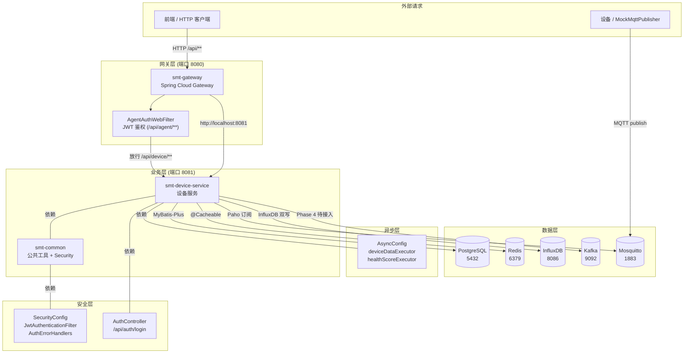
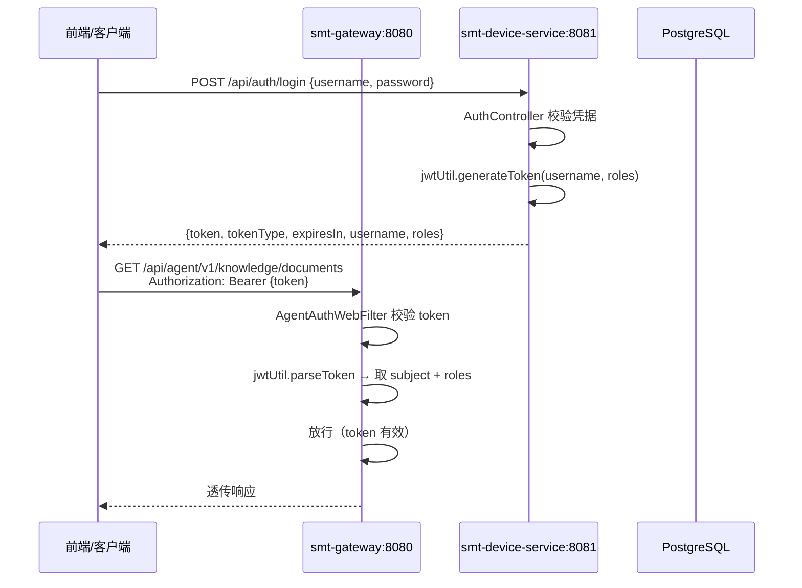
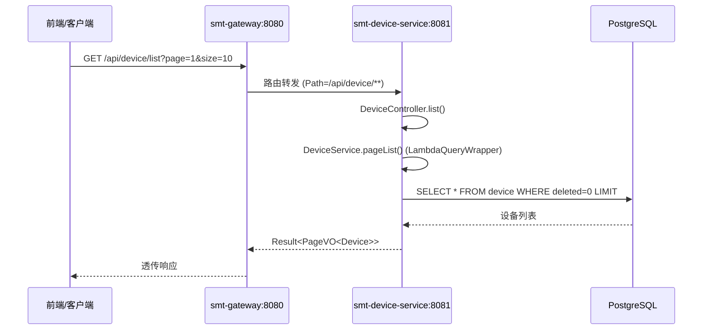
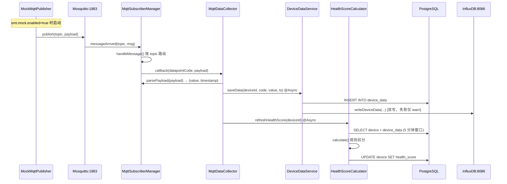
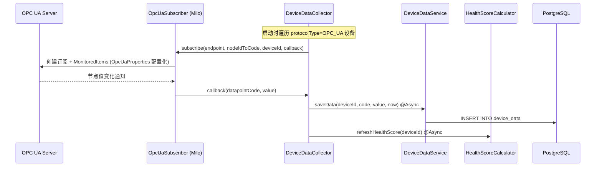
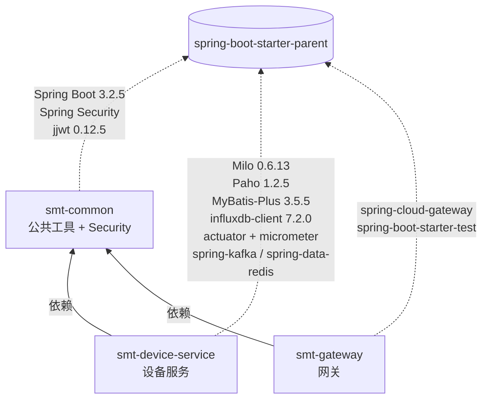
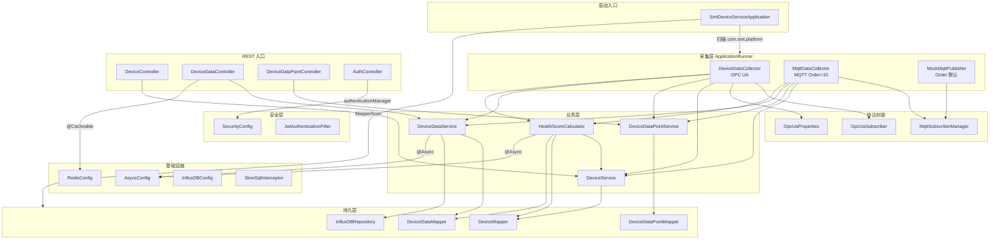
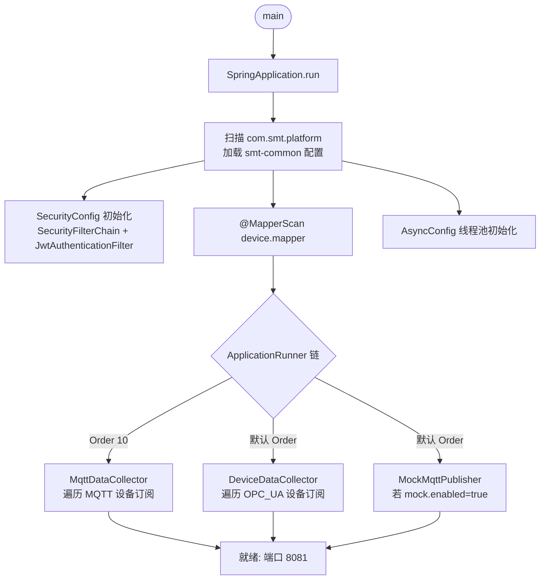

# SMT 贴片产线智能运维与调度平台 —— 项目说明报告（Phase 1）

| 项 | 值 |
|---|---|
| 项目名称 | `smt-agent-platform` —— SMT 贴片产线智能运维与调度系统 |
| 当前阶段 | Phase 1：Java 服务底座 + 设备数据接入（PRD 路线图第 1-2 月） |
| 报告日期 | 2026-07-05 |
| 报告范围 | 已交付代码（`java-backend/`、`docker-compose/`、`scripts/`、`docs/`、`api-contracts/`）+ P0/P1 修复 + 阶段进度 + 架构 + 调用逻辑 + 风险摘要 + 路线图 |
| 目标读者 | 项目内开发人员 |
| 对照基准 | [`docs/PRD.md`](file:///home/north30/projects/Personal/smt-agent-platform/docs/PRD.md)、[`docs/DIR.md`](file:///home/north30/projects/Personal/smt-agent-platform/docs/DIR.md)、[`.trae/specs/phase1-java-device-foundation/spec.md`](file:///home/north30/projects/Personal/smt-agent-platform/.trae/specs/phase1-java-device-foundation/spec.md)、[`.trae/specs/phase1-java-device-foundation/checklist.md`](file:///home/north30/projects/Personal/smt-agent-platform/.trae/specs/phase1-java-device-foundation/checklist.md)、[`.trae/reports/test-report-comprehensive.md`](file:///home/north30/projects/Personal/smt-agent-platform/.trae/reports/test-report-comprehensive.md) |
| 前置文档 | 无（首阶段） |
| Git 状态 | 分支 `feature/agent-layer-init`，14 次提交；Phase 1 已通过 PR #3 合并至 `main` |

---

## 一、总体概述

本项目定位为面向电子制造 SMT（表面贴装）生产线的工业智能体平台，通过多智能体协同实现"感知—决策—规划—执行"全链路运营闭环。完整规划为 5 个阶段、约 10 个月交付周期（详见 [PRD §6](file:///home/north30/projects/Personal/smt-agent-platform/docs/PRD.md)）。

**当前进度一句话**：Phase 1（Java 服务底座 + 设备数据接入）代码层面全量交付完成，P0/P1 问题全部修复，71 个单元测试全绿，Phase 1 已通过 PR #3 合并至 `main`；端到端运行验证因本机 Docker Hub 不可达而跳过。注：网关 StripPrefix 配置错误导致 Agent 接口 404 的问题已在修复批次中解决（详见 §4.3）。

**已交付**：Java Maven 多模块工程（`smt-common` / `smt-gateway` / `smt-device-service`）、PostgreSQL + Redis + Kafka + Mosquitto + InfluxDB 中间件编排、设备台账 CRUD、采集点配置、OPC UA + MQTT 双通道数据接入、实时数据存储（PG + InfluxDB 双写）与历史查询、健康评分（@Async + 配置外置）、Mock 数据生成器、Spring Security + JWT RBAC 骨架、网关 reactive JWT 鉴权过滤器、可观测性（actuator + micrometer + 慢 SQL 日志）、@Async 异步化（双线程池）、Redis 缓存、BaseEntity 审计字段自动填充、DTO JSR-380 校验增强、OPC UA 参数配置化、日志 Profile 隔离、OpenAPI 契约、数据库 DDL。

**未交付**（属后续阶段）：Python 智能体层（5 个 Agent，Phase 2 已交付 2 个）、C++ 原生层（Phase 5）、前端可视化（Phase 4）、`smt-order-service` / `smt-quality-service` / `smt-notification-service` / `smt-agent-router` 等 Java 微服务（Phase 3-4）、Modbus 协议（Phase 3+）、InfluxDB 端到端验证（本机 Docker Hub 不可达）、Kafka 业务层 Producer/Consumer 接入（Phase 4）、多租户隔离（Phase 3+）。

---

## 二、开发阶段与进度

### 2.1 路线图总览（PRD §6）

| 阶段 | 周期 | 核心交付 | 状态 |
|---|---|---|---|
| **Phase 1** | 第 1-2 月 | Java 服务底座 + 设备数据接入 | 🟢 代码完成 + P0/P1 修复完成，已合并 `main` |
| Phase 2 | 第 3-4 月 | 知识助手 Agent（RAG）+ 设备运维 Agent | 🟡 代码完成 + P0 修复完成，未合并 `main` |
| Phase 3 | 第 5-6 月 | 质量分析 Agent + 调度 Agent | ⬜ 未启动 |
| Phase 4 | 第 7-8 月 | 执行协同 Agent + 全流程闭环 | ⬜ 未启动（前置阻塞已修复） |
| Phase 5 | 第 9-10 月 | 系统集成测试 + 产线试点 | ⬜ 未启动 |

### 2.2 Phase 1 详细进度

依据 [`.trae/specs/phase1-java-device-foundation/checklist.md`](file:///home/north30/projects/Personal/smt-agent-platform/.trae/specs/phase1-java-device-foundation/checklist.md)：

| # | 交付项 | 状态 | 备注 |
|---|---|---|---|
| 1 | 项目基础设施（`.gitignore`、`.editorconfig`、`docker-compose.yml`、`scripts/`） | ✅ | |
| 2 | docker-compose 启动 PG/Redis/Kafka/Zookeeper/Mosquitto/InfluxDB | ⚠️ | 编排正确，新增 InfluxDB + 三网络隔离 + 凭据环境变量化；本机 Docker Hub 不可达未实跑 |
| 3 | Java 父 POM + 三子模块编译通过 | ✅ | 新增 JaCoCo 0.8.12 覆盖率插件；`mvn clean install -DskipTests` 通过 |
| 4 | `smt-common`（Result/BizException/JwtUtil/配置）+ 单测 | ✅ | 新增 BaseEntity/MyMetaObjectHandler/SecurityConfig/JwtAuthenticationFilter/AuthErrorHandlers；ResultCode 新增 5 状态码；GlobalExceptionHandler 补 5 类异常处理器 |
| 5 | `smt-gateway` 路由 `/api/device/**` + CORS + JWT 鉴权 | ✅ | 新增 AgentAuthWebFilter（reactive JWT 过滤器，仅拦截 `/api/agent/**`）；CorsConfig 加 `@Profile("dev")` |
| 6 | 设备台账 CRUD + 分页筛选 + 软删除 | ✅ | 新增 `@Transactional`、`getByIdOrThrow`、DTO `@Size`/`@Pattern`/`@AssertTrue` 校验、`DuplicateKeyException` 捕获 |
| 7 | 采集点配置（新增/查询） | ✅ | DataPointCreateDTO 加 `@Size`/`@Pattern` |
| 8 | OPC UA 接入（Eclipse Milo） | ✅ | 新增 OpcUaProperties 配置化（默认 100ms/50ms）；`@PreDestroy` 优雅关闭 |
| 9 | MQTT 接入（Eclipse Paho） | ✅ | MqttSubscriberManager 补 `@PreDestroy destroy()` 安全断开 |
| 10 | 实时数据写入 + 历史数据查询（升序） | ✅ | `saveData` 加 `@Async("deviceDataExecutor")` + InfluxDB 双写 |
| 11 | 设备健康评分（0-100） | ✅ | HealthScoreProperties 12 字段配置外置；`refreshHealthScore` 加 `@Async("healthScoreExecutor")` |
| 12 | Mock 数据生成器（`smt.mock.enabled` 开关） | ✅ | 默认 false |
| 13 | `api-contracts/openapi/device_api.yaml` | ✅ | 与 Controller 对齐 |
| 14 | `docs/database/init.sql`（三表 + 索引 + 中文注释） | ⚠️ | DDL 正确；新增 `doc_meta` 表（Phase 2 知识库）+ `uk_device_code` 唯一索引；未实跑验证 |
| 15 | 全量测试 `mvn test` | ✅ | 71 个用例全绿（原 47 + 新增 24） |
| 16 | 端到端闭环验证 | ⚠️ | 本机中间件未拉起，代码层验证已通过 |
| 17 | 中文注释/文档/异常消息 | ✅ | |
| 18 | 遵循 AGENTS.md 代码规范 | ✅ | |

**P0/P1 修复新增交付项**（commits 9589425、afb9c3b、8d778f6、bb2a107、908c621）：

| # | 新增项 | 文件 |
|---|---|---|
| 19 | Spring Security + JWT RBAC 骨架 | [`SecurityConfig.java`](file:///home/north30/projects/Personal/smt-agent-platform/java-backend/smt-common/src/main/java/com/smt/platform/common/security/SecurityConfig.java)、[`JwtAuthenticationFilter.java`](file:///home/north30/projects/Personal/smt-agent-platform/java-backend/smt-common/src/main/java/com/smt/platform/common/security/JwtAuthenticationFilter.java)、[`AuthErrorHandlers.java`](file:///home/north30/projects/Personal/smt-agent-platform/java-backend/smt-common/src/main/java/com/smt/platform/common/security/AuthErrorHandlers.java)、[`AuthController.java`](file:///home/north30/projects/Personal/smt-agent-platform/java-backend/smt-device-service/src/main/java/com/smt/platform/device/controller/AuthController.java) |
| 20 | 可观测性基线 | actuator + micrometer-registry-prometheus + [`SlowSqlInterceptor.java`](file:///home/north30/projects/Personal/smt-agent-platform/java-backend/smt-device-service/src/main/java/com/smt/platform/device/config/SlowSqlInterceptor.java) |
| 21 | @Async 异步化双线程池 | [`AsyncConfig.java`](file:///home/north30/projects/Personal/smt-agent-platform/java-backend/smt-device-service/src/main/java/com/smt/platform/device/config/AsyncConfig.java) |
| 22 | InfluxDB 时序数据双写 | [`InfluxDBConfig.java`](file:///home/north30/projects/Personal/smt-agent-platform/java-backend/smt-device-service/src/main/java/com/smt/platform/device/config/InfluxDBConfig.java)、[`InfluxDBRepository.java`](file:///home/north30/projects/Personal/smt-agent-platform/java-backend/smt-device-service/src/main/java/com/smt/platform/device/repository/InfluxDBRepository.java) |
| 23 | Redis 缓存接入 | [`RedisConfig.java`](file:///home/north30/projects/Personal/smt-agent-platform/java-backend/smt-device-service/src/main/java/com/smt/platform/device/config/RedisConfig.java) |
| 24 | 审计字段自动填充 | [`BaseEntity.java`](file:///home/north30/projects/Personal/smt-agent-platform/java-backend/smt-common/src/main/java/com/smt/platform/common/entity/BaseEntity.java)、[`MyMetaObjectHandler.java`](file:///home/north30/projects/Personal/smt-agent-platform/java-backend/smt-common/src/main/java/com/smt/platform/common/config/MyMetaObjectHandler.java) |
| 25 | 健康评分配置外置 | [`HealthScoreProperties.java`](file:///home/north30/projects/Personal/smt-agent-platform/java-backend/smt-device-service/src/main/java/com/smt/platform/device/health/HealthScoreProperties.java) |
| 26 | OPC UA 参数配置化 | [`OpcUaProperties.java`](file:///home/north30/projects/Personal/smt-agent-platform/java-backend/smt-device-service/src/main/java/com/smt/platform/device/collect/opcua/OpcUaProperties.java) |
| 27 | 日志 Profile 隔离 | [`logback-spring.xml`](file:///home/north30/projects/Personal/smt-agent-platform/java-backend/smt-device-service/src/main/resources/logback-spring.xml)、[`application-dev.yml`](file:///home/north30/projects/Personal/smt-agent-platform/java-backend/smt-device-service/src/main/resources/application-dev.yml)、[`application-prod.yml`](file:///home/north30/projects/Personal/smt-agent-platform/java-backend/smt-device-service/src/main/resources/application-prod.yml) |
| 28 | 网关 reactive JWT 鉴权 | [`AgentAuthWebFilter.java`](file:///home/north30/projects/Personal/smt-agent-platform/java-backend/smt-gateway/src/main/java/com/smt/platform/gateway/security/AgentAuthWebFilter.java) |

**Phase 1 收尾待办**：Phase 1 P0/P1 问题已全部修复。仅剩端到端闭环验证（需 Docker 环境）及 4 项延期至 Phase 3+ 的工作（详见 §六）。

### 2.3 Git 状态

```
* 24a56e4 (origin/feature/quality-scheduler-orchestration) fix(scripts&docker): 完整引入Kafka和Zookeeper支持
  9a90672 refactor(sevice): 完成项目代码大重构与功能优化
  cb580b3 docs(explaination): 更新README文档，新增 Phase3 项目说明报告
  dde26bc feat(agents): 新增 Phase3 全量智能体能力，完成多Agent编排闭环
  3c48361 Merge pull request #4 from north30-dev/feature/agent-layer-init
  02e2922 refactor(device): 调整Mybatis慢SQL拦截器的签名参数
  c117d5f chore(agents): 替换Poetry为uv作为Python依赖管理工具
  38598c4 docs(explaination): 更新README文档，补充模块概览与阶段交付说明
  908c621 feat: 完成 phase2 全量功能迭代与架构升级
  ...
  a9ad02d Merge pull request #3 from north30-dev/feature/initial-scaffold
  ...
```

- Phase 1 已通过 PR #3 合并至 `main`（commit a9ad02d），Phase 2/3 通过 PR #4 合并
- 修复批次（BLOCK/P1/P2/P3 问题）在 `feature/quality-scheduler-orchestration` 分支进行，**当前为工作区修改，尚未提交**
- 修复批次验证运行结果（2026-07-09）：
  - Java：57 个用例全绿，0 失败，BUILD SUCCESS
  - Python：175 通过 / 1 失败（预存 LLM_API_KEY 环境变量问题，与本次修复无关）/ 2 跳过
  - 集成测试：11/12 通过，1 项预期失败（LM Studio 鉴权，SEC-4 设计，`config.sh` 已不再硬编码 API key）
- 待修复批次 commit 后，再补充 commit hash 至本节

---

## 三、项目架构

### 3.1 四层架构：设计 vs 现状

PRD §3.1 设计了"交互层 / 智能体层 / 服务层 / 数据层"四层架构。Phase 1 交付了**服务层**与**数据层**的基础及增强：

| 层 | 设计职责 | Phase 1 现状 |
|---|---|---|
| 交互层（Frontend） | Web 控制台、移动端、数字孪生大屏 | ❌ 仅占位目录（`frontend/src/pages/` 6 个空目录），无实现文件 |
| 智能体层（Agent） | 5 个 Python Agent（调度/运维/质量/知识/执行） | ❌ 未启动（Phase 2 已交付 2 个） |
| 服务层（Service） | Java 微服务群 + 消息队列 | 🟡 `smt-common`（含 Security+审计）/ `smt-gateway`（含 JWT 鉴权）/ `smt-device-service`（含 @Async+缓存+双写）；缺 order/quality/notification/agent-router |
| 数据层（Data） | PostgreSQL + InfluxDB + Milvus + 工业协议 | 🟡 PostgreSQL + Redis（已用缓存）+ Kafka（Phase 4 事件驱动待接入）+ Mosquitto + InfluxDB（已编排+双写代码就绪）；Milvus 未编排（Phase 2） |

### 3.2 模块划分（当前实现）



> Kafka 节点表示中间件已编排但业务层暂未接入，Phase 4 事件驱动改造时启用（详见 §六风险摘要）。

### 3.3 技术栈选型

| 层 | 技术 | 版本 | 用途 | 对应源文件链接 |
|---|---|---|---|---|
| Java 后端 | Spring Boot | 3.2.5 | 微服务框架 | [`pom.xml`](file:///home/north30/projects/Personal/smt-agent-platform/java-backend/pom.xml) |
| Java 后端 | Spring Cloud | 2023.0.1 | Gateway 网关 | [`smt-gateway/pom.xml`](file:///home/north30/projects/Personal/smt-agent-platform/java-backend/smt-gateway/pom.xml) |
| Java 后端 | Java | 21 | LTS | [`pom.xml`](file:///home/north30/projects/Personal/smt-agent-platform/java-backend/pom.xml) |
| Java 后端 | MyBatis-Plus | 3.5.5 | ORM（非 JPA，遵循 AGENTS.md §3.1） | [`smt-device-service/pom.xml`](file:///home/north30/projects/Personal/smt-agent-platform/java-backend/smt-device-service/pom.xml) |
| Java 后端 | Spring Security | 由 BOM 管理 | RBAC + JWT 过滤器 | [`SecurityConfig.java`](file:///home/north30/projects/Personal/smt-agent-platform/java-backend/smt-common/src/main/java/com/smt/platform/common/security/SecurityConfig.java) |
| Java 后端 | Eclipse Milo | 0.6.13 | OPC UA 客户端 | [`smt-device-service/pom.xml`](file:///home/north30/projects/Personal/smt-agent-platform/java-backend/smt-device-service/pom.xml) |
| Java 后端 | Eclipse Paho | 1.2.5 | MQTT 客户端 | 同上 |
| Java 后端 | jjwt | 0.12.5 | JWT 生成/解析 | [`smt-common/pom.xml`](file:///home/north30/projects/Personal/smt-agent-platform/java-backend/smt-common/pom.xml) |
| Java 后端 | PostgreSQL Driver | 42.7.3 | JDBC | [`smt-device-service/pom.xml`](file:///home/north30/projects/Personal/smt-agent-platform/java-backend/smt-device-service/pom.xml) |
| Java 后端 | spring-boot-starter-actuator | 由 BOM 管理 | 可观测性端点 | [`application.yml`](file:///home/north30/projects/Personal/smt-agent-platform/java-backend/smt-device-service/src/main/resources/application.yml) |
| Java 后端 | micrometer-registry-prometheus | 由 BOM 管理 | Prometheus 格式指标 | 同上 |
| Java 后端 | influxdb-client-java | 7.2.0 | InfluxDB 2.x 时序写入 | [`smt-device-service/pom.xml`](file:///home/north30/projects/Personal/smt-agent-platform/java-backend/smt-device-service/pom.xml) |
| Java 后端 | spring-boot-starter-cache | 由 BOM 管理 | 缓存抽象 | [`RedisConfig.java`](file:///home/north30/projects/Personal/smt-agent-platform/java-backend/smt-device-service/src/main/java/com/smt/platform/device/config/RedisConfig.java) |
| Java 后端 | spring-boot-starter-aop | 由 BOM 管理 | AOP 代理（缓存+异步） | 同上 |
| Java 后端 | JaCoCo Maven Plugin | 0.8.12 | 测试覆盖率 | [`pom.xml`](file:///home/north30/projects/Personal/smt-agent-platform/java-backend/pom.xml) |
| 数据层 | PostgreSQL | 16-alpine | 关系库 | [`docker-compose.yml`](file:///home/north30/projects/Personal/smt-agent-platform/docker-compose/docker-compose.yml) |
| 数据层 | Redis | 7-alpine | 缓存（已用） | 同上 |
| 数据层 | Kafka | 2.7.1 (wurstmeister) + Zookeeper 3.4.6 | 消息队列（Phase 4 事件驱动待接入） | 同上 |
| 数据层 | Mosquitto | 2.0.18 | MQTT Broker | 同上 |
| 数据层 | InfluxDB | 2.7-alpine | 时序库（已编排，双写代码就绪） | 同上 |
| 构建 | Maven | 多模块 | 父 POM 统一版本管理 | [`pom.xml`](file:///home/north30/projects/Personal/smt-agent-platform/java-backend/pom.xml) |
| 编排 | docker-compose | 3.8 | 开发环境中间件 | [`docker-compose.yml`](file:///home/north30/projects/Personal/smt-agent-platform/docker-compose/docker-compose.yml) |

### 3.4 系统交互流程

#### 3.4.1 JWT 鉴权流程



#### 3.4.2 HTTP 请求流程（前端 → 网关 → 设备服务）



#### 3.4.3 MQTT 数据采集流程（核心闭环，含 @Async + InfluxDB 双写）



#### 3.4.4 OPC UA 数据采集流程



---

## 四、已实现功能模块

### 4.1 项目基础设施

| 文件/目录 | 说明 |
|---|---|
|[`.gitignore`](file:///home/north30/projects/Personal/smt-agent-platform/.gitignore) | 忽略 `target/`、`__pycache__/`、`build/`、`node_modules/`、`.env`、IDE 配置 |
|[`.editorconfig`](file:///home/north30/projects/Personal/smt-agent-platform/.editorconfig) | 4 空格缩进（前端 2 空格）、LF 换行、文件末尾空行 |
| [`docker-compose/docker-compose.yml`](file:///home/north30/projects/Personal/smt-agent-platform/docker-compose/docker-compose.yml) | PG(5432) / Redis(6379) / ZK(2181) / Kafka(9092) / Mosquitto(1883) / InfluxDB(8086) + 三网络隔离 + 凭据环境变量化；init/01-schema.sql 已合并 Phase 1-2 全部 DDL |
| [`docker-compose/.env.example`](file:///home/north30/projects/Personal/smt-agent-platform/docker-compose/.env.example) | 全部环境变量模板 |
| [`scripts/build_all.sh`](file:///home/north30/projects/Personal/smt-agent-platform/scripts/build_all.sh) | 一键构建脚本（含 Python poetry install） |
| [`scripts/dev_restart.sh`](file:///home/north30/projects/Personal/smt-agent-platform/scripts/dev_restart.sh) | 一键重启脚本（含 Java 微服务 + Python Agent 后台启动） |

### 4.2 smt-common 基础工具模块

被 `smt-gateway` 与 `smt-device-service` 共同依赖，提供横切能力。

| 类 | 职责 | 文件 |
|---|---|---|
| `Result<T>` | 统一响应封装 `{code, message, data}` | [`Result.java`](file:///home/north30/projects/Personal/smt-agent-platform/java-backend/smt-common/src/main/java/com/smt/platform/common/response/Result.java) |
| `ResultCode` | 响应码枚举（含新增 CONFLICT/VALIDATION_FAILED/TOO_MANY_REQUESTS/SERVICE_UNAVAILABLE/GATEWAY_TIMEOUT） | [`ResultCode.java`](file:///home/north30/projects/Personal/smt-agent-platform/java-backend/smt-common/src/main/java/com/smt/platform/common/response/ResultCode.java) |
| `BizException` | 业务异常 | [`BizException.java`](file:///home/north30/projects/Personal/smt-agent-platform/java-backend/smt-common/src/main/java/com/smt/platform/common/exception/BizException.java) |
| `GlobalExceptionHandler` | 全局异常处理（含新增 5 类异常处理器，handleBizException 动态 HTTP 状态码） | [`GlobalExceptionHandler.java`](file:///home/north30/projects/Personal/smt-agent-platform/java-backend/smt-common/src/main/java/com/smt/platform/common/exception/GlobalExceptionHandler.java) |
| `JacksonConfig` | `LocalDateTime` 格式化 | [`JacksonConfig.java`](file:///home/north30/projects/Personal/smt-agent-platform/java-backend/smt-common/src/main/java/com/smt/platform/common/config/JacksonConfig.java) |
| `CorsConfig` | 全局 CORS（`@Profile("dev")` 隔离） | [`CorsConfig.java`](file:///home/north30/projects/Personal/smt-agent-platform/java-backend/smt-common/src/main/java/com/smt/platform/common/config/CorsConfig.java) |
| `JwtUtil` | JWT 生成/解析/校验 | [`JwtUtil.java`](file:///home/north30/projects/Personal/smt-agent-platform/java-backend/smt-common/src/main/java/com/smt/platform/common/utils/JwtUtil.java) |
| `BaseEntity` | 实体基类（createTime/updateTime/createBy/updateBy/deleted 自动填充） | [`BaseEntity.java`](file:///home/north30/projects/Personal/smt-agent-platform/java-backend/smt-common/src/main/java/com/smt/platform/common/entity/BaseEntity.java) |
| `MyMetaObjectHandler` | MyBatis-Plus 自动填充处理器（INSERT/UPDATE 触发） | [`MyMetaObjectHandler.java`](file:///home/north30/projects/Personal/smt-agent-platform/java-backend/smt-common/src/main/java/com/smt/platform/common/config/MyMetaObjectHandler.java) |
| `SecurityConfig` | Spring Security 配置（STATELESS + 路径规则 + BCryptPasswordEncoder） | [`SecurityConfig.java`](file:///home/north30/projects/Personal/smt-agent-platform/java-backend/smt-common/src/main/java/com/smt/platform/common/security/SecurityConfig.java) |
| `JwtAuthenticationFilter` | Servlet 版 JWT 过滤器（OncePerRequestFilter） | [`JwtAuthenticationFilter.java`](file:///home/north30/projects/Personal/smt-agent-platform/java-backend/smt-common/src/main/java/com/smt/platform/common/security/JwtAuthenticationFilter.java) |
| `AuthErrorHandlers` | 401/403 JSON 响应处理器 | [`AuthErrorHandlers.java`](file:///home/north30/projects/Personal/smt-agent-platform/java-backend/smt-common/src/main/java/com/smt/platform/common/security/AuthErrorHandlers.java) |

### 4.3 smt-gateway API 网关

| 类 | 职责 | 文件 |
|---|---|---|
| `SmtGatewayApplication` | 网关启动类 | [`SmtGatewayApplication.java`](file:///home/north30/projects/Personal/smt-agent-platform/java-backend/smt-gateway/src/main/java/com/smt/platform/gateway/SmtGatewayApplication.java) |
| `CorsConfig` | 网关层 CORS（`@Profile("dev")`，reactive `CorsWebFilter`） | [`gateway/CorsConfig.java`](file:///home/north30/projects/Personal/smt-agent-platform/java-backend/smt-gateway/src/main/java/com/smt/platform/gateway/config/CorsConfig.java) |
| `AgentAuthWebFilter` | reactive JWT 鉴权过滤器（仅拦截 `/api/agent/**`，`/api/device/**` 放行） | [`AgentAuthWebFilter.java`](file:///home/north30/projects/Personal/smt-agent-platform/java-backend/smt-gateway/src/main/java/com/smt/platform/gateway/security/AgentAuthWebFilter.java) |

**路由配置**（[`application.yml`](file:///home/north30/projects/Personal/smt-agent-platform/java-backend/smt-gateway/src/main/resources/application.yml)）：

- 端口 8080
- `/api/device/**` → `http://${SMT_DEVICE_SERVICE_HOST:localhost}:${SMT_DEVICE_SERVICE_PORT:8081}`
- `/api/agent/v1/knowledge/**` → `http://${SMT_AGENT_KNOWLEDGE_HOST:localhost}:${SMT_AGENT_KNOWLEDGE_PORT:8004}`（StripPrefix=2，剥离 `/api/agent`，转发 `/v1/knowledge/**`）
- `/api/agent/v1/maintenance/**` → `http://${SMT_AGENT_MAINTENANCE_HOST:localhost}:${SMT_AGENT_MAINTENANCE_PORT:8002}`（StripPrefix=2，剥离 `/api/agent`，转发 `/v1/maintenance/**`）

> 修复批次说明：原配置 `Path=/api/agent/knowledge/**` 与 Python 侧注册的 `/v1/knowledge/**` 路径不匹配，导致网关 404。修复方案在网关 predicate 中加入 `/v1` 段（`Path=/api/agent/v1/knowledge/**`），保持 `StripPrefix=2` 不变，剥离 `/api/agent` 后转发 `/v1/knowledge/**` 给 Python Agent，与 Python 侧 FastAPI 路由对齐。maintenance 路由同此处理。

### 4.4 smt-device-service 设备服务（核心）

#### 4.4.1 设备台账管理

| 接口 | 方法 | 路径 |
|---|---|---|
| 新增设备 | POST | `/api/device` |
| 更新设备 | PUT | `/api/device/{id}` |
| 删除设备（软删除） | DELETE | `/api/device/{id}` |
| 查询详情 | GET | `/api/device/{id}` |
| 分页查询（产线/类型/状态筛选） | GET | `/api/device/list` |

**主要特性**：类级 `@Transactional`；`create` 捕获 `DuplicateKeyException`；`getByIdOrThrow` 替代原覆写；DTO `@Size`/`@Pattern`/`@AssertTrue` 校验；Device 继承 BaseEntity 审计字段自动填充。

文件：[`DeviceController.java`](file:///home/north30/projects/Personal/smt-agent-platform/java-backend/smt-device-service/src/main/java/com/smt/platform/device/controller/DeviceController.java)、[`DeviceServiceImpl.java`](file:///home/north30/projects/Personal/smt-agent-platform/java-backend/smt-device-service/src/main/java/com/smt/platform/device/service/impl/DeviceServiceImpl.java)、[`Device.java`](file:///home/north30/projects/Personal/smt-agent-platform/java-backend/smt-device-service/src/main/java/com/smt/platform/device/model/entity/Device.java)

#### 4.4.2 采集点配置

| 接口 | 方法 | 路径 |
|---|---|---|
| 新增采集点 | POST | `/api/device/{deviceId}/datapoints` |
| 查询设备下采集点 | GET | `/api/device/{deviceId}/datapoints` |

**主要特性**：DataPointCreateDTO 加 `@Size`/`@Pattern` 校验。

文件：[`DeviceDataPointController.java`](file:///home/north30/projects/Personal/smt-agent-platform/java-backend/smt-device-service/src/main/java/com/smt/platform/device/controller/DeviceDataPointController.java)、[`DeviceDataPointServiceImpl.java`](file:///home/north30/projects/Personal/smt-agent-platform/java-backend/smt-device-service/src/main/java/com/smt/platform/device/service/impl/DeviceDataPointServiceImpl.java)

#### 4.4.3 OPC UA 数据接入（Eclipse Milo）

**主要特性**：OpcUaProperties 配置化（`smt.opcua.publishing-interval-ms=100`、`sampling-interval-ms=50`、`queue-size=10`）；`@PreDestroy destroy()` 优雅关闭；所有 `CompletableFuture.get()` 调用加 30 秒超时防启动卡死；`OpcUaSubscriber.createClient` 为 `protected` 工厂方法支持测试覆写。

文件：[`OpcUaSubscriber.java`](file:///home/north30/projects/Personal/smt-agent-platform/java-backend/smt-device-service/src/main/java/com/smt/platform/device/collect/opcua/OpcUaSubscriber.java)、[`OpcUaProperties.java`](file:///home/north30/projects/Personal/smt-agent-platform/java-backend/smt-device-service/src/main/java/com/smt/platform/device/collect/opcua/OpcUaProperties.java)、[`DeviceDataCollector.java`](file:///home/north30/projects/Personal/smt-agent-platform/java-backend/smt-device-service/src/main/java/com/smt/platform/device/collect/DeviceDataCollector.java)

#### 4.4.4 MQTT 数据接入（Eclipse Paho）

**主要特性**：按采集点 topic 订阅、payload 解析支持 JSON 与纯文本两种格式、`@PreDestroy destroy()` 安全断开连接；启用 `setAutomaticReconnect(true)` 断连自动重连。

文件：[`MqttSubscriberManager.java`](file:///home/north30/projects/Personal/smt-agent-platform/java-backend/smt-device-service/src/main/java/com/smt/platform/device/collect/mqtt/MqttSubscriberManager.java)、[`MqttDataCollector.java`](file:///home/north30/projects/Personal/smt-agent-platform/java-backend/smt-device-service/src/main/java/com/smt/platform/device/collect/mqtt/MqttDataCollector.java)

#### 4.4.5 实时数据存储与历史查询

| 接口 | 方法 | 路径 |
|---|---|---|
| 历史数据查询（按数据点+时间范围+分页，升序） | GET | `/api/device/{deviceId}/data` |

**主要特性**：`saveData` 加 `@Async("deviceDataExecutor")` 异步执行；InfluxDB 双写（失败仅 warn 不阻断 PG 主流程）；查询走 `idx_device_data_query` 复合索引；历史查询加 `@Cacheable`（Redis，TTL 10min）。

文件：[`DeviceDataController.java`](file:///home/north30/projects/Personal/smt-agent-platform/java-backend/smt-device-service/src/main/java/com/smt/platform/device/controller/DeviceDataController.java)、[`DeviceDataServiceImpl.java`](file:///home/north30/projects/Personal/smt-agent-platform/java-backend/smt-device-service/src/main/java/com/smt/platform/device/service/impl/DeviceDataServiceImpl.java)、[`InfluxDBRepository.java`](file:///home/north30/projects/Personal/smt-agent-platform/java-backend/smt-device-service/src/main/java/com/smt/platform/device/repository/InfluxDBRepository.java)

#### 4.4.6 设备健康评分

**评分规则**（0-100，全部通过 `smt.health.score.*` 配置化，默认值与原硬编码一致）：

| 设备状态 | 评分 |
|---|---|
| MAINTENANCE | 30（`score-maintenance`） |
| STOPPED | 50（`score-stopped`） |
| RUNNING | 基础 100（`base-score`），按最近 5 分钟数据扣分 |

扣分规则（同一采集点仅取最近一条参与计算）：

| 采集点 code 包含 | 一级阈值（扣 20） | 二级阈值（扣 40） |
|---|---|---|
| `temp` / `temperature` | value > 80 | value > 100 |
| `vibration` / `vib` | value > 10 | value > 20 |

评分下限 0、上限 100；`refreshHealthScore` 加 `@Async("healthScoreExecutor")` 异步执行。

文件：[`HealthScoreCalculator.java`](file:///home/north30/projects/Personal/smt-agent-platform/java-backend/smt-device-service/src/main/java/com/smt/platform/device/health/HealthScoreCalculator.java)、[`HealthScoreProperties.java`](file:///home/north30/projects/Personal/smt-agent-platform/java-backend/smt-device-service/src/main/java/com/smt/platform/device/health/HealthScoreProperties.java)

#### 4.4.7 Mock 数据生成器

**主要特性**：`smt.mock.enabled=true` 时按 `smt.mock.interval-ms` 周期向 MQTT broker 发布模拟数据；`@Order` 保证在 `MqttDataCollector` 订阅完成后启动；`@PreDestroy` 优雅关闭。

文件：[`MockMqttPublisher.java`](file:///home/north30/projects/Personal/smt-agent-platform/java-backend/smt-device-service/src/main/java/com/smt/platform/device/mock/MockMqttPublisher.java)、[`MockProperties.java`](file:///home/north30/projects/Personal/smt-agent-platform/java-backend/smt-device-service/src/main/java/com/smt/platform/device/config/MockProperties.java)

#### 4.4.8 鉴权端点

| 接口 | 方法 | 路径 |
|---|---|---|
| 登录获取 JWT | POST | `/api/auth/login` |
| 查询当前用户信息 | GET | `/api/auth/me` |

**主要特性**：Phase 1 固定 ADMIN 角色；密码存储为 BCrypt 哈希，通过 `smt.security.admin.*` 配置；登录校验使用 `PasswordEncoder.matches()`；JWT 过期时间 `smt.security.jwt.expiry-seconds`（默认 86400）。

> 修复批次说明：BCrypt 哈希含 `$` 字符，与 Spring `${}` 占位符语法冲突，无法直接放入默认值。`application.yml` 中先用 `smt.security.admin.dev-hash` 明文属性存放哈希，再通过嵌套占位符 `${SMT_ADMIN_PASSWORD:${smt.security.admin.dev-hash}}` 引用——生产环境由 `SMT_ADMIN_PASSWORD` 注入真实哈希，dev 环境回退到 `dev-hash`。集成测试脚本 [`scripts/config.sh`](file:///home/north30/projects/Personal/smt-agent-platform/scripts/config.sh) 中 `ADMIN_PASSWORD` 改读 `SMT_ADMIN_PASSWORD_PLAIN`（明文，默认 `dev-only-admin`），与 `SMT_ADMIN_PASSWORD`（BCrypt 哈希）区分，避免误用哈希作为登录明文。

文件：[`AuthController.java`](file:///home/north30/projects/Personal/smt-agent-platform/java-backend/smt-device-service/src/main/java/com/smt/platform/device/controller/AuthController.java)

#### 4.4.9 异步配置

| 线程池 Bean | core / max / queue | 用途 |
|---|---|---|
| `deviceDataExecutor` | 2 / 8 / 500 | 数据写入异步执行 |
| `healthScoreExecutor` | 1 / 2 / 100 | 健康评分异步执行 |

统一 CallerRunsPolicy 拒绝策略；`waitForTasksToCompleteOnShutdown=true`。

文件：[`AsyncConfig.java`](file:///home/north30/projects/Personal/smt-agent-platform/java-backend/smt-device-service/src/main/java/com/smt/platform/device/config/AsyncConfig.java)

### 4.5 API 契约与数据库脚本

| 文件 | 说明 |
|---|---|
| [`api-contracts/openapi/device_api.yaml`](file:///home/north30/projects/Personal/smt-agent-platform/api-contracts/openapi/device_api.yaml) | OpenAPI 3.0，覆盖设备 CRUD / 采集点 / 历史数据接口 |
| [`docs/database/init.sql`](file:///home/north30/projects/Personal/smt-agent-platform/docs/database/init.sql) | PostgreSQL DDL：`device`（含 `uk_device_code` 唯一索引）/ `device_data_point` / `device_data` / `doc_meta` 四表 + 索引 + 中文注释；已同步合并到 `docker-compose/init/01-schema.sql`，后者为 Docker 环境的唯一 DDL 入口 |

**数据库表结构**：

| 表 | 主要字段 | 索引 |
|---|---|---|
| `device` | id, device_code(唯一), device_name, device_type, production_line, ip_address, protocol_type, opc_ua_endpoint, status, health_score, create_time, update_time, create_by, update_by, deleted | UNIQUE(device_code) |
| `device_data_point` | id, device_id, datapoint_code, datapoint_name, node_path, data_type, sample_interval_ms, create_time | idx(device_id) |
| `device_data` | id, device_id, datapoint_code, value, timestamp | idx(device_id, datapoint_code, timestamp) + idx(timestamp) |
| `doc_meta` | doc_id(PK), doc_name, create_time | — |

---

## 五、代码文件依赖关系与调用逻辑

### 5.1 模块依赖关系



### 5.2 包结构（smt-device-service）

```
com.smt.platform.device
├── [SmtDeviceServiceApplication.java](file:///home/north30/projects/Personal/smt-agent-platform/java-backend/smt-device-service/src/main/java/com/smt/platform/device/SmtDeviceServiceApplication.java)        启动类（@MapperScan device.mapper）
├── config/
│   ├── [MybatisPlusConfig.java](file:///home/north30/projects/Personal/smt-agent-platform/java-backend/smt-device-service/src/main/java/com/smt/platform/device/config/MybatisPlusConfig.java)              分页插件配置
│   ├── [MockProperties.java](file:///home/north30/projects/Personal/smt-agent-platform/java-backend/smt-device-service/src/main/java/com/smt/platform/device/config/MockProperties.java)                 Mock 配置绑定
│   ├── [AsyncConfig.java](file:///home/north30/projects/Personal/smt-agent-platform/java-backend/smt-device-service/src/main/java/com/smt/platform/device/config/AsyncConfig.java)                    @EnableAsync + 双线程池
│   ├── [InfluxDBConfig.java](file:///home/north30/projects/Personal/smt-agent-platform/java-backend/smt-device-service/src/main/java/com/smt/platform/device/config/InfluxDBConfig.java)                 InfluxDB 2.x 客户端配置
│   ├── [RedisConfig.java](file:///home/north30/projects/Personal/smt-agent-platform/java-backend/smt-device-service/src/main/java/com/smt/platform/device/config/RedisConfig.java)                    @EnableCaching + RedisTemplate + CacheManager
│   ├── [SlowSqlInterceptor.java](file:///home/north30/projects/Personal/smt-agent-platform/java-backend/smt-device-service/src/main/java/com/smt/platform/device/config/SlowSqlInterceptor.java)             慢 SQL 拦截器
│   └── [HealthScoreProperties.java](file:///home/north30/projects/Personal/smt-agent-platform/java-backend/smt-device-service/src/main/java/com/smt/platform/device/health/HealthScoreProperties.java)          健康评分 12 字段配置
├── controller/                         REST 入口（/api/device/* + /api/auth/*）
│   ├── [DeviceController.java](file:///home/north30/projects/Personal/smt-agent-platform/java-backend/smt-device-service/src/main/java/com/smt/platform/device/controller/DeviceController.java)
│   ├── [DeviceDataController.java](file:///home/north30/projects/Personal/smt-agent-platform/java-backend/smt-device-service/src/main/java/com/smt/platform/device/controller/DeviceDataController.java)
│   ├── [DeviceDataPointController.java](file:///home/north30/projects/Personal/smt-agent-platform/java-backend/smt-device-service/src/main/java/com/smt/platform/device/controller/DeviceDataPointController.java)
│   └── [AuthController.java](file:///home/north30/projects/Personal/smt-agent-platform/java-backend/smt-device-service/src/main/java/com/smt/platform/device/controller/AuthController.java)
├── service/ + impl/                    业务逻辑层
│   ├── [DeviceService.java](file:///home/north30/projects/Personal/smt-agent-platform/java-backend/smt-device-service/src/main/java/com/smt/platform/device/service/DeviceService.java) / [DeviceServiceImpl.java](file:///home/north30/projects/Personal/smt-agent-platform/java-backend/smt-device-service/src/main/java/com/smt/platform/device/service/impl/DeviceServiceImpl.java)
│   ├── [DeviceDataService.java](file:///home/north30/projects/Personal/smt-agent-platform/java-backend/smt-device-service/src/main/java/com/smt/platform/device/service/DeviceDataService.java) / [DeviceDataServiceImpl.java](file:///home/north30/projects/Personal/smt-agent-platform/java-backend/smt-device-service/src/main/java/com/smt/platform/device/service/impl/DeviceDataServiceImpl.java)
│   └── [DeviceDataPointService.java](file:///home/north30/projects/Personal/smt-agent-platform/java-backend/smt-device-service/src/main/java/com/smt/platform/device/service/DeviceDataPointService.java) / [DeviceDataPointServiceImpl.java](file:///home/north30/projects/Personal/smt-agent-platform/java-backend/smt-device-service/src/main/java/com/smt/platform/device/service/impl/DeviceDataPointServiceImpl.java)
├── mapper/                            MyBatis-Plus Mapper
│   ├── [DeviceMapper.java](file:///home/north30/projects/Personal/smt-agent-platform/java-backend/smt-device-service/src/main/java/com/smt/platform/device/mapper/DeviceMapper.java)
│   ├── [DeviceDataMapper.java](file:///home/north30/projects/Personal/smt-agent-platform/java-backend/smt-device-service/src/main/java/com/smt/platform/device/mapper/DeviceDataMapper.java)
│   └── [DeviceDataPointMapper.java](file:///home/north30/projects/Personal/smt-agent-platform/java-backend/smt-device-service/src/main/java/com/smt/platform/device/mapper/DeviceDataPointMapper.java)
├── model/
│   ├── entity/                        [Device.java](file:///home/north30/projects/Personal/smt-agent-platform/java-backend/smt-device-service/src/main/java/com/smt/platform/device/model/entity/Device.java)(extends BaseEntity) / [DeviceData.java](file:///home/north30/projects/Personal/smt-agent-platform/java-backend/smt-device-service/src/main/java/com/smt/platform/device/model/entity/DeviceData.java) / [DeviceDataPoint.java](file:///home/north30/projects/Personal/smt-agent-platform/java-backend/smt-device-service/src/main/java/com/smt/platform/device/model/entity/DeviceDataPoint.java)
│   ├── dto/                           [DeviceCreateDTO.java](file:///home/north30/projects/Personal/smt-agent-platform/java-backend/smt-device-service/src/main/java/com/smt/platform/device/model/dto/DeviceCreateDTO.java) / [DeviceUpdateDTO.java](file:///home/north30/projects/Personal/smt-agent-platform/java-backend/smt-device-service/src/main/java/com/smt/platform/device/model/dto/DeviceUpdateDTO.java) / [DataPointCreateDTO.java](file:///home/north30/projects/Personal/smt-agent-platform/java-backend/smt-device-service/src/main/java/com/smt/platform/device/model/dto/DataPointCreateDTO.java)
│   └── vo/                            [PageVO.java](file:///home/north30/projects/Personal/smt-agent-platform/java-backend/smt-device-service/src/main/java/com/smt/platform/device/model/vo/PageVO.java)
├── collect/                           数据采集层
│   ├── [DeviceDataCollector.java](file:///home/north30/projects/Personal/smt-agent-platform/java-backend/smt-device-service/src/main/java/com/smt/platform/device/collect/DeviceDataCollector.java)            OPC UA 采集入口（ApplicationRunner）
│   ├── [MqttDataCollector.java](file:///home/north30/projects/Personal/smt-agent-platform/java-backend/smt-device-service/src/main/java/com/smt/platform/device/collect/MqttDataCollector.java)              MQTT 采集入口（ApplicationRunner, @Order(10)）
│   ├── opcua/[OpcUaSubscriber.java](file:///home/north30/projects/Personal/smt-agent-platform/java-backend/smt-device-service/src/main/java/com/smt/platform/device/collect/opcua/OpcUaSubscriber.java)          Milo 订阅封装
│   ├── opcua/[OpcUaProperties.java](file:///home/north30/projects/Personal/smt-agent-platform/java-backend/smt-device-service/src/main/java/com/smt/platform/device/collect/opcua/OpcUaProperties.java)          OPC UA 参数配置
│   └── mqtt/[MqttSubscriberManager.java](file:///home/north30/projects/Personal/smt-agent-platform/java-backend/smt-device-service/src/main/java/com/smt/platform/device/collect/mqtt/MqttSubscriberManager.java)     Paho 订阅/发布/payload解析
├── health/
│   └── [HealthScoreCalculator.java](file:///home/north30/projects/Personal/smt-agent-platform/java-backend/smt-device-service/src/main/java/com/smt/platform/device/health/HealthScoreCalculator.java)          规则评分（@Async + 配置注入）
├── repository/
│   └── [InfluxDBRepository.java](file:///home/north30/projects/Personal/smt-agent-platform/java-backend/smt-device-service/src/main/java/com/smt/platform/device/repository/InfluxDBRepository.java)             InfluxDB 双写封装
└── mock/
    └── [MockMqttPublisher.java](file:///home/north30/projects/Personal/smt-agent-platform/java-backend/smt-device-service/src/main/java/com/smt/platform/device/mock/MockMqttPublisher.java)              Mock 数据发布（ApplicationRunner）
```

### 5.3 类级依赖关系（smt-device-service 内部）



### 5.4 关键调用链

#### 5.4.1 启动流程



#### 5.4.2 数据采集链（MQTT 全链路，含 @Async + InfluxDB 双写）

```
MockMqttPublisher.publish()
  → MqttSubscriberManager.publish(topic, payload)
  → Mosquitto broker
  → Paho messageArrived(topic, message)
  → MqttSubscriberManager.handleMessage(topic, message)
      └─ 按 topic 路由到 SubscriptionInfo.callback
  → MqttDataCollector lambda:
      ├─ MqttSubscriberManager.parsePayload(payload)
      ├─ DeviceDataService.saveData(deviceId, code, value, ts)  @Async("deviceDataExecutor")
      │     ├─ DeviceDataMapper.insert(DeviceData)              [单条 PG INSERT]
      │     └─ InfluxDBRepository.writeDeviceData(...)          [双写，失败仅 warn]
      └─ HealthScoreCalculator.refreshHealthScore(deviceId)     @Async("healthScoreExecutor")
            ├─ DeviceService.getByIdOrThrow(deviceId)
            ├─ DeviceDataMapper.selectList(5 分钟窗口)
            ├─ calculate(device, recentData)                     [配置化规则扣分]
            └─ DeviceMapper.updateById(healthScore)
```

### 5.5 文件清单与职责矩阵

#### 5.5.1 smt-common（12 个 Java 文件）

| 文件 | 维度 | 职责 |
|---|---|---|
| [`Result.java`](file:///home/north30/projects/Personal/smt-agent-platform/java-backend/smt-common/src/main/java/com/smt/platform/common/response/Result.java) | 响应 | 统一封装 |
| [`ResultCode.java`](file:///home/north30/projects/Personal/smt-agent-platform/java-backend/smt-common/src/main/java/com/smt/platform/common/response/ResultCode.java) | 响应 | 状态码枚举（含 5 个新增） |
| [`BizException.java`](file:///home/north30/projects/Personal/smt-agent-platform/java-backend/smt-common/src/main/java/com/smt/platform/common/exception/BizException.java) | 异常 | 业务异常 |
| [`GlobalExceptionHandler.java`](file:///home/north30/projects/Personal/smt-agent-platform/java-backend/smt-common/src/main/java/com/smt/platform/common/exception/GlobalExceptionHandler.java) | 异常 | 全局兜底（含 5 类异常处理器） |
| [`JacksonConfig.java`](file:///home/north30/projects/Personal/smt-agent-platform/java-backend/smt-common/src/main/java/com/smt/platform/common/config/JacksonConfig.java) | 配置 | 序列化 |
| [`CorsConfig.java`](file:///home/north30/projects/Personal/smt-agent-platform/java-backend/smt-common/src/main/java/com/smt/platform/common/config/CorsConfig.java) | 配置 | 跨域（`@Profile("dev")`） |
| [`MyMetaObjectHandler.java`](file:///home/north30/projects/Personal/smt-agent-platform/java-backend/smt-common/src/main/java/com/smt/platform/common/config/MyMetaObjectHandler.java) | 配置 | 审计字段自动填充 |
| [`JwtUtil.java`](file:///home/north30/projects/Personal/smt-agent-platform/java-backend/smt-common/src/main/java/com/smt/platform/common/utils/JwtUtil.java) | 安全 | Token 生成/校验 |
| [`BaseEntity.java`](file:///home/north30/projects/Personal/smt-agent-platform/java-backend/smt-common/src/main/java/com/smt/platform/common/entity/BaseEntity.java) | 实体 | 审计字段基类 |
| [`SecurityConfig.java`](file:///home/north30/projects/Personal/smt-agent-platform/java-backend/smt-common/src/main/java/com/smt/platform/common/security/SecurityConfig.java) | 安全 | Spring Security 配置 |
| [`JwtAuthenticationFilter.java`](file:///home/north30/projects/Personal/smt-agent-platform/java-backend/smt-common/src/main/java/com/smt/platform/common/security/JwtAuthenticationFilter.java) | 安全 | Servlet JWT 过滤器 |
| [`AuthErrorHandlers.java`](file:///home/north30/projects/Personal/smt-agent-platform/java-backend/smt-common/src/main/java/com/smt/platform/common/security/AuthErrorHandlers.java) | 安全 | 401/403 响应 |

#### 5.5.2 smt-gateway（3 个 Java 文件）

| 文件 | 维度 | 职责 |
|---|---|---|
| [`SmtGatewayApplication.java`](file:///home/north30/projects/Personal/smt-agent-platform/java-backend/smt-gateway/src/main/java/com/smt/platform/gateway/SmtGatewayApplication.java) | 启动 | 网关入口 |
| [`CorsConfig.java`](file:///home/north30/projects/Personal/smt-agent-platform/java-backend/smt-gateway/src/main/java/com/smt/platform/gateway/config/CorsConfig.java) | 配置 | 网关层跨域（`@Profile("dev")`） |
| [`AgentAuthWebFilter.java`](file:///home/north30/projects/Personal/smt-agent-platform/java-backend/smt-gateway/src/main/java/com/smt/platform/gateway/security/AgentAuthWebFilter.java) | 安全 | reactive JWT 鉴权 |

#### 5.5.3 smt-device-service（36 个 Java 文件）

| 维度 | 文件数 | 主要文件 |
|---|---|---|
| 启动 | 1 | [`SmtDeviceServiceApplication.java`](file:///home/north30/projects/Personal/smt-agent-platform/java-backend/smt-device-service/src/main/java/com/smt/platform/device/SmtDeviceServiceApplication.java) |
| config | 7 | [`MybatisPlusConfig.java`](file:///home/north30/projects/Personal/smt-agent-platform/java-backend/smt-device-service/src/main/java/com/smt/platform/device/config/MybatisPlusConfig.java)、[`MockProperties.java`](file:///home/north30/projects/Personal/smt-agent-platform/java-backend/smt-device-service/src/main/java/com/smt/platform/device/config/MockProperties.java)、[`AsyncConfig.java`](file:///home/north30/projects/Personal/smt-agent-platform/java-backend/smt-device-service/src/main/java/com/smt/platform/device/config/AsyncConfig.java)、[`InfluxDBConfig.java`](file:///home/north30/projects/Personal/smt-agent-platform/java-backend/smt-device-service/src/main/java/com/smt/platform/device/config/InfluxDBConfig.java)、[`RedisConfig.java`](file:///home/north30/projects/Personal/smt-agent-platform/java-backend/smt-device-service/src/main/java/com/smt/platform/device/config/RedisConfig.java)、[`SlowSqlInterceptor.java`](file:///home/north30/projects/Personal/smt-agent-platform/java-backend/smt-device-service/src/main/java/com/smt/platform/device/config/SlowSqlInterceptor.java)、[`HealthScoreProperties.java`](file:///home/north30/projects/Personal/smt-agent-platform/java-backend/smt-device-service/src/main/java/com/smt/platform/device/health/HealthScoreProperties.java) |
| controller | 4 | [`DeviceController.java`](file:///home/north30/projects/Personal/smt-agent-platform/java-backend/smt-device-service/src/main/java/com/smt/platform/device/controller/DeviceController.java)、[`DeviceDataController.java`](file:///home/north30/projects/Personal/smt-agent-platform/java-backend/smt-device-service/src/main/java/com/smt/platform/device/controller/DeviceDataController.java)、[`DeviceDataPointController.java`](file:///home/north30/projects/Personal/smt-agent-platform/java-backend/smt-device-service/src/main/java/com/smt/platform/device/controller/DeviceDataPointController.java)、[`AuthController.java`](file:///home/north30/projects/Personal/smt-agent-platform/java-backend/smt-device-service/src/main/java/com/smt/platform/device/controller/AuthController.java) |
| service + impl | 6 | [`DeviceService.java`](file:///home/north30/projects/Personal/smt-agent-platform/java-backend/smt-device-service/src/main/java/com/smt/platform/device/service/DeviceService.java) / [`DeviceServiceImpl.java`](file:///home/north30/projects/Personal/smt-agent-platform/java-backend/smt-device-service/src/main/java/com/smt/platform/device/service/impl/DeviceServiceImpl.java)、[`DeviceDataService.java`](file:///home/north30/projects/Personal/smt-agent-platform/java-backend/smt-device-service/src/main/java/com/smt/platform/device/service/DeviceDataService.java) / [`DeviceDataServiceImpl.java`](file:///home/north30/projects/Personal/smt-agent-platform/java-backend/smt-device-service/src/main/java/com/smt/platform/device/service/impl/DeviceDataServiceImpl.java)、[`DeviceDataPointService.java`](file:///home/north30/projects/Personal/smt-agent-platform/java-backend/smt-device-service/src/main/java/com/smt/platform/device/service/DeviceDataPointService.java) / [`DeviceDataPointServiceImpl.java`](file:///home/north30/projects/Personal/smt-agent-platform/java-backend/smt-device-service/src/main/java/com/smt/platform/device/service/impl/DeviceDataPointServiceImpl.java) |
| mapper | 3 | [`DeviceMapper.java`](file:///home/north30/projects/Personal/smt-agent-platform/java-backend/smt-device-service/src/main/java/com/smt/platform/device/mapper/DeviceMapper.java)、[`DeviceDataMapper.java`](file:///home/north30/projects/Personal/smt-agent-platform/java-backend/smt-device-service/src/main/java/com/smt/platform/device/mapper/DeviceDataMapper.java)、[`DeviceDataPointMapper.java`](file:///home/north30/projects/Personal/smt-agent-platform/java-backend/smt-device-service/src/main/java/com/smt/platform/device/mapper/DeviceDataPointMapper.java) |
| model/entity | 3 | [`Device.java`](file:///home/north30/projects/Personal/smt-agent-platform/java-backend/smt-device-service/src/main/java/com/smt/platform/device/model/entity/Device.java)（extends BaseEntity）、[`DeviceData.java`](file:///home/north30/projects/Personal/smt-agent-platform/java-backend/smt-device-service/src/main/java/com/smt/platform/device/model/entity/DeviceData.java)、[`DeviceDataPoint.java`](file:///home/north30/projects/Personal/smt-agent-platform/java-backend/smt-device-service/src/main/java/com/smt/platform/device/model/entity/DeviceDataPoint.java) |
| model/dto | 3 | [`DeviceCreateDTO.java`](file:///home/north30/projects/Personal/smt-agent-platform/java-backend/smt-device-service/src/main/java/com/smt/platform/device/model/dto/DeviceCreateDTO.java)、[`DeviceUpdateDTO.java`](file:///home/north30/projects/Personal/smt-agent-platform/java-backend/smt-device-service/src/main/java/com/smt/platform/device/model/dto/DeviceUpdateDTO.java)、[`DataPointCreateDTO.java`](file:///home/north30/projects/Personal/smt-agent-platform/java-backend/smt-device-service/src/main/java/com/smt/platform/device/model/dto/DataPointCreateDTO.java) |
| model/vo | 1 | [`PageVO.java`](file:///home/north30/projects/Personal/smt-agent-platform/java-backend/smt-device-service/src/main/java/com/smt/platform/device/model/vo/PageVO.java) |
| collect | 5 | [`DeviceDataCollector.java`](file:///home/north30/projects/Personal/smt-agent-platform/java-backend/smt-device-service/src/main/java/com/smt/platform/device/collect/DeviceDataCollector.java)、[`MqttDataCollector.java`](file:///home/north30/projects/Personal/smt-agent-platform/java-backend/smt-device-service/src/main/java/com/smt/platform/device/collect/MqttDataCollector.java)、[`OpcUaSubscriber.java`](file:///home/north30/projects/Personal/smt-agent-platform/java-backend/smt-device-service/src/main/java/com/smt/platform/device/collect/opcua/OpcUaSubscriber.java)、[`OpcUaProperties.java`](file:///home/north30/projects/Personal/smt-agent-platform/java-backend/smt-device-service/src/main/java/com/smt/platform/device/collect/opcua/OpcUaProperties.java)、[`MqttSubscriberManager.java`](file:///home/north30/projects/Personal/smt-agent-platform/java-backend/smt-device-service/src/main/java/com/smt/platform/device/collect/mqtt/MqttSubscriberManager.java) |
| health | 1 | [`HealthScoreCalculator.java`](file:///home/north30/projects/Personal/smt-agent-platform/java-backend/smt-device-service/src/main/java/com/smt/platform/device/health/HealthScoreCalculator.java) |
| repository | 1 | [`InfluxDBRepository.java`](file:///home/north30/projects/Personal/smt-agent-platform/java-backend/smt-device-service/src/main/java/com/smt/platform/device/repository/InfluxDBRepository.java) |
| mock | 1 | [`MockMqttPublisher.java`](file:///home/north30/projects/Personal/smt-agent-platform/java-backend/smt-device-service/src/main/java/com/smt/platform/device/mock/MockMqttPublisher.java) |

#### 5.5.4 测试覆盖（共 71 个用例，全绿）

| 测试类 | 覆盖范围 |
|---|---|
| `JwtUtilTest` | JWT 生成/解析/过期/篡改（7 用例） |
| `AgentAuthWebFilterTest` | 网关鉴权 7 场景（7 用例） |
| `DeviceServiceImplTest` | 设备 create/pageList/update/getById（9 用例） |
| `DeviceDataServiceImplTest` | 实时数据 saveData/queryHistory（4 用例） |
| `DeviceDataPointServiceImplTest` | 采集点 create/listByDeviceId（3 用例） |
| `DeviceControllerTest` | Controller 层 MockMvc（7 用例） |
| `HealthScoreCalculatorTest` | 配置化规则评分（11 用例） |
| `MqttSubscriberManagerTest` | 订阅/发布/parsePayload/handleMessage（14 用例） |
| `OpcUaSubscriberTest` | OPC UA 回调路径（9 用例） |

---

## 六、已知问题与风险摘要

本节为风险概览，详细 findings 见 `.trae/reports/` 下 5 份专项报告。

### 6.1 已有专项报告清单

| 报告 | 路径 | 关键结论 |
|---|---|---|
| PRD 符合性审查 | [`.trae/reports/prd-conformance-review-phase1.md`](file:///home/north30/projects/Personal/smt-agent-platform/.trae/reports/prd-conformance-review-phase1.md) | 符合 7 / 部分符合 4 / 不符合 5 |
| 代码审查 | [`.trae/reports/code-review-phase1.md`](file:///home/north30/projects/Personal/smt-agent-platform/.trae/reports/code-review-phase1.md) | Blocker 3 / Major 8 / Minor 6 |
| 性能评估 | [`.trae/reports/performance-eval-phase1.md`](file:///home/north30/projects/Personal/smt-agent-platform/.trae/reports/performance-eval-phase1.md) | P0 4 / P1 5 / P2 4 |
| 安全扫描 | [`.trae/reports/security-scan-phase1.md`](file:///home/north30/projects/Personal/smt-agent-platform/.trae/reports/security-scan-phase1.md) | 详见报告 |
| 综合测试 | [`.trae/reports/test-report-comprehensive.md`](file:///home/north30/projects/Personal/smt-agent-platform/.trae/reports/test-report-comprehensive.md) | Java 71 + Python 62 全绿；Java 覆盖率 36.2% |

### 6.2 风险概览（含修复状态）

| 级别 | 问题 | 状态 | 修复说明 | 来源 |
|---|---|---|---|---|
| 🔴 Blocker | `DeviceServiceImpl.getById` 覆写破坏 `IService` 契约 | ✅ 已修复 | 移除覆写，新增 `getByIdOrThrow()` 独立方法 | [`[code-review-phase1#B1]`](file:///home/north30/projects/Personal/smt-agent-platform/.trae/reports/code-review-phase1.md) |
| 🔴 Blocker | 写操作 `create` check-then-act 无 `@Transactional` | ✅ 已修复 | 类级 `@Transactional` + `DuplicateKeyException` 捕获 + `uk_device_code` 唯一索引 | [`[code-review-phase1#B2]`](file:///home/north30/projects/Personal/smt-agent-platform/.trae/reports/code-review-phase1.md) |
| 🔴 Blocker | `CorsConfig` 无 `@Profile("dev")` 隔离 | ✅ 已修复 | 两份 CorsConfig 均加 `@Profile("dev")` | [`[code-review-phase1#B3]`](file:///home/north30/projects/Personal/smt-agent-platform/.trae/reports/code-review-phase1.md) |
| 🔴 P0 性能 | 数据回调全链路同步，无 `@Async` | ✅ 已修复 | AsyncConfig 双线程池 + `saveData`/`refreshHealthScore` 均 `@Async` | [`[performance-eval-phase1#P0-1]`](file:///home/north30/projects/Personal/smt-agent-platform/.trae/reports/performance-eval-phase1.md) |
| 🔴 P0 性能 | `saveData` 单条 INSERT，无 `saveBatch` | ⏳ 部分修复 | `@Async` 已缓解吞吐；`saveBatch` 批量化延期 Phase 3 | [`[performance-eval-phase1#P0-2]`](file:///home/north30/projects/Personal/smt-agent-platform/.trae/reports/performance-eval-phase1.md) |
| 🔴 P0 性能 | 健康评分每条消息触发全量重算 | ✅ 已修复 | `@Async("healthScoreExecutor")` + CallerRunsPolicy 防堆积 | [`[performance-eval-phase1#P0-3]`](file:///home/north30/projects/Personal/smt-agent-platform/.trae/reports/performance-eval-phase1.md) |
| 🔴 P0 性能 | 零可观测性 | ✅ 已修复 | actuator + micrometer-prometheus + SlowSqlInterceptor | [`[performance-eval-phase1#P0-4]`](file:///home/north30/projects/Personal/smt-agent-platform/.trae/reports/performance-eval-phase1.md) |
| 🟠 Major | RBAC 骨架缺失 | ✅ 已修复 | SecurityConfig + JwtAuthenticationFilter + AuthController + `@PreAuthorize` | [`[prd-conformance-review-phase1#4.1]`](file:///home/north30/projects/Personal/smt-agent-platform/.trae/reports/prd-conformance-review-phase1.md) |
| 🟠 Major | InfluxDB 时序库未编排 | ✅ 已修复 | docker-compose 新增 InfluxDB 2.7 + 双写代码就绪 | [`[prd-conformance-review-phase1#4.3]`](file:///home/north30/projects/Personal/smt-agent-platform/.trae/reports/prd-conformance-review-phase1.md) |
| 🟠 Major | Kafka 业务层零调用，死依赖 | ⏳ 延期 | Redis 缓存已接入；Kafka Producer/Consumer 接入延期 Phase 4 | [`[prd-conformance-review-phase1#3.1]`](file:///home/north30/projects/Personal/smt-agent-platform/.trae/reports/prd-conformance-review-phase1.md) |
| 🟠 Major | OPC UA 采样参数硬编码 | ✅ 已修复 | OpcUaProperties 配置化（默认 100ms/50ms） | [`[performance-eval-phase1#P1-1]`](file:///home/north30/projects/Personal/smt-agent-platform/.trae/reports/performance-eval-phase1.md) |
| 🟠 Major | Collector 无 `@PreDestroy` 资源销毁 | ✅ 已修复 | OpcUaSubscriber + MqttSubscriberManager 均补 `@PreDestroy` | [`[code-review-phase1#M5]`](file:///home/north30/projects/Personal/smt-agent-platform/.trae/reports/code-review-phase1.md) |
| 🟠 Major | DTO 枚举字段无 `@Pattern`/`@Size` 约束 | ✅ 已修复 | DeviceCreateDTO/DeviceUpdateDTO/DataPointCreateDTO JSR-380 校验 | [`[code-review-phase1#M3]`](file:///home/north30/projects/Personal/smt-agent-platform/.trae/reports/code-review-phase1.md) |
| 🟠 Major | `GlobalExceptionHandler` 缺异常处理器 | ✅ 已修复 | 新增 4 类处理器 + handleBizException 动态状态码 | [`[code-review-phase1#M4]`](file:///home/north30/projects/Personal/smt-agent-platform/.trae/reports/code-review-phase1.md) |
| 🟠 Major | 关键路径测试覆盖不足 | ✅ 已修复 | 47 → 71 用例；DeviceServiceImplTest 补 update/getById | [`[code-review-phase1#M8]`](file:///home/north30/projects/Personal/smt-agent-platform/.trae/reports/code-review-phase1.md) |
| ⚠️ 验证 | docker-compose 端到端闭环未实跑 | ⏳ 待环境 | 本机 Docker Hub 不可达 | [`[prd-conformance-review-phase1#5.1]`](file:///home/north30/projects/Personal/smt-agent-platform/.trae/reports/prd-conformance-review-phase1.md) |

### 6.3 延期至 Phase 3+ 的项目

| 项目 | 延期阶段 | 原因 |
|---|---|---|
| Kafka 业务层 Producer/Consumer 接入 | Phase 4 | PRD §6 明确 Phase 4 为"Kafka 事件驱动" |
| `saveData saveBatch` 批量化 | Phase 3 | `@Async` 已缓解，批量化架构变更较大 |
| 多租户隔离 | Phase 3 | Phase 3 多智能体编排时需不同角色权限 |
| `createBy`/`updateBy` 动态提取 JWT 用户 | Phase 3 | 当前暂填 "system" |
| `ResultCode` BIZ_ERROR/SYSTEM_ERROR 同码 500 | Phase 3 | 改码会破坏前端契约 |

---

## 七、后续阶段路线图

依据 [PRD §6](file:///home/north30/projects/Personal/smt-agent-platform/docs/PRD.md)，后续阶段规划如下（详细需求见 PRD 第四章）：

| 阶段 | 核心交付 | 技术重点 | 关键依赖 |
|---|---|---|---|
| Phase 2 | 知识助手 Agent（RAG）+ 设备运维 Agent | Python + FastAPI + Milvus + httpx AsyncClient | Phase 1 设备数据 + RBAC 收尾（已完成） |
| Phase 3 | 质量分析 Agent + 调度 Agent | LangGraph 多智能体编排 | Phase 2 Agent 框架 + LangChain/LangGraph 引入 |
| Phase 4 | 执行协同 Agent + 全流程闭环 + 前端 | Kafka 事件驱动 + 人机协同 + React 前端 | Phase 3 多 Agent 协同 |
| Phase 5 | C++ 原生层 + 系统集成测试 + 产线试点 | pybind11/JNI + PHM 模型 + 端到端验证 | 全部前置阶段 |

**Phase 1 已全部完成**，Phase 2 的前置依赖（RBAC 骨架、可观测性、异步化、InfluxDB、Redis 缓存）均已落地。

---

## 八、附录

### 8.1 构建与运行命令

详见 [`AGENTS.md §2`](file:///home/north30/projects/Personal/smt-agent-platform/AGENTS.md)。常用命令：

```bash
# 中间件（含 InfluxDB + 三网络隔离）
cd docker-compose && docker compose up -d

# Java 全量编译
cd java-backend && mvn clean install -DskipTests

# 单服务运行
cd java-backend && mvn -pl smt-device-service spring-boot:run

# 全量测试（含 JaCoCo 覆盖率报告）
cd java-backend && mvn test

# 端到端验证（需中间件就绪）
cd java-backend && mvn -pl smt-device-service spring-boot:run -Dspring-boot.run.arguments=--smt.mock.enabled=true
```

### 8.2 关键配置

| 配置项 | 默认值 | 文件 |
|---|---|---|
| `smt.mock.enabled` | `false` | [`application.yml`](file:///home/north30/projects/Personal/smt-agent-platform/java-backend/smt-device-service/src/main/resources/application.yml) |
| `smt.mock.interval-ms` | `5000` | 同上 |
| `smt.mqtt.broker` | `tcp://localhost:1883` | 同上 |
| `smt.mqtt.qos` | `1` | 同上 |
| `smt.security.jwt.secret` | `${SMT_JWT_SECRET}` | 同上 |
| `smt.security.jwt.header` | `Authorization` | 同上 |
| `smt.security.jwt.prefix` | `Bearer ` | 同上 |
| `smt.security.jwt.expiry-seconds` | `86400` | 同上 |
| `smt.security.admin.username` | `${SMT_ADMIN_USERNAME:admin}` | 同上 |
| `smt.security.admin.dev-hash` | `$2a$10$KI7jxWFMeXBVu7QfOoqmquVNgFmSs9dm7FE4UHa63qkm3IoqZWDeO`（`dev-only-admin` 的 BCrypt 哈希） | 同上 |
| `smt.security.admin.password` | `${SMT_ADMIN_PASSWORD:${smt.security.admin.dev-hash}}`（嵌套占位符，详见 §4.4.8 说明） | 同上 |
| `smt.opcua.publishing-interval-ms` | `100` | 同上 |
| `smt.opcua.sampling-interval-ms` | `50` | 同上 |
| `smt.opcua.queue-size` | `10` | 同上 |
| `smt.health.score.score-maintenance` | `30` | 同上 |
| `smt.health.score.score-stopped` | `50` | 同上 |
| `smt.health.score.base-score` | `100` | 同上 |
| `smt.health.score.recent-window-minutes` | `5` | 同上 |
| `smt.influxdb.url` | `${SMT_INFLUXDB_URL:http://localhost:8086}` | 同上 |
| `smt.influxdb.token` | `${SMT_INFLUXDB_TOKEN:dev-only-token}` | 同上 |
| `smt.influxdb.org-name` | `${SMT_INFLUXDB_ORG:smt}` | 同上 |
| `smt.influxdb.bucket` | `${SMT_INFLUXDB_BUCKET:device_data}` | 同上 |
| `smt.observation.slow-sql-threshold-ms` | `100` | 同上 |
| device-service 端口 | `8081` | 同上 |
| gateway 端口 | `8080` | [`gateway/application.yml`](file:///home/north30/projects/Personal/smt-agent-platform/java-backend/smt-gateway/src/main/resources/application.yml) |

### 8.3 安全架构

| 组件 | 层 | 拦截范围 | 说明 |
|---|---|---|---|
| `AgentAuthWebFilter` | 网关层 | `/api/agent/**` | reactive WebFilter，校验 Bearer token，无效返回 401 |
| `SecurityConfig` + `JwtAuthenticationFilter` | 设备服务层 | 所有非 GET `/api/**` | Servlet 版 SecurityFilterChain，写操作需认证 |
| `AuthController` | 设备服务层 | `/api/auth/login` | 登录签发 JWT（Phase 1 固定 ADMIN 角色） |

### 8.4 审查方法

本报告基于以下步骤编写：

1. 阅读 [`docs/PRD.md`](file:///home/north30/projects/Personal/smt-agent-platform/docs/PRD.md) / [`docs/DIR.md`](file:///home/north30/projects/Personal/smt-agent-platform/docs/DIR.md) / [`AGENTS.md`](file:///home/north30/projects/Personal/smt-agent-platform/AGENTS.md)
2. 阅读 [`.trae/specs/phase1-java-device-foundation/`](file:///home/north30/projects/Personal/smt-agent-platform/.trae/specs/phase1-java-device-foundation/) 下 spec / tasks / checklist
3. 汇总 `.trae/reports/` 下 5 份专项报告
4. 全量阅读 `java-backend/` 下 51 个 Java 源文件 + 配置 + 测试
5. 核对 P0/P1 修复提交（commits 9589425、afb9c3b）的实际代码变更
6. 核对 `docker-compose.yml` / `init.sql` / `device_api.yaml` / 父子 POM
7. `git log` 确认分支与提交历史
8. 用 Mermaid 绘制架构图、依赖图、时序图、流程图
