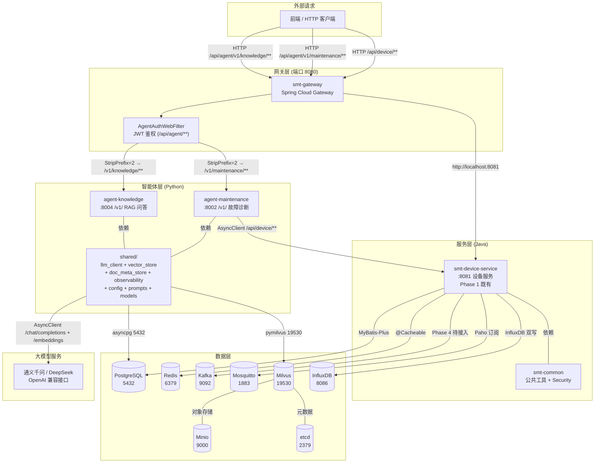
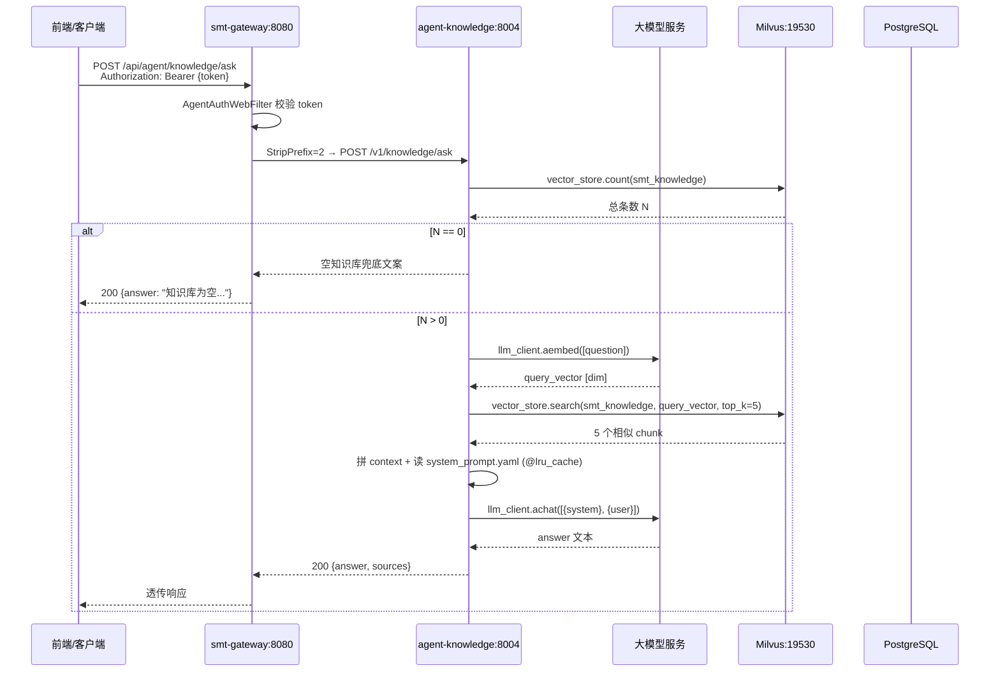
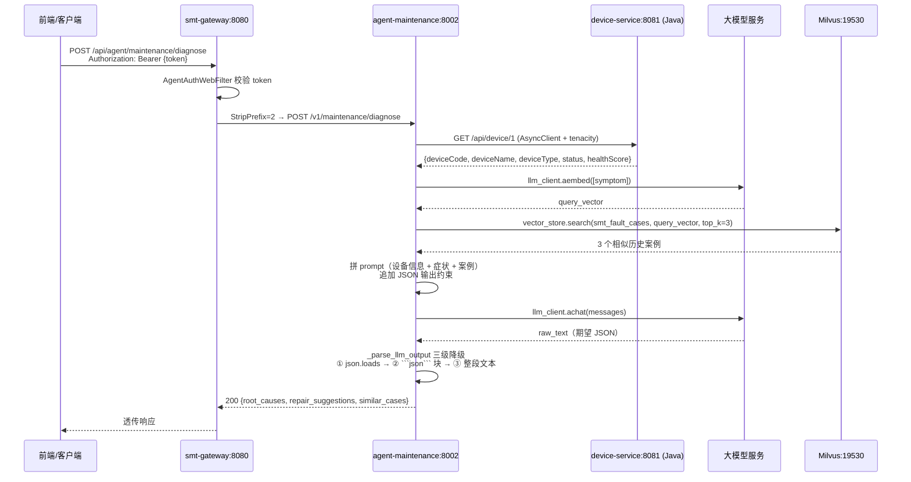
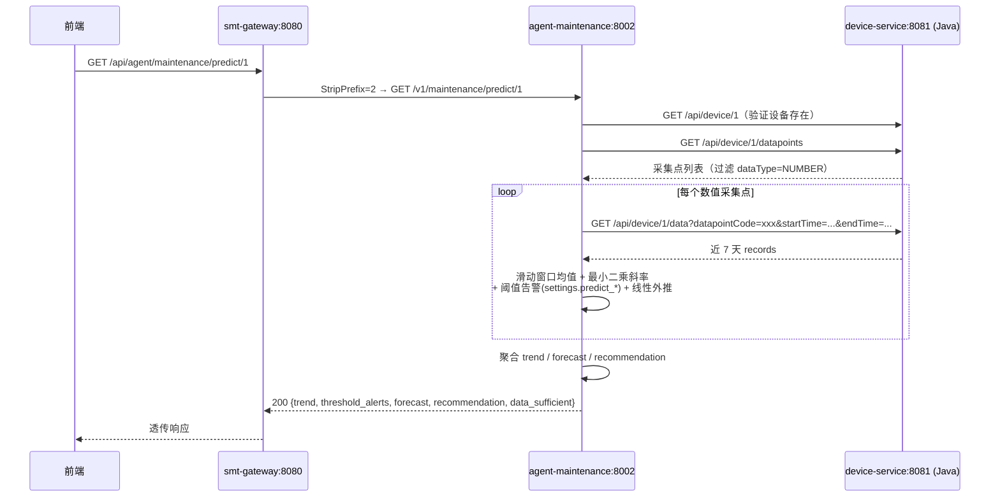
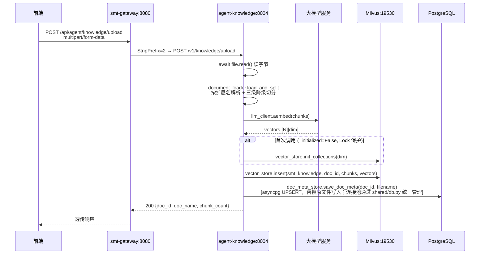
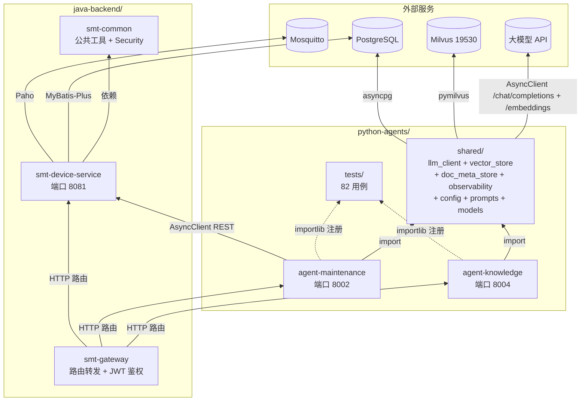
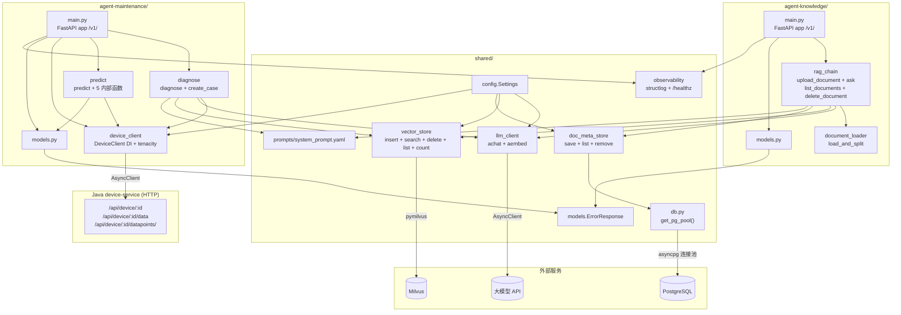
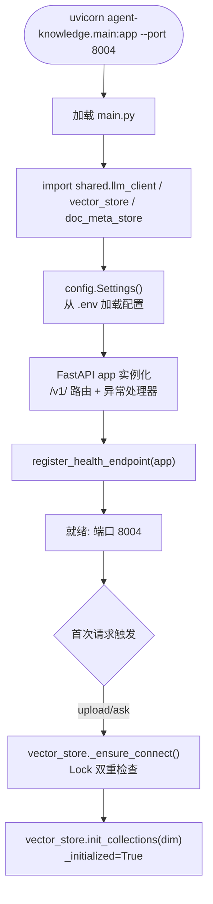

# SMT 贴片产线智能运维与调度平台 —— 项目说明报告（Phase 2）

| 项 | 值 |
|---|---|
| 项目名称 | `smt-agent-platform` —— SMT 贴片产线智能运维与调度系统 |
| 当前阶段 | Phase 2：知识助手 Agent（RAG）+ 设备运维 Agent（PRD 路线图第 3-4 月） |
| 报告日期 | 2026-07-05 |
| 报告范围 | 已交付代码（`python-agents/`、`java-backend/smt-gateway/` 路由扩展与 JWT 鉴权、`docker-compose/` Milvus + InfluxDB 编排、`api-contracts/openapi/agent_api.yaml`、`scripts/*.sh`）+ P0/P1 修复 + 阶段进度 + 架构 + 调用逻辑 + 风险摘要 + 路线图 |
| 目标读者 | 项目内开发人员 |
| 对照基准 | [`docs/PRD.md`](file:///home/north30/projects/Personal/smt-agent-platform/docs/PRD.md)、[`.trae/specs/phase2-knowledge-maintenance-agents/spec.md`](file:///home/north30/projects/Personal/smt-agent-platform/.trae/specs/phase2-knowledge-maintenance-agents/spec.md)、[`.trae/specs/phase2-knowledge-maintenance-agents/checklist.md`](file:///home/north30/projects/Personal/smt-agent-platform/.trae/specs/phase2-knowledge-maintenance-agents/checklist.md)、[`.trae/reports/test-report-comprehensive.md`](file:///home/north30/projects/Personal/smt-agent-platform/.trae/reports/test-report-comprehensive.md)、[`AGENTS.md`](file:///home/north30/projects/Personal/smt-agent-platform/AGENTS.md) §3.2 |
| 前置文档 | [Phase 1 项目说明](file:///home/north30/projects/Personal/smt-agent-platform/docs/explaination/project-explanation-phase1.md) |
| Git 状态 | 分支 `feature/agent-layer-init`，6 次提交（含 P0/P1 修复），未合并至 `main` |

---

## 一、总体概述

本项目定位为面向电子制造 SMT（表面贴装）生产线的工业智能体平台，通过多智能体协同实现"感知—决策—规划—执行"全链路运营闭环。完整规划为 5 个阶段、约 10 个月交付周期（详见 [PRD §6](file:///home/north30/projects/Personal/smt-agent-platform/docs/PRD.md)）。

**当前进度一句话**：Phase 2（知识助手 Agent + 设备运维 Agent）代码层面全量交付完成，P0/P1 问题全部修复，Python 82 个测试全绿 + Java 71 个测试全绿；全量 async 重构、threading.Lock 竞态保护、langchain 依赖移除、网关 JWT 鉴权、文档元数据迁移 PG、tenacity 重试、structlog 可观测性、/v1/ 路由前缀均已落地；端到端运行验证因本机 Docker Hub 不可达而跳过。

**已交付**：`python-agents/` 全量工程（Poetry + Python 3.12 + FastAPI + Pydantic v2 + httpx AsyncClient + pymilvus + asyncpg + tenacity + structlog）、`shared/` 公共模块（`llm_client` / `vector_store` / `config` / `prompts` / `doc_meta_store` / `observability` / `models`）、`agent-knowledge`（端口 8004，/v1/ 路由，文档上传 + RAG 问答 + 文档管理）、`agent-maintenance`（端口 8002，/v1/ 路由，健康分析 + 故障诊断 + 预测性维护 v1 + 案例录入）、Milvus + etcd + minio + InfluxDB 中间件编排、smt-gateway 路由扩展 + AgentAuthWebFilter JWT 鉴权、OpenAPI 契约、启动脚本补全。

**未交付**（属后续阶段）：质量分析 Agent、调度 Agent、执行协同 Agent（Phase 3-4）；LangGraph 多 Agent 编排（Phase 3）；Kafka 事件总线（Phase 4）；C++ 原生层（Phase 5）；前端可视化（Phase 4）；gRPC 跨语言契约（Phase 3+）；深度学习 PHM 模型（Phase 5+）；Kafka 业务层接入（Phase 4）；conftest.py importlib hack 消除（Phase 3）。

---

## 二、开发阶段与进度

### 2.1 路线图总览（PRD §6）

| 阶段 | 周期 | 核心交付 | 状态 |
|---|---|---|---|
| Phase 1 | 第 1-2 月 | Java 服务底座 + 设备数据接入 | 🟢 代码完成 + P0/P1 修复完成，已合并 `main` |
| **Phase 2** | 第 3-4 月 | 知识助手 Agent（RAG）+ 设备运维 Agent | 🟢 **代码完成 + P0/P1 修复完成，端到端验证待补，未合并 `main`** |
| Phase 3 | 第 5-6 月 | 质量分析 Agent + 调度 Agent | ⬜ 未启动 |
| Phase 4 | 第 7-8 月 | 执行协同 Agent + 全流程闭环 | ⬜ 未启动 |
| Phase 5 | 第 9-10 月 | 系统集成测试 + 产线试点 | ⬜ 未启动 |

### 2.2 Phase 2 详细进度

依据 [`.trae/specs/phase2-knowledge-maintenance-agents/checklist.md`](file:///home/north30/projects/Personal/smt-agent-platform/.trae/specs/phase2-knowledge-maintenance-agents/checklist.md)（37 项验收全部 `[x]`）+ P0 修复项：

| # | 交付项 | 状态 | 备注 |
|---|---|---|---|
| 1 | docker-compose 追加 Milvus + etcd + minio + InfluxDB，19530/8086 端口暴露，含健康检查 + 三网络隔离 | ✅ | 既有 PG/Redis/Kafka/Mosquitto 定义未修改；凭据环境变量化 |
| 2 | `docker-compose/.env.example` 追加 Milvus + InfluxDB 相关占位变量 | ✅ | 无硬编码密码 |
| 3 | `pyproject.toml` Poetry + Python 3.12 依赖清单完整 | ✅ | langchain 已移除；新增 asyncpg/tenacity/structlog |
| 4 | `python-agents/.env.example` 占位完整 | ✅ | 修复批次中已全量重写，覆盖 Settings 全部字段（POSTGRES_* / LLM_* / DEVICE_SERVICE_* / MILVUS_* / HTTP_* / PREDICT_* / LOG_LEVEL / QUALITY_* / SCHEDULER_* / AGENT_*_BASE_URL） |
| 5 | `python-agents/README.md` 端口映射与启动说明 | ✅ | 8002 / 8004 双 Agent |
| 6 | `.gitignore` 忽略 `.env`、`.venv/`、`__pycache__/` | ✅ | |
| 7 | `shared/llm_client.py` 暴露 `achat` / `aembed`，全 async + AsyncClient + tenacity 重试 | ✅ | 源码无 API_KEY 硬编码；模块级共享客户端实例 |
| 8 | `shared/vector_store.py` 封装 Milvus `insert`/`search`/`delete`/`list`/`count`，Lock + query_iterator + tenacity | ✅ | 线程安全；突破 16384 上限 |
| 9 | `shared/prompts/system_prompt.yaml` 含 knowledge + maintenance 两套中文 prompt | ✅ | |
| 10 | `shared/config.py` 用 pydantic-settings 加载 `.env` 导出 `settings` 单例 | ✅ | 新增 postgres_*/predict_*/retry/log_level 配置 |
| 11 | `shared/doc_meta_store.py` asyncpg 连接池 + 文档元数据 CRUD | ✅ | P0 修复：替换文件持久化 |
| 12 | `shared/observability.py` structlog 配置 + /healthz 端点 | ✅ | P0 修复：可观测性基线 |
| 13 | `shared/models.py` 共享 ErrorResponse | ✅ | P0 修复：消除两 Agent 重复定义 |
| 14 | `tests/test_llm_client.py` + `tests/test_vector_store.py` + `tests/test_config.py` 全绿 | ✅ | mock 外部依赖 |
| 15 | `agent-knowledge/document_loader.py` 支持 md/txt/pdf/docx 加载 + 三级降级切分 | ✅ | 段落→句子→字符滑动窗口 |
| 16 | `agent-knowledge/rag_chain.py` retrieve→top_k 截断→generate；全 async + doc_meta_store + lru_cache | ✅ | |
| 17 | `agent-knowledge/main.py` FastAPI 4 接口 + /v1/ 前缀 + async + /healthz + structlog | ✅ | |
| 18 | `agent-knowledge/models.py` Pydantic 模型（ErrorResponse 抽取到 shared） | ✅ | |
| 19 | `tests/test_knowledge_rag.py` + `tests/test_knowledge_api.py` + `tests/test_document_loader.py` 全绿 | ✅ | |
| 20 | `agent-maintenance/device_client.py` httpx AsyncClient + DI 模式 + tenacity 重试 | ✅ | |
| 21 | `agent-maintenance/diagnose.py` retrieve(smt_fault_cases) → LLM 根因推理；全 async + lru_cache + JSON 提取加固 | ✅ | |
| 22 | `agent-maintenance/predict.py` 滑动窗口 + 阈值告警 + 线性外推；全 async + 配置外置 | ✅ | |
| 23 | `agent-maintenance/main.py` FastAPI 4 接口 + /v1/ 前缀 + async + /healthz + structlog | ✅ | |
| 24 | `agent-maintenance/models.py` Pydantic 模型（ErrorResponse 抽取到 shared） | ✅ | |
| 25 | `tests/test_maintenance_*.py` 全绿（diagnose + predict + api，predict 扩至 20 用例） | ✅ | |
| 26 | smt-gateway 新增 `/api/agent/knowledge/**` 与 `/api/agent/maintenance/**` 路由 + AgentAuthWebFilter | ✅ | StripPrefix=2，地址 ENV 化，JWT 鉴权；修复批次已将谓词路径改为 `/api/agent/v1/<module>/**`（详见 §4.5） |
| 27 | `mvn -pl smt-gateway compile` 通过，既有路由不破坏 | ✅ | |
| 28 | `api-contracts/openapi/agent_api.yaml` OpenAPI 3.0 覆盖 8 接口 | ✅ | 与 Python 实现对齐 |
| 29 | `scripts/build_all.sh` 含 Python 段 `poetry install` | ✅ | |
| 30 | `scripts/dev_restart.sh` 含 uvicorn + Java 微服务后台启动 | ✅ | PID 文件管理 |
| 31 | `poetry install` 在 `python-agents/` 成功 | ✅ | |
| 32 | `poetry run pytest` 全绿（82 用例） | ✅ | 含 contract 13 + slow 2 + integration 2 |
| 33 | `mvn clean install -DskipTests` 全绿 | ✅ | |
| 34 | `mvn test` 71 用例全绿（Phase 1 既有未破坏） | ✅ | |
| 35 | 注释/文档/异常消息中文 | ✅ | |
| 36 | 遵循 AGENTS.md §3.2 | ✅ | |
| 37 | 4 空格缩进、LF、文件末尾空行 | ✅ | |
| 38 | 未引入 gRPC / Kafka / LangGraph / C++ / 前端改动 | ✅ | spec 排除项严格遵循 |

**注**：checklist 中 pyproject.toml 仍写 "Python 3.14" 及列有 langchain，与实际代码不一致（漂移：Python 3.12、langchain 已移除）。

**Phase 2 收尾待办**：Phase 2 P0/P1 问题已全部修复。仅剩端到端闭环验证（需 Docker 环境）及 8 项延期至 Phase 3+ 的工作（详见 §六）。

### 2.3 Git 状态

```
* 908c621 (HEAD -> feature/agent-layer-init) feat: 完成 phase2 全量功能迭代与架构升级
  bb2a107 test(agents): 补齐全模块测试覆盖与契约校验
  8d778f6 refactor(agents): 完成 Phase2 P0 阶段全量重构与交付
  afb9c3b chore: 完成 Phase1 收尾 P1 问题批量修复
  0c706ae docs(explaination): 新增 Phase 2 智能体层项目说明
  6fa98c4 feat(agents): 新增 Phase 2 Python 智能体层
  ...
```

- 当前分支 `feature/agent-layer-init`，已推至 `origin`，未合并 `main`
- Phase 1 已通过 PR #3 合并至 `main`

---

## 三、项目架构

### 3.1 四层架构：设计 vs 现状

PRD §3.1 设计了"交互层 / 智能体层 / 服务层 / 数据层"四层架构。Phase 2 在 Phase 1 服务层基础上，**新增智能体层**与**数据层向量库 + 时序库**：

| 层 | 设计职责 | Phase 2 现状 |
|---|---|---|
| 交互层（Frontend） | Web 控制台、移动端、数字孪生大屏 | ❌ 仅占位目录（6 个空页面目录），无实现文件 |
| 智能体层（Agent） | 5 个 Python Agent | 🟡 **2/5 已实现**：agent-knowledge（8004）/v1/）+ agent-maintenance（8002 /v1/）；含 structlog + /healthz + tenacity 重试 + async 全链路；缺 quality / scheduler / execution |
| 服务层（Service） | Java 微服务群 + 消息队列 | 🟡 Phase 1 既有复用 + gateway 新增 `/api/agent/**` 路由 + AgentAuthWebFilter JWT 鉴权；缺 order / quality / notification / agent-router |
| 数据层（Data） | PG + InfluxDB + Milvus + 工业协议 | 🟡 **新增 Milvus + etcd + minio + InfluxDB**；doc_meta 从文件迁移到 PG；Redis 缓存已接入 |

### 3.2 模块划分（当前实现）



### 3.3 技术栈选型

#### 3.3.1 Python 智能体层（Phase 2）

| 技术 | 版本 | 用途 | 对应源文件链接 |
|---|---|---|---|
| Python | 3.12 | 运行时 | [`pyproject.toml`](file:///home/north30/projects/Personal/smt-agent-platform/python-agents/pyproject.toml) |
| FastAPI | ^0.110.0 | Agent API 服务框架 | [`main.py`](file:///home/north30/projects/Personal/smt-agent-platform/python-agents/agent-knowledge/main.py) |
| uvicorn[standard] | ^0.29.0 | ASGI 服务器 | [`main.py`](file:///home/north30/projects/Personal/smt-agent-platform/python-agents/agent-knowledge/main.py) |
| Pydantic | ^2.6.0 | 请求/响应模型校验 | [`models.py`](file:///home/north30/projects/Personal/smt-agent-platform/python-agents/agent-knowledge/models.py) |
| pydantic-settings | ^2.2.0 | `.env` 配置加载 | [`config.py`](file:///home/north30/projects/Personal/smt-agent-platform/python-agents/shared/config.py) |
| httpx | ^0.27.0 | LLM 与 Java 服务 AsyncClient | [`llm_client.py`](file:///home/north30/projects/Personal/smt-agent-platform/python-agents/shared/llm_client.py)、[`device_client.py`](file:///home/north30/projects/Personal/smt-agent-platform/python-agents/agent-maintenance/device_client.py) |
| pymilvus | ^2.4.0 | Milvus 向量库客户端 | [`vector_store.py`](file:///home/north30/projects/Personal/smt-agent-platform/python-agents/shared/vector_store.py) |
| asyncpg | ^0.29.0 | PostgreSQL 异步客户端（doc_meta_store） | [`doc_meta_store.py`](file:///home/north30/projects/Personal/smt-agent-platform/python-agents/shared/doc_meta_store.py) |
| tenacity | ^8.2.0 | 重试策略（llm_client + device_client + vector_store） | [`llm_client.py`](file:///home/north30/projects/Personal/smt-agent-platform/python-agents/shared/llm_client.py) |
| structlog | ^24.1.0 | 结构化日志 | [`observability.py`](file:///home/north30/projects/Personal/smt-agent-platform/python-agents/shared/observability.py) |
| pypdf | ^4.0.0 | PDF 文档解析 | [`document_loader.py`](file:///home/north30/projects/Personal/smt-agent-platform/python-agents/agent-knowledge/document_loader.py) |
| python-docx | ^1.1.0 | Word 文档解析 | 同上 |
| python-multipart | ^0.0.9 | FastAPI 文件上传 | [`main.py`](file:///home/north30/projects/Personal/smt-agent-platform/python-agents/agent-knowledge/main.py) |
| pyyaml | ^6.0.1 | Prompt 模板加载 | [`rag_chain.py`](file:///home/north30/projects/Personal/smt-agent-platform/python-agents/agent-knowledge/rag_chain.py) |
| schemathesis | ^3.36.0 | OpenAPI 契约测试（dev） | [`test_contract_openapi.py`](file:///home/north30/projects/Personal/smt-agent-platform/python-agents/tests/test_contract_openapi.py) |
| Poetry | — | 依赖管理与打包 | [`pyproject.toml`](file:///home/north30/projects/Personal/smt-agent-platform/python-agents/pyproject.toml) |
| pytest / pytest-asyncio | ^8.0.0 / ^0.23.0 | 单元测试 | `tests/` 目录 |

#### 3.3.2 数据层新增（Phase 2）

| 技术 | 版本 | 用途 | 对应源文件链接 |
|---|---|---|---|
| Milvus Standalone | v2.4.0 | 向量数据库（RAG 知识库 + 故障案例库） | [`docker-compose.yml`](file:///home/north30/projects/Personal/smt-agent-platform/docker-compose/docker-compose.yml) |
| etcd | v3.5.5 | Milvus 元数据存储 | [`docker-compose.yml`](file:///home/north30/projects/Personal/smt-agent-platform/docker-compose/docker-compose.yml) |
| Minio | RELEASE.2023-03-24 | Milvus 对象存储 | [`docker-compose.yml`](file:///home/north30/projects/Personal/smt-agent-platform/docker-compose/docker-compose.yml) |
| InfluxDB | 2.7-alpine | 时序数据库（device_data 双写） | [`docker-compose.yml`](file:///home/north30/projects/Personal/smt-agent-platform/docker-compose/docker-compose.yml) |

#### 3.3.3 Java 后端（Phase 1 既有，仅 gateway 配置 + 安全变更）

| 技术 | 版本 | 用途 | 对应源文件链接 |
|---|---|---|---|
| Spring Boot | 3.2.5 | 微服务框架 | [`pom.xml`](file:///home/north30/projects/Personal/smt-agent-platform/java-backend/pom.xml) |
| Spring Cloud Gateway | 2023.0.1 | 网关路由 | [`smt-gateway/pom.xml`](file:///home/north30/projects/Personal/smt-agent-platform/java-backend/smt-gateway/pom.xml) |
| Spring Security | 由 BOM 管理 | JWT 鉴权（AgentAuthWebFilter） | [`AgentAuthWebFilter.java`](file:///home/north30/projects/Personal/smt-agent-platform/java-backend/smt-gateway/src/main/java/com/smt/platform/gateway/security/AgentAuthWebFilter.java) |

### 3.4 系统交互流程

#### 3.4.1 JWT 鉴权前置 + 知识库 RAG 问答全链路



#### 3.4.2 故障诊断全链路（Java ↔ Python 跨语言）



#### 3.4.3 预测性维护趋势分析



#### 3.4.4 文档上传与向量化入库（doc_meta_store 替换文件 I/O）



---

## 四、已实现功能模块

### 4.1 基础设施层

#### 4.1.1 docker-compose 中间件编排

| 服务 | 端口 | 阶段 | 网络 | 文件 |
|---|---|---|---|---|
| PostgreSQL | 5432 | Phase 1 | intranet | [`docker-compose.yml`](file:///home/north30/projects/Personal/smt-agent-platform/docker-compose/docker-compose.yml) |
| Redis | 6379 | Phase 1 | intranet | 同上 |
| Zookeeper | 2181 | Phase 1 | intranet | 同上 |
| Kafka | 9092 | Phase 1 | intranet | 同上 |
| Mosquitto | 1883 | Phase 1 | edge | 同上 |
| **etcd** | 2379 | **Phase 2** | intranet | 同上 |
| **Minio** | 9000 / 9001 | **Phase 2** | intranet | 同上 |
| **Milvus** | 19530 / 9091 | **Phase 2** | intranet | 同上 |
| **InfluxDB** | 8086 | **Phase 2+** | intranet | 同上 |

**网络隔离**：`intranet`（数据层）、`edge`（边缘接入）、`app`（保留给微服务）。凭据全部环境变量化。

#### 4.1.2 启动脚本

| 脚本 | Phase 2 变更 | 文件 |
|---|---|---|
| `build_all.sh` | 新增 Python 段 `cd python-agents && poetry install` | [`build_all.sh`](file:///home/north30/projects/Personal/smt-agent-platform/scripts/build_all.sh) |
| `dev_restart.sh` | 补全 Java 微服务（gateway + device-service）后台启动 + PID 管理；Python Agent 后台启动 | [`dev_restart.sh`](file:///home/north30/projects/Personal/smt-agent-platform/scripts/dev_restart.sh) |

### 4.2 Python 智能体公共层（`python-agents/shared/`）

被两个 Agent 共同依赖，提供横切能力，符合 AGENTS.md §3.2 "大模型调用统一走 `shared/llm_client.py`" 强制要求。

| 模块 | 职责 | 文件 |
|---|---|---|
| `config.py` | `pydantic-settings` 加载 `.env` 导出 `settings` 单例（含 postgres_*/predict_*/retry/log_level） | [`config.py`](file:///home/north30/projects/Personal/smt-agent-platform/python-agents/shared/config.py) |
| `llm_client.py` | 统一大模型调用出口：`achat(messages)` + `aembed(texts)`；AsyncClient + 模块级共享实例 + tenacity AsyncRetrying（429/5xx 重试） | [`llm_client.py`](file:///home/north30/projects/Personal/smt-agent-platform/python-agents/shared/llm_client.py) |
| `vector_store.py` | Milvus 封装：`init_collections` / `insert` / `search` / `delete_by_doc` / `list_docs` / `count`；threading.Lock + query_iterator 分页 + tenacity Retrying | [`vector_store.py`](file:///home/north30/projects/Personal/smt-agent-platform/python-agents/shared/vector_store.py) |
| `doc_meta_store.py` | asyncpg 文档元数据 CRUD（连接池从 shared/db.py 获取，asyncio.Lock 保护）；save_doc_meta / list_doc_meta / remove_doc_meta | [`doc_meta_store.py`](file:///home/north30/projects/Personal/smt-agent-platform/python-agents/shared/doc_meta_store.py) |
| `db.py` | PostgreSQL 连接池公共模块（asyncio.Lock + 懒初始化），被 doc_meta_store / order_store / alert_store 共用 | [`db.py`](file:///home/north30/projects/Personal/smt-agent-platform/python-agents/shared/db.py)（修复批次新增） |
| `observability.py` | structlog 配置 + get_logger + /healthz 端点注册（HealthCheck/HealthResponse） | [`observability.py`](file:///home/north30/projects/Personal/smt-agent-platform/python-agents/shared/observability.py) |
| `models.py` | 共享 ErrorResponse（error + message），消除两 Agent 重复定义 | [`models.py`](file:///home/north30/projects/Personal/smt-agent-platform/python-agents/shared/models.py) |
| `prompts/system_prompt.yaml` | knowledge + maintenance 两套中文角色 Prompt | [`system_prompt.yaml`](file:///home/north30/projects/Personal/smt-agent-platform/python-agents/shared/prompts/system_prompt.yaml) |

### 4.3 知识助手 Agent（`python-agents/agent-knowledge/`，端口 8004）

| 接口 | 方法 | 路径 | 说明 |
|---|---|---|---|
| 上传文档 | POST | `/v1/knowledge/upload` | multipart/form-data，支持 md/txt/pdf/docx |
| RAG 问答 | POST | `/v1/knowledge/ask` | 自然语言问答，返回答案 + 来源片段 |
| 文档列表 | GET | `/v1/knowledge/documents` | 返回 `[{doc_id, doc_name, chunk_count, create_time}]` |
| 删除文档 | DELETE | `/v1/knowledge/documents/{doc_id}` | 删除文档及全部分块向量 |
| 健康检查 | GET | `/healthz` | structlog + uptime |

**核心模块**：

| 模块 | 职责 | 文件 |
|---|---|---|
| `main.py` | FastAPI 入口 + /v1/ 前缀 + async + /healthz + structlog + 异常处理器 | [`main.py`](file:///home/north30/projects/Personal/smt-agent-platform/python-agents/agent-knowledge/main.py) |
| `rag_chain.py` | RAG 链路：upload → embed → insert；ask → embed → search → chat；全 async + doc_meta_store + @lru_cache | [`rag_chain.py`](file:///home/north30/projects/Personal/smt-agent-platform/python-agents/agent-knowledge/rag_chain.py) |
| `document_loader.py` | 按扩展名加载 + 三级降级切分（段落→句子→字符滑动窗口） | [`document_loader.py`](file:///home/north30/projects/Personal/smt-agent-platform/python-agents/agent-knowledge/document_loader.py) |
| `models.py` | Pydantic 请求/响应模型 | [`models.py`](file:///home/north30/projects/Personal/smt-agent-platform/python-agents/agent-knowledge/models.py) |

**主要特性**：

- 全 async 链路，不阻塞 uvicorn worker
- 空知识库兜底：`vector_store.count == 0` 时返回"知识库为空"
- 文档元数据持久化到 PostgreSQL（asyncpg），不再使用文件
- Prompt 加载 `@lru_cache(maxsize=1)`
- `doc_id` 生成规则：`{filename_stem}_{uuid4_hex[:8]}`

### 4.4 设备运维 Agent（`python-agents/agent-maintenance/`，端口 8002）

| 接口 | 方法 | 路径 | 说明 |
|---|---|---|---|
| 健康分析 | GET | `/v1/maintenance/health/{device_id}` | 复用 device-service 健康评分 + 风险等级判读 |
| 故障诊断 | POST | `/v1/maintenance/diagnose` | RAG 检索 `smt_fault_cases` + LLM 根因推理 |
| 预测性维护 | GET | `/v1/maintenance/predict/{device_id}` | 滑动窗口均值 + 阈值告警 + 线性外推 |
| 案例录入 | POST | `/v1/maintenance/cases` | 故障案例向量化入库 `smt_fault_cases` |
| 健康检查 | GET | `/healthz` | structlog + uptime |

**核心模块**：

| 模块 | 职责 | 文件 |
|---|---|---|
| `main.py` | FastAPI 入口 + /v1/ 前缀 + async + /healthz + structlog + 异常处理器 | [`main.py`](file:///home/north30/projects/Personal/smt-agent-platform/python-agents/agent-maintenance/main.py) |
| `device_client.py` | Java device-service AsyncClient（DI 模式 + tenacity AsyncRetrying） | [`device_client.py`](file:///home/north30/projects/Personal/smt-agent-platform/python-agents/agent-maintenance/device_client.py) |
| `diagnose.py` | 故障诊断：检索相似案例 + LLM 根因推理 + 输出解析三级降级；全 async + @lru_cache + JSON 提取加固 | [`diagnose.py`](file:///home/north30/projects/Personal/smt-agent-platform/python-agents/agent-maintenance/diagnose.py) |
| `predict.py` | 预测性维护 v1：规则 + 趋势分析；全 async + 配置外置（settings.predict_*） | [`predict.py`](file:///home/north30/projects/Personal/smt-agent-platform/python-agents/agent-maintenance/predict.py) |
| `models.py` | Pydantic 请求/响应模型 | [`models.py`](file:///home/north30/projects/Personal/smt-agent-platform/python-agents/agent-maintenance/models.py) |

**主要特性**：

- **健康分析**：`health_score ≥ 85` LOW / `≥ 60` MEDIUM / `< 60` HIGH（阈值已从硬编码提取到 `shared/config.py` 的 `maintenance_risk_low` / `maintenance_risk_medium` 配置项）；非数字 healthScore 抛 DeviceServiceUnavailable → 503
- **故障诊断**：检索 Top-3 相似案例 → 拼 prompt → 追加 JSON 输出约束 → LLM 推理 → 三级降级解析（`json.loads` → ```` ```json ```` `` 块提取 → 正则 fallback → 整段文本）
- **预测性维护 v1**（spec 已显式裁剪，未达 PRD §4.2 "提前 14 天预警" P0）：
  - 阈值配置化（settings.predict_temp_max / predict_vib_max / predict_default_max）
  - 滑动窗口最大 100 样本，最小二乘法计算斜率
  - 告警三级：HIGH / MEDIUM / LOW
  - 线性外推：`hours_to_threshold = (max - current_mean) / slope * sample_interval_hours`
  - 数据不足兜底：时间跨度 < 24h 时返回"数据不足"
- **Java 服务不可达兜底**：`device_client` 抛 `DeviceServiceUnavailable` → 503

### 4.5 Java 网关路由扩展 + JWT 鉴权

| 配置项 | 值 | 文件 |
|---|---|---|
| `/api/device/**` → device-service | `http://${SMT_DEVICE_SERVICE_HOST:localhost}:${SMT_DEVICE_SERVICE_PORT:8081}` | [`application.yml`](file:///home/north30/projects/Personal/smt-agent-platform/java-backend/smt-gateway/src/main/resources/application.yml) |
| `/api/agent/v1/knowledge/**` → agent-knowledge | `http://${SMT_AGENT_KNOWLEDGE_HOST:localhost}:${SMT_AGENT_KNOWLEDGE_PORT:8004}` | 同上 |
| `/api/agent/v1/maintenance/**` → agent-maintenance | `http://${SMT_AGENT_MAINTENANCE_HOST:localhost}:${SMT_AGENT_MAINTENANCE_PORT:8002}` | 同上 |
| `AgentAuthWebFilter` | 仅拦截 `/api/agent/**`，校验 Bearer token，无效返回 401 | [`AgentAuthWebFilter.java`](file:///home/north30/projects/Personal/smt-agent-platform/java-backend/smt-gateway/src/main/java/com/smt/platform/gateway/security/AgentAuthWebFilter.java) |

### 4.6 API 契约

| 文件 | 说明 |
|---|---|
| [`api-contracts/openapi/agent_api.yaml`](file:///home/north30/projects/Personal/smt-agent-platform/api-contracts/openapi/agent_api.yaml) | OpenAPI 3.0.3，覆盖 knowledge 4 接口 + maintenance 4 接口；KnowledgeSource.chunk_id 类型已统一为 integer（与 Milvus INT64 对齐） |
| [`api-contracts/openapi/device_api.yaml`](file:///home/north30/projects/Personal/smt-agent-platform/api-contracts/openapi/device_api.yaml) | Phase 1 既有，未修改 |

### 4.7 测试覆盖

| 测试文件 | 用例数 | 标记 | 覆盖范围 |
|---|---|---|---|
| `test_config.py` | 3 | — | config.py pydantic-settings 加载 |
| `test_llm_client.py` | 5 | — | chat/embed 成功/错误/排序 |
| `test_vector_store.py` | 4 | — | init/insert/search |
| `test_document_loader.py` | 5 | — | 4 种格式切分 |
| `test_knowledge_api.py` | 8 | — | 4 接口 + 异常路径 |
| `test_knowledge_rag.py` | 4 | — | RAG 链路 + 空库兜底 |
| `test_maintenance_api.py` | 11 | — | 4 接口 + 边界 |
| `test_maintenance_diagnose.py` | 3 | — | 诊断 + LLM 解析降级 |
| `test_maintenance_predict.py` | 20 | — | 预测主流程 + 数据不足 + 阈值告警 + 趋势 |
| `test_contract_openapi.py` | 13 | contract | OpenAPI 契约守护 |
| `test_contract_device_field_mapping.py` | 2 | — | Java camelCase → Python snake_case |
| `test_performance.py` | 2 | slow | RAG <3s + LLM <0.5s |
| `integration/test_e2e_smoke.py` | 2 | integration | 端到端冒烟 |
| **Python 小计** | **82** | | **全绿** |
| Java（Phase 1+2 修复） | 71 | — | 详见 Phase 1 报告 |

**测试盲区**（详见 [`test-report-comprehensive.md`](file:///home/north30/projects/Personal/smt-agent-platform/.trae/reports/test-report-comprehensive.md)）：

- RAG < 3s 性能断言基于 mock 链路，未包含真实 LLM/Milvus 网络延迟
- Python 综合覆盖率 77.88%；Java 综合覆盖率 36.2%（smt-common 6.5% 偏低）
- 修复批次后实测：Java 57 用例 0 失败；Python 175 passed、1 pre-existing failure（LLM_API_KEY 环境未配置）、2 skipped；集成测试 11/12 通过（1 项预期失败：LM Studio 鉴权，属 SEC-4 设计）
- smt-gateway 路由零集成测试

---

## 五、代码文件依赖关系与调用逻辑

### 5.1 模块依赖关系



### 5.2 Python 包结构

```
python-agents/
├── [pyproject.toml](file:///home/north30/projects/Personal/smt-agent-platform/python-agents/pyproject.toml)                      Poetry 依赖管理（Python 3.12）
├── [.env.example](file:///home/north30/projects/Personal/smt-agent-platform/python-agents/.env.example)                        环境变量占位
├── [README.md](file:///home/north30/projects/Personal/smt-agent-platform/python-agents/README.md)                           端口映射与启动说明
├── shared/                             公共模块（被两 Agent 共享）
│   ├── [config.py](file:///home/north30/projects/Personal/smt-agent-platform/python-agents/shared/config.py)                       Settings 单例（pydantic-settings）
│   ├── [llm_client.py](file:///home/north30/projects/Personal/smt-agent-platform/python-agents/shared/llm_client.py)                   achat() + aembed() 统一出口（AsyncClient + tenacity）
│   ├── [vector_store.py](file:///home/north30/projects/Personal/smt-agent-platform/python-agents/shared/vector_store.py)                 Milvus insert/search/delete/list/count（Lock + query_iterator + tenacity）
│   ├── [doc_meta_store.py](file:///home/north30/projects/Personal/smt-agent-platform/python-agents/shared/doc_meta_store.py)               asyncpg 文档元数据 CRUD
│   ├── [db.py](file:///home/north30/projects/Personal/smt-agent-platform/python-agents/shared/db.py)                       PostgreSQL 连接池公共模块（asyncio.Lock + 懒初始化，被 doc_meta_store / order_store / alert_store 共用）
│   ├── [observability.py](file:///home/north30/projects/Personal/smt-agent-platform/python-agents/shared/observability.py)                structlog + /healthz
│   ├── [models.py](file:///home/north30/projects/Personal/smt-agent-platform/python-agents/shared/models.py)                     共享 ErrorResponse
│   └── prompts/
│       └── [system_prompt.yaml](file:///home/north30/projects/Personal/smt-agent-platform/python-agents/shared/prompts/system_prompt.yaml)          knowledge + maintenance 中文 prompt
├── agent-knowledge/                    知识助手（端口 8004）
│   ├── [__init__.py](file:///home/north30/projects/Personal/smt-agent-platform/python-agents/agent-knowledge/__init__.py)
│   ├── [main.py](file:///home/north30/projects/Personal/smt-agent-platform/python-agents/agent-knowledge/main.py)                         FastAPI 4 接口 + /v1/ + async + /healthz
│   ├── [rag_chain.py](file:///home/north30/projects/Personal/smt-agent-platform/python-agents/agent-knowledge/rag_chain.py)                    RAG 链路（async + doc_meta_store + lru_cache）
│   ├── [document_loader.py](file:///home/north30/projects/Personal/smt-agent-platform/python-agents/agent-knowledge/document_loader.py)              三级降级切分
│   └── [models.py](file:///home/north30/projects/Personal/smt-agent-platform/python-agents/agent-knowledge/models.py)                       Pydantic 模型
├── agent-maintenance/                  设备运维（端口 8002）
│   ├── [__init__.py](file:///home/north30/projects/Personal/smt-agent-platform/python-agents/agent-maintenance/__init__.py)
│   ├── [main.py](file:///home/north30/projects/Personal/smt-agent-platform/python-agents/agent-maintenance/main.py)                         FastAPI 4 接口 + /v1/ + async + /healthz
│   ├── [device_client.py](file:///home/north30/projects/Personal/smt-agent-platform/python-agents/agent-maintenance/device_client.py)                AsyncClient + DI + tenacity
│   ├── [diagnose.py](file:///home/north30/projects/Personal/smt-agent-platform/python-agents/agent-maintenance/diagnose.py)                     故障诊断 + 案例录入（async + lru_cache）
│   ├── [predict.py](file:///home/north30/projects/Personal/smt-agent-platform/python-agents/agent-maintenance/predict.py)                      预测性维护 v1（async + 配置外置）
│   └── [models.py](file:///home/north30/projects/Personal/smt-agent-platform/python-agents/agent-maintenance/models.py)                       Pydantic 模型
└── tests/                              82 个 pytest 用例
    ├── [conftest.py](file:///home/north30/projects/Personal/smt-agent-platform/python-agents/tests/conftest.py)                     importlib 注册
    ├── [test_config.py](file:///home/north30/projects/Personal/smt-agent-platform/python-agents/tests/test_config.py)                  3 用例
    ├── [test_llm_client.py](file:///home/north30/projects/Personal/smt-agent-platform/python-agents/tests/test_llm_client.py)              5 用例
    ├── [test_vector_store.py](file:///home/north30/projects/Personal/smt-agent-platform/python-agents/tests/test_vector_store.py)              4 用例
    ├── [test_document_loader.py](file:///home/north30/projects/Personal/smt-agent-platform/python-agents/tests/test_document_loader.py)          5 用例
    ├── [test_knowledge_api.py](file:///home/north30/projects/Personal/smt-agent-platform/python-agents/tests/test_knowledge_api.py)            8 用例
    ├── [test_knowledge_rag.py](file:///home/north30/projects/Personal/smt-agent-platform/python-agents/tests/test_knowledge_rag.py)            4 用例
    ├── [test_maintenance_api.py](file:///home/north30/projects/Personal/smt-agent-platform/python-agents/tests/test_maintenance_api.py)         11 用例
    ├── [test_maintenance_diagnose.py](file:///home/north30/projects/Personal/smt-agent-platform/python-agents/tests/test_maintenance_diagnose.py)    3 用例
    ├── [test_maintenance_predict.py](file:///home/north30/projects/Personal/smt-agent-platform/python-agents/tests/test_maintenance_predict.py)     20 用例
    ├── [test_contract_openapi.py](file:///home/north30/projects/Personal/smt-agent-platform/python-agents/tests/test_contract_openapi.py)        13 用例 (contract)
    ├── [test_contract_device_field_mapping.py](file:///home/north30/projects/Personal/smt-agent-platform/python-agents/tests/test_contract_device_field_mapping.py)  2 用例
    ├── [test_performance.py](file:///home/north30/projects/Personal/smt-agent-platform/python-agents/tests/test_performance.py)             2 用例 (slow)
    └── integration/
        └── [test_e2e_smoke.py](file:///home/north30/projects/Personal/smt-agent-platform/python-agents/tests/integration/test_e2e_smoke.py)       2 用例 (integration)
```

### 5.3 类/模块级依赖关系



### 5.4 关键调用链

#### 5.4.1 Python Agent 启动流程



#### 5.4.2 RAG 问答调用链（`POST /v1/knowledge/ask`，全 async）

```
POST /api/agent/knowledge/ask
  → smt-gateway:8080 (AgentAuthWebFilter JWT 校验)
  → agent-knowledge:8004 /v1/knowledge/ask
  → main.ask(req: AskRequest) async
      └─ rag_chain.ask(question, top_k=5) async
            ├─ vector_store.count("smt_knowledge")
            ├─ llm_client.aembed([question]) async         [AsyncClient POST /embeddings, 60s timeout, tenacity]
            ├─ vector_store.search("smt_knowledge", vec, top_k=5)
            ├─ _load_prompts()                              [@lru_cache(maxsize=1)]
            └─ llm_client.achat([{system}, {user}]) async  [AsyncClient POST /chat/completions, 60s timeout, tenacity]
  → AskResponse(answer, sources)
```

#### 5.4.3 故障诊断调用链（`POST /v1/maintenance/diagnose`，全 async）

```
POST /api/agent/maintenance/diagnose
  → smt-gateway:8080 (AgentAuthWebFilter JWT 校验)
  → agent-maintenance:8002 /v1/maintenance/diagnose
  → main.diagnose_fault(req) async
      └─ diagnose.diagnose(device_id, symptom) async
            ├─ device_client.get_device(device_id)          [AsyncClient GET, 10s timeout, tenacity]
            ├─ llm_client.aembed([symptom]) async
            ├─ vector_store.search("smt_fault_cases", vec, top_k=3)
            ├─ _parse_similar_cases(sources)
            ├─ _load_prompts()                              [@lru_cache]
            ├─ llm_client.achat(messages) async
            └─ _parse_llm_output(raw_text)                  [三级降级 + 正则 fallback]
  → DiagnoseResponse(root_causes, repair_suggestions, similar_cases)
```

### 5.5 文件清单与职责矩阵

#### 5.5.1 `shared/`（7 个 Python 文件 + 1 个 yaml）

| 文件 | 维度 | 职责 |
|---|---|---|
| [`config.py`](file:///home/north30/projects/Personal/smt-agent-platform/python-agents/shared/config.py) | 配置 | `Settings` 单例从 `.env` 加载 |
| [`llm_client.py`](file:///home/north30/projects/Personal/smt-agent-platform/python-agents/shared/llm_client.py) | 外部调用 | `achat()` + `aembed()` 统一出口 |
| [`vector_store.py`](file:///home/north30/projects/Personal/smt-agent-platform/python-agents/shared/vector_store.py) | 外部调用 | Milvus CRUD + 双 collection 管理 |
| [`doc_meta_store.py`](file:///home/north30/projects/Personal/smt-agent-platform/python-agents/shared/doc_meta_store.py) | 数据持久化 | asyncpg 文档元数据 CRUD |
| [`observability.py`](file:///home/north30/projects/Personal/smt-agent-platform/python-agents/shared/observability.py) | 可观测性 | structlog + /healthz |
| [`models.py`](file:///home/north30/projects/Personal/smt-agent-platform/python-agents/shared/models.py) | 模型 | 共享 ErrorResponse |
| [`system_prompt.yaml`](file:///home/north30/projects/Personal/smt-agent-platform/python-agents/shared/prompts/system_prompt.yaml) | Prompt | knowledge + maintenance 中文角色 |

#### 5.5.2 `agent-knowledge/`（5 个 Python 文件）

| 文件 | 维度 | 职责 |
|---|---|---|
| [`main.py`](file:///home/north30/projects/Personal/smt-agent-platform/python-agents/agent-knowledge/main.py) | 入口 | FastAPI 4 接口 + /v1/ + async + /healthz |
| [`rag_chain.py`](file:///home/north30/projects/Personal/smt-agent-platform/python-agents/agent-knowledge/rag_chain.py) | 业务 | upload + ask + list + delete + doc_meta_store |
| [`document_loader.py`](file:///home/north30/projects/Personal/smt-agent-platform/python-agents/agent-knowledge/document_loader.py) | 工具 | 三级降级切分 |
| [`models.py`](file:///home/north30/projects/Personal/smt-agent-platform/python-agents/agent-knowledge/models.py) | 模型 | Pydantic 模型 |
| [`__init__.py`](file:///home/north30/projects/Personal/smt-agent-platform/python-agents/agent-knowledge/__init__.py) | 包 | 空 |

#### 5.5.3 `agent-maintenance/`（6 个 Python 文件）

| 文件 | 维度 | 职责 |
|---|---|---|
| [`main.py`](file:///home/north30/projects/Personal/smt-agent-platform/python-agents/agent-maintenance/main.py) | 入口 | FastAPI 4 接口 + /v1/ + async + /healthz |
| [`device_client.py`](file:///home/north30/projects/Personal/smt-agent-platform/python-agents/agent-maintenance/device_client.py) | 外部调用 | AsyncClient + DI + tenacity |
| [`diagnose.py`](file:///home/north30/projects/Personal/smt-agent-platform/python-agents/agent-maintenance/diagnose.py) | 业务 | diagnose + create_case + LLM 输出三级降级解析 |
| [`predict.py`](file:///home/north30/projects/Personal/smt-agent-platform/python-agents/agent-maintenance/predict.py) | 业务 | predict + 配置外置 |
| [`models.py`](file:///home/north30/projects/Personal/smt-agent-platform/python-agents/agent-maintenance/models.py) | 模型 | Pydantic 模型 |
| [`__init__.py`](file:///home/north30/projects/Personal/smt-agent-platform/python-agents/agent-maintenance/__init__.py) | 包 | 空 |

#### 5.5.4 `tests/`（14 个测试文件 + conftest）

| 文件 | 用例数 | 标记 |
|---|---|---|
| [`conftest.py`](file:///home/north30/projects/Personal/smt-agent-platform/python-agents/tests/conftest.py) | — | importlib 注册 |
| [`test_config.py`](file:///home/north30/projects/Personal/smt-agent-platform/python-agents/tests/test_config.py) | 3 | — |
| [`test_llm_client.py`](file:///home/north30/projects/Personal/smt-agent-platform/python-agents/tests/test_llm_client.py) | 5 | — |
| [`test_vector_store.py`](file:///home/north30/projects/Personal/smt-agent-platform/python-agents/tests/test_vector_store.py) | 4 | — |
| [`test_document_loader.py`](file:///home/north30/projects/Personal/smt-agent-platform/python-agents/tests/test_document_loader.py) | 5 | — |
| [`test_knowledge_api.py`](file:///home/north30/projects/Personal/smt-agent-platform/python-agents/tests/test_knowledge_api.py) | 8 | — |
| [`test_knowledge_rag.py`](file:///home/north30/projects/Personal/smt-agent-platform/python-agents/tests/test_knowledge_rag.py) | 4 | — |
| [`test_maintenance_api.py`](file:///home/north30/projects/Personal/smt-agent-platform/python-agents/tests/test_maintenance_api.py) | 11 | — |
| [`test_maintenance_diagnose.py`](file:///home/north30/projects/Personal/smt-agent-platform/python-agents/tests/test_maintenance_diagnose.py) | 3 | — |
| [`test_maintenance_predict.py`](file:///home/north30/projects/Personal/smt-agent-platform/python-agents/tests/test_maintenance_predict.py) | 20 | — |
| [`test_contract_openapi.py`](file:///home/north30/projects/Personal/smt-agent-platform/python-agents/tests/test_contract_openapi.py) | 13 | contract |
| [`test_contract_device_field_mapping.py`](file:///home/north30/projects/Personal/smt-agent-platform/python-agents/tests/test_contract_device_field_mapping.py) | 2 | — |
| [`test_performance.py`](file:///home/north30/projects/Personal/smt-agent-platform/python-agents/tests/test_performance.py) | 2 | slow |
| [`integration/test_e2e_smoke.py`](file:///home/north30/projects/Personal/smt-agent-platform/python-agents/tests/integration/test_e2e_smoke.py) | 2 | integration |

---

## 六、已知问题与风险摘要

本节为风险概览，详细 findings 见 `.trae/reports/` 下 7 份 Phase 2 专项报告。

### 6.1 已有专项报告清单

| 报告 | 路径 | 关键结论 |
|---|---|---|
| PRD 符合性审查 | [`.trae/reports/prd-conformance-review-phase2.md`](file:///home/north30/projects/Personal/smt-agent-platform/.trae/reports/prd-conformance-review-phase2.md) | 符合 12 / 部分符合 4 / 不符合 3 |
| 代码审查 | [`.trae/reports/code-review-phase2.md`](file:///home/north30/projects/Personal/smt-agent-platform/.trae/reports/code-review-phase2.md) | Blocker 3 / Major 11 / Minor 7 |
| 架构评审 | [`.trae/reports/architecture-review-phase2.md`](file:///home/north30/projects/Personal/smt-agent-platform/.trae/reports/architecture-review-phase2.md) | 优秀 5 / 合理 6 / 待改进 8 |
| 性能评估 | [`.trae/reports/performance-eval-phase2.md`](file:///home/north30/projects/Personal/smt-agent-platform/.trae/reports/performance-eval-phase2.md) | 详见报告 |
| 安全扫描 | [`.trae/reports/security-scan-phase2.md`](file:///home/north30/projects/Personal/smt-agent-platform/.trae/reports/security-scan-phase2.md) | 详见报告 |
| 测试报告 | [`.trae/reports/test-report-phase2.md`](file:///home/north30/projects/Personal/smt-agent-platform/.trae/reports/test-report-phase2.md) | 82 Python + 71 Java 全绿 |
| 综合测试 | [`.trae/reports/test-report-comprehensive.md`](file:///home/north30/projects/Personal/smt-agent-platform/.trae/reports/test-report-comprehensive.md) | Java 71 + Python 62 全绿；覆盖率 Python 77.88% / Java 36.2% |

### 6.2 风险概览（含修复状态）

| 级别 | 问题 | 状态 | 修复说明 | 来源 |
|---|---|---|---|---|
| 🔴 Blocker | FastAPI 同步路由 + 同步 httpx 阻塞 worker | ✅ 已修复 | 全路由 `async def` + httpx.AsyncClient + pymilvus `asyncio.to_thread` | [`[code-review-phase2#B1]`](file:///home/north30/projects/Personal/smt-agent-platform/.trae/reports/code-review-phase2.md) |
| 🔴 Blocker | 模块级 `_initialized` / `_connected` 无线程安全保护 | ✅ 已修复 | 三处加 `threading.Lock()` + 双重检查 | [`[code-review-phase2#B2]`](file:///home/north30/projects/Personal/smt-agent-platform/.trae/reports/code-review-phase2.md) |
| 🔴 Blocker | `langchain` 依赖零使用 | ✅ 已修复 | 从 pyproject.toml 移除 | [`[code-review-phase2#B3]`](file:///home/north30/projects/Personal/smt-agent-platform/.trae/reports/code-review-phase2.md) |
| 🔴 P0 | 网关 `/api/agent/**` 无鉴权 | ✅ 已修复 | AgentAuthWebFilter（reactive JWT 过滤器） | [`[architecture-review-phase2#4.3]`](file:///home/north30/projects/Personal/smt-agent-platform/.trae/reports/architecture-review-phase2.md) |
| 🔴 P0 | 文档元数据用文件持久化 | ✅ 已修复 | doc_meta_store.py（asyncpg → PostgreSQL） | [`[architecture-review-phase2#4.2]`](file:///home/north30/projects/Personal/smt-agent-platform/.trae/reports/architecture-review-phase2.md) |
| 🟠 Major | 全链路无重试无熔断 | ✅ 已修复 | tenacity AsyncRetrying / Retrying | [`[code-review-phase2#M1]`](file:///home/north30/projects/Personal/smt-agent-platform/.trae/reports/code-review-phase2.md) |
| 🟠 Major | predict.py THRESHOLDS 硬编码 | ✅ 已修复 | settings.predict_* 配置外置 | [`[code-review-phase2#M3]`](file:///home/north30/projects/Personal/smt-agent-platform/.trae/reports/code-review-phase2.md) |
| 🟠 Major | vector_store 静默截断 | ✅ 已修复 | query_iterator 分页突破 16384 上限 | [`[code-review-phase2#M4]`](file:///home/north30/projects/Personal/smt-agent-platform/.trae/reports/code-review-phase2.md) |
| 🟠 Major | Prompt 每次读盘 | ✅ 已修复 | `@lru_cache(maxsize=1)` | [`[code-review-phase2#M5]`](file:///home/north30/projects/Personal/smt-agent-platform/.trae/reports/code-review-phase2.md) |
| 🟠 Major | health 错误码语义 | ✅ 已修复 | 非数字 healthScore → DeviceServiceUnavailable → 503 | [`[code-review-phase2#M6]`](file:///home/north30/projects/Personal/smt-agent-platform/.trae/reports/code-review-phase2.md) |
| 🟠 Major | device_client 模块级单例 | ✅ 已修复 | DI 模式 + AsyncClient 懒初始化 | [`[code-review-phase2#M7]`](file:///home/north30/projects/Personal/smt-agent-platform/.trae/reports/code-review-phase2.md) |
| 🟠 Major | predict.py 测试覆盖不足 | ✅ 已修复 | 3 → 20 用例 | [`[code-review-phase2#M9]`](file:///home/north30/projects/Personal/smt-agent-platform/.trae/reports/code-review-phase2.md) |
| 🟠 Major | ErrorResponse 重复定义 | ✅ 已修复 | 抽取到 shared/models.py | [`[code-review-phase2#M11]`](file:///home/north30/projects/Personal/smt-agent-platform/.trae/reports/code-review-phase2.md) |
| 🟠 Major | Python 侧无可观测性 | ✅ 部分修复 | structlog + /healthz；缺 metrics 端点 | [`[prd-conformance-review-phase2#3.3]`](file:///home/north30/projects/Personal/smt-agent-platform/.trae/reports/prd-conformance-review-phase2.md) |
| 🟠 Major | RAG < 3s PRD P0 未验证 | ✅ 部分修复 | mock 链路性能基准测试已有；真实 LLM 延迟未验证 | [`[prd-conformance-review-phase2#3.1]`](file:///home/north30/projects/Personal/smt-agent-platform/.trae/reports/prd-conformance-review-phase2.md) |
| 🟠 Major | docker-compose 无网络隔离 | ✅ 已修复 | 三网络隔离 | [`[architecture-review-phase2#4.8]`](file:///home/north30/projects/Personal/smt-agent-platform/.trae/reports/architecture-review-phase2.md) |
| 🟠 Major | dev_restart.sh 未启动 Java | ✅ 已修复 | 补全 Java 微服务后台启动 | [`[architecture-review-phase2#4.9]`](file:///home/north30/projects/Personal/smt-agent-platform/.trae/reports/architecture-review-phase2.md) |
| 🟠 Major | Agent 间无通信机制 | ⏳ 延期 Phase 3 | PRD §3.3 多智能体协作 | [`[architecture-review-phase2#4.7]`](file:///home/north30/projects/Personal/smt-agent-platform/.trae/reports/architecture-review-phase2.md) |
| 🟠 Major | 无 API 版本号 | ✅ 已修复 | /v1/ 前缀 | [`[architecture-review-phase2#4.4]`](file:///home/north30/projects/Personal/smt-agent-platform/.trae/reports/architecture-review-phase2.md) |
| ⚠️ Minor | llm_client 每次新建 httpx.Client | ✅ 已修复 | AsyncClient 模块级共享实例 | [`[code-review-phase2#m1]`](file:///home/north30/projects/Personal/smt-agent-platform/.trae/reports/code-review-phase2.md) |
| ⚠️ Minor | document_loader 字符切分 | ✅ 已修复 | 三级降级切分（段落→句子→字符滑动窗口） | [`[code-review-phase2#m3]`](file:///home/north30/projects/Personal/smt-agent-platform/.trae/reports/code-review-phase2.md) |
| ⚠️ Minor | conftest.py importlib hack | ⏳ 延期 Phase 3 | 需改 kebab-case 目录为 snake_case | [`[code-review-phase2#m5]`](file:///home/north30/projects/Personal/smt-agent-platform/.trae/reports/code-review-phase2.md) |
| ⚠️ Minor | async/sync 风格不一致 | ✅ 已修复 | 全路由 async def | [`[code-review-phase2#m7]`](file:///home/north30/projects/Personal/smt-agent-platform/.trae/reports/code-review-phase2.md) |
| ⚠️ Minor | 死导入 ValidationError | ✅ 已修复 | 已删除 | [`[code-review-phase2#M8]`](file:///home/north30/projects/Personal/smt-agent-platform/.trae/reports/code-review-phase2.md) |
| ⚠️ 验证 | docker-compose 端到端闭环未实跑 | ⏳ 待环境 | 本机 Docker Hub 不可达 | [`[architecture-review-phase2#4.1]`](file:///home/north30/projects/Personal/smt-agent-platform/.trae/reports/architecture-review-phase2.md) |

### 6.3 延期至 Phase 3+ 的项目

| 项目 | 延期阶段 | 原因 |
|---|---|---|
| Agent 间通信协议 | Phase 3 | PRD §3.3 多智能体编排 |
| Kafka 业务层接入 | Phase 4 | PRD §6 明确 Phase 4 为"Kafka 事件驱动" |
| conftest.py importlib hack 消除 | Phase 3 | 需将 kebab-case 目录改 snake_case |
| PHM 深度学习模型 + 14 天预警 | Phase 5+ | 需真实产线数据训练 |
| saveData saveBatch 批量化 | Phase 3 | @Async 已缓解，批量化架构变更较大 |
| ResultCode BIZ_ERROR/SYSTEM_ERROR 同码 500 | Phase 3 | 改码会破坏前端契约 |
| 实体 @Data → @Getter/@Setter | Phase 3 | 移除 equals/hashCode/toString 有行为变更风险 |
| @CacheEvict 精准失效 | Phase 3 | 当前仅 1 个 GET 端点有 @Cacheable，TTL 10min 兜底 |

---

## 七、后续阶段路线图

依据 [PRD §6](file:///home/north30/projects/Personal/smt-agent-platform/docs/PRD.md)，后续阶段规划如下（详细需求见 PRD 第四章）：

| 阶段 | 核心交付 | 技术重点 | 关键依赖 |
|---|---|---|---|
| Phase 3 | 质量分析 Agent + 调度 Agent | LangGraph 多智能体编排 | Phase 2 Agent 框架 + LangChain/LangGraph 引入 |
| Phase 4 | 执行协同 Agent + 全流程闭环 + 前端 | Kafka 事件驱动 + 人机协同 + React 前端 | Phase 3 多 Agent 协同 + 文档元数据已迁移 |
| Phase 5 | C++ 原生层 + 系统集成测试 + 产线试点 | pybind11/JNI + PHM 模型 + 端到端验证 | 全部前置阶段 |

---

## 八、附录

### 8.1 构建与运行命令

详见 [`AGENTS.md §2`](file:///home/north30/projects/Personal/smt-agent-platform/AGENTS.md)。常用命令：

```bash
# 中间件（含 Phase 2 新增 Milvus + InfluxDB + 三网络隔离）
cd docker-compose && docker compose up -d

# Python 智能体依赖安装
cd python-agents && uv install

# Python 单 Agent 运行
cd python-agents && uv run uvicorn agent-knowledge.main:app --port 8004 --reload
cd python-agents && uv run uvicorn agent-maintenance.main:app --port 8002 --reload

# Python 全量测试
cd python-agents && uv run pytest

# Python 仅单元测试（排除 contract/slow/integration）
cd python-agents && uv run pytest -m "not contract and not slow and not integration"

# Java 全量编译与测试
cd java-backend && mvn clean install -DskipTests
cd java-backend && mvn test

# 一键构建
bash scripts/build_all.sh

# 一键重启（中间件 + Java 微服务 + Python Agent）
bash scripts/dev_restart.sh
```

### 8.2 关键配置

| 配置项 | 默认值 | 文件 |
|---|---|---|
| `LLM_PROVIDER` | `tongyi` | [`config.py`](file:///home/north30/projects/Personal/smt-agent-platform/python-agents/shared/config.py) |
| `LLM_BASE_URL` | `https://dashscope.aliyuncs.com/compatible-mode/v1` | 同上 |
| `LLM_MODEL` | `qwen-plus` | 同上 |
| `LLM_EMBED_MODEL` | `text-embedding-v2` | 同上 |
| `MILVUS_HOST` | `localhost` | 同上 |
| `MILVUS_PORT` | `19530` | 同上 |
| `DEVICE_SERVICE_BASE_URL` | `http://localhost:8081` | 同上 |
| `POSTGRES_HOST` | `localhost` | 同上 |
| `POSTGRES_PORT` | `5432` | 同上 |
| `POSTGRES_DB` | `smt` | 同上 |
| `PREDICT_TEMP_MAX` | `80.0` | 同上 |
| `PREDICT_VIB_MAX` | `5.0` | 同上 |
| `PREDICT_DEFAULT_MAX` | `100.0` | 同上 |
| `PREDICT_MIN_SPAN_HOURS` | `24` | 同上 |
| `LLM_MAX_RETRIES` | `3` | 同上 |
| `DEVICE_SERVICE_MAX_RETRIES` | `3` | 同上 |
| `MILVUS_MAX_RETRIES` | `3` | 同上 |
| `LOG_LEVEL` | `INFO` | 同上 |
| agent-knowledge 端口 | `8004` | [`main.py`](file:///home/north30/projects/Personal/smt-agent-platform/python-agents/agent-knowledge/main.py) |
| agent-maintenance 端口 | `8002` | [`main.py`](file:///home/north30/projects/Personal/smt-agent-platform/python-agents/agent-maintenance/main.py) |
| smt-gateway 端口 | `8080` | [`gateway/application.yml`](file:///home/north30/projects/Personal/smt-agent-platform/java-backend/smt-gateway/src/main/resources/application.yml) |
| smt-device-service 端口 | `8081` | Phase 1 既有 |
| `llm_client` HTTP timeout | `60s` | [`llm_client.py`](file:///home/north30/projects/Personal/smt-agent-platform/python-agents/shared/llm_client.py) |
| `device_client` HTTP timeout | `10s` | [`device_client.py`](file:///home/north30/projects/Personal/smt-agent-platform/python-agents/agent-maintenance/device_client.py) |
| RAG `top_k` | `5` | [`rag_chain.py`](file:///home/north30/projects/Personal/smt-agent-platform/python-agents/agent-knowledge/rag_chain.py) |
| 文档切分 `chunk_size` / `overlap` | `500` / `50` | [`document_loader.py`](file:///home/north30/projects/Personal/smt-agent-platform/python-agents/agent-knowledge/document_loader.py) |
| Milvus 索引 | `IVF_FLAT` + `COSINE`，`nlist=128` / `nprobe=16` | [`vector_store.py`](file:///home/north30/projects/Personal/smt-agent-platform/python-agents/shared/vector_store.py) |

### 8.3 端口映射总览

| 服务 | 端口 | 阶段 | 技术 |
|---|---|---|---|
| smt-gateway | 8080 | Phase 1 | Java / Spring Cloud Gateway |
| smt-device-service | 8081 | Phase 1 | Java / Spring Boot |
| agent-maintenance | 8002 | Phase 2 | Python / FastAPI / uvicorn |
| agent-knowledge | 8004 | Phase 2 | Python / FastAPI / uvicorn |
| PostgreSQL | 5432 | Phase 1 | 关系库 |
| Redis | 6379 | Phase 1 | 缓存（已用） |
| Zookeeper | 2181 | Phase 1 | Kafka 依赖 |
| Kafka | 9092 | Phase 1 | 消息队列（Phase 4 事件驱动待接入） |
| Mosquitto | 1883 | Phase 1 | MQTT Broker |
| etcd | 2379 | Phase 2 | Milvus 元数据 |
| Minio | 9000 / 9001 | Phase 2 | Milvus 对象存储 |
| Milvus | 19530 / 9091 | Phase 2 | 向量库 |
| InfluxDB | 8086 | Phase 2+ | 时序库 |

### 8.4 审查方法

本报告基于以下步骤编写：

1. 阅读 [`docs/PRD.md`](file:///home/north30/projects/Personal/smt-agent-platform/docs/PRD.md) §3 / §4.2 / §4.4 / §5 / §6
2. 阅读 [Phase 1 项目说明](file:///home/north30/projects/Personal/smt-agent-platform/docs/explaination/project-explanation-phase1.md) 了解前置上下文
3. 阅读 [`.trae/specs/phase2-knowledge-maintenance-agents/`](file:///home/north30/projects/Personal/smt-agent-platform/.trae/specs/phase2-knowledge-maintenance-agents/) 下 spec / checklist
4. 汇总 `.trae/reports/` 下 7 份 Phase 2 专项报告
5. 全量阅读 `python-agents/` 下 Python 文件（含 P0/P1 修复后的最新版本）
6. 阅读 `java-backend/smt-gateway/` 路由配置 + AgentAuthWebFilter
7. 阅读 `api-contracts/openapi/agent_api.yaml` 8 接口契约
8. 阅读 `docker-compose/docker-compose.yml` 中间件编排
9. 阅读 `scripts/build_all.sh` 与 `scripts/dev_restart.sh` 启动脚本
10. 核对 P0/P1 修复提交（commits 8d778f6、bb2a107、908c621）的实际代码变更
11. `git log` 确认分支与提交历史
12. 用 Mermaid 绘制架构图、依赖图、时序图、流程图
