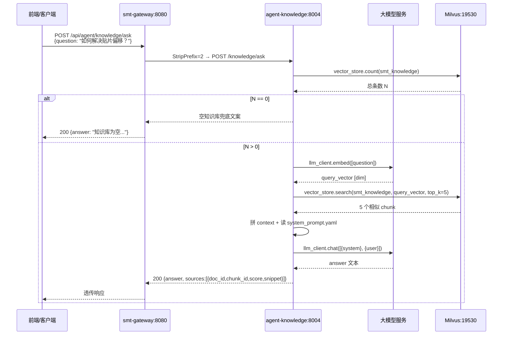
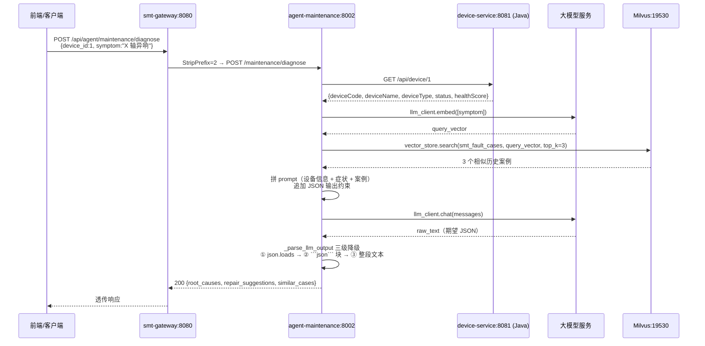
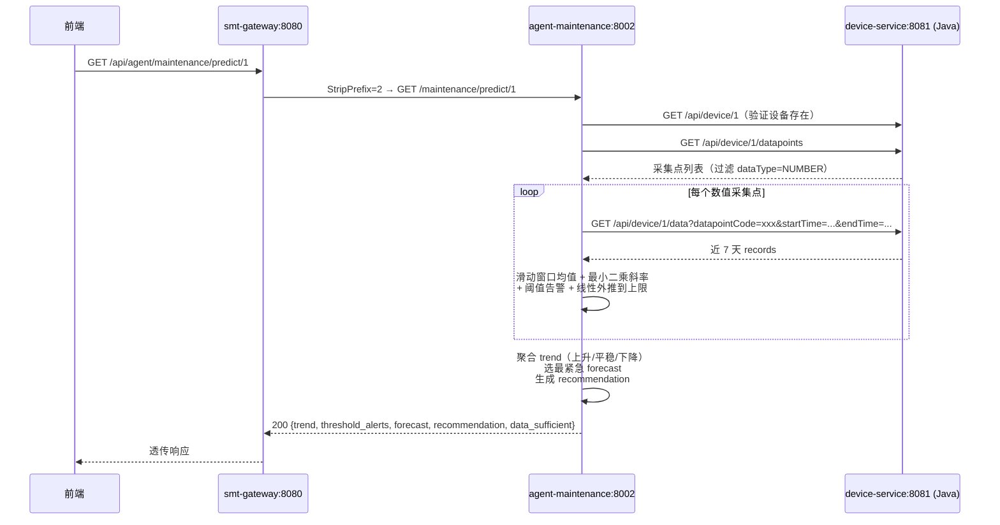
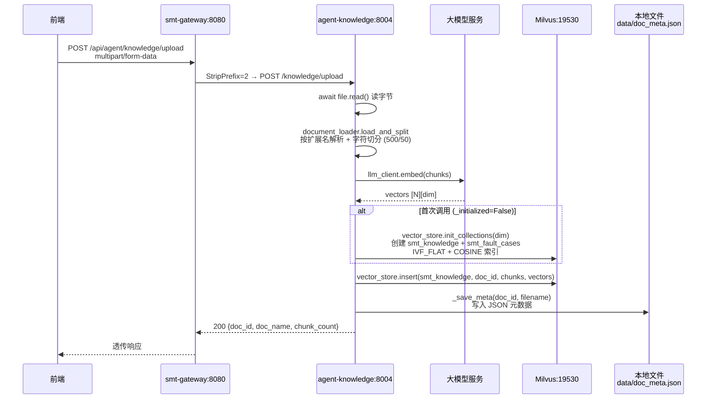
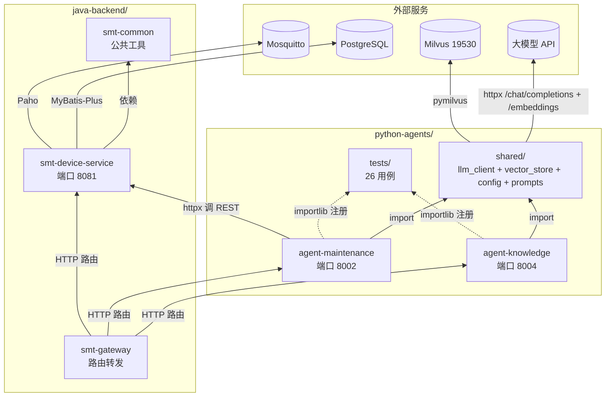
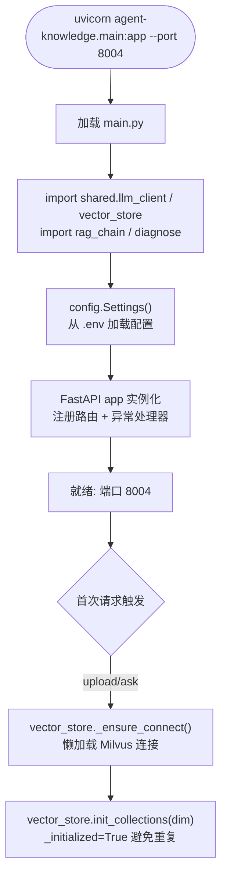

# SMT 贴片产线智能运维与调度平台 —— 项目说明报告（Phase 2）

| 项 | 值 |
|---|---|
| 项目名称 | `smt-agent-platform` —— SMT 贴片产线智能运维与调度系统 |
| 当前阶段 | Phase 2：知识助手 Agent（RAG）+ 设备运维 Agent（PRD 路线图第 3-4 月） |
| 报告日期 | 2026-06-28 |
| 报告范围 | 已交付代码（`python-agents/`、`java-backend/smt-gateway/` 路由扩展、`docker-compose/` Milvus 编排、`api-contracts/openapi/agent_api.yaml`、`scripts/*.sh`）+ 阶段进度 + 架构 + 调用逻辑 + 风险摘要 + 路线图 |
| 目标读者 | 项目内开发人员 |
| 对照基准 | [`docs/PRD.md`](file:///home/north30/projects/Personal/smt-agent-platform/docs/PRD.md)、[`.trae/specs/phase2-knowledge-maintenance-agents/spec.md`](file:///home/north30/projects/Personal/smt-agent-platform/.trae/specs/phase2-knowledge-maintenance-agents/spec.md)、[`.trae/specs/phase2-knowledge-maintenance-agents/checklist.md`](file:///home/north30/projects/Personal/smt-agent-platform/.trae/specs/phase2-knowledge-maintenance-agents/checklist.md)、[`AGENTS.md`](file:///home/north30/projects/Personal/smt-agent-platform/AGENTS.md) §3.2 |
| 前置文档 | [Phase 1 项目说明](file:///home/north30/projects/Personal/smt-agent-platform/docs/explaination/project-explanation-phase1.md) |
| Git 状态 | 分支 `feature/agent-layer-init`，2 次提交，未合并至 `main` |

---

## 一、总体概述

本项目定位为面向电子制造 SMT（表面贴装）生产线的工业智能体平台，通过多智能体协同实现"感知—决策—规划—执行"全链路运营闭环。完整规划为 5 个阶段、约 10 个月交付周期（详见 [PRD §6](file:///home/north30/projects/Personal/smt-agent-platform/docs/PRD.md)）。

**当前进度一句话**：Phase 2（知识助手 Agent + 设备运维 Agent）代码层面已基本交付完成，Python 智能体层落地 2 个 Agent、8 个 REST 接口、26 个测试用例全绿；Java 侧 52 个测试用例未破坏（Phase 1 既有回归）；尚未合并至 `main` 分支，端到端运行验证因本机 Docker Hub 不可达而跳过。

**已交付**：`python-agents/` 全量工程（Poetry + Python 3.14 + FastAPI + Pydantic v2 + httpx + pymilvus）、`shared/` 公共模块（`llm_client` / `vector_store` / `config` / `prompts`）、`agent-knowledge`（端口 8004，文档上传 + RAG 问答 + 文档管理）、`agent-maintenance`（端口 8002，健康分析 + 故障诊断 + 预测性维护 v1 + 案例录入）、Milvus + etcd + minio 中间件编排、smt-gateway 路由扩展、OpenAPI 契约、启动脚本补 Python 段。

**未交付**（属后续阶段）：质量分析 Agent、调度 Agent、执行协同 Agent（Phase 3-4）；LangGraph 多 Agent 编排（Phase 3）；Kafka 事件总线（Phase 4）；C++ 原生层（Phase 5）；前端可视化（Phase 4）；gRPC 跨语言契约（Phase 3+）；深度学习 PHM 模型（Phase 5+）；网关鉴权、可观测性、重试熔断等非功能性改造（Phase 2 收尾 / Phase 3 起步）。

---

## 二、开发阶段与进度

### 2.1 路线图总览（PRD §6）

| 阶段 | 周期 | 核心交付 | 状态 |
|---|---|---|---|
| Phase 1 | 第 1-2 月 | Java 服务底座 + 设备数据接入 | 🟢 代码完成并已合并 `main`（PR #3） |
| **Phase 2** | 第 3-4 月 | 知识助手 Agent（RAG）+ 设备运维 Agent | 🟡 **代码完成，端到端验证待补，未合并 `main`** |
| Phase 3 | 第 5-6 月 | 质量分析 Agent + 调度 Agent | ⬜ 未启动 |
| Phase 4 | 第 7-8 月 | 执行协同 Agent + 全流程闭环 | ⬜ 未启动 |
| Phase 5 | 第 9-10 月 | 系统集成测试 + 产线试点 | ⬜ 未启动 |

### 2.2 Phase 2 详细进度

依据 [`.trae/specs/phase2-knowledge-maintenance-agents/checklist.md`](file:///home/north30/projects/Personal/smt-agent-platform/.trae/specs/phase2-knowledge-maintenance-agents/checklist.md)（37 项验收全部 `[x]`）：

| # | 交付项 | 状态 | 备注 |
|---|---|---|---|
| 1 | docker-compose 追加 Milvus + etcd + minio 三服务，19530 端口暴露，含健康检查 | ✅ | 既有 PG/Redis/Kafka/Mosquitto 定义未修改 |
| 2 | `docker-compose/.env.example` 追加 Milvus 相关占位变量 | ✅ | 无硬编码密码 |
| 3 | `pyproject.toml` Poetry + Python 3.14 依赖清单完整 | ✅ | fastapi/uvicorn/pymilvus/pypdf/python-docx/pydantic v2 等 |
| 4 | `python-agents/.env.example` 占位完整 | ✅ | LLM_API_KEY / MILVUS_HOST / DEVICE_SERVICE_BASE_URL |
| 5 | `python-agents/README.md` 端口映射与启动说明 | ✅ | 8002 / 8004 双 Agent |
| 6 | `.gitignore` 忽略 `.env`、`.venv/`、`__pycache__/` | ✅ | |
| 7 | `shared/llm_client.py` 暴露 `chat` / `embed`，源码无 API_KEY 硬编码 | ✅ | 走 `shared/config.py` 读 env |
| 8 | `shared/vector_store.py` 封装 Milvus `insert`/`search`/`delete`/`list`/`count` | ✅ | 双 collection：`smt_knowledge` / `smt_fault_cases` |
| 9 | `shared/prompts/system_prompt.yaml` 含 knowledge + maintenance 两套中文 prompt | ✅ | |
| 10 | `shared/config.py` 用 pydantic-settings 加载 `.env` 导出 `settings` 单例 | ✅ | |
| 11 | `tests/test_llm_client.py` + `tests/test_vector_store.py` 全绿 | ✅ | mock 外部依赖 |
| 12 | `agent-knowledge/document_loader.py` 支持 md/txt/pdf/docx 加载切分 | ✅ | chunk_size=500, overlap=50 |
| 13 | `agent-knowledge/rag_chain.py` retrieve→top_k 截断→generate；空知识库兜底 | ✅ | |
| 14 | `agent-knowledge/main.py` FastAPI 4 接口齐备 | ✅ | upload / ask / documents / delete |
| 15 | `agent-knowledge/models.py` Pydantic 模型 + 统一错误响应 | ✅ | |
| 16 | `tests/test_knowledge_rag.py` + `tests/test_knowledge_api.py` 全绿 | ✅ | mock vector_store + llm_client + TestClient |
| 17 | `agent-maintenance/device_client.py` httpx 调 Java device-service，不可达抛 `DeviceServiceUnavailable` | ✅ | |
| 18 | `agent-maintenance/diagnose.py` retrieve(smt_fault_cases) → LLM 根因推理 | ✅ | 输出 root_causes + repair_suggestions + similar_cases |
| 19 | `agent-maintenance/predict.py` 滑动窗口均值/方差 + 阈值告警 + 线性外推 | ✅ | 数据 < 24h 兜底"数据不足" |
| 20 | `agent-maintenance/main.py` FastAPI 4 接口齐备 | ✅ | health / diagnose / predict / cases |
| 21 | `agent-maintenance/models.py` Pydantic 模型；503 异常映射 | ✅ | |
| 22 | `tests/test_maintenance_*.py` 全绿（diagnose + predict + api） | ✅ | |
| 23 | smt-gateway 新增 `/api/agent/knowledge/**` 与 `/api/agent/maintenance/**` 路由 | ✅ | StripPrefix=2，地址 ENV 化 |
| 24 | `mvn -pl smt-gateway compile` 通过，既有路由不破坏 | ✅ | |
| 25 | `api-contracts/openapi/agent_api.yaml` OpenAPI 3.0 覆盖 8 接口 | ✅ | 与 Python 实现对齐 |
| 26 | `scripts/build_all.sh` 含 Python 段 `poetry install` | ✅ | |
| 27 | `scripts/dev_restart.sh` 含 uvicorn 后台启动 + PID 文件 | ✅ | |
| 28 | `poetry install` 在 `python-agents/` 成功 | ✅ | |
| 29 | `poetry run pytest` 全绿（26 用例） | ✅ | |
| 30 | `mvn clean install -DskipTests` 全绿 | ✅ | |
| 31 | `mvn test` 仍 47 用例全绿（Phase 1 既有未破坏） | ✅ | 注：实际 surefire 报告 52 个，文档漂移见风险 §6 |
| 32 | 注释/文档/异常消息中文 | ✅ | |
| 33 | 遵循 AGENTS.md §3.2（kebab-case 包名 + 下划线导入 + Pydantic + 统一 llm_client） | ✅ | |
| 34 | 4 空格缩进、LF、文件末尾空行 | ✅ | |
| 35 | 未引入 gRPC / Kafka / LangGraph / C++ / 前端改动 | ✅ | spec 排除项严格遵循 |

**Phase 2 收尾待办**（来自 [`prd-conformance-review-phase2.md`](file:///home/north30/projects/Personal/smt-agent-platform/.trae/reports/prd-conformance-review-phase2.md)、[`code-review-phase2.md`](file:///home/north30/projects/Personal/smt-agent-platform/.trae/reports/code-review-phase2.md)、[`architecture-review-phase2.md`](file:///home/north30/projects/Personal/smt-agent-platform/.trae/reports/architecture-review-phase2.md)）：

- **P0**：网关接入 Spring Security + JWT 过滤器（覆盖 `/api/agent/**`）；`langchain` 依赖二选一（真正用 RetrievalQA 重构 或 移除声明并更新 PRD §3.1）；文档元数据从文件迁移到 PostgreSQL；同步路由改 `async def` + `httpx.AsyncClient`；模块级 `_initialized` / `_connected` 标志用 `lifespan` 或 `Lock` 保护
- **P1**：RAG `< 3s` 性能基准用例；`llm_client` / `device_client` 引入 tenacity 重试；`predict.py` THRESHOLDS 配置化；Prompt `@lru_cache`；`list_docs`/`delete_by_doc` 静默截断修复
- 详见 §六「已知问题与风险摘要」

### 2.3 Git 状态

```
* 6fa98c4 (HEAD -> feature/agent-layer-init) feat(agents): 新增 Phase 2 Python 智能体层
  8b259af refactor(device-service): 测试方法名由中文改为英文
  a9ad02d Merge pull request #3 from north30-dev/feature/initial-scaffold
  ...
```

- 当前分支 `feature/agent-layer-init`，已推至 `origin`，未合并 `main`
- `main` 分支受 AGENTS.md §5.1 约束禁止直接 push，须走 PR 合并
- Phase 1 已通过 PR #3 合并至 `main`

---

## 三、项目架构

### 3.1 四层架构：设计 vs 现状

PRD §3.1 设计了"交互层 / 智能体层 / 服务层 / 数据层"四层架构。Phase 2 在 Phase 1 服务层基础上，**新增智能体层**与**数据层向量库**：

| 层 | 设计职责 | Phase 2 现状 |
|---|---|---|
| 交互层（Frontend） | Web 控制台、移动端、数字孪生大屏 | ❌ 仅占位目录（`frontend/src/pages/` 6 个空目录：Dashboard / DeviceMonitor / KnowledgeBase / QualityControl / ProductionSchedule / AlarmCenter），无实现文件 |
| 智能体层（Agent） | 5 个 Python Agent（调度/运维/质量/知识/执行） | 🟡 **2/5 已实现**：agent-knowledge（8004）+ agent-maintenance（8002）；缺 quality / scheduler / execution |
| 服务层（Service） | Java 微服务群 + 消息队列 | 🟡 Phase 1 既有 `smt-common` / `smt-gateway` / `smt-device-service` 复用，gateway 新增 `/api/agent/**` 路由；缺 order / quality / notification / agent-router |
| 数据层（Data） | PG + InfluxDB + Milvus + 工业协议 | 🟡 **新增 Milvus + etcd + minio**；InfluxDB 仍未编排，时序数据落 PG |

### 3.2 模块划分（当前实现）

```mermaid
graph TB
    subgraph 外部["外部请求"]
        Client[前端 / HTTP 客户端]
    end

    subgraph 网关层["网关层 (端口 8080)"]
        GW[smt-gateway<br/>Spring Cloud Gateway]
    end

    subgraph 智能体层["智能体层 (Python)"]
        AK[agent-knowledge<br/>:8004 RAG 问答]
        AM[agent-maintenance<br/>:8002 故障诊断]
        Shared[shared/<br/>llm_client + vector_store<br/>+ config + prompts]
    end

    subgraph 服务层["服务层 (Java)"]
        DS[smt-device-service<br/>:8081 设备服务<br/>Phase 1 既有]
        Common[smt-common<br/>公共工具]
    end

    subgraph 数据层["数据层"]
        PG[(PostgreSQL<br/>5432)]
        Redis[(Redis<br/>6379)]
        Kafka[(Kafka<br/>9092)]
        MQTT[(Mosquitto<br/>1883)]
        Milvus[(Milvus<br/>19530)]
        Minio[(Minio<br/>9000)]
        Etcd[(etcd<br/>2379)]
    end

    subgraph LLM["大模型服务"]
        LLM[通义千问 / DeepSeek<br/>OpenAI 兼容接口]
    end

    Client -->|HTTP /api/agent/knowledge/**| GW
    Client -->|HTTP /api/agent/maintenance/**| GW
    Client -->|HTTP /api/device/**| GW
    GW -->|StripPrefix=2 → /knowledge/**| AK
    GW -->|StripPrefix=2 → /maintenance/**| AM
    GW -->|http://localhost:8081| DS

    AK ---|依赖| Shared
    AM ---|依赖| Shared

    Shared -->|httpx /chat/completions + /embeddings| LLM
    Shared -->|pymilvus 19530| Milvus
    AM -->|httpx /api/device/**| DS

    DS ---|依赖| Common
    DS -->|MyBatis-Plus| PG
    DS -->|Paho 订阅| MQTT
    DS -.->|未接入业务| Redis
    DS -.->|未接入业务| Kafka

    Milvus ---|元数据| Etcd
    Milvus ---|对象存储| Minio

    style Redis fill:#ffe,stroke:#999,stroke-dasharray: 5 5
    style Kafka fill:#ffe,stroke:#999,stroke-dasharray: 5 5
```

> 虚线节点表示中间件已编排但业务层零调用（详见 §六风险摘要）。

### 3.3 技术栈选型

#### 3.3.1 Python 智能体层（Phase 2 新增）

| 技术 | 版本 | 用途 | 文件 |
|---|---|---|---|
| Python | 3.14 | 运行时 | [`pyproject.toml`](file:///home/north30/projects/Personal/smt-agent-platform/python-agents/pyproject.toml) |
| FastAPI | ^0.110.0 | Agent API 服务框架 | [`main.py`](file:///home/north30/projects/Personal/smt-agent-platform/python-agents/agent-knowledge/main.py) |
| uvicorn[standard] | ^0.29.0 | ASGI 服务器 | |
| Pydantic | ^2.6.0 | 请求/响应模型校验 | [`models.py`](file:///home/north30/projects/Personal/smt-agent-platform/python-agents/agent-knowledge/models.py) |
| pydantic-settings | ^2.2.0 | `.env` 配置加载 | [`config.py`](file:///home/north30/projects/Personal/smt-agent-platform/python-agents/shared/config.py) |
| httpx | ^0.27.0 | LLM 与 Java 服务 HTTP 客户端 | [`llm_client.py`](file:///home/north30/projects/Personal/smt-agent-platform/python-agents/shared/llm_client.py)、[`device_client.py`](file:///home/north30/projects/Personal/smt-agent-platform/python-agents/agent-maintenance/device_client.py) |
| pymilvus | ^2.4.0 | Milvus 向量库客户端 | [`vector_store.py`](file:///home/north30/projects/Personal/smt-agent-platform/python-agents/shared/vector_store.py) |
| pypdf | ^4.0.0 | PDF 文档解析 | [`document_loader.py`](file:///home/north30/projects/Personal/smt-agent-platform/python-agents/agent-knowledge/document_loader.py) |
| python-docx | ^1.1.0 | Word 文档解析 | 同上 |
| python-multipart | ^0.0.9 | FastAPI 文件上传 | |
| pyyaml | ^6.0.1 | Prompt 模板加载 | [`rag_chain.py`](file:///home/north30/projects/Personal/smt-agent-platform/python-agents/agent-knowledge/rag_chain.py#L126-L131) |
| langchain | ^0.3.0 | **声明但未使用**（见风险 §6） | [`pyproject.toml#L21-L22`](file:///home/north30/projects/Personal/smt-agent-platform/python-agents/pyproject.toml#L21-L22) |
| langchain-community | ^0.3.0 | 同上 | 同上 |
| Poetry | — | 依赖管理与打包 | |
| pytest / pytest-asyncio | ^8.0.0 / ^0.23.0 | 单元测试 | `tests/` |

#### 3.3.2 数据层新增（Phase 2）

| 技术 | 版本 | 用途 |
|---|---|---|
| Milvus Standalone | v2.4.0 | 向量数据库（RAG 知识库 + 故障案例库） |
| etcd | v3.5.5 | Milvus 元数据存储 |
| Minio | RELEASE.2023-03-24 | Milvus 对象存储 |

#### 3.3.3 Java 后端（Phase 1 既有，仅 gateway 配置变更）

| 技术 | 版本 | 用途 |
|---|---|---|
| Spring Boot | 3.2.5 | 微服务框架 |
| Spring Cloud Gateway | 2023.0.1 | 网关路由 |

### 3.4 系统交互流程

#### 3.4.1 知识库 RAG 问答全链路



#### 3.4.2 故障诊断全链路（Java ↔ Python 跨语言）



#### 3.4.3 预测性维护趋势分析



#### 3.4.4 文档上传与向量化入库



---

## 四、已实现功能模块

### 4.1 基础设施层

#### 4.1.1 docker-compose 中间件编排

| 服务 | 端口 | 阶段 | 文件 |
|---|---|---|---|
| PostgreSQL | 5432 | Phase 1 | [`docker-compose.yml`](file:///home/north30/projects/Personal/smt-agent-platform/docker-compose/docker-compose.yml) |
| Redis | 6379 | Phase 1 | 同上 |
| Zookeeper | 2181 | Phase 1 | 同上 |
| Kafka | 9092 | Phase 1 | 同上 |
| Mosquitto | 1883 | Phase 1 | 同上 |
| **etcd** | 2379 | **Phase 2 新增** | [`docker-compose.yml#L116-L133`](file:///home/north30/projects/Personal/smt-agent-platform/docker-compose/docker-compose.yml#L116-L133) |
| **Minio** | 9000 / 9001 | **Phase 2 新增** | [`docker-compose.yml#L135-L154`](file:///home/north30/projects/Personal/smt-agent-platform/docker-compose/docker-compose.yml#L135-L154) |
| **Milvus** | 19530 / 9091 | **Phase 2 新增** | [`docker-compose.yml#L156-L183`](file:///home/north30/projects/Personal/smt-agent-platform/docker-compose/docker-compose.yml#L156-L183) |

**主要特性**：Milvus 三容器含健康检查链路（etcd healthy → minio healthy → milvus 启动）；既有服务定义零修改；数据卷持久化（`smt-milvus-data` / `smt-etcd-data` / `smt-minio-data`）。

#### 4.1.2 启动脚本

| 脚本 | Phase 2 变更 | 文件 |
|---|---|---|
| `build_all.sh` | 新增 Python 段 `cd python-agents && poetry install` | [`build_all.sh#L19-L32`](file:///home/north30/projects/Personal/smt-agent-platform/scripts/build_all.sh#L19-L32) |
| `dev_restart.sh` | 新增 uvicorn 后台启动 agent-knowledge (8004) 与 agent-maintenance (8002)，PID 文件管理 | [`dev_restart.sh#L26-L49`](file:///home/north30/projects/Personal/smt-agent-platform/scripts/dev_restart.sh#L26-L49) |

**已知缺陷**：`dev_restart.sh` 未启动 Java 微服务（gateway / device-service），仅打印 `[TODO]` 提示，实际调用 device-service 会 503（见风险 §6）。

### 4.2 Python 智能体公共层（`python-agents/shared/`）

被两个 Agent 共同依赖，提供横切能力，符合 AGENTS.md §3.2 "大模型调用统一走 `shared/llm_client.py`" 强制要求。

| 模块 | 职责 | 文件 |
|---|---|---|
| `config.py` | `pydantic-settings` 加载 `.env` 导出 `settings` 单例 | [`config.py`](file:///home/north30/projects/Personal/smt-agent-platform/python-agents/shared/config.py) |
| `llm_client.py` | 统一大模型调用出口：`chat(messages) -> str` + `embed(texts) -> list[list[float]]` | [`llm_client.py`](file:///home/north30/projects/Personal/smt-agent-platform/python-agents/shared/llm_client.py) |
| `vector_store.py` | Milvus 封装：`init_collections` / `insert` / `search` / `delete_by_doc` / `list_docs` / `count` | [`vector_store.py`](file:///home/north30/projects/Personal/smt-agent-platform/python-agents/shared/vector_store.py) |
| `prompts/system_prompt.yaml` | knowledge + maintenance 两套中文角色 Prompt | [`system_prompt.yaml`](file:///home/north30/projects/Personal/smt-agent-platform/python-agents/shared/prompts/system_prompt.yaml) |

**主要特性**：

- `llm_client` 封装 OpenAI 兼容接口（`/chat/completions` + `/embeddings`），支持通义千问 / DeepSeek 通过 `LLM_PROVIDER` 切换
- `vector_store` 管理 `smt_knowledge` 与 `smt_fault_cases` 两个 collection，schema 一致（id / doc_id / chunk_id / content / vector），物理隔离避免业务互相污染
- IVF_FLAT + COSINE 索引，`nlist=128` / `nprobe=16`
- `llm_client.embed` 按 `index` 字段排序保证返回顺序与入参一致

**已知缺陷**：每次调用新建 `httpx.Client` 无连接池复用（m1）；无重试无熔断（M1）；`vector_store.list_docs`/`delete_by_doc` 用 `limit=16384` 静默截断（M4）。

### 4.3 知识助手 Agent（`python-agents/agent-knowledge/`，端口 8004）

| 接口 | 方法 | 路径 | 说明 |
|---|---|---|---|
| 上传文档 | POST | `/knowledge/upload` | multipart/form-data，支持 md/txt/pdf/docx |
| RAG 问答 | POST | `/knowledge/ask` | 自然语言问答，返回答案 + 来源片段 |
| 文档列表 | GET | `/knowledge/documents` | 返回 `[{doc_id, doc_name, chunk_count, create_time}]` |
| 删除文档 | DELETE | `/knowledge/documents/{doc_id}` | 删除文档及全部分块向量 |

**核心模块**：

| 模块 | 职责 | 文件 |
|---|---|---|
| `main.py` | FastAPI 入口 + 异常处理器 | [`main.py`](file:///home/north30/projects/Personal/smt-agent-platform/python-agents/agent-knowledge/main.py) |
| `rag_chain.py` | RAG 链路：upload → embed → insert；ask → embed → search → chat | [`rag_chain.py`](file:///home/north30/projects/Personal/smt-agent-platform/python-agents/agent-knowledge/rag_chain.py) |
| `document_loader.py` | 按扩展名加载 + 字符切分（chunk_size=500, overlap=50） | [`document_loader.py`](file:///home/north30/projects/Personal/smt-agent-platform/python-agents/agent-knowledge/document_loader.py) |
| `models.py` | Pydantic 请求/响应模型 | [`models.py`](file:///home/north30/projects/Personal/smt-agent-platform/python-agents/agent-knowledge/models.py) |

**主要特性**：

- RAG 链路串行：`embed` (100-500ms) → `search` (50-200ms) → `chat` (1-10s)
- 空知识库兜底：`vector_store.count == 0` 时返回"知识库为空，请先上传文档"，不编造内容
- 文档元数据持久化到 `agent-knowledge/data/doc_meta.json`（**已知架构缺陷 M2**，破坏无状态）
- `doc_id` 生成规则：`{filename_stem}_{uuid4_hex[:8]}`，保证全局唯一
- 异常分类：`LLMClientError` / `VectorStoreError` → 503；`ValueError` → 400；`Exception` → 500 兜底不外泄堆栈

### 4.4 设备运维 Agent（`python-agents/agent-maintenance/`，端口 8002）

| 接口 | 方法 | 路径 | 说明 |
|---|---|---|---|
| 健康分析 | GET | `/maintenance/health/{device_id}` | 复用 Phase 1 device-service 健康评分 + 风险等级判读 |
| 故障诊断 | POST | `/maintenance/diagnose` | RAG 检索 `smt_fault_cases` + LLM 根因推理 |
| 预测性维护 | GET | `/maintenance/predict/{device_id}` | 滑动窗口均值 + 阈值告警 + 线性外推 |
| 案例录入 | POST | `/maintenance/cases` | 故障案例向量化入库 `smt_fault_cases` |

**核心模块**：

| 模块 | 职责 | 文件 |
|---|---|---|
| `main.py` | FastAPI 入口 + 异常处理器 | [`main.py`](file:///home/north30/projects/Personal/smt-agent-platform/python-agents/agent-maintenance/main.py) |
| `device_client.py` | Java device-service HTTP 客户端（get_device / get_device_data / list_datapoints） | [`device_client.py`](file:///home/north30/projects/Personal/smt-agent-platform/python-agents/agent-maintenance/device_client.py) |
| `diagnose.py` | 故障诊断：检索相似案例 + LLM 根因推理 + 输出解析三级降级 | [`diagnose.py`](file:///home/north30/projects/Personal/smt-agent-platform/python-agents/agent-maintenance/diagnose.py) |
| `predict.py` | 预测性维护 v1：规则 + 趋势分析 | [`predict.py`](file:///home/north30/projects/Personal/smt-agent-platform/python-agents/agent-maintenance/predict.py) |
| `models.py` | Pydantic 请求/响应模型 | [`models.py`](file:///home/north30/projects/Personal/smt-agent-platform/python-agents/agent-maintenance/models.py) |

**主要特性**：

- **健康分析**：`health_score ≥ 85` LOW / `≥ 60` MEDIUM / `< 60` HIGH，附中文分析文案
- **故障诊断**：检索 Top-3 相似案例 → 拼 prompt（设备信息 + 症状 + 案例）→ 追加 JSON 输出约束 → LLM 推理 → 三级降级解析（`json.loads` → ```` ```json ```` 块提取 → 整段文本作为 root_causes）
- **预测性维护 v1**（spec 已显式裁剪，未达 PRD §4.2 "提前 14 天预警" P0）：
  - 阈值硬编码：`TEMP max 80` / `VIB max 5.0` / `DEFAULT max 100`
  - 滑动窗口最大 100 样本，最小二乘法计算斜率
  - 告警三级：`HIGH` (≥max) / `MEDIUM` (≥0.9max) / `LOW` (≥0.8max)
  - 线性外推：`hours_to_threshold = (max - current_mean) / slope * sample_interval_hours`
  - 数据不足兜底：时间跨度 < 24h 或无 NUMBER 类型采集点时返回"数据不足，无法预测"
- **Java 服务不可达兜底**：`device_client` 抛 `DeviceServiceUnavailable` → 503
- **跨语言字段映射**：Java 返回 `healthScore`（camelCase）→ Python 响应 `health_score`（snake_case）

### 4.5 Java 网关路由扩展

| 配置项 | 值 | 文件 |
|---|---|---|
| `/api/device/**` → device-service | `http://${SMT_DEVICE_SERVICE_HOST:localhost}:${SMT_DEVICE_SERVICE_PORT:8081}` | [`application.yml#L13-L19`](file:///home/north30/projects/Personal/smt-agent-platform/java-backend/smt-gateway/src/main/resources/application.yml#L13-L19) |
| `/api/agent/knowledge/**` → agent-knowledge | `http://${SMT_AGENT_KNOWLEDGE_HOST:localhost}:${SMT_AGENT_KNOWLEDGE_PORT:8004}` | [`application.yml#L20-L27`](file:///home/north30/projects/Personal/smt-agent-platform/java-backend/smt-gateway/src/main/resources/application.yml#L20-L27) |
| `/api/agent/maintenance/**` → agent-maintenance | `http://${SMT_AGENT_MAINTENANCE_HOST:localhost}:${SMT_AGENT_MAINTENANCE_PORT:8002}` | [`application.yml#L28-L34`](file:///home/north30/projects/Personal/smt-agent-platform/java-backend/smt-gateway/src/main/resources/application.yml#L28-L34) |

**主要特性**：

- `StripPrefix=2` 剥离 `/api/agent`，Python 收到 `/knowledge/**` 与 `/maintenance/**`
- 后端地址 ENV 化，便于容器化部署
- 既有 `/api/device/**` 路由不破坏
- **已知缺陷**：网关无任何 `GlobalFilter` / `GatewayFilter` / JWT 校验，所有 `/api/agent/**` 匿名可调（见风险 §6 B3）

### 4.6 API 契约

| 文件 | 说明 |
|---|---|
| [`api-contracts/openapi/agent_api.yaml`](file:///home/north30/projects/Personal/smt-agent-platform/api-contracts/openapi/agent_api.yaml) | OpenAPI 3.0.3，覆盖 knowledge 4 接口 + maintenance 4 接口，含请求/响应 schema 与示例 |
| [`api-contracts/openapi/device_api.yaml`](file:///home/north30/projects/Personal/smt-agent-platform/api-contracts/openapi/device_api.yaml) | Phase 1 既有，未修改 |

**主要特性**：

- 字段命名 snake_case 与 Python Pydantic 默认对齐
- 错误码大写蛇形：`device_service_unavailable` / `llm_unavailable` / `vector_store_unavailable` / `invalid_param` / `internal_error` / `unsupported_file_type`
- HTTP 200/400/422/503/500 语义对齐
- `ErrorResponse` schema 统一：`{error: string, message: string}`
- **已知缺陷**：URL 无 `/v1/` 版本号前缀（architecture §4.4）；无 `securitySchemes` 定义（B3）

### 4.7 测试覆盖

| 测试文件 | 用例数 | 覆盖范围 |
|---|---|---|
| `test_llm_client.py` | 3 | chat 成功 / chat HTTP 错误 / embed 按 index 排序 |
| `test_vector_store.py` | 4 | init_collections / insert / search 空 / search 有结果 |
| `test_knowledge_api.py` | 5 | upload / ask / ask_invalid / documents / delete |
| `test_knowledge_rag.py` | 3 | RAG 链路（mock llm + vector_store） |
| `test_maintenance_api.py` | 4 | health / diagnose / predict / cases |
| `test_maintenance_diagnose.py` | 4 | 诊断流程 + LLM 输出解析降级 |
| `test_maintenance_predict.py` | 3 | 预测主流程 + 数据不足 + 阈值告警 |
| **Python 小计** | **26** | **全绿** |
| Java（Phase 1 既有） | 52 | 详见 Phase 1 报告，未被破坏 |

**测试盲区**（详见 [`test-report-phase2.md`](file:///home/north30/projects/Personal/smt-agent-platform/.trae/reports/test-report-phase2.md)）：

- `document_loader.py` PDF/Word/Markdown 切分零覆盖（所有 RAG 测试 mock 掉了 `load_and_split`）
- PRD §5 RAG `< 3s` 性能断言零覆盖
- OpenAPI 8 接口契约自动化校验零覆盖
- Java ↔ Python 字段映射（`healthScore` ↔ `health_score`）零覆盖
- `smt-gateway` 路由零测试

---

## 五、代码文件依赖关系与调用逻辑

### 5.1 模块依赖关系



**依赖方向总结**：

- `shared/` 是最底层 Python 模块，被两个 Agent 共同依赖
- `agent-knowledge` 与 `agent-maintenance` 之间**无直接依赖**（两 Agent 进程独立，无通信机制，见风险 §6 architecture §4.7）
- Java↔Python 通过 REST 同步通信（spec 范围裁剪，未引入 gRPC/Kafka）
- Python 测试通过 `conftest.py` importlib hack 注册 kebab-case 包为下划线模块

### 5.2 Python 包结构

```
python-agents/
├── pyproject.toml                      Poetry 依赖管理（Python 3.14）
├── .env.example                        环境变量占位
├── README.md                           端口映射与启动说明
├── shared/                             公共模块（被两 Agent 共享）
│   ├── config.py                       Settings 单例（pydantic-settings）
│   ├── llm_client.py                   chat() + embed() 统一出口
│   ├── vector_store.py                 Milvus insert/search/delete/list/count
│   └── prompts/
│       └── system_prompt.yaml          knowledge + maintenance 中文 prompt
├── agent-knowledge/                    知识助手（端口 8004）
│   ├── __init__.py
│   ├── main.py                         FastAPI 4 接口 + 异常处理器
│   ├── rag_chain.py                    RAG 链路（upload + ask + list + delete）
│   ├── document_loader.py              md/txt/pdf/docx 加载切分
│   ├── models.py                       Pydantic 模型
│   └── data/
│       └── doc_meta.json               文档元数据（运行时生成，破坏无状态）
├── agent-maintenance/                  设备运维（端口 8002）
│   ├── __init__.py
│   ├── main.py                         FastAPI 4 接口 + 异常处理器
│   ├── device_client.py                Java device-service HTTP 客户端
│   ├── diagnose.py                     故障诊断 + 案例录入
│   ├── predict.py                      预测性维护 v1（规则 + 趋势）
│   └── models.py                       Pydantic 模型
└── tests/                              26 个 pytest 用例
    ├── conftest.py                     importlib 注册 kebab-case 包
    ├── test_llm_client.py              3 用例
    ├── test_vector_store.py            4 用例
    ├── test_knowledge_api.py           5 用例
    ├── test_knowledge_rag.py           3 用例
    ├── test_maintenance_api.py         4 用例
    ├── test_maintenance_diagnose.py    4 用例
    └── test_maintenance_predict.py     3 用例
```

### 5.3 类/模块级依赖关系

```mermaid
graph TB
    subgraph 共享["shared/"]
        Cfg[config.Settings]
        LLM[llm_client<br/>chat + embed]
        VS[vector_store<br/>insert + search + delete + list + count]
        Prompt[prompts/system_prompt.yaml]
    end

    subgraph 知识["agent-knowledge/"]
        AKMain[main.py<br/>FastAPI app]
        RAG[rag_chain<br/>upload_document + ask<br/>list_documents + delete_document]
        Loader[document_loader<br/>load_and_split]
        AKModels[models.py]
        AKMeta[(data/doc_meta.json)]
    end

    subgraph 运维["agent-maintenance/"]
        AMMain[main.py<br/>FastAPI app]
        DC[device_client<br/>DeviceClient 单例]
        Diag[diagnose<br/>diagnose + create_case]
        Pred[predict<br/>predict + 5 个内部函数]
        AMModels[models.py]
    end

    subgraph Java["Java device-service (HTTP)"]
        DS[/api/device/{id}<br/>/api/device/{id}/data<br/>/api/device/{id}/datapoints/]
    end

    subgraph 外部["外部服务"]
        LLM_API[(大模型 API)]
        Mil[(Milvus)]
    end

    AKMain --> RAG
    AKMain --> AKModels
    RAG --> Loader
    RAG --> LLM
    RAG --> VS
    RAG --> Prompt
    RAG --> AKMeta

    AMMain --> Diag
    AMMain --> Pred
    AMMain --> DC
    AMMain --> AMModels
    Diag --> DC
    Diag --> LLM
    Diag --> VS
    Diag --> Prompt
    Pred --> DC
    Pred --> AMModels

    DC -->|httpx| DS

    LLM -->|httpx| LLM_API
    VS -->|pymilvus| Mil
    Cfg --> LLM
    Cfg --> VS
    Cfg --> DC
```

**依赖方向总结**：

- `main.py` → `rag_chain` / `diagnose` / `predict` → `shared/` + Agent 内部模块（标准三层）
- `agent-maintenance` 通过 `device_client` 跨语言调 Java device-service REST
- `shared/config.py` 的 `settings` 单例被 `llm_client` / `vector_store` / `device_client` 三处依赖
- `rag_chain._initialized` 与 `diagnose._initialized` 各自独立标志，但底层共享 `vector_store._connected`（见风险 §6 B2）

### 5.4 关键调用链

#### 5.4.1 Python Agent 启动流程



> 注：Milvus 连接与 collection 初始化都是懒加载，进程启动时不连接，首次 RAG 请求才触发。

#### 5.4.2 RAG 问答调用链（`POST /knowledge/ask`）

```
POST /api/agent/knowledge/ask
  → smt-gateway:8080 (Path=/api/agent/knowledge/**, StripPrefix=2)
  → agent-knowledge:8004 /knowledge/ask
  → main.ask(req: AskRequest)
      └─ rag_chain.ask(question, top_k=5)
            ├─ vector_store.count("smt_knowledge")           [空库兜底判断]
            │     └─ col.num_entities
            ├─ llm_client.embed([question])[0]               [httpx POST /embeddings, 60s timeout]
            ├─ vector_store.search("smt_knowledge", vec, top_k=5)
            │     └─ col.search(metric=COSINE, nprobe=16, output_fields=[doc_id, chunk_id, content])
            ├─ _load_prompts()                                [yaml.safe_load system_prompt.yaml]
            ├─ 拼 context = "[1] {content}\n[2] {content}..."
            └─ llm_client.chat([{system}, {user}])           [httpx POST /chat/completions, 60s timeout]
  → AskResponse(answer, sources:[SourceItem(doc_id, chunk_id, score, snippet)])
```

#### 5.4.3 故障诊断调用链（`POST /maintenance/diagnose`）

```
POST /api/agent/maintenance/diagnose
  → smt-gateway:8080 (StripPrefix=2)
  → agent-maintenance:8002 /maintenance/diagnose
  → main.diagnose_fault(req: DiagnoseRequest)
      └─ diagnose.diagnose(device_id, symptom)
            ├─ device_client.get_device(device_id)            [httpx GET /api/device/{id}, 10s timeout]
            ├─ llm_client.embed([symptom])[0]
            ├─ vector_store.search("smt_fault_cases", vec, top_k=3)
            ├─ _parse_similar_cases(sources)                  [按行解析 症状/根因/解决方案]
            ├─ _format_device_info(device_info)               [硬编码 5 字段：deviceCode/Name/Type/Line/status]
            ├─ _load_prompts()
            ├─ 拼 user_content + 追加 JSON 输出约束
            ├─ llm_client.chat(messages)                      [返回 raw_text]
            └─ _parse_llm_output(raw_text)                    [三级降级]
                  ├─ try: json.loads(text)
                  ├─ try: _extract_json_block → json.loads
                  └─ fallback: return [raw_text], []
  → DiagnoseResponse(root_causes, repair_suggestions, similar_cases)
```

#### 5.4.4 预测性维护调用链（`GET /maintenance/predict/{device_id}`）

```
GET /api/agent/maintenance/predict/1
  → smt-gateway:8080 (StripPrefix=2)
  → agent-maintenance:8002 /maintenance/predict/1
  → main.predict_device(device_id=1)
      └─ predict.predict(device_id)
            ├─ device_client.get_device(1)                    [验证设备存在]
            ├─ device_client.list_datapoints(1)               [过滤 dataType=NUMBER]
            ├─ for dp in number_points:
            │     ├─ device_client.get_device_data(1, code, start_time, end_time)
            │     ├─ _parse_points(records)                   [(datetime, float) 列表]
            │     ├─ _linear_slope(values)                    [手写最小二乘]
            │     ├─ _build_alert(code, current_mean, cfg)    [6 种 if/elif 边界]
            │     └─ _build_forecast(code, current_mean, slope, cfg, sample_interval)
            ├─ _aggregate_trend(slopes)                       [上升/平稳/下降]
            ├─ _pick_most_urgent(forecast_candidates)         [最小 hours_to_threshold]
            └─ _build_recommendation(threshold_alerts)        [HIGH/MEDIUM/LOW → 文案]
  → PredictResponse(trend, threshold_alerts, forecast, recommendation, data_sufficient)
```

### 5.5 文件清单与职责矩阵

#### 5.5.1 `shared/`（4 个 Python 文件 + 1 个 yaml）

| 文件 | 行数 | 维度 | 职责 |
|---|---|---|---|
| `config.py` | 31 | 配置 | `Settings` 单例从 `.env` 加载 |
| `llm_client.py` | 87 | 外部调用 | `chat()` + `embed()` 统一出口 |
| `vector_store.py` | 244 | 外部调用 | Milvus CRUD + 双 collection 管理 |
| `prompts/system_prompt.yaml` | 28 | Prompt | knowledge + maintenance 中文角色 |

#### 5.5.2 `agent-knowledge/`（5 个 Python 文件）

| 文件 | 行数 | 维度 | 职责 |
|---|---|---|---|
| `main.py` | 123 | 入口 | FastAPI 4 接口 + 4 个异常处理器 |
| `rag_chain.py` | 165 | 业务 | upload + ask + list + delete + 元数据文件管理 |
| `document_loader.py` | 85 | 工具 | md/txt/pdf/docx 加载 + 字符切分 |
| `models.py` | 59 | 模型 | 6 个 Pydantic 模型 |
| `__init__.py` | 0 | 包 | 空 |

#### 5.5.3 `agent-maintenance/`（6 个 Python 文件）

| 文件 | 行数 | 维度 | 职责 |
|---|---|---|---|
| `main.py` | 142 | 入口 | FastAPI 4 接口 + 5 个异常处理器 |
| `device_client.py` | 89 | 外部调用 | Java device-service HTTP 客户端 + 模块级单例 |
| `diagnose.py` | 244 | 业务 | diagnose + create_case + LLM 输出三级降级解析 |
| `predict.py` | 274 | 业务 | predict + 9 个内部辅助函数（规则 + 趋势） |
| `models.py` | ~90 | 模型 | 8 个 Pydantic 模型 |
| `__init__.py` | 0 | 包 | 空 |

#### 5.5.4 `tests/`（7 个测试文件 + conftest）

| 文件 | 用例数 | 覆盖 |
|---|---|---|
| `conftest.py` | — | importlib 注册 kebab-case 包 |
| `test_llm_client.py` | 3 | chat/embed 成功与错误 |
| `test_vector_store.py` | 4 | init/insert/search |
| `test_knowledge_api.py` | 5 | 4 接口 + 422 |
| `test_knowledge_rag.py` | 3 | RAG 链路 + 空库兜底 |
| `test_maintenance_api.py` | 4 | 4 接口 |
| `test_maintenance_diagnose.py` | 4 | 诊断 + LLM 解析降级 |
| `test_maintenance_predict.py` | 3 | 预测主流程 + 数据不足 |

#### 5.5.5 Java 侧变更（仅 gateway 配置）

| 文件 | 变更类型 | 说明 |
|---|---|---|
| `smt-gateway/src/main/resources/application.yml` | MODIFIED | 新增 2 条 `/api/agent/**` 路由 |
| `smt-gateway/src/main/java/...` | 无变更 | 仍仅 `SmtGatewayApplication` + `CorsConfig` 两个文件 |

---

## 六、已知问题与风险摘要

本节为风险概览，详细 findings 见 `.trae/reports/` 下 6 份 Phase 2 专项报告。

### 6.1 已有专项报告清单

| 报告 | 路径 | 关键结论 |
|---|---|---|
| PRD 符合性审查 | [`.trae/reports/prd-conformance-review-phase2.md`](file:///home/north30/projects/Personal/smt-agent-platform/.trae/reports/prd-conformance-review-phase2.md) | 符合 12 / 部分符合 4 / 不符合 3 |
| 代码审查 | [`.trae/reports/code-review-phase2.md`](file:///home/north30/projects/Personal/smt-agent-platform/.trae/reports/code-review-phase2.md) | Blocker 3 / Major 11 / Minor 7 |
| 架构评审 | [`.trae/reports/architecture-review-phase2.md`](file:///home/north30/projects/Personal/smt-agent-platform/.trae/reports/architecture-review-phase2.md) | 优秀 5 / 合理 6 / 待改进 8 |
| 性能评估 | [`.trae/reports/performance-eval-phase2.md`](file:///home/north30/projects/Personal/smt-agent-platform/.trae/reports/performance-eval-phase2.md) | 详见报告 |
| 安全扫描 | [`.trae/reports/security-scan-phase2.md`](file:///home/north30/projects/Personal/smt-agent-platform/.trae/reports/security-scan-phase2.md) | 详见报告 |
| 测试报告 | [`.trae/reports/test-report-phase2.md`](file:///home/north30/projects/Personal/smt-agent-platform/.trae/reports/test-report-phase2.md) | 26 Python + 52 Java 全绿，但盲区多 |

### 6.2 风险概览（Phase 2 收尾必处理）

| 级别 | 问题 | 归属 | 详见 |
|---|---|---|---|
| 🔴 Blocker | FastAPI 同步路由（`def`）+ 同步 `httpx.Client` 阻塞 uvicorn worker，LLM 60s 超时期间整个 worker 阻塞 | Phase 2 收尾 | code-review B1 |
| 🔴 Blocker | 模块级 `global` 可变状态（`_initialized` / `_connected`）无线程安全保护，多 worker 并发下竞态 | Phase 2 收尾 | code-review B2 |
| 🔴 Blocker | `langchain`/`langchain-community` 依赖声明但全代码零使用，违背 PRD §3.1 技术栈承诺 | Phase 2 收尾 | code-review B3 / prd-conf §4.1 / arch §4.1 |
| 🔴 P0 架构 | 网关 `/api/agent/**` 无鉴权过滤器，LLM 计费接口裸露，匿名可刷 | Phase 2 收尾 | arch §4.3 / prd-conf §4.2 |
| 🔴 P0 架构 | 文档元数据用 `data/doc_meta.json` 文件持久化，破坏无状态，多副本不一致 | Phase 2 收尾 | arch §4.2 / prd-conf §4.3 / code-review M2 |
| 🟠 Major | 全链路无重试无熔断（`llm_client` / `device_client` / `vector_store` 一次失败即抛） | Phase 3 起步 | code-review M1 |
| 🟠 Major | `predict.py` THRESHOLDS 硬编码，无法按设备差异化配置 | Phase 3 | code-review M3 |
| 🟠 Major | `vector_store.list_docs`/`delete_by_doc` 用 `limit=16384` 静默截断，超 16384 chunk 文档删除会留孤儿向量 | Phase 2 收尾 | code-review M4 |
| 🟠 Major | Prompt 每次读盘（`yaml.safe_load`），无 `@lru_cache` 缓存，每次 I/O 10-30ms | Phase 2 收尾 | code-review M5 |
| 🟠 Major | `health` 接口 `int(device.get("healthScore") or 0)` 强转，上游数据异常时返回 400 而非 502 | Phase 2 收尾 | code-review M6 |
| 🟠 Major | `device_client` 模块级单例在 import 时即创建 `httpx.Client`，测试可控性差 | Phase 3 | code-review M7 |
| 🟠 Major | `predict.py` 复杂分支覆盖不足（3 测试 vs 9+ 分支） | Phase 2 收尾 | code-review M9 |
| 🟠 Major | Python 侧完全无可观测性（无 `logging` / `structlog` / `/healthz` / `/metrics`） | Phase 3 起步 | prd-conf §3.3 |
| 🟠 Major | RAG `< 3s` PRD P0 指标零性能验证，且 `ask` 同步路由 + 60s LLM 超时存在阻塞风险 | Phase 2 收尾 | prd-conf §3.1 |
| 🟠 Major | 预测性维护"提前 14 天预警"被 spec 裁剪为规则 + 线性外推 v1，未达 PRD P0 | Phase 5+ | prd-conf §3.2 |
| 🟠 Major | `ErrorResponse` 在两 Agent 各自定义一份，违反 DRY | Phase 2 收尾 | code-review M11 |
| 🟠 Major | docker-compose 无网络隔离，Python Agent 可直连 PostgreSQL/Redis 绕过 device-service | Phase 2 收尾 | arch §4.8 |
| 🟠 Major | `scripts/dev_restart.sh` 未启动 Java 微服务，与"一键重启"语义不符 | Phase 2 收尾 | arch §4.9 |
| 🟠 Major | Agent 间无通信机制（PRD §3.3 多智能体协作流程在 Phase 2 无法实现） | Phase 3 起步 | arch §4.7 |
| 🟠 Major | 无 API 版本号（`/v1/` 前缀），未来不兼容变更无法灰度 | Phase 3 起步 | arch §4.4 |
| ⚠️ Minor | `llm_client` 每次新建 `httpx.Client` 无连接池复用，TCP/TLS 握手 100-300ms | Phase 3 起步 | code-review m1 |
| ⚠️ Minor | `document_loader` 按字符切分，英文按字符会切断单词 | Phase 3 | code-review m3 |
| ⚠️ Minor | `conftest.py` importlib hack 注册 kebab-case 包，非标准做法 | Phase 3 | code-review m5 / arch §4.6 |
| ⚠️ Minor | `agent-knowledge/main.py` `from pydantic import ValidationError` 死导入 | Phase 2 收尾 | code-review M8 |
| ⚠️ Minor | async/sync 风格不一致（仅 `upload` 是 `async def`） | Phase 2 收尾 | code-review m7 |
| ⚠️ 验证 | docker-compose 端到端闭环未实跑（本机 Docker Hub 不可达） | 待环境就绪 | checklist 隐含 |
| ⚠️ 文档 | checklist/tasks.md 声明 Java 47 用例，实际 surefire 报告 52 个，文档漂移 | Phase 2 收尾 | test-report §1 |

### 6.3 处理优先级建议

| 优先级 | 项 | 建议归属 |
|---|---|---|
| P0 | 3 个 Blocker（同步路由 + 全局状态 + langchain 依赖）+ 网关鉴权 + 文档元数据迁移 PG + 静默截断修复 + Prompt 缓存 + 错误码语义 + 死导入清理 + ErrorResponse 抽取 + 风格统一 | Phase 2 收尾 |
| P1 | 重试/熔断 + THRESHOLDS 配置化 + 可观测性 + 性能基准用例 + docker-compose 网络隔离 + 启动脚本补 Java 段 + API 版本号 + Agent 间通信预留 + `device_client` 延迟初始化 + 测试覆盖补全 | Phase 3 起步 |
| P2 | Minor 代码质量（连接池复用 + 切分策略 + kebab-case hack + 字段硬编码 + JSON 解析增强） | Phase 3 |

---

## 七、后续阶段路线图

依据 [PRD §6](file:///home/north30/projects/Personal/smt-agent-platform/docs/PRD.md)，后续阶段规划如下（详细需求见 PRD 第四章）：

| 阶段 | 核心交付 | 技术重点 | 关键依赖 |
|---|---|---|---|
| Phase 3 | 质量分析 Agent + 调度 Agent | LangGraph 多智能体编排 | Phase 2 Agent 框架 + LangChain 重构 |
| Phase 4 | 执行协同 Agent + 全流程闭环 + 前端可视化 | Kafka 事件驱动 + 人机协同 + React 前端 | Phase 3 多 Agent 协同 + 文档元数据已迁移 |
| Phase 5 | C++ 原生层 + 系统集成测试 + 产线试点 | pybind11/JNI + PHM 模型 + 端到端验证 | 全部前置阶段 |

### 7.1 Phase 3 起步前需完成的 Phase 2 收尾项

- **必做**：3 个 Blocker 修复（同步路由改 async + 全局状态保护 + langchain 二选一）
- **必做**：网关鉴权（防 LLM 计费接口被刷）
- **必做**：文档元数据迁移到 PostgreSQL（为 Phase 4 多副本铺路）
- **强烈建议**：可观测性最小基线（`logging` + `/healthz`）
- **强烈建议**：`shared/` 预留 `agent_bus.py` 接口（为 Phase 3 LangGraph Agent 间通信铺路）

### 7.2 Phase 3 跨阶段衔接风险（来自架构评审 §5.1）

| 评估项 | 现状 | Phase 3 衔接风险 |
|---|---|---|
| Agent 编排基座 | 无 LangChain/LangGraph 使用 | **高**：需推倒重构 RAG 为 RetrievalQA，引入 LangGraph StateGraph |
| Agent 间通信 | 无 | **高**：质量 Agent 需调知识 Agent 查 SOP，需补通信层 |
| shared 抽象 | 仅 llm_client/vector_store | **中**：需补 `base_agent.py` 基类（统一 lifespan/exception_handler/healthz） |
| API 版本号 | 无 | **中**：新增 4 个 Agent 接口时统一引入 `/v1/` |
| 服务发现 | 无 | **低**：4 个 Agent 仍可用 ENV 管理 |

---

## 八、附录

### 8.1 构建与运行命令

详见 [`AGENTS.md §2`](file:///home/north30/projects/Personal/smt-agent-platform/AGENTS.md)。常用命令：

```bash
# 中间件（含 Phase 2 新增 Milvus + etcd + minio）
cd docker-compose && docker-compose up -d

# Python 智能体依赖安装
cd python-agents && poetry install

# Python 单 Agent 运行
cd python-agents && poetry run uvicorn agent-knowledge.main:app --port 8004 --reload
cd python-agents && poetry run uvicorn agent-maintenance.main:app --port 8002 --reload

# Python 全量测试
cd python-agents && poetry run pytest

# Java 全量编译与测试
cd java-backend && mvn clean install -DskipTests
cd java-backend && mvn test

# 一键构建（C++ 跳过 → Java → Python）
bash scripts/build_all.sh

# 一键重启（中间件 + Python Agent；Java 微服务需手动 mvn spring-boot:run）
bash scripts/dev_restart.sh
```

### 8.2 关键配置

| 配置项 | 默认值 | 文件 |
|---|---|---|
| `LLM_PROVIDER` | `tongyi` | [`shared/config.py`](file:///home/north30/projects/Personal/smt-agent-platform/python-agents/shared/config.py) |
| `LLM_BASE_URL` | `https://dashscope.aliyuncs.com/compatible-mode/v1` | 同上 |
| `LLM_MODEL` | `qwen-plus` | 同上 |
| `LLM_EMBED_MODEL` | `text-embedding-v2` | 同上 |
| `MILVUS_HOST` | `localhost` | 同上 |
| `MILVUS_PORT` | `19530` | 同上 |
| `DEVICE_SERVICE_BASE_URL` | `http://localhost:8081` | 同上 |
| agent-knowledge 端口 | `8004` | [`agent-knowledge/main.py`](file:///home/north30/projects/Personal/smt-agent-platform/python-agents/agent-knowledge/main.py#L122) |
| agent-maintenance 端口 | `8002` | [`agent-maintenance/main.py`](file:///home/north30/projects/Personal/smt-agent-platform/python-agents/agent-maintenance/main.py#L141) |
| smt-gateway 端口 | `8080` | [`gateway/application.yml`](file:///home/north30/projects/Personal/smt-agent-platform/java-backend/smt-gateway/src/main/resources/application.yml) |
| smt-device-service 端口 | `8081` | Phase 1 既有 |
| `llm_client` HTTP timeout | `60s` | [`llm_client.py#L42`](file:///home/north30/projects/Personal/smt-agent-platform/python-agents/shared/llm_client.py#L42) |
| `device_client` HTTP timeout | `10s` | [`device_client.py#L26`](file:///home/north30/projects/Personal/smt-agent-platform/python-agents/agent-maintenance/device_client.py#L26) |
| RAG `top_k` | `5` | [`rag_chain.py#L61`](file:///home/north30/projects/Personal/smt-agent-platform/python-agents/agent-knowledge/rag_chain.py#L61) |
| 文档切分 `chunk_size` / `overlap` | `500` / `50` | [`document_loader.py#L17-L18`](file:///home/north30/projects/Personal/smt-agent-platform/python-agents/agent-knowledge/document_loader.py#L17-L18) |
| 预测 `_MIN_SPAN_HOURS` | `24` | [`predict.py#L19`](file:///home/north30/projects/Personal/smt-agent-platform/python-agents/agent-maintenance/predict.py#L19) |
| 预测 `_WINDOW_SIZE` | `100` | [`predict.py#L22`](file:///home/north30/projects/Personal/smt-agent-platform/python-agents/agent-maintenance/predict.py#L22) |
| Milvus 索引 | `IVF_FLAT` + `COSINE`，`nlist=128` / `nprobe=16` | [`vector_store.py#L88-L94`](file:///home/north30/projects/Personal/smt-agent-platform/python-agents/shared/vector_store.py#L88-L94) |

### 8.3 端口映射总览

| 服务 | 端口 | 阶段 | 技术 |
|---|---|---|---|
| smt-gateway | 8080 | Phase 1 | Java / Spring Cloud Gateway |
| smt-device-service | 8081 | Phase 1 | Java / Spring Boot |
| agent-maintenance | 8002 | Phase 2 | Python / FastAPI / uvicorn |
| agent-knowledge | 8004 | Phase 2 | Python / FastAPI / uvicorn |
| PostgreSQL | 5432 | Phase 1 | 关系库 |
| Redis | 6379 | Phase 1 | 缓存（未用） |
| Zookeeper | 2181 | Phase 1 | Kafka 依赖 |
| Kafka | 9092 | Phase 1 | 消息队列（未用） |
| Mosquitto | 1883 | Phase 1 | MQTT Broker |
| etcd | 2379 | Phase 2 | Milvus 元数据 |
| Minio | 9000 / 9001 | Phase 2 | Milvus 对象存储 |
| Milvus | 19530 / 9091 | Phase 2 | 向量库 |

### 8.4 审查方法

本报告基于以下步骤编写：

1. 阅读 [`docs/PRD.md`](file:///home/north30/projects/Personal/smt-agent-platform/docs/PRD.md) §3（架构）/ §4.2（运维 Agent）/ §4.4（知识助手）/ §5（非功能）/ §6（路线图）
2. 阅读 [Phase 1 项目说明](file:///home/north30/projects/Personal/smt-agent-platform/docs/explaination/project-explanation-phase1.md) 了解前置上下文
3. 阅读 [`.trae/specs/phase2-knowledge-maintenance-agents/`](file:///home/north30/projects/Personal/smt-agent-platform/.trae/specs/phase2-knowledge-maintenance-agents/) 下 spec / checklist
4. 汇总 `.trae/reports/` 下 6 份 Phase 2 专项报告（PRD 符合性 / 代码审查 / 架构评审 / 性能评估 / 安全扫描 / 测试报告）
5. 全量阅读 `python-agents/` 下 24 个 Python 文件（shared 4 + agent-knowledge 5 + agent-maintenance 6 + tests 7 + conftest + __init__×3）
6. 阅读 `java-backend/smt-gateway/src/main/resources/application.yml` 路由配置
7. 阅读 `api-contracts/openapi/agent_api.yaml` 8 接口契约
8. 阅读 `docker-compose/docker-compose.yml` Milvus + etcd + minio 编排
9. 阅读 `scripts/build_all.sh` 与 `scripts/dev_restart.sh` 启动脚本
10. `git log` 确认分支与提交历史（当前 `feature/agent-layer-init`）
11. 用 Mermaid 绘制架构图、依赖图、时序图、流程图
