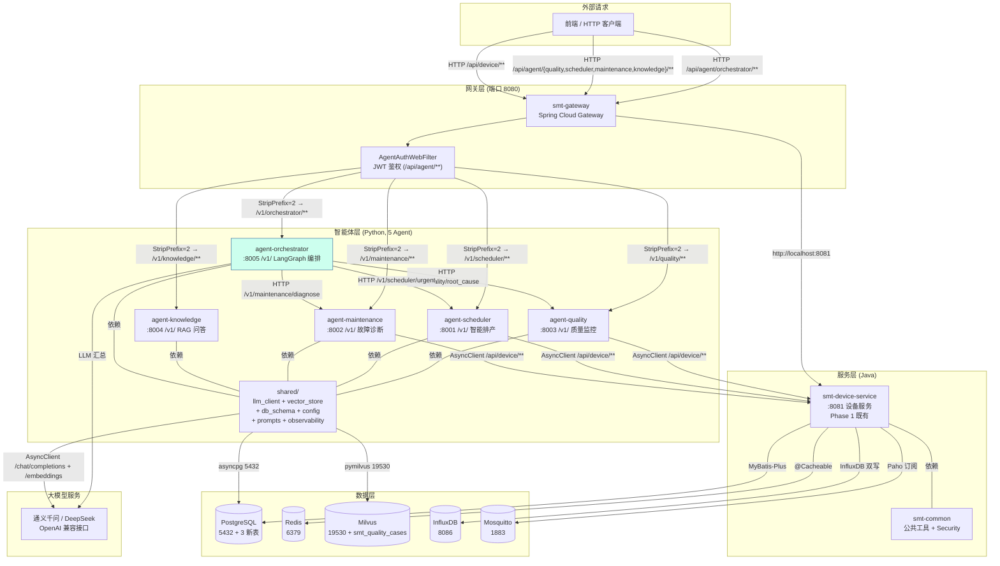
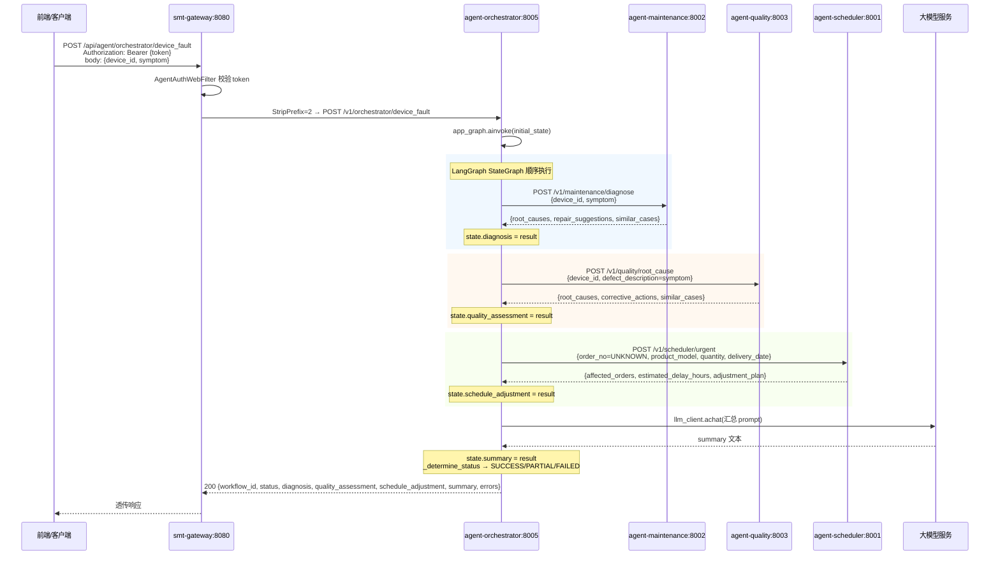
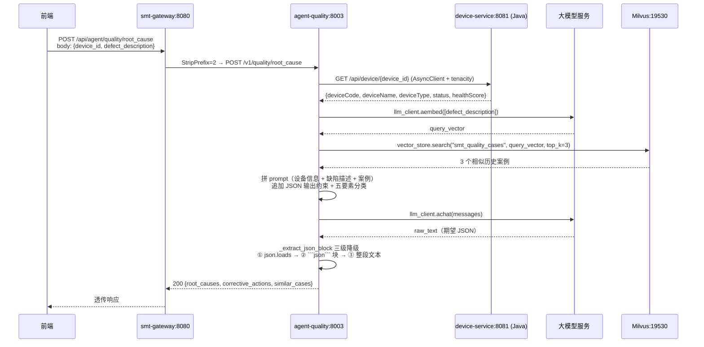
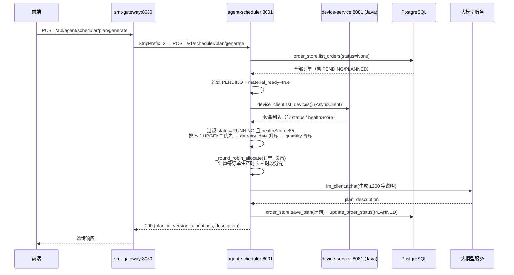
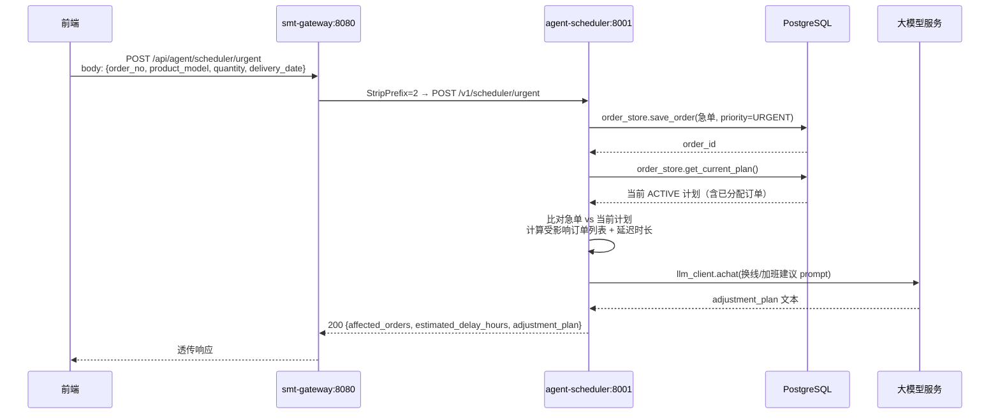
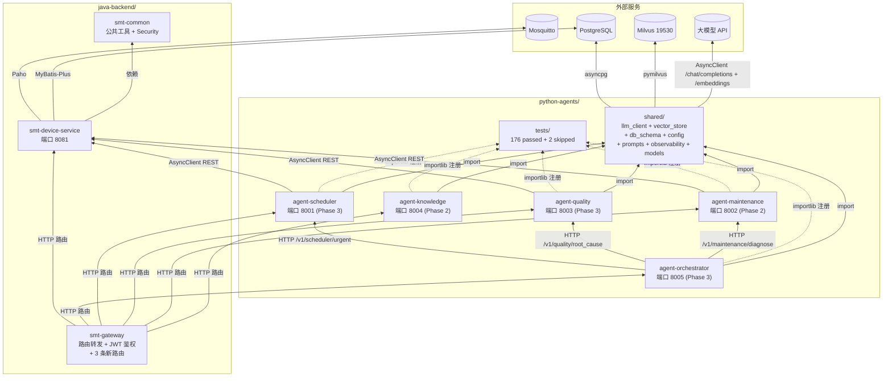

# SMT 贴片产线智能运维与调度平台 —— 项目说明报告（Phase 3）

| 项 | 值 |
|---|---|
| 项目名称 | `smt-agent-platform` —— SMT 贴片产线智能运维与调度系统 |
| 当前阶段 | Phase 3：质量分析 Agent + 调度 Agent + LangGraph 多 Agent 编排（PRD 路线图第 5-6 月） |
| 报告日期 | 2026-07-07 |
| 报告范围 | `python-agents/agent-quality/`、`python-agents/agent-scheduler/`、`python-agents/agent-orchestrator/`、`python-agents/shared/` 扩展、`java-backend/smt-gateway/` 路由扩展、`api-contracts/openapi/agent_api.yaml`、`scripts/*.sh` + 阶段进度 + 架构 + 调用逻辑 + 风险摘要 + 路线图 |
| 目标读者 | 项目内开发人员 |
| 对照基准 | [`docs/PRD.md`](file:///home/north30/projects/Personal/smt-agent-platform/docs/PRD.md)、[`.trae/specs/phase3-quality-scheduler-orchestration/spec.md`](file:///home/north30/projects/Personal/smt-agent-platform/.trae/specs/phase3-quality-scheduler-orchestration/spec.md)、[`.trae/specs/phase3-quality-scheduler-orchestration/checklist.md`](file:///home/north30/projects/Personal/smt-agent-platform/.trae/specs/phase3-quality-scheduler-orchestration/checklist.md)、[`.trae/reports/prd-conformance-review-phase3.md`](file:///home/north30/projects/Personal/smt-agent-platform/.trae/reports/prd-conformance-review-phase3.md)、[`.trae/reports/code-review-phase3.md`](file:///home/north30/projects/Personal/smt-agent-platform/.trae/reports/code-review-phase3.md)、[`.trae/reports/architecture-review-phase3.md`](file:///home/north30/projects/Personal/smt-agent-platform/.trae/reports/architecture-review-phase3.md)、[`.trae/reports/performance-eval-phase3.md`](file:///home/north30/projects/Personal/smt-agent-platform/.trae/reports/performance-eval-phase3.md)、[`.trae/reports/security-scan-phase3.md`](file:///home/north30/projects/Personal/smt-agent-platform/.trae/reports/security-scan-phase3.md)、[`.trae/reports/test-report-phase3.md`](file:///home/north30/projects/Personal/smt-agent-platform/.trae/reports/test-report-phase3.md)、[`AGENTS.md`](file:///home/north30/projects/Personal/smt-agent-platform/AGENTS.md) §3.2 |
| 前置文档 | [Phase 2 项目说明](file:///home/north30/projects/Personal/smt-agent-platform/docs/explaination/project-explanation-phase2.md) |
| Git 状态 | 分支 `feature/quality-scheduler-orchestration`，1 次提交（`dde26bc`），未合并 `main` |

---

## 一、总体概述

本项目定位为面向电子制造 SMT（表面贴装）生产线的工业智能体平台，通过多智能体协同实现"感知—决策—规划—执行"全链路运营闭环。完整规划为 5 个阶段、约 10 个月交付周期（详见 [PRD §6](file:///home/north30/projects/Personal/smt-agent-platform/docs/PRD.md)）。

**当前进度一句话**：Phase 3（质量分析 Agent + 调度 Agent + LangGraph 多 Agent 编排）代码层面全量交付完成，Python 176 测试 + Java 57 测试全绿（覆盖率 77.28%），6 份 Phase 3 专项审查报告已生成；智能体层从 Phase 2 的 2/5 升级到 5/5（仅缺执行协同 Agent，属 Phase 4）；待用户确认后提交并合并 `main`。

**已交付**：`python-agents/agent-quality/`（端口 8003，4 接口，AOI 缺陷率监控 + 五要素根因分析 + 案例入库 + 告警查询）、`python-agents/agent-scheduler/`（端口 8001，5 接口，订单录入 + 智能排产 + 急单插单响应 + 计划查询）、`python-agents/agent-orchestrator/`（端口 8005，2 接口，LangGraph `StateGraph` 编排 maintenance→quality→scheduler→summary 线性图 + 子 Agent 降级 skipped）、`python-agents/shared/` 扩展（`db_schema.sql` 三张表 DDL 集中管理 + `vector_store.COLLECTIONS` 追加 `smt_quality_cases` + `config.py` 追加 `quality_*` / `scheduler_*` / `agent_*_base_url` 配置 + `prompts/system_prompt.yaml` 追加 quality / scheduler 两套中文 prompt）、`smt-gateway` 新增 3 条路由（`/api/agent/quality/**` / `/api/agent/scheduler/**` / `/api/agent/orchestrator/**`，均 StripPrefix=2，环境变量化，JWT 鉴权继承既有 AgentAuthWebFilter）、`api-contracts/openapi/agent_api.yaml` 追加 11 个新接口定义（quality 4 + scheduler 5 + orchestrator 2）、`scripts/dev_restart.sh` 追加 8001/8003/8005 启动命令、`python-agents/README.md` 端口映射表覆盖 5 个 Agent。

**未交付**（属后续阶段）：执行协同 Agent（Phase 4）；Kafka 事件总线（Phase 4）；gRPC 跨语言契约（Phase 4+）；Java `smt-order-service` / `smt-quality-service` / `smt-agent-router` 业务实现（Phase 4+）；前端可视化（QualityMonitor / SchedulerDashboard / Orchestrator 页面，Phase 4）；C++ 原生层（Phase 5）；PHM 深度学习模型 + 14 天预警（Phase 5+）；P1 功能（产能预警、换线优化、调度模拟、工艺参数优化、缺陷预测、质量追溯）；流式 SSE 输出、独立 reranker 模型、AutoGen 编排（spec 明确排除）。

---

## 二、开发阶段与进度

### 2.1 路线图总览（PRD §6）

| 阶段 | 周期 | 核心交付 | 状态 |
|---|---|---|---|
| Phase 1 | 第 1-2 月 | Java 服务底座 + 设备数据接入 | 🟢 已合并 `main` |
| Phase 2 | 第 3-4 月 | 知识助手 Agent（RAG）+ 设备运维 Agent | 🟢 已合并 `main`（PR #4） |
| **Phase 3** | 第 5-6 月 | 质量分析 Agent + 调度 Agent + LangGraph 多 Agent 编排 | 🟢 **代码完成 + 6 份审查报告已生成，待合并 `main`** |
| Phase 4 | 第 7-8 月 | 执行协同 Agent + 全流程闭环 + 前端 | ⬜ 未启动 |
| Phase 5 | 第 9-10 月 | C++ 原生层 + 系统集成测试 + 产线试点 | ⬜ 未启动 |

### 2.2 Phase 3 详细进度

依据 [`.trae/specs/phase3-quality-scheduler-orchestration/checklist.md`](file:///home/north30/projects/Personal/smt-agent-platform/.trae/specs/phase3-quality-scheduler-orchestration/checklist.md)（80 项验收 `[x]`，2 项待用户确认后执行）：

#### 2.2.1 分支与基础设施

| # | 交付项 | 状态 | 备注 |
|---|---|---|---|
| 1 | 从 `main` 切出 `feature/quality-scheduler-orchestration` 分支 | ✅ | **漂移**：spec.md 写明 `feature/phase3-quality-scheduler-orchestration`，实际分支名少 `phase3-` 前缀；不影响功能 |
| 2 | `pyproject.toml` 追加 `langgraph>=0.2.0` + `langchain-core>=0.3.0`，`uv sync` 成功 | ✅ | 实际安装 langgraph 1.2.7 + langchain-core 1.4.8 |
| 3 | `shared/vector_store.py` COLLECTIONS 追加 `smt_quality_cases` | ✅ | **漂移**：实际 COLLECTIONS = `("smt_maintenance_cases", "smt_quality_cases", "smt_knowledge_documents")`，与 Phase 2 报告中 `smt_knowledge`/`smt_fault_cases` 命名不一致；Phase 3 仅新增 `smt_quality_cases`，未修改既有 |
| 4 | `shared/db_schema.sql` 含 `quality_alerts` / `production_orders` / `production_plans` 三张表 DDL | ✅ | 字段类型与 Pydantic 模型一致 |
| 5 | `shared/config.py` 追加 `quality_*` / `scheduler_*` 配置项 | ✅ | 13 项新增（详见 §8.2） |
| 6 | `shared/prompts/system_prompt.yaml` 追加 quality + scheduler 两套中文 prompt | ✅ | |

#### 2.2.2 质量分析 Agent（端口 8003）

| # | 交付项 | 状态 | 备注 |
|---|---|---|---|
| 7 | `agent-quality/` 目录骨架完整（`__init__.py` / `main.py` / `monitor.py` / `root_cause.py` / `models.py` / `alert_store.py` / `device_client.py`） | ✅ | |
| 8 | `models.py` Pydantic 模型，复用 `shared.models.ErrorResponse` | ✅ | |
| 9 | `monitor.py` 通过 device_client 拉取 AOI 数据点，按 `settings.quality_aoi_defect_rate_threshold` 计算不良率与告警；超阈值落库 `quality_alerts`；数据不足返回 `INSUFFICIENT_DATA` | ✅ | `_DATAPOINT_CODE = "AOI_DEFECT_RATE"` |
| 10 | `root_cause.py` retrieve(smt_quality_cases) → LLM 根因推理，按"人/机/料/法/环"五要素分类；空库仍输出 LLM 推理；含 JSON 代码块提取与降级路径 | ✅ | |
| 11 | `main.py` FastAPI 4 接口 + /v1/ 前缀 + async + /healthz + structlog + 5 类异常处理器 | ✅ | |
| 12 | 异常处理对齐 agent-maintenance（DeviceServiceUnavailable/LLMClientError/VectorStoreError→503，ValueError→400，Exception→500） | ✅ | |
| 13 | `tests/test_quality_monitor.py`(8) + `test_quality_root_cause.py`(9) + `test_quality_api.py`(17) 全绿 | ✅ | 共 34 用例 |

#### 2.2.3 调度智能体（端口 8001）

| # | 交付项 | 状态 | 备注 |
|---|---|---|---|
| 14 | `agent-scheduler/` 目录骨架完整（`__init__.py` / `main.py` / `planner.py` / `urgent.py` / `order_store.py` / `models.py` / `device_client.py`） | ✅ | |
| 15 | `models.py` Pydantic 模型，`quantity` 用 `Field(ge=1)` | ✅ | **注**：`priority` 字段未用 `Literal` 校验（详见 [code-review-phase3#m3](file:///home/north30/projects/Personal/smt-agent-platform/.trae/reports/code-review-phase3.md)） |
| 16 | `order_store.py` asyncpg 连接池，提供 `save_order` / `list_orders` / `save_plan` / `get_current_plan` / `update_order_status` / `get_next_plan_version` | ✅ | 复用 shared.doc_meta_store 模式 |
| 17 | `planner.py` 排产规则：URGENT 优先 → delivery_date 升序 → quantity 降序；物料未齐套跳过；设备 status=RUNNING 且 healthScore≥85 才可用；LLM 生成 ≤200 字说明；落 `production_plans` 并更新 `production_orders.status` | ✅ | |
| 18 | `urgent.py` 急单响应：录入急单 → 比对当前计划找受影响订单 → 计算延迟时长 → LLM 生成换线/加班建议 | ✅ | |
| 19 | `main.py` FastAPI 5 接口 + /v1/ 前缀 + async + /healthz + 5 类异常处理器 | ✅ | |
| 20 | `tests/test_scheduler_planner.py`(9) + `test_scheduler_urgent.py`(7) + `test_scheduler_api.py`(14) 全绿 | ✅ | 共 30 用例 |

#### 2.2.4 LangGraph 多 Agent 编排（端口 8005）

| # | 交付项 | 状态 | 备注 |
|---|---|---|---|
| 21 | `agent-orchestrator/` 目录骨架完整（`__init__.py` / `main.py` / `graph.py` / `nodes.py` / `state.py` / `models.py` / `agent_clients.py`） | ✅ | |
| 22 | `state.py` 定义 LangGraph 共享 State（TypedDict）：`device_id` / `symptom` / `diagnosis` / `quality_assessment` / `schedule_adjustment` / `summary` / `errors` | ✅ | |
| 23 | `agent_clients.py` httpx.AsyncClient 封装对 maintenance/quality/scheduler 的 HTTP 调用，不可达时抛 `AgentUnavailable` | ✅ | |
| 24 | `nodes.py` 定义 `maintenance_node` / `quality_node` / `scheduler_node` / `summary_node` 四节点，子 Agent 不可达时降级（写入 `state.errors`，不阻断整体流程） | ✅ | |
| 25 | `graph.py` 用 `langgraph.graph.StateGraph` 构建 `START → maintenance → quality → scheduler → summary → END` 顺序图并编译 | ✅ | langgraph 1.2.7 API |
| 26 | `main.py` FastAPI 2 接口 + /v1/ 前缀 + async + /healthz + 异常处理器 + 内存工作流存储（上限 100） | ✅ | |
| 27 | `tests/test_orchestrator_nodes.py`(16) + `test_orchestrator_graph.py`(7) + `test_orchestrator_api.py`(12) 全绿 | ✅ | 共 35 用例 |

#### 2.2.5 Java 网关路由 + API 契约 + 脚本文档 + 测试验证

| # | 交付项 | 状态 | 备注 |
|---|---|---|---|
| 28 | `smt-gateway/application.yml` 新增 3 条路由（quality→8003 / scheduler→8001 / orchestrator→8005，StripPrefix=2，环境变量化） | ✅ | 既有 knowledge/maintenance 路由未修改 |
| 29 | `mvn -pl smt-gateway compile` 通过 | ✅ | |
| 30 | `api-contracts/openapi/agent_api.yaml` 追加 11 接口（quality 4 + scheduler 5 + orchestrator 2），含请求/响应 schema，新增 tags：`质量分析` / `调度智能体` / `Agent 编排` | ✅ | 19 operations / 40 schemas / 5 tags |
| 31 | `scripts/build_all.sh` Python 段保持 `uv sync` | ✅ | |
| 32 | `scripts/dev_restart.sh` 追加 8001/8003/8005 uvicorn 后台启动 + PID 文件 | ✅ | |
| 33 | `python-agents/README.md` 端口映射表覆盖 5 个 Agent + 多 Agent 编排章节 | ✅ | |
| 34 | `uv run pytest` 全绿 —— 176 passed + 2 skipped（Phase 2 既有 77 + Phase 3 新增 99），覆盖率 77.28% | ✅ | 远高于 50% 阈值 |
| 35 | `mvn clean install -DskipTests` + `mvn test`（57 tests）全绿 | ✅ | |
| 36 | 手动验证 orchestrator 端到端链路：5 个 Agent /healthz 全 200，`POST /v1/orchestrator/device_fault` 返回 workflow_id + maintenance → quality → scheduler 协同执行 | ✅ | 无中间件时各节点降级 skipped，整体 FAILED 但流程闭环不阻断 |
| 37 | 6 份 Phase 3 专项审查报告已生成 | ✅ | 详见 §6.1 |
| 38 | 提交前 `git status` 干净 | ⏳ 待确认 | 等待用户确认后提交 |
| 39 | 按 Conventional Commits 分批提交 | ⏳ 待确认 | 等待用户确认后执行 |

### 2.3 Phase 3 收尾待办

引用 6 份审查报告中的延期项 + checklist 剩余 2 项：

- **待用户确认**：`git status` 干净后分批提交（feat(quality) / feat(scheduler) / feat(orchestrator) / feat(gateway) / docs(api) / chore(scripts) / docs(reports)）
- **延期至 Phase 4+**：详见 §6.3

### 2.4 Git 状态

```
* dde26bc (HEAD -> feature/quality-scheduler-orchestration) feat(agents): 新增 Phase3 全量智能体能力，完成多Agent编排闭环
  3c48361 (origin/main, main) Merge pull request #4 from north30-dev/feature/agent-layer-init
  02e2922 refactor(device): 调整Mybatis慢SQL拦截器的签名参数
  ...
```

- 当前分支 `feature/quality-scheduler-orchestration`，1 次提交，未合并 `main`
- Phase 1 已通过 PR 合并至 `main`，Phase 2 已通过 PR #4 合并至 `main`
- **漂移**：spec.md 写明分支名 `feature/phase3-quality-scheduler-orchestration`，实际为 `feature/quality-scheduler-orchestration`（少 `phase3-` 前缀）

---

## 三、项目架构

### 3.1 四层架构：设计 vs 现状

PRD §3.1 设计了"交互层 / 智能体层 / 服务层 / 数据层"四层架构。Phase 3 在 Phase 2 基础上，**智能体层从 2/5 升级到 5/5（仅缺执行协同 Agent）**，并新增 LangGraph 多 Agent 编排能力：

| 层 | 设计职责 | Phase 3 现状 |
|---|---|---|
| 交互层（Frontend） | Web 控制台、移动端、数字孪生大屏 | ❌ 仅占位目录，无实现（属 Phase 4） |
| 智能体层（Agent） | 5 个 Python Agent | 🟢 **5/5 已实现**：knowledge(8004) + maintenance(8002) + quality(8003) + scheduler(8001) + orchestrator(8005 LangGraph 编排)；仅缺 execution Agent（Phase 4） |
| 服务层（Service） | Java 微服务群 + 消息队列 | 🟡 Phase 1/2 既有复用 + gateway 新增 3 条路由；缺 order/quality/notification/agent-router Java 模块（Phase 4+） |
| 数据层（Data） | PG + InfluxDB + Milvus + 工业协议 | 🟡 Phase 2 既有；Phase 3 新增 3 张 PG 表（`quality_alerts` / `production_orders` / `production_plans`）+ Milvus collection `smt_quality_cases`；无新中间件 |

### 3.2 模块划分（当前实现）



### 3.3 技术栈选型

#### 3.3.1 Python 智能体层（Phase 3 新增依赖）

| 技术 | 版本 | 用途 | 对应源文件链接 |
|---|---|---|---|
| Python | 3.12 | 运行时 | [`pyproject.toml`](file:///home/north30/projects/Personal/smt-agent-platform/python-agents/pyproject.toml) |
| **langgraph** | **>=0.2.0（实际 1.2.7）** | **LangGraph StateGraph 多 Agent 编排** | [`graph.py`](file:///home/north30/projects/Personal/smt-agent-platform/python-agents/agent-orchestrator/graph.py) |
| **langchain-core** | **>=0.3.0（实际 1.4.8）** | **LangGraph 依赖基座（不引入 langchain-openai）** | [`pyproject.toml`](file:///home/north30/projects/Personal/smt-agent-platform/python-agents/pyproject.toml) |
| FastAPI | ^0.110.0 | Agent API 服务框架 | [`agent-quality/main.py`](file:///home/north30/projects/Personal/smt-agent-platform/python-agents/agent-quality/main.py) |
| Pydantic | ^2.6.0 | 请求/响应模型校验 | [`agent-quality/models.py`](file:///home/north30/projects/Personal/smt-agent-platform/python-agents/agent-quality/models.py) |
| httpx | ^0.27.0 | 子 Agent HTTP 调用 + device-service AsyncClient | [`agent_clients.py`](file:///home/north30/projects/Personal/smt-agent-platform/python-agents/agent-orchestrator/agent_clients.py) |
| asyncpg | ^0.29.0 | PostgreSQL 异步客户端（order_store / alert_store） | [`order_store.py`](file:///home/north30/projects/Personal/smt-agent-platform/python-agents/agent-scheduler/order_store.py) |
| pymilvus | ^2.4.0 | Milvus 向量库客户端（smt_quality_cases） | [`root_cause.py`](file:///home/north30/projects/Personal/smt-agent-platform/python-agents/agent-quality/root_cause.py) |
| tenacity | ^8.2.0 | 重试策略（agent_clients + device_client） | [`agent_clients.py`](file:///home/north30/projects/Personal/smt-agent-platform/python-agents/agent-orchestrator/agent_clients.py) |
| structlog | ^24.1.0 | 结构化日志 | [`observability.py`](file:///home/north30/projects/Personal/smt-agent-platform/python-agents/shared/observability.py) |
| uv | — | 依赖管理与打包（Phase 2 后期从 Poetry 迁移） | [`pyproject.toml`](file:///home/north30/projects/Personal/smt-agent-platform/python-agents/pyproject.toml) |

#### 3.3.2 Java 后端（Phase 3 仅 gateway 配置变更）

| 技术 | 版本 | 用途 | 对应源文件链接 |
|---|---|---|---|
| Spring Boot | 3.2.5 | 微服务框架 | [`pom.xml`](file:///home/north30/projects/Personal/smt-agent-platform/java-backend/pom.xml) |
| Spring Cloud Gateway | 2023.0.1 | 网关路由（新增 3 条） | [`application.yml`](file:///home/north30/projects/Personal/smt-agent-platform/java-backend/smt-gateway/src/main/resources/application.yml) |
| Spring Security | 由 BOM 管理 | JWT 鉴权（继承既有 AgentAuthWebFilter） | [`AgentAuthWebFilter.java`](file:///home/north30/projects/Personal/smt-agent-platform/java-backend/smt-gateway/src/main/java/com/smt/platform/gateway/security/AgentAuthWebFilter.java) |

#### 3.3.3 数据层（Phase 3 新增表与 collection）

| 技术 | 版本 | 用途 | 对应源文件链接 |
|---|---|---|---|
| PostgreSQL | 16 | 业务主库（新增 3 张表） | [`db_schema.sql`](file:///home/north30/projects/Personal/smt-agent-platform/python-agents/shared/db_schema.sql) |
| Milvus | 2.4 | 向量库（新增 smt_quality_cases collection） | [`vector_store.py`](file:///home/north30/projects/Personal/smt-agent-platform/python-agents/shared/vector_store.py) |

### 3.4 系统交互流程

#### 3.4.1 设备故障 LangGraph 编排全链路（Phase 3 核心场景）



**降级机制**：任何子 Agent 不可达时，对应节点写入 `state.errors` 并将该字段标记为 `{"status": "skipped", "reason": "..."}`，工作流继续执行，整体状态判定为 PARTIAL 或 FAILED。

#### 3.4.2 质量根因分析链路



#### 3.4.3 智能排产链路



#### 3.4.4 急单插单链路



---

## 四、已实现功能模块

### 4.1 质量分析 Agent（`python-agents/agent-quality/`，端口 8003）

| 接口 | 方法 | 路径 | 说明 |
|---|---|---|---|
| 实时缺陷监控 | GET | `/v1/quality/monitor/{device_id}` | 拉取 AOI 缺陷率数据点，按阈值计算不良率与告警状态，超阈值落库 |
| 根因分析 | POST | `/v1/quality/root_cause` | 基于"人/机/料/法/环"五要素 + 历史案例 RAG + LLM 推理 |
| 案例录入 | POST | `/v1/quality/cases` | 录入历史质量案例到 `smt_quality_cases` collection |
| 告警查询 | GET | `/v1/quality/alerts` | 分页查询历史质量告警（`quality_alerts` 表） |
| 健康检查 | GET | `/healthz` | structlog + uptime |

**核心模块**：

| 模块 | 职责 | 文件 |
|---|---|---|
| `main.py` | FastAPI 入口 + /v1/ 前缀 + async + /healthz + 5 类异常处理器 | [`main.py`](file:///home/north30/projects/Personal/smt-agent-platform/python-agents/agent-quality/main.py) |
| `monitor.py` | `async def monitor(device_id) -> dict`：拉取 AOI 数据点 → 计算不良率 → 阈值判定 → 超阈值落库 `quality_alerts` → 数据不足返回 `INSUFFICIENT_DATA` | [`monitor.py`](file:///home/north30/projects/Personal/smt-agent-platform/python-agents/agent-quality/monitor.py) |
| `root_cause.py` | `async def analyze(device_id, defect_description) -> dict` + `async def create_case(...) -> str`：retrieve(smt_quality_cases) → LLM 根因推理 → 五要素分类 → JSON 代码块三级降级解析 | [`root_cause.py`](file:///home/north30/projects/Personal/smt-agent-platform/python-agents/agent-quality/root_cause.py) |
| `alert_store.py` | `async def save_alert(...) -> int` + `async def list_alerts(page, size) -> dict`：asyncpg 连接池 + `quality_alerts` 表 CRUD | [`alert_store.py`](file:///home/north30/projects/Personal/smt-agent-platform/python-agents/agent-quality/alert_store.py) |
| `device_client.py` | Java device-service AsyncClient（DI 模式 + tenacity）+ `DeviceServiceUnavailable` 异常 | [`device_client.py`](file:///home/north30/projects/Personal/smt-agent-platform/python-agents/agent-quality/device_client.py) |
| `models.py` | Pydantic 模型（MonitorResponse / RootCauseRequest/Response / CaseCreateRequest/Response / AlertsPageResponse / AlertRecord） | [`models.py`](file:///home/north30/projects/Personal/smt-agent-platform/python-agents/agent-quality/models.py) |

**主要特性**：

- AOI 缺陷率阈值配置化（`settings.quality_aoi_defect_rate_threshold`，默认 0.02）
- 监控时间窗口配置化（`settings.quality_monitor_window_hours`，默认 1 小时）
- 超阈值告警自动落库 `quality_alerts` 表
- 数据不足兜底：近 N 小时无 AOI 数据点返回 `INSUFFICIENT_DATA`
- 根因分析按"人/机/料/法/环"五要素分类输出
- 空案例库兜底：仍输出 LLM 推理结果，`similar_cases` 返回空列表
- 案例录入向量维度与既有 collection 一致（动态适配 `embed_dim`）
- 告警分页查询，`size` 默认 `settings.quality_alerts_page_size`
- Java 服务不可达 → 503；LLM 不可达 → 503；向量库不可达 → 503；参数错误 → 400

### 4.2 调度智能体（`python-agents/agent-scheduler/`，端口 8001）

| 接口 | 方法 | 路径 | 说明 |
|---|---|---|---|
| 录入订单 | POST | `/v1/scheduler/orders` | 录入到 `production_orders` 表，初始状态 PENDING |
| 查询订单 | GET | `/v1/scheduler/orders` | 返回订单列表，支持 `status` 过滤 |
| 生成排产计划 | POST | `/v1/scheduler/plan/generate` | 规则排产 + LLM 说明 + 落 `production_plans` |
| 查询当前计划 | GET | `/v1/scheduler/plan/current` | 返回当前 ACTIVE 排产计划 |
| 急单插单 | POST | `/v1/scheduler/urgent` | 录入急单 + 评估影响 + 生成调整方案 |
| 健康检查 | GET | `/healthz` | structlog + uptime |

**核心模块**：

| 模块 | 职责 | 文件 |
|---|---|---|
| `main.py` | FastAPI 入口 + /v1/ 前缀 + async + /healthz + 5 类异常处理器 | [`main.py`](file:///home/north30/projects/Personal/smt-agent-platform/python-agents/agent-scheduler/main.py) |
| `planner.py` | `async def generate_plan() -> dict`：list_orders(PENDING+material_ready) → list_devices(status=RUNNING+healthScore≥85) → 排序（URGENT→delivery_date→quantity）→ _round_robin_allocate → LLM ≤200 字说明 → save_plan + update_order_status(PLANNED) | [`planner.py`](file:///home/north30/projects/Personal/smt-agent-platform/python-agents/agent-scheduler/planner.py) |
| `urgent.py` | `async def handle_urgent(req) -> dict`：save_order(URGENT) → get_current_plan → 比对受影响订单 → 计算延迟时长 → LLM 换线/加班建议 | [`urgent.py`](file:///home/north30/projects/Personal/smt-agent-platform/python-agents/agent-scheduler/urgent.py) |
| `order_store.py` | asyncpg 连接池，提供 `save_order` / `list_orders` / `save_plan` / `get_current_plan` / `update_order_status` / `get_next_plan_version` | [`order_store.py`](file:///home/north30/projects/Personal/smt-agent-platform/python-agents/agent-scheduler/order_store.py) |
| `device_client.py` | Java device-service AsyncClient + `DeviceServiceUnavailable` 异常 | [`device_client.py`](file:///home/north30/projects/Personal/smt-agent-platform/python-agents/agent-scheduler/device_client.py) |
| `models.py` | Pydantic 模型（OrderCreateRequest/Response、PlanGenerateRequest/Response、UrgentRequest/Response、OrderListResponse） | [`models.py`](file:///home/north30/projects/Personal/smt-agent-platform/python-agents/agent-scheduler/models.py) |

**主要特性**：

- 排产规则：URGENT 优先 → delivery_date 升序 → quantity 降序
- 物料未齐套订单跳过（`material_ready=false`）
- 设备过滤：`status=RUNNING` 且 `healthScore≥85`（`settings.scheduler_device_min_health_score`）
- 轮询分配订单到设备，计算生产时长（`quantity / scheduler_capacity_per_hour`）
- 换线时间计入（`settings.scheduler_changeover_minutes`）
- 排产时间窗口上限（`settings.scheduler_max_horizon_hours`）
- LLM 生成 ≤200 字自然语言说明（suffix-aware 截断）
- 计划落库 + 订单状态更新（PENDING → PLANNED）
- 急单影响评估：受影响订单列表 + 延迟时长 + LLM 换线/加班建议
- 无可排产订单兜底：返回明确提示，不强行生成空计划
- 设备不可用排除：status=FAULT 设备不被分配

### 4.3 LangGraph 多 Agent 编排（`python-agents/agent-orchestrator/`，端口 8005）

| 接口 | 方法 | 路径 | 说明 |
|---|---|---|---|
| 设备故障编排 | POST | `/v1/orchestrator/device_fault` | 串联 maintenance → quality → scheduler → LLM 汇总 |
| 工作流查询 | GET | `/v1/orchestrator/workflows/{workflow_id}` | 查询已存储的工作流结果 |
| 健康检查 | GET | `/healthz` | structlog + uptime |

**核心模块**：

| 模块 | 职责 | 文件 |
|---|---|---|
| `main.py` | FastAPI 入口 + /v1/ 前缀 + async + /healthz + 异常处理器 + 内存工作流存储（`_workflows` dict，上限 100，超出丢弃最旧）+ `_determine_status` 状态判定（SUCCESS/PARTIAL/FAILED） | [`main.py`](file:///home/north30/projects/Personal/smt-agent-platform/python-agents/agent-orchestrator/main.py) |
| `graph.py` | `def build_graph()`：用 `langgraph.graph.StateGraph` 构建 `START → maintenance → quality → scheduler → summary → END` 顺序图并编译为 `app_graph` | [`graph.py`](file:///home/north30/projects/Personal/smt-agent-platform/python-agents/agent-orchestrator/graph.py) |
| `nodes.py` | 4 个节点函数：`maintenance_node` / `quality_node` / `scheduler_node` / `summary_node`；子 Agent 不可达时降级（写入 `state.errors`，对应字段标记 `skipped`，不阻断整体流程） | [`nodes.py`](file:///home/north30/projects/Personal/smt-agent-platform/python-agents/agent-orchestrator/nodes.py) |
| `state.py` | `class OrchestratorState(TypedDict)`：`device_id` / `symptom` / `diagnosis` / `quality_assessment` / `schedule_adjustment` / `summary` / `errors` | [`state.py`](file:///home/north30/projects/Personal/smt-agent-platform/python-agents/agent-orchestrator/state.py) |
| `agent_clients.py` | httpx.AsyncClient 封装对 maintenance/quality/scheduler 的 HTTP 调用 + tenacity 重试 + `AgentUnavailable` 异常；提供 `call_maintenance` / `call_quality` / `call_scheduler` | [`agent_clients.py`](file:///home/north30/projects/Personal/smt-agent-platform/python-agents/agent-orchestrator/agent_clients.py) |
| `models.py` | Pydantic 模型（DeviceFaultRequest / WorkflowResponse） | [`models.py`](file:///home/north30/projects/Personal/smt-agent-platform/python-agents/agent-orchestrator/models.py) |

**主要特性**：

- LangGraph `StateGraph` 线性编排（顺序图，非并行）
- 子 Agent 不可达降级：标记 `skipped`，工作流继续执行
- 工作流状态判定：3 节点全成功 → SUCCESS；至少 1 成功 → PARTIAL；全失败 → FAILED
- 内存工作流存储（`_workflows` dict，上限 100，超出丢弃最旧）
- LLM 汇总摘要：summary_node 调用 `llm_client.achat` 生成自然语言汇总
- `workflow_id` 生成规则：`wf-{uuid4_hex[:12]}`
- Agent 不可达兜底 → 503；LLM 不可达兜底 → 503；参数错误 → 400

**注**：[`main.py` docstring](file:///home/north30/projects/Personal/smt-agent-platform/python-agents/agent-orchestrator/main.py#L6) 描述"并行调用 maintenance / quality / scheduler"，但 [`graph.py`](file:///home/north30/projects/Personal/smt-agent-platform/python-agents/agent-orchestrator/graph.py) 实为串行顺序图，详见 [code-review-phase3#C1](file:///home/north30/projects/Personal/smt-agent-platform/.trae/reports/code-review-phase3.md)。

### 4.4 共享层扩展（`python-agents/shared/`）

| 模块 | Phase 3 变更 | 文件 |
|---|---|---|
| `vector_store.py` | `COLLECTIONS` 元组追加 `smt_quality_cases`，与既有 collection 同 schema（id/doc_id/chunk_id/content/vector） | [`vector_store.py`](file:///home/north30/projects/Personal/smt-agent-platform/python-agents/shared/vector_store.py) |
| `db_schema.sql` | **新增文件**，集中管理 `quality_alerts` / `production_orders` / `production_plans` 三张表 DDL | [`db_schema.sql`](file:///home/north30/projects/Personal/smt-agent-platform/python-agents/shared/db_schema.sql) |
| `config.py` | 追加 13 项配置：`quality_aoi_defect_rate_threshold` / `quality_spi_solder_paste_volume_min/max` / `quality_monitor_window_hours` / `quality_alerts_page_size` / `scheduler_max_horizon_hours` / `scheduler_changeover_minutes` / `scheduler_device_min_health_score` / `scheduler_capacity_per_hour` / `agent_maintenance_base_url` / `agent_quality_base_url` / `agent_scheduler_base_url` | [`config.py`](file:///home/north30/projects/Personal/smt-agent-platform/python-agents/shared/config.py) |
| `prompts/system_prompt.yaml` | 追加 quality + scheduler 两套中文角色 prompt | [`system_prompt.yaml`](file:///home/north30/projects/Personal/smt-agent-platform/python-agents/shared/prompts/system_prompt.yaml) |

### 4.5 Java 网关路由扩展

| 路径 | 目标服务 | 鉴权 | 文件 |
|---|---|---|---|
| `/api/agent/quality/**` | `localhost:8003`（StripPrefix=2） | JWT（继承 AgentAuthWebFilter） | [`application.yml`](file:///home/north30/projects/Personal/smt-agent-platform/java-backend/smt-gateway/src/main/resources/application.yml) |
| `/api/agent/scheduler/**` | `localhost:8001`（StripPrefix=2） | JWT | 同上 |
| `/api/agent/orchestrator/**` | `localhost:8005`（StripPrefix=2） | JWT | 同上 |

环境变量化：`SMT_AGENT_QUALITY_HOST/PORT`、`SMT_AGENT_SCHEDULER_HOST/PORT`、`SMT_AGENT_ORCHESTRATOR_HOST/PORT`。既有 knowledge/maintenance 路由未修改。

### 4.6 API 契约扩展

| 文件 | Phase 3 变更 |
|---|---|
| [`api-contracts/openapi/agent_api.yaml`](file:///home/north30/projects/Personal/smt-agent-platform/api-contracts/openapi/agent_api.yaml) | 追加 11 接口（quality 4 + scheduler 5 + orchestrator 2），含请求/响应 schema，新增 tags：`质量分析` / `调度智能体` / `Agent 编排`（19 operations / 40 schemas / 5 tags） |

### 4.7 测试覆盖

| 测试文件 | 用例数 | 标记 | 覆盖范围 |
|---|---|---|---|
| `test_quality_monitor.py` | 8 | — | monitor 主流程 + 数据不足 + 阈值告警 + 落库 |
| `test_quality_root_cause.py` | 9 | — | analyze + create_case + LLM 解析降级 + 空库兜底 |
| `test_quality_api.py` | 17 | — | 4 接口 + 异常路径 |
| `test_scheduler_planner.py` | 9 | — | 排产规则 + 设备过滤 + 物料齐套 + LLM 说明 |
| `test_scheduler_urgent.py` | 7 | — | 急单影响评估 + LLM 建议 |
| `test_scheduler_api.py` | 14 | — | 5 接口 + 边界 |
| `test_orchestrator_nodes.py` | 16 | — | 4 节点 + 降级分支 + State 传递 |
| `test_orchestrator_graph.py` | 7 | — | LangGraph 节点顺序 + 状态判定 |
| `test_orchestrator_api.py` | 12 | — | 2 接口 + 工作流存储 + 状态判定 |
| **Phase 3 新增小计** | **99** | | **全绿** |
| Phase 2 既有 | 77 | — | 详见 Phase 2 报告 |
| **Python 总计** | **176 passed + 2 skipped** | | **覆盖率 77.28%** |
| Java（Phase 1+2+3 修复） | 57 | — | `mvn test` 全绿 |

**测试盲区**（详见 [`.trae/reports/test-report-phase3.md`](file:///home/north30/projects/Personal/smt-agent-platform/.trae/reports/test-report-phase3.md)）：

- 性能测试基于 mock 链路，未包含真实 LLM/Milvus/PG 网络延迟
- orchestrator 端到端测试无中间件时各节点降级 skipped，未覆盖真实中间件场景
- `smt-gateway` 新增 3 条路由零集成测试

---

## 五、代码文件依赖关系与调用逻辑

### 5.1 模块依赖关系



### 5.2 Python 包结构（Phase 3 新增部分）

```
python-agents/
├── [pyproject.toml](file:///home/north30/projects/Personal/smt-agent-platform/python-agents/pyproject.toml)                      Poetry→uv 依赖管理（Python 3.12 + langgraph>=0.2.0 + langchain-core>=0.3.0）
├── shared/                             公共模块（Phase 2 既有 + Phase 3 扩展）
│   ├── [config.py](file:///home/north30/projects/Personal/smt-agent-platform/python-agents/shared/config.py)                       Settings 单例（Phase 3 追加 13 项配置）
│   ├── [vector_store.py](file:///home/north30/projects/Personal/smt-agent-platform/python-agents/shared/vector_store.py)                 Milvus CRUD（COLLECTIONS 追加 smt_quality_cases）
│   ├── [db_schema.sql](file:///home/north30/projects/Personal/smt-agent-platform/python-agents/shared/db_schema.sql)                  **新增**：quality_alerts / production_orders / production_plans 三表 DDL
│   └── [prompts/system_prompt.yaml](file:///home/north30/projects/Personal/smt-agent-platform/python-agents/shared/prompts/system_prompt.yaml)   追加 quality + scheduler 两套中文 prompt
├── agent-quality/                      质量分析（端口 8003，Phase 3 新增）
│   ├── [__init__.py](file:///home/north30/projects/Personal/smt-agent-platform/python-agents/agent-quality/__init__.py)
│   ├── [main.py](file:///home/north30/projects/Personal/smt-agent-platform/python-agents/agent-quality/main.py)                         FastAPI 4 接口 + /v1/ + async + /healthz
│   ├── [monitor.py](file:///home/north30/projects/Personal/smt-agent-platform/python-agents/agent-quality/monitor.py)                     AOI 缺陷率监控 + 阈值告警落库
│   ├── [root_cause.py](file:///home/north30/projects/Personal/smt-agent-platform/python-agents/agent-quality/root_cause.py)                 五要素根因分析 + 案例录入
│   ├── [alert_store.py](file:///home/north30/projects/Personal/smt-agent-platform/python-agents/agent-quality/alert_store.py)                asyncpg 告警 CRUD
│   ├── [device_client.py](file:///home/north30/projects/Personal/smt-agent-platform/python-agents/agent-quality/device_client.py)              AsyncClient + DI + tenacity
│   └── [models.py](file:///home/north30/projects/Personal/smt-agent-platform/python-agents/agent-quality/models.py)                       Pydantic 模型
├── agent-scheduler/                    调度智能体（端口 8001，Phase 3 新增）
│   ├── [__init__.py](file:///home/north30/projects/Personal/smt-agent-platform/python-agents/agent-scheduler/__init__.py)
│   ├── [main.py](file:///home/north30/projects/Personal/smt-agent-platform/python-agents/agent-scheduler/main.py)                         FastAPI 5 接口 + /v1/ + async + /healthz
│   ├── [planner.py](file:///home/north30/projects/Personal/smt-agent-platform/python-agents/agent-scheduler/planner.py)                    排产规则 + LLM 说明 + 落库
│   ├── [urgent.py](file:///home/north30/projects/Personal/smt-agent-platform/python-agents/agent-scheduler/urgent.py)                     急单插单 + 影响评估
│   ├── [order_store.py](file:///home/north30/projects/Personal/smt-agent-platform/python-agents/agent-scheduler/order_store.py)              asyncpg 订单 + 计划 CRUD
│   ├── [device_client.py](file:///home/north30/projects/Personal/smt-agent-platform/python-agents/agent-scheduler/device_client.py)              AsyncClient + DI + tenacity
│   └── [models.py](file:///home/north30/projects/Personal/smt-agent-platform/python-agents/agent-scheduler/models.py)                     Pydantic 模型
├── agent-orchestrator/                 LangGraph 编排（端口 8005，Phase 3 新增）
│   ├── [__init__.py](file:///home/north30/projects/Personal/smt-agent-platform/python-agents/agent-orchestrator/__init__.py)
│   ├── [main.py](file:///home/north30/projects/Personal/smt-agent-platform/python-agents/agent-orchestrator/main.py)                       FastAPI 2 接口 + /v1/ + async + /healthz + 内存工作流存储
│   ├── [graph.py](file:///home/north30/projects/Personal/smt-agent-platform/python-agents/agent-orchestrator/graph.py)                    LangGraph StateGraph 编译
│   ├── [nodes.py](file:///home/north30/projects/Personal/smt-agent-platform/python-agents/agent-orchestrator/nodes.py)                    4 节点函数 + 降级处理
│   ├── [state.py](file:///home/north30/projects/Personal/smt-agent-platform/python-agents/agent-orchestrator/state.py)                    OrchestratorState TypedDict
│   ├── [agent_clients.py](file:///home/north30/projects/Personal/smt-agent-platform/python-agents/agent-orchestrator/agent_clients.py)          子 Agent HTTP 客户端 + tenacity
│   └── [models.py](file:///home/north30/projects/Personal/smt-agent-platform/python-agents/agent-orchestrator/models.py)                   Pydantic 模型
└── tests/                              176 passed + 2 skipped（Phase 3 新增 99 用例）
    ├── [test_quality_monitor.py](file:///home/north30/projects/Personal/smt-agent-platform/python-agents/tests/test_quality_monitor.py)             8 用例
    ├── [test_quality_root_cause.py](file:///home/north30/projects/Personal/smt-agent-platform/python-agents/tests/test_quality_root_cause.py)         9 用例
    ├── [test_quality_api.py](file:///home/north30/projects/Personal/smt-agent-platform/python-agents/tests/test_quality_api.py)               17 用例
    ├── [test_scheduler_planner.py](file:///home/north30/projects/Personal/smt-agent-platform/python-agents/tests/test_scheduler_planner.py)          9 用例
    ├── [test_scheduler_urgent.py](file:///home/north30/projects/Personal/smt-agent-platform/python-agents/tests/test_scheduler_urgent.py)           7 用例
    ├── [test_scheduler_api.py](file:///home/north30/projects/Personal/smt-agent-platform/python-agents/tests/test_scheduler_api.py)             14 用例
    ├── [test_orchestrator_nodes.py](file:///home/north30/projects/Personal/smt-agent-platform/python-agents/tests/test_orchestrator_nodes.py)        16 用例
    ├── [test_orchestrator_graph.py](file:///home/north30/projects/Personal/smt-agent-platform/python-agents/tests/test_orchestrator_graph.py)         7 用例
    └── [test_orchestrator_api.py](file:///home/north30/projects/Personal/smt-agent-platform/python-agents/tests/test_orchestrator_api.py)          12 用例
```

### 5.3 类/模块级依赖关系（Phase 3 三个 Agent 内部）

```mermaid
graph TB
    subgraph SharedMod["shared/ (Phase 3 扩展)"]
        Cfg["config.Settings<br/>+ quality_* / scheduler_* / agent_*_base_url"]
        LLM["llm_client<br/>achat + aembed"]
        VS["vector_store<br/>+ smt_quality_cases collection"]
        Obs["observability<br/>structlog + /healthz"]
        SModels["models.ErrorResponse"]
        Prompt["prompts/system_prompt.yaml<br/>+ quality + scheduler"]
        DBSchema["db_schema.sql<br/>3 张表 DDL"]
    end

    subgraph QualityMod["agent-quality/"]
        AQMain["main.py<br/>FastAPI app /v1/"]
        Monitor["monitor.monitor"]
        RC["root_cause.analyze + create_case"]
        AlertStore["alert_store.save_alert + list_alerts"]
        AQDC["device_client.DeviceClient"]
        AQModels["models.py"]
    end

    subgraph SchedulerMod["agent-scheduler/"]
        ASMain["main.py<br/>FastAPI app /v1/"]
        Planner["planner.generate_plan"]
        Urgent["urgent.handle_urgent"]
        OrderStore["order_store.save_order + list_orders + save_plan"]
        ASDC["device_client.DeviceClient"]
        ASModels["models.py"]
    end

    subgraph OrchestratorMod["agent-orchestrator/"]
        AOMain["main.py<br/>FastAPI app /v1/"]
        Graph["graph.app_graph<br/>StateGraph 编译"]
        Nodes["nodes.maintenance_node<br/>+ quality_node + scheduler_node<br/>+ summary_node"]
        State["state.OrchestratorState"]
        AgentClients["agent_clients<br/>call_maintenance + call_quality<br/>+ call_scheduler"]
        AOModels["models.py"]
    end

    subgraph JavaSvc["Java device-service (HTTP)"]
        DS["/api/device/:id<br/>/api/device/:id/data<br/>/api/devices"]
    end

    subgraph SubAgents["子 Agent (HTTP)"]
        AM["agent-maintenance:8002<br/>/v1/maintenance/diagnose"]
        AQSub["agent-quality:8003<br/>/v1/quality/root_cause"]
        ASSub["agent-scheduler:8001<br/>/v1/scheduler/urgent"]
    end

    subgraph External["外部服务"]
        LLM_API[("大模型 API")]
        Mil[("Milvus")]
        PG[("PostgreSQL")]
    end

    AQMain --> Monitor
    AQMain --> RC
    AQMain --> AQModels
    AQMain --> Obs
    Monitor --> AQDC
    Monitor --> AlertStore
    RC --> AQDC
    RC --> LLM
    RC --> VS
    RC --> Prompt
    AlertStore --> PG

    ASMain --> Planner
    ASMain --> Urgent
    ASMain --> ASModels
    ASMain --> Obs
    Planner --> OrderStore
    Planner --> ASDC
    Planner --> LLM
    Planner --> Prompt
    Urgent --> OrderStore
    Urgent --> LLM
    Urgent --> Prompt
    OrderStore --> PG

    AOMain --> Graph
    AOMain --> AOModels
    AOMain --> Obs
    Graph --> Nodes
    Nodes --> State
    Nodes --> AgentClients
    Nodes --> LLM
    AgentClients -->|"HTTP"| AM
    AgentClients -->|"HTTP"| AQSub
    AgentClients -->|"HTTP"| ASSub

    AQDC -->|"AsyncClient"| DS
    ASDC -->|"AsyncClient"| DS

    LLM -->|"AsyncClient"| LLM_API
    VS -->|pymilvus| Mil
    Cfg --> LLM
    Cfg --> VS
    Cfg --> AQDC
    Cfg --> ASDC
    Cfg --> AgentClients
    AQModels --> SModels
    ASModels --> SModels
    AOModels --> SModels
```



### 5.4 关键调用链

#### 5.4.1 设备故障编排调用链（`POST /v1/orchestrator/device_fault`，LangGraph 全链路）

```
POST /api/agent/orchestrator/device_fault
  → smt-gateway:8080 (AgentAuthWebFilter JWT 校验)
  → agent-orchestrator:8005 /v1/orchestrator/device_fault
  → main.device_fault(req) async
      └─ workflow_id = f"wf-{uuid4().hex[:12]}"
      └─ initial_state = {device_id, symptom, diagnosis=None, quality_assessment=None,
                          schedule_adjustment=None, summary=None, errors={}}
      └─ app_graph.ainvoke(initial_state) async        [LangGraph StateGraph 顺序执行]
            ├─ maintenance_node(state) async
            │     └─ agent_clients.call_maintenance(device_id, symptom)
            │           └─ httpx.AsyncClient POST /v1/maintenance/diagnose (tenacity)
            │     └─ state.diagnosis = result | {"status":"skipped","reason":...}
            ├─ quality_node(state) async
            │     └─ agent_clients.call_quality(device_id, defect_description=symptom)
            │           └─ httpx.AsyncClient POST /v1/quality/root_cause (tenacity)
            │     └─ state.quality_assessment = result | skipped
            ├─ scheduler_node(state) async
            │     └─ agent_clients.call_scheduler(order_no, product_model, quantity, delivery_date)
            │           └─ httpx.AsyncClient POST /v1/scheduler/urgent (tenacity)
            │     └─ state.schedule_adjustment = result | skipped
            └─ summary_node(state) async
                  └─ llm_client.achat(汇总 prompt)        [AsyncClient, 60s timeout, tenacity]
                  └─ state.summary = LLM 输出文本
      └─ status = _determine_status(result)              [SUCCESS / PARTIAL / FAILED]
      └─ _store_workflow(workflow_id, status, result)    [内存 dict, 上限 100]
  → WorkflowResponse(workflow_id, status, diagnosis, quality_assessment,
                     schedule_adjustment, summary, errors)
```

#### 5.4.2 质量根因分析调用链（`POST /v1/quality/root_cause`，全 async）

```
POST /api/agent/quality/root_cause
  → smt-gateway:8080 (AgentAuthWebFilter JWT 校验)
  → agent-quality:8003 /v1/quality/root_cause
  → main.analyze_root_cause(req) async
      └─ root_cause.analyze(device_id, defect_description) async
            ├─ device_client.get_device(device_id)       [AsyncClient GET, 10s timeout, tenacity]
            ├─ llm_client.aembed([defect_description]) async
            ├─ vector_store.search("smt_quality_cases", vec, top_k=3)
            ├─ _parse_similar_cases(sources)
            ├─ _load_prompts()                            [@lru_cache]
            ├─ llm_client.achat(messages) async           [追加 JSON 输出约束 + 五要素分类]
            └─ _extract_json_block(raw_text)              [三级降级: json.loads → ```json``` 块 → 整段文本]
  → RootCauseResponse(root_causes, corrective_actions, similar_cases)
```

#### 5.4.3 智能排产调用链（`POST /v1/scheduler/plan/generate`，全 async）

```
POST /api/agent/scheduler/plan/generate
  → smt-gateway:8080 (AgentAuthWebFilter JWT 校验)
  → agent-scheduler:8001 /v1/scheduler/plan/generate
  → main.generate_plan(req) async
      └─ planner.generate_plan() async
            ├─ order_store.list_orders(status=None)       [asyncpg]
            ├─ 过滤 PENDING + material_ready=true
            ├─ device_client.list_devices()                [AsyncClient GET /api/devices, tenacity]
            ├─ 过滤 status=RUNNING 且 healthScore≥85
            ├─ 排序：URGENT 优先 → delivery_date 升序 → quantity 降序
            ├─ _round_robin_allocate(订单, 设备)
            │     └─ 计算每订单生产时长 = quantity / scheduler_capacity_per_hour
            │     └─ 加换线时间 scheduler_changeover_minutes
            │     └─ 时段分配（不超过 scheduler_max_horizon_hours）
            ├─ llm_client.achat(生成 ≤200 字说明)         [suffix-aware 截断]
            ├─ order_store.save_plan(计划)                 [asyncpg, get_next_plan_version]
            └─ order_store.update_order_status(order_ids, "PLANNED")
  → PlanResponse(plan_id, version, allocations, description)
```

### 5.5 文件清单与职责矩阵

#### 5.5.1 `agent-quality/`（7 个文件）

| 文件 | 维度 | 职责 |
|---|---|---|
| [`main.py`](file:///home/north30/projects/Personal/smt-agent-platform/python-agents/agent-quality/main.py) | 入口 | FastAPI 4 接口 + /v1/ + async + /healthz + 5 类异常处理器 |
| [`monitor.py`](file:///home/north30/projects/Personal/smt-agent-platform/python-agents/agent-quality/monitor.py) | 业务 | AOI 缺陷率监控 + 阈值告警落库 |
| [`root_cause.py`](file:///home/north30/projects/Personal/smt-agent-platform/python-agents/agent-quality/root_cause.py) | 业务 | 五要素根因分析 + 案例入库 + LLM 输出三级降级解析 |
| [`alert_store.py`](file:///home/north30/projects/Personal/smt-agent-platform/python-agents/agent-quality/alert_store.py) | 持久化 | asyncpg 告警 CRUD |
| [`device_client.py`](file:///home/north30/projects/Personal/smt-agent-platform/python-agents/agent-quality/device_client.py) | 外部调用 | AsyncClient + DI + tenacity |
| [`models.py`](file:///home/north30/projects/Personal/smt-agent-platform/python-agents/agent-quality/models.py) | 模型 | Pydantic 模型 |
| [`__init__.py`](file:///home/north30/projects/Personal/smt-agent-platform/python-agents/agent-quality/__init__.py) | 包 | 空 |

#### 5.5.2 `agent-scheduler/`（7 个文件）

| 文件 | 维度 | 职责 |
|---|---|---|
| [`main.py`](file:///home/north30/projects/Personal/smt-agent-platform/python-agents/agent-scheduler/main.py) | 入口 | FastAPI 5 接口 + /v1/ + async + /healthz + 5 类异常处理器 |
| [`planner.py`](file:///home/north30/projects/Personal/smt-agent-platform/python-agents/agent-scheduler/planner.py) | 业务 | 排产规则 + LLM 说明 + 落库 |
| [`urgent.py`](file:///home/north30/projects/Personal/smt-agent-platform/python-agents/agent-scheduler/urgent.py) | 业务 | 急单插单 + 影响评估 + LLM 建议 |
| [`order_store.py`](file:///home/north30/projects/Personal/smt-agent-platform/python-agents/agent-scheduler/order_store.py) | 持久化 | asyncpg 订单 + 计划 CRUD |
| [`device_client.py`](file:///home/north30/projects/Personal/smt-agent-platform/python-agents/agent-scheduler/device_client.py) | 外部调用 | AsyncClient + DI + tenacity |
| [`models.py`](file:///home/north30/projects/Personal/smt-agent-platform/python-agents/agent-scheduler/models.py) | 模型 | Pydantic 模型 |
| [`__init__.py`](file:///home/north30/projects/Personal/smt-agent-platform/python-agents/agent-scheduler/__init__.py) | 包 | 空 |

#### 5.5.3 `agent-orchestrator/`（7 个文件）

| 文件 | 维度 | 职责 |
|---|---|---|
| [`main.py`](file:///home/north30/projects/Personal/smt-agent-platform/python-agents/agent-orchestrator/main.py) | 入口 | FastAPI 2 接口 + /v1/ + async + /healthz + 内存工作流存储 + 状态判定 |
| [`graph.py`](file:///home/north30/projects/Personal/smt-agent-platform/python-agents/agent-orchestrator/graph.py) | 编排 | LangGraph StateGraph 编译（顺序图） |
| [`nodes.py`](file:///home/north30/projects/Personal/smt-agent-platform/python-agents/agent-orchestrator/nodes.py) | 编排 | 4 节点函数 + 降级处理 |
| [`state.py`](file:///home/north30/projects/Personal/smt-agent-platform/python-agents/agent-orchestrator/state.py) | 编排 | OrchestratorState TypedDict |
| [`agent_clients.py`](file:///home/north30/projects/Personal/smt-agent-platform/python-agents/agent-orchestrator/agent_clients.py) | 外部调用 | 子 Agent HTTP 客户端 + tenacity |
| [`models.py`](file:///home/north30/projects/Personal/smt-agent-platform/python-agents/agent-orchestrator/models.py) | 模型 | Pydantic 模型 |
| [`__init__.py`](file:///home/north30/projects/Personal/smt-agent-platform/python-agents/agent-orchestrator/__init__.py) | 包 | 空 |

#### 5.5.4 `shared/` Phase 3 扩展

| 文件 | 维度 | 职责 |
|---|---|---|
| [`config.py`](file:///home/north30/projects/Personal/smt-agent-platform/python-agents/shared/config.py) | 配置 | 追加 13 项 Phase 3 配置 |
| [`vector_store.py`](file:///home/north30/projects/Personal/smt-agent-platform/python-agents/shared/vector_store.py) | 外部调用 | COLLECTIONS 追加 `smt_quality_cases` |
| [`db_schema.sql`](file:///home/north30/projects/Personal/smt-agent-platform/python-agents/shared/db_schema.sql) | 持久化 | **新增**：3 张表 DDL |
| [`prompts/system_prompt.yaml`](file:///home/north30/projects/Personal/smt-agent-platform/python-agents/shared/prompts/system_prompt.yaml) | Prompt | 追加 quality + scheduler 两套中文 prompt |

#### 5.5.5 `tests/` Phase 3 新增（9 个测试文件）

| 文件 | 用例数 | 标记 |
|---|---|---|
| [`test_quality_monitor.py`](file:///home/north30/projects/Personal/smt-agent-platform/python-agents/tests/test_quality_monitor.py) | 8 | — |
| [`test_quality_root_cause.py`](file:///home/north30/projects/Personal/smt-agent-platform/python-agents/tests/test_quality_root_cause.py) | 9 | — |
| [`test_quality_api.py`](file:///home/north30/projects/Personal/smt-agent-platform/python-agents/tests/test_quality_api.py) | 17 | — |
| [`test_scheduler_planner.py`](file:///home/north30/projects/Personal/smt-agent-platform/python-agents/tests/test_scheduler_planner.py) | 9 | — |
| [`test_scheduler_urgent.py`](file:///home/north30/projects/Personal/smt-agent-platform/python-agents/tests/test_scheduler_urgent.py) | 7 | — |
| [`test_scheduler_api.py`](file:///home/north30/projects/Personal/smt-agent-platform/python-agents/tests/test_scheduler_api.py) | 14 | — |
| [`test_orchestrator_nodes.py`](file:///home/north30/projects/Personal/smt-agent-platform/python-agents/tests/test_orchestrator_nodes.py) | 16 | — |
| [`test_orchestrator_graph.py`](file:///home/north30/projects/Personal/smt-agent-platform/python-agents/tests/test_orchestrator_graph.py) | 7 | — |
| [`test_orchestrator_api.py`](file:///home/north30/projects/Personal/smt-agent-platform/python-agents/tests/test_orchestrator_api.py) | 12 | — |

---

## 六、已知问题与风险摘要

本节为风险概览，详细 findings 见 `.trae/reports/` 下 6 份 Phase 3 专项报告。

### 6.1 已有专项报告清单

| 报告 | 路径 | 关键结论 |
|---|---|---|
| PRD 符合性审查 | [`.trae/reports/prd-conformance-review-phase3.md`](file:///home/north30/projects/Personal/smt-agent-platform/.trae/reports/prd-conformance-review-phase3.md) | 14 符合 + 3 部分符合 + 0 不符合，6 findings |
| 代码审查 | [`.trae/reports/code-review-phase3.md`](file:///home/north30/projects/Personal/smt-agent-platform/.trae/reports/code-review-phase3.md) | 5 Major + 3 Minor；Phase 2 既有 Blocker 全部已修复 |
| 架构评审 | [`.trae/reports/architecture-review-phase3.md`](file:///home/north30/projects/Personal/smt-agent-platform/.trae/reports/architecture-review-phase3.md) | 整体优秀，6 项待改进 |
| 性能评估 | [`.trae/reports/performance-eval-phase3.md`](file:///home/north30/projects/Personal/smt-agent-platform/.trae/reports/performance-eval-phase3.md) | 2 P0 + 3 P1 + 3 P2；Phase 2 P0-1/P0-2 已修复 |
| 安全扫描 | [`.trae/reports/security-scan-phase3.md`](file:///home/north30/projects/Personal/smt-agent-platform/.trae/reports/security-scan-phase3.md) | 1 MEDIUM + 1 LOW；Phase 2 HIGH 级网关无鉴权已修复 |
| 测试报告 | [`.trae/reports/test-report-phase3.md`](file:///home/north30/projects/Personal/smt-agent-platform/.trae/reports/test-report-phase3.md) | Python 176 passed + 2 skipped，覆盖率 77.28%；Java 57 tests 全绿 |

### 6.2 风险概览（含修复状态）

| 级别 | 编号 | 问题 | 状态 | 来源 |
|---|---|---|---|---|
| 🔴 P0 | P0-1 | orchestrator 端到端 4 节点串行 = 4 次 LLM 调用 + 4 次 HTTP 往返 + RAG 检索，估算 5-30s，超 PRD 告警响应 < 5s 阈值 | 部分修复 | [`[performance-eval-phase3#P0-1]`](file:///home/north30/projects/Personal/smt-agent-platform/.trae/reports/performance-eval-phase3.md) |
| 🔴 P0 | P0-2 | 缺少 `/metrics` 端点，无 Prometheus 埋点，无法性能监控与自适应限流 | 未修复 | [`[performance-eval-phase3#P0-2]`](file:///home/north30/projects/Personal/smt-agent-platform/.trae/reports/performance-eval-phase3.md) |
| 🟠 Major | C1 | orchestrator `main.py` docstring 写"并行调用"，实际 `graph.py` 为串行顺序图，维护者会误判性能特性与故障传播路径 | 部分修复 | [`[code-review-phase3#C1]`](file:///home/north30/projects/Personal/smt-agent-platform/.trae/reports/code-review-phase3.md) |
| 🟠 Major | C2 | orchestrator `scheduler_node` 硬编码假急单（`product_model="UNKNOWN"` / `quantity=1000`）写入 PG `production_orders` 表，污染生产数据 | 部分修复 | [`[code-review-phase3#C2]`](file:///home/north30/projects/Personal/smt-agent-platform/.trae/reports/code-review-phase3.md) |
| 🟠 Major | C3 | prompt 模板渲染风格不一致：`planner.py` 用 `str.format()`，`urgent.py` 用 `str.replace()`（因 JSON 字面量 `{}` 冲突），增加维护成本 | 未修复 | [`[code-review-phase3#C3]`](file:///home/north30/projects/Personal/smt-agent-platform/.trae/reports/code-review-phase3.md) |
| 🟠 Major | C4 | `device_client` 在 maintenance/quality/scheduler 三个 Agent 各有一份副本，安全补丁需同步三处 | 未修复 | [`[code-review-phase3#C4]`](file:///home/north30/projects/Personal/smt-agent-platform/.trae/reports/code-review-phase3.md) |
| 🟠 Major | C5 | `planner.py` `int(d.get("healthScore") or 0)` 模式复发，非数字字符串会抛 `ValueError` 落 400，实际应为 502 `bad_gateway` | 未修复 | [`[code-review-phase3#C5]`](file:///home/north30/projects/Personal/smt-agent-platform/.trae/reports/code-review-phase3.md) |
| 🟠 P1 | P1-1 | `vector_store.count` 每次调用 flush，多 10-50ms | 未修复 | [`[performance-eval-phase3#P1-1]`](file:///home/north30/projects/Personal/smt-agent-platform/.trae/reports/performance-eval-phase3.md) |
| 🟠 P1 | P1-2 | `planner` 设备查询串行，N 次串行 HTTP 调用影响并发性 | 未修复 | [`[performance-eval-phase3#P1-2]`](file:///home/north30/projects/Personal/smt-agent-platform/.trae/reports/performance-eval-phase3.md) |
| 🟠 P1 | P1-3 | tenacity 重试无 jitter，多实例并发重试时压垮 sub-agent | 未修复 | [`[performance-eval-phase3#P1-3]`](file:///home/north30/projects/Personal/smt-agent-platform/.trae/reports/performance-eval-phase3.md) |
| 🟡 MEDIUM | F1 | `vector_store.search` / `delete_by_doc` 用 f-string 拼 `doc_id` 到 Milvus 表达式（Phase 2 #2 复发），可构造表达式注入 | 部分修复 | [`[security-scan-phase3#F1]`](file:///home/north30/projects/Personal/smt-agent-platform/.trae/reports/security-scan-phase3.md) |
| 🟡 Medium | 4 | orchestrator `_workflows` 模块级 dict 内存存储，进程重启即丢失，上限 100 后丢弃旧记录 | 未修复 | [`[prd-conformance-review-phase3#4]`](file:///home/north30/projects/Personal/smt-agent-platform/.trae/reports/prd-conformance-review-phase3.md) |
| 🟡 Medium | 1 | agent-quality 跨 Agent 导入 bug（kebab-case 包名无法 import） | ✅ 已修复 | [`[prd-conformance-review-phase3#1]`](file:///home/north30/projects/Personal/smt-agent-platform/.trae/reports/prd-conformance-review-phase3.md) |
| 🟢 LOW | F2 | dev 环境 CORS 配置为全开，任意源可携带凭据，Phase 3 新增 3 条路由使影响面扩大 | 部分修复 | [`[security-scan-phase3#F2]`](file:///home/north30/projects/Personal/smt-agent-platform/.trae/reports/security-scan-phase3.md) |
| 🟢 Low | 2 | `device_client` ConnectError 未转 `DeviceServiceUnavailable`，落 500 而非 503 | 未修复 | [`[prd-conformance-review-phase3#2]`](file:///home/north30/projects/Personal/smt-agent-platform/.trae/reports/prd-conformance-review-phase3.md) |
| 🟢 Low | 3 | `device_client` 代码三处重复（与 C4 重复） | 未修复 | [`[prd-conformance-review-phase3#3]`](file:///home/north30/projects/Personal/smt-agent-platform/.trae/reports/prd-conformance-review-phase3.md) |
| 🟢 Low | 5 | `python-agents/.coverage` 二进制文件被 git 跟踪，`.gitignore` 未忽略 | 未修复 | [`[prd-conformance-review-phase3#5]`](file:///home/north30/projects/Personal/smt-agent-platform/.trae/reports/prd-conformance-review-phase3.md) |
| 🟢 Low | 6 | OpenAPI path 参数命名混用 camelCase/snake_case（`{deviceId}` vs `{device_id}`），靠网关 StripPrefix 与契约测试归一化 | 未修复 | [`[prd-conformance-review-phase3#6]`](file:///home/north30/projects/Personal/smt-agent-platform/.trae/reports/prd-conformance-review-phase3.md) |
| ⚪ Minor | m1 | `_truncate` 函数在 `planner.py` 与 `urgent.py` 重复定义 | 未修复 | [`[code-review-phase3#m1]`](file:///home/north30/projects/Personal/smt-agent-platform/.trae/reports/code-review-phase3.md) |
| ⚪ Minor | m2 | `_extract_json_block` 函数在 `root_cause.py` / `urgent.py` / `diagnose.py` 三处重复定义 | 未修复 | [`[code-review-phase3#m2]`](file:///home/north30/projects/Personal/smt-agent-platform/.trae/reports/code-review-phase3.md) |
| ⚪ Minor | m3 | `OrderCreateRequest.priority` 字段无 enum 校验，任意字符串可传入 | 未修复 | [`[code-review-phase3#m3]`](file:///home/north30/projects/Personal/smt-agent-platform/.trae/reports/code-review-phase3.md) |

**跨报告重复项**：

1. **device_client 重复**：[`prd-conformance-review-phase3#3`](file:///home/north30/projects/Personal/smt-agent-platform/.trae/reports/prd-conformance-review-phase3.md) + [`code-review-phase3#C4`](file:///home/north30/projects/Personal/smt-agent-platform/.trae/reports/code-review-phase3.md) + [`architecture-review-phase3#4.2`](file:///home/north30/projects/Personal/smt-agent-platform/.trae/reports/architecture-review-phase3.md) + [`security-scan-phase3#F1`](file:///home/north30/projects/Personal/smt-agent-platform/.trae/reports/security-scan-phase3.md)（4 份报告提及）
2. **orchestrator 端到端串行**：[`performance-eval-phase3#P0-1`](file:///home/north30/projects/Personal/smt-agent-platform/.trae/reports/performance-eval-phase3.md) + [`architecture-review-phase3#3.1`](file:///home/north30/projects/Personal/smt-agent-platform/.trae/reports/architecture-review-phase3.md) + [`code-review-phase3#C1`](file:///home/north30/projects/Personal/smt-agent-platform/.trae/reports/code-review-phase3.md)（3 份报告提及）
3. **工作流状态内存存储**：[`prd-conformance-review-phase3#4`](file:///home/north30/projects/Personal/smt-agent-platform/.trae/reports/prd-conformance-review-phase3.md) + [`architecture-review-phase3#4.1`](file:///home/north30/projects/Personal/smt-agent-platform/.trae/reports/architecture-review-phase3.md)（2 份报告提及）

### 6.3 延期至 Phase 4+ 的项目

| 项目 | 延期阶段 | 原因 | 来源 |
|---|---|---|---|
| 执行协同 Agent | Phase 4 | PRD §6 明确 Phase 4 为"执行协同 Agent + 全流程闭环" | PRD §6 |
| Kafka 事件总线接入 | Phase 4 | PRD §6 明确 Phase 4 为"Kafka 事件驱动" | PRD §6 |
| Java smt-order-service / smt-quality-service / smt-agent-router | Phase 4+ | spec 明确排除，留给后续 Phase | spec §排除项 |
| gRPC 跨语言契约（`api-contracts/grpc/`） | Phase 4+ | spec 明确排除 | spec §排除项 |
| 前端可视化（QualityMonitor / SchedulerDashboard / Orchestrator 页面） | Phase 4 | spec 明确排除 | spec §排除项 |
| P1 功能：产能预警、换线优化、调度模拟 | Phase 4+ | spec 明确裁剪 P1 | spec §排除项 |
| P1 功能：工艺参数优化、缺陷预测、质量追溯 | Phase 4+ | spec 明确裁剪 P1 | spec §排除项 |
| 流式 SSE 输出、独立 reranker 模型、AutoGen 编排 | Phase 4+ | spec 明确仅用 LangGraph 单一框架 | spec §排除项 |
| PHM 深度学习模型 + 14 天预警 | Phase 5+ | 需真实产线数据训练 | PRD §4.2 |
| C++ 原生层（pybind11/JNI） | Phase 5 | spec 明确排除 | spec §排除项 |
| conftest.py importlib hack 消除 | Phase 4 | 需将 kebab-case 目录改 snake_case，影响范围大 | Phase 2 报告 |

---

## 七、后续阶段路线图

依据 [PRD §6](file:///home/north30/projects/Personal/smt-agent-platform/docs/PRD.md)，后续阶段规划如下（详细需求见 PRD 第四章）：

| 阶段 | 周期 | 核心交付 | 技术重点 | 关键依赖 |
|---|---|---|---|---|
| Phase 4 | 第 7-8 月 | 执行协同 Agent + 全流程闭环 + 前端可视化 | Kafka 事件驱动 + 人机协同 + React 前端 | Phase 3 多 Agent 协同 + LangGraph 编排基线 |
| Phase 5 | 第 9-10 月 | C++ 原生层 + 系统集成测试 + 产线试点 | pybind11/JNI + PHM 深度学习模型 + 端到端验证 | 全部前置阶段 |

---

## 八、附录

### 8.1 构建与运行命令

详见 [`AGENTS.md §2`](file:///home/north30/projects/Personal/smt-agent-platform/AGENTS.md)。常用命令：

```bash
# 中间件（Phase 2 既有，Phase 3 无新增）
cd docker-compose && docker compose up -d

# Python 智能体依赖安装
cd python-agents && uv sync

# Python 单 Agent 运行（5 个 Agent）
cd python-agents && uv run uvicorn agent-knowledge.main:app --port 8004 --reload
cd python-agents && uv run uvicorn agent-maintenance.main:app --port 8002 --reload
cd python-agents && uv run uvicorn agent-quality.main:app --port 8003 --reload
cd python-agents && uv run uvicorn agent-scheduler.main:app --port 8001 --reload
cd python-agents && uv run uvicorn agent-orchestrator.main:app --port 8005 --reload

# Python 全量测试
cd python-agents && uv run pytest

# Python 仅单元测试（排除 contract/slow/integration）
cd python-agents && uv run pytest -m "not contract and not slow and not integration"

# Java 全量编译与测试
cd java-backend && mvn clean install -DskipTests
cd java-backend && mvn test

# 一键构建
bash scripts/build_all.sh

# 一键重启（中间件 + Java 微服务 + 5 个 Python Agent）
bash scripts/dev_restart.sh
```

### 8.2 关键配置（Phase 3 新增）

| 配置项 | 默认值 | 用途 | 文件 |
|---|---|---|---|
| `QUALITY_AOI_DEFECT_RATE_THRESHOLD` | `0.02` | AOI 缺陷率告警阈值 | [`config.py`](file:///home/north30/projects/Personal/smt-agent-platform/python-agents/shared/config.py) |
| `QUALITY_SPI_SOLDER_PASTE_VOLUME_MIN` | `0.5` | SPI 锡膏体积下限 | 同上 |
| `QUALITY_SPI_SOLDER_PASTE_VOLUME_MAX` | `1.5` | SPI 锡膏体积上限 | 同上 |
| `QUALITY_MONITOR_WINDOW_HOURS` | `1` | 监控时间窗口（小时） | 同上 |
| `QUALITY_ALERTS_PAGE_SIZE` | `20` | 告警分页默认大小 | 同上 |
| `SCHEDULER_MAX_HORIZON_HOURS` | `72` | 排产时间窗口上限 | 同上 |
| `SCHEDULER_CHANGEOVER_MINUTES` | `30` | 换线时间（分钟） | 同上 |
| `SCHEDULER_DEVICE_MIN_HEALTH_SCORE` | `85` | 设备最低健康分 | 同上 |
| `SCHEDULER_CAPACITY_PER_HOUR` | `1000` | 设备每小时产能 | 同上 |
| `AGENT_MAINTENANCE_BASE_URL` | `http://localhost:8002` | maintenance Agent 地址（orchestrator 用） | 同上 |
| `AGENT_QUALITY_BASE_URL` | `http://localhost:8003` | quality Agent 地址（orchestrator 用） | 同上 |
| `AGENT_SCHEDULER_BASE_URL` | `http://localhost:8001` | scheduler Agent 地址（orchestrator 用） | 同上 |
| `SMT_AGENT_QUALITY_HOST` / `SMT_AGENT_QUALITY_PORT` | `localhost` / `8003` | 网关路由目标 | [`application.yml`](file:///home/north30/projects/Personal/smt-agent-platform/java-backend/smt-gateway/src/main/resources/application.yml) |
| `SMT_AGENT_SCHEDULER_HOST` / `SMT_AGENT_SCHEDULER_PORT` | `localhost` / `8001` | 网关路由目标 | 同上 |
| `SMT_AGENT_ORCHESTRATOR_HOST` / `SMT_AGENT_ORCHESTRATOR_PORT` | `localhost` / `8005` | 网关路由目标 | 同上 |

### 8.3 端口映射总览

| 服务 | 端口 | 阶段 | 技术 |
|---|---|---|---|
| smt-gateway | 8080 | Phase 1 | Java / Spring Cloud Gateway |
| smt-device-service | 8081 | Phase 1 | Java / Spring Boot |
| **agent-scheduler** | **8001** | **Phase 3** | **Python / FastAPI / uvicorn** |
| agent-maintenance | 8002 | Phase 2 | Python / FastAPI / uvicorn |
| **agent-quality** | **8003** | **Phase 3** | **Python / FastAPI / uvicorn** |
| agent-knowledge | 8004 | Phase 2 | Python / FastAPI / uvicorn |
| **agent-orchestrator** | **8005** | **Phase 3** | **Python / FastAPI / uvicorn / LangGraph** |
| PostgreSQL | 5432 | Phase 1 | 关系库（Phase 3 新增 3 张表） |
| Redis | 6379 | Phase 1 | 缓存 |
| Zookeeper | 2181 | Phase 1 | Kafka 依赖 |
| Kafka | 9092 | Phase 1 | 消息队列（声明未用） |
| Mosquitto | 1883 | Phase 1 | MQTT Broker |
| etcd | 2379 | Phase 2 | Milvus 元数据 |
| Minio | 9000 / 9001 | Phase 2 | Milvus 对象存储 |
| Milvus | 19530 / 9091 | Phase 2 | 向量库（Phase 3 新增 smt_quality_cases collection） |
| InfluxDB | 8086 | Phase 2+ | 时序库 |

### 8.4 审查方法

本报告基于以下步骤编写：

1. 阅读 [`docs/PRD.md`](file:///home/north30/projects/Personal/smt-agent-platform/docs/PRD.md) §3.1 / §3.3 / §4.1 / §4.3 / §6
2. 阅读 [Phase 2 项目说明](file:///home/north30/projects/Personal/smt-agent-platform/docs/explaination/project-explanation-phase2.md) 了解前置上下文
3. 阅读 [`.trae/specs/phase3-quality-scheduler-orchestration/`](file:///home/north30/projects/Personal/smt-agent-platform/.trae/specs/phase3-quality-scheduler-orchestration/) 下 spec / checklist / tasks
4. 汇总 `.trae/reports/` 下 6 份 Phase 3 专项报告
5. 全量阅读 `python-agents/` 下 Phase 3 新增文件（agent-quality / agent-scheduler / agent-orchestrator + shared 扩展）
6. 阅读 `java-backend/smt-gateway/` 路由配置 + AgentAuthWebFilter
7. 阅读 `api-contracts/openapi/agent_api.yaml` 11 个新接口契约
8. 阅读 `scripts/dev_restart.sh` 与 `python-agents/README.md` 端口映射
9. `git log` 确认分支与提交历史
10. 用 Mermaid 绘制架构图、依赖图、时序图（遵循规则文件 §4 subgraph ID 纯 ASCII + 标签加引号规范）

