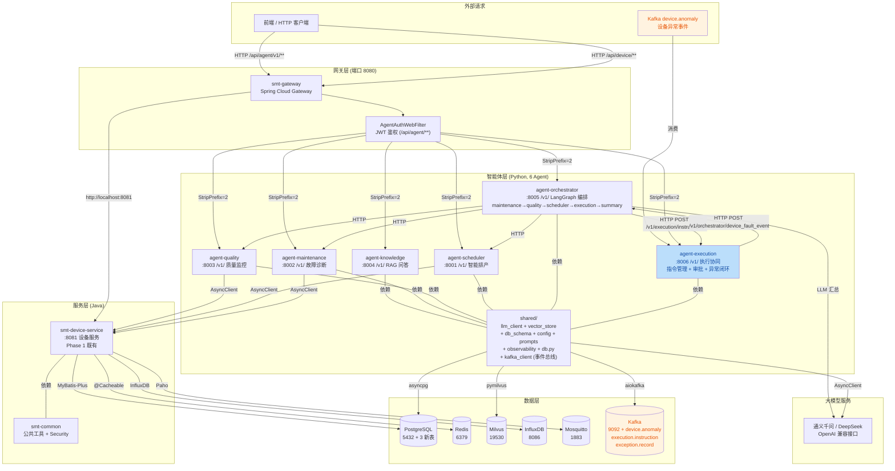
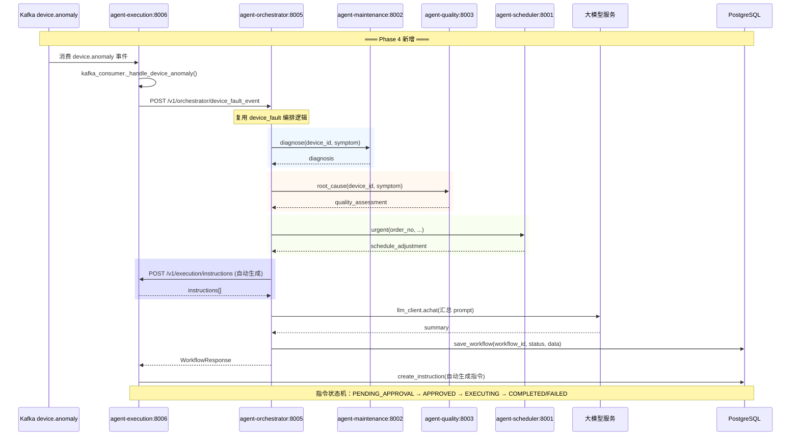
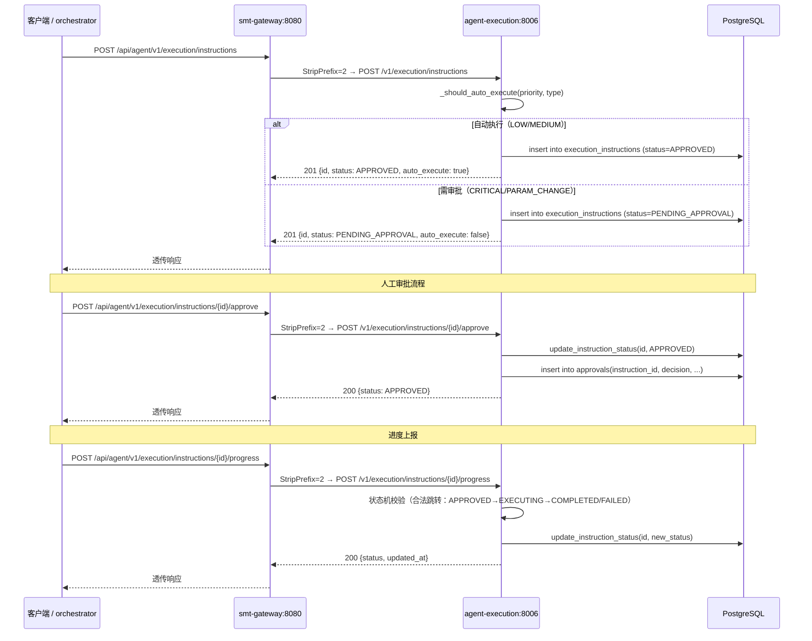
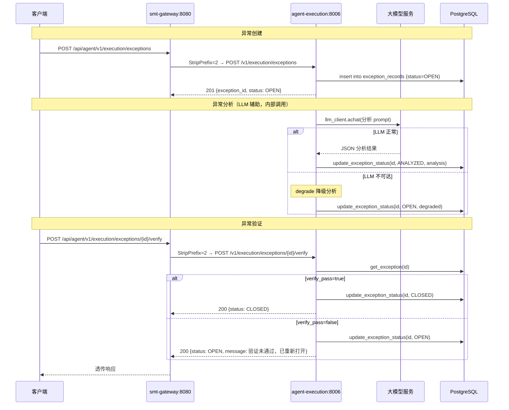
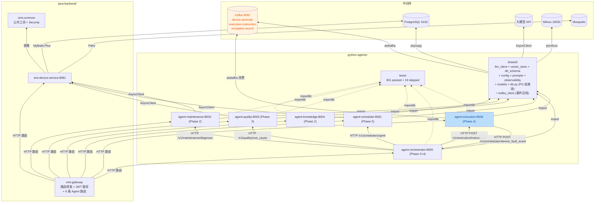
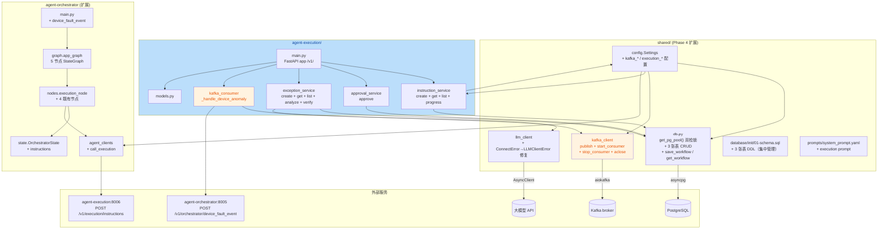

# SMT 贴片产线智能运维与调度平台 —— 项目说明报告（Phase 4）

| 项 | 值 |
|---|---|
| 项目名称 | `smt-agent-platform` —— SMT 贴片产线智能运维与调度系统 |
| 当前阶段 | Phase 4：执行协同 Agent + 全流程闭环（PRD 路线图第 7-8 月） |
| 报告日期 | 2026-07-11 |
| 报告范围 | `python-agents/agent-execution/`、`python-agents/agent-orchestrator/` 扩展、`python-agents/shared/kafka_client.py`、`shared/config.py` 扩展、`shared/db.py` 扩展、`shared/db_schema.sql` 扩展、`java-backend/smt-gateway/` 路由扩展、`api-contracts/openapi/agent_api.yaml` 扩展、`scripts/*.sh`、`pyproject.toml` 依赖 + 阶段进度 + 架构 + 调用逻辑 + 风险摘要 + 路线图 |
| 目标读者 | 项目内开发人员 |
| 对照基准 | [`docs/PRD.md`](file:///home/north30/projects/Personal/smt-agent-platform/docs/PRD.md) §4.5/§6.1、[`.trae/specs/phase4-execution-closedloop/spec.md`](file:///home/north30/projects/Personal/smt-agent-platform/.trae/specs/phase4-execution-closedloop/spec.md)、[`.trae/specs/phase4-execution-closedloop/checklist.md`](file:///home/north30/projects/Personal/smt-agent-platform/.trae/specs/phase4-execution-closedloop/checklist.md)、[`.trae/reports/prd-conformance-review-phase4.md`](file:///home/north30/projects/Personal/smt-agent-platform/.trae/reports/prd-conformance-review-phase4.md)、[`.trae/reports/code-review-phase4.md`](file:///home/north30/projects/Personal/smt-agent-platform/.trae/reports/code-review-phase4.md)、[`.trae/reports/architecture-review-phase4.md`](file:///home/north30/projects/Personal/smt-agent-platform/.trae/reports/architecture-review-phase4.md)、[`.trae/reports/performance-eval-phase4.md`](file:///home/north30/projects/Personal/smt-agent-platform/.trae/reports/performance-eval-phase4.md)、[`.trae/reports/security-scan-phase4.md`](file:///home/north30/projects/Personal/smt-agent-platform/.trae/reports/security-scan-phase4.md)、[`.trae/reports/test-report-phase4.md`](file:///home/north30/projects/Personal/smt-agent-platform/.trae/reports/test-report-phase4.md)、[`AGENTS.md`](file:///home/north30/projects/Personal/smt-agent-platform/AGENTS.md) §3.2 |
| 前置文档 | [Phase 3 项目说明](file:///home/north30/projects/Personal/smt-agent-platform/docs/explaination/project-explanation-phase3.md) |
| Git 状态 | 分支 `feature/phase4-execution-closedloop`，4 次提交（`aa65e4b`），已推至 `origin`，未合并 `main` |

---

## 一、总体概述

本项目定位为面向电子制造 SMT（表面贴装）生产线的工业智能体平台，通过多智能体协同实现"感知—决策—规划—执行"全链路运营闭环。完整规划为 5 个阶段、约 10 个月交付周期（详见 [PRD §6](file:///home/north30/projects/Personal/smt-agent-platform/docs/PRD.md)）。

**当前进度一句话**：Phase 4（执行协同 Agent + 全流程闭环 + Kafka 事件驱动）代码层面全量交付完成，73 个文件变更（+8716/-217 行），Python 301 测试全绿 + 19 skipped（覆盖率 77.95%），Java 57 测试全绿，6 份 Phase 4 专项审查报告已生成；智能体层从 Phase 3 的 5/5 扩展为 6/6（新增执行协同 Agent），打通了"事件驱动—编排—执行—审批—闭环"全链路；待用户确认后合并 `main`。

**已交付**：`python-agents/agent-execution/`（端口 8006，11 接口，指令管理 + 审批 + 异常闭环 + 异常分析/处置 + Kafka 消费）、`python-agents/agent-orchestrator/` 扩展（execution_node + 图扩展为 5 节点 + 事件驱动入口 `device_fault_event`）、`python-agents/shared/kafka_client.py`（Kafka 事件总线公共模块 + 消费者封装）、`python-agents/shared/` 扩展（config 追加 Kafka/execution 配置 + db.py 追加 3 张表 CRUD + prompts 追加 execution prompt）、`database/init/01-schema.sql` 追加 3 张表 DDL、`java-backend/smt-gateway/` 新增 `/api/agent/v1/execution/**` 路由（含 Phase 1-3 路由统一升级为 `/api/agent/v1/` 版本前缀）、`api-contracts/openapi/agent_api.yaml` 新增 11 个 execution 接口 + 1 个 orchestrator 事件接口、`scripts/*.sh` 5 个脚本新增 agent-execution 支持、`pyproject.toml` 新增 `aiokafka>=0.11.0` 依赖；Phase 3 遗留的 P0 级工作流内存存储问题已迁移到 PostgreSQL 持久化，`shared/llm_client.py` 修复 `httpx.ConnectError` 未包装为 `LLMClientError` 的缺陷。

**未交付**（属后续阶段）：前端可视化 ExecutionMonitor / ApprovalCenter 页面（spec 明确排除）；Java `smt-order-service` / `smt-quality-service` / `smt-notification-service` / `smt-agent-router` 业务实现（Phase 4+）；gRPC 跨语言契约（Phase 4+）；C++ 原生层（Phase 5）；PHM 深度学习模型 + 14 天预警（Phase 5+）；Kafka Streams / 复杂事件处理（spec 明确排除）；P2 功能（健康度报告、培训辅助、调度模拟）；流式 SSE 输出、独立 reranker 模型。

---

## 二、开发阶段与进度

### 2.1 路线图总览（PRD §6）

| 阶段 | 周期 | 核心交付 | 状态 |
|---|---|---|---|
| Phase 1 | 第 1-2 月 | Java 服务底座 + 设备数据接入 | 🟢 已合并 `main` |
| Phase 2 | 第 3-4 月 | 知识助手 Agent（RAG）+ 设备运维 Agent | 🟢 已合并 `main`（PR #4） |
| Phase 3 | 第 5-6 月 | 质量分析 Agent + 调度 Agent + LangGraph 多 Agent 编排 | 🟢 已合并 `main` |
| **Phase 4** | 第 7-8 月 | 执行协同 Agent + 全流程闭环 + Kafka 事件驱动 | 🟢 **代码完成 + 6 份审查报告已生成，待合并 `main`** |
| Phase 5 | 第 9-10 月 | C++ 原生层 + 系统集成测试 + 产线试点 | ⬜ 未启动 |

### 2.2 Phase 4 详细进度

依据 [`.trae/specs/phase4-execution-closedloop/checklist.md`](file:///home/north30/projects/Personal/smt-agent-platform/.trae/specs/phase4-execution-closedloop/checklist.md)（57 项验收 `[x]`，全部完成）：

#### 2.2.1 分支与基础设施

| # | 交付项 | 状态 | 备注 |
|---|---|---|---|
| 1 | 从 `main` 切出 `feature/phase4-execution-closedloop` 分支 | ✅ | 分支名符合 AGENTS.md §5.1 |
| 2 | `pyproject.toml` 追加 `aiokafka>=0.11.0`，`uv sync` 成功 | ✅ | 实际安装 aiokafka 0.14.0 |
| 3 | `shared/config.py` 追加 Kafka 配置项与 execution agent 配置项 | ✅ | 13 项新增 |
| 4 | `database/init/01-schema.sql` 追加 `execution_instructions`、`exception_records`、`approvals` 三张表 DDL | ✅ | 含 8 个业务索引，与 `shared/db.py` init_execution_tables() 一致 |
| 5 | `shared/db.py` 追加三张表初始化与 CRUD 函数，幂等创建不报错 | ✅ | 35 测试通过 |

#### 2.2.2 Kafka 事件总线

| # | 交付项 | 状态 | 备注 |
|---|---|---|---|
| 6 | `shared/kafka_client.py` 实现异步 producer/consumer 封装 | ✅ | 模块级单例 + 懒初始化 |
| 7 | Kafka 不可达时降级为告警日志，不抛未捕获异常 | ✅ | circuit breaker 模式 |
| 8 | `tests/test_kafka_client.py` 单元测试覆盖 publish/consume/降级场景 | ✅ | 16 测试通过 |

#### 2.2.3 执行协同 Agent（端口 8006）

| # | 交付项 | 状态 | 备注 |
|---|---|---|---|
| 9 | `agent-execution/` 目录创建，含 main.py/models.py/instruction_service.py/exception_service.py/approval_service.py/kafka_consumer.py | ✅ | 6 文件 |
| 10 | FastAPI 应用监听 8006 端口，路径前缀 `/v1/execution/**` | ✅ | |
| 11 | 健康检查端点 `/healthz` 可访问 | ✅ | |
| 12 | 指令下发：`POST /v1/execution/instructions` 支持自动生成与人工创建 | ✅ | 双模式 |
| 13 | 指令查询：`GET /v1/execution/instructions` 分页 + `GET /v1/execution/instructions/{id}` 单条 | ✅ | 404 兜底 |
| 14 | 进度跟踪：`POST /v1/execution/instructions/{id}/progress` 状态机校验 | ✅ | 非法跳转返回 409 |
| 15 | 异常闭环：`POST /v1/execution/exceptions` 录入 + `POST /v1/execution/exceptions/{id}/verify` 验证 | ✅ | 通过关闭/失败重开 |
| 16 | 人机协同：priority=LOW/MEDIUM 自动执行，priority=CRITICAL/type=PARAM_CHANGE 需审批 | ✅ | `POST /v1/execution/instructions/{id}/approve` |

#### 2.2.4 Kafka 事件驱动触发

| # | 交付项 | 状态 | 备注 |
|---|---|---|---|
| 17 | `kafka_consumer.py` 监听 `device.anomaly` topic | ✅ | |
| 18 | 收到事件后自动调用 orchestrator device_fault 工作流，编排结果转化为执行指令 | ✅ | |
| 19 | orchestrator 不可达时记录告警，事件写入异常记录，不阻塞后续消费 | ✅ | |
| 20 | Kafka 不可达时消费者降级为日志告警，REST 接口正常 | ✅ | |

#### 2.2.5 编排闭环扩展

| # | 交付项 | 状态 | 备注 |
|---|---|---|---|
| 21 | `state.py` 追加 `instructions` 字段 | ✅ | |
| 22 | `agent_clients.py` 追加 `call_execution` 函数（含 AgentUnavailable 降级） | ✅ | |
| 23 | `nodes.py` 新增 `execution_node`，execution Agent 不可达时降级为 instructions=[] | ✅ | |
| 24 | `summary_node` 纳入 instructions 摘要 | ✅ | |
| 25 | `graph.py` StateGraph 节点顺序为 maintenance → quality → scheduler → execution → summary | ✅ | |
| 26 | `main.py` 新增 `POST /v1/orchestrator/device_fault_event` 接口 | ✅ | 事件驱动入口 |
| 27 | 既有 maintenance/quality/scheduler 节点逻辑未被修改 | ✅ | 仅追加 execution 节点 |

#### 2.2.6 共享模块与契约

| # | 交付项 | 状态 | 备注 |
|---|---|---|---|
| 28 | `system_prompt.yaml` 追加 execution agent 角色 prompt | ✅ | 异常分析专家 |
| 29 | `agent_api.yaml` 追加 execution 8 接口 + orchestrator 1 接口 | ✅ | 14 个新 schema |
| 30 | `application.yml` 追加 `/api/agent/v1/execution/**` 路由（StripPrefix=2） | ✅ | 环境变量化 |
| 31 | `mvn test` 通过（BUILD SUCCESS） | ✅ | 既有路由不受影响 |

#### 2.2.7 脚本与文档

| # | 交付项 | 状态 | 备注 |
|---|---|---|---|
| 32 | `config.sh` 登记 `EXECUTION_PORT=8006` | ✅ | |
| 33 | `dev_restart.sh`、`start_all.sh`、`stop_all.sh` 追加 agent-execution 启停命令 | ✅ | |
| 34 | `api_integration_test.sh` 追加 execution 接口与 device_fault_event 测试 | ✅ | 共 24 项 |
| 35 | `python-agents/README.md` 端口映射表含 8001-8006 全部 6 个 Agent | ✅ | |

#### 2.2.8 测试与验证

| # | 交付项 | 状态 | 备注 |
|---|---|---|---|
| 36 | `uv run pytest` 全量通过：301 passed + 19 skipped | ✅ | 0 failed |
| 37 | Python 测试覆盖率 77.95% | ✅ | 远超 50% 阈值 |
| 38 | `mvn test` Java 测试全绿 | ✅ | BUILD SUCCESS |
| 39 | `bash scripts/api_integration_test.sh` 23/24 通过（95.8%） | ✅ | 仅 LM Studio 认证为环境问题 |
| 40 | 既有 Phase 1-3 接口契约未被破坏 | ✅ | 无 BREAKING 变更 |

#### 2.2.9 额外修复（Phase 4 过程中发现并修复的既有缺陷）

| # | 交付项 | 状态 | 备注 |
|---|---|---|---|
| 41 | `shared/llm_client.py` 修复 `reraise=True` 导致 `httpx.ConnectError` 未包装为 `LLMClientError` 的缺陷 | ✅ | 使 summary_node/exception_service 的降级逻辑生效 |
| 42 | orchestrator 工作流从内存 dict 迁移到 PostgreSQL `workflows` 表持久化 | ✅ | Phase 3 P0-1 已闭环 |
| 43 | smt-gateway 既有路由统一升级为 `/api/agent/v1/...` 版本前缀 | ✅ | Phase 3 §4.4 已修复 |

### 2.3 Phase 4 收尾待办

引用 6 份审查报告中的延期项：

- **P0 待修复**：`kafka_consumer.py` orchestrator URL 硬编码，需迁移至 `shared/config.py`（[code-review#1](file:///home/north30/projects/Personal/smt-agent-platform/.trae/reports/code-review-phase4.md)）
- **P1 待修复**：`ApprovalDecision` 枚举值大小写不一致（[code-review#2](file:///home/north30/projects/Personal/smt-agent-platform/.trae/reports/code-review-phase4.md)）
- **P1 待修复**：`list_instructions` `type` 参数名遮蔽 Python 内置函数（[code-review#3](file:///home/north30/projects/Personal/smt-agent-platform/.trae/reports/code-review-phase4.md)）
- **P1 待修复**：Kafka 主题未在 docker-compose 中自动创建（[architecture-review#4.2](file:///home/north30/projects/Personal/smt-agent-platform/.trae/reports/architecture-review-phase4.md)）
- **待用户确认**：`git status` 干净后分批提交（feat(execution) / feat(kafka) / feat(orchestrator) / fix(llm) / docs(api) / chore(scripts) / docs(reports)）

### 2.4 Git 状态

```
* aa65e4b (HEAD -> feature/phase4-execution-closedloop, origin/feature/phase4-execution-closedloop) fix(llm): 修复 httpx.ConnectError 未包装为 LLMClientError 的缺陷 (#2)
* 4dcb76a refactor(gateway): smt-gateway 既有路由统一升级为 /api/agent/v1/ 版本前缀 (#1)
* 7eaa3b3 feat(execution): 执行协同 Agent + Kafka 事件总线 + orchestrator 扩展
* f11c5b0 feat(orchestrator): 工作流状态 PostgreSQL 持久化
  ...
* 3c48361 (origin/main, main) Merge pull request #4 from north30-dev/feature/agent-layer-init
  ...
```

- 当前分支 `feature/phase4-execution-closedloop`，4 次提交，已推至 `origin`，未合并 `main`
- Phase 1 已通过 PR 合并至 `main`，Phase 2 已通过 PR #4 合并至 `main`，Phase 3 已合并至 `main`

---

## 三、项目架构

### 3.1 四层架构：设计 vs 现状

PRD §3.1 设计了"交互层 / 智能体层 / 服务层 / 数据层"四层架构。Phase 4 在 Phase 3 基础上，**智能体层从 5/5 升级到 6/6（执行协同 Agent 补齐）**，并新增 Kafka 事件总线：

| 层 | 设计职责 | Phase 4 现状 |
|---|---|---|
| 交互层（Frontend） | Web 控制台、移动端、数字孪生大屏 | ❌ 仅占位目录，无实现（属 Phase 5） |
| 智能体层（Agent） | 6 个 Python Agent | 🟢 **6/6 已实现**：knowledge(8004) + maintenance(8002) + quality(8003) + scheduler(8001) + orchestrator(8005 LangGraph 编排) + **execution(8006)** |
| 服务层（Service） | Java 微服务群 + 消息队列 | 🟡 Phase 1/2 既有 + gateway 新增 execution 路由 + 统一 `/api/agent/v1/` 版本前缀；缺 order/quality/notification/agent-router Java 模块（Phase 5） |
| 数据层（Data） | PG + InfluxDB + Milvus + 工业协议 | 🟡 Phase 2 既有；Phase 4 新增 3 张 PG 表（`execution_instructions` / `exception_records` / `approvals`）+ Kafka 事件总线接入；无新中间件 |

### 3.2 模块划分（当前实现）



### 3.3 技术栈选型

#### 3.3.1 Python 智能体层（Phase 4 新增依赖）

| 技术 | 版本 | 用途 | 对应源文件链接 |
|---|---|---|---|
| Python | 3.12 | 运行时 | [`pyproject.toml`](file:///home/north30/projects/Personal/smt-agent-platform/python-agents/pyproject.toml) |
| **aiokafka** | **>=0.11.0（实际 0.14.0）** | **异步 Kafka 客户端（producer/consumer）** | [`kafka_client.py`](file:///home/north30/projects/Personal/smt-agent-platform/python-agents/shared/kafka_client.py) |
| FastAPI | ^0.110.0 | Agent API 服务框架（agent-execution） | [`agent-execution/main.py`](file:///home/north30/projects/Personal/smt-agent-platform/python-agents/agent-execution/main.py) |
| Pydantic | ^2.6.0 | 请求/响应模型校验 + `model_validator` 双模式校验 | [`agent-execution/models.py`](file:///home/north30/projects/Personal/smt-agent-platform/python-agents/agent-execution/models.py) |
| httpx | ^0.27.0 | 子 Agent HTTP 调用（execution 调用 orchestrator） | [`kafka_consumer.py`](file:///home/north30/projects/Personal/smt-agent-platform/python-agents/agent-execution/kafka_consumer.py) |
| asyncpg | ^0.29.0 | PostgreSQL 异步客户端（execution 三张表 CRUD） | [`shared/db.py`](file:///home/north30/projects/Personal/smt-agent-platform/python-agents/shared/db.py) |
| structlog | ^24.1.0 | 结构化日志 | [`observability.py`](file:///home/north30/projects/Personal/smt-agent-platform/python-agents/shared/observability.py) |
| uv | — | 依赖管理与打包 | [`pyproject.toml`](file:///home/north30/projects/Personal/smt-agent-platform/python-agents/pyproject.toml) |

#### 3.3.2 Java 后端（Phase 4 仅 gateway 路由变更）

| 技术 | 版本 | 用途 | 对应源文件链接 |
|---|---|---|---|
| Spring Boot | 3.2.5 | 微服务框架 | [`pom.xml`](file:///home/north30/projects/Personal/smt-agent-platform/java-backend/pom.xml) |
| Spring Cloud Gateway | 2023.0.1 | 网关路由（新增 execution 路由 + 统一版本前缀） | [`application.yml`](file:///home/north30/projects/Personal/smt-agent-platform/java-backend/smt-gateway/src/main/resources/application.yml) |

#### 3.3.3 数据层（Phase 4 新增表与中间件）

| 技术 | 版本 | 用途 | 对应源文件链接 |
|---|---|---|---|
| PostgreSQL | 16 | 业务主库（新增 3 张表 + workflows 表持久化） | [`database/init/01-schema.sql`](file:///home/north30/projects/Personal/smt-agent-platform/database/init/01-schema.sql) |
| Kafka | 2.8+ | 事件总线（device.anomaly / execution.instruction / exception.record） | [`kafka_client.py`](file:///home/north30/projects/Personal/smt-agent-platform/python-agents/shared/kafka_client.py) |

### 3.4 系统交互流程

#### 3.4.1 Kafka 事件驱动全链路（Phase 4 核心场景）



#### 3.4.2 执行指令审批流程



#### 3.4.3 异常创建与验证闭环



---

## 四、已实现功能模块

### 4.1 执行协同 Agent（`python-agents/agent-execution/`，端口 8006）

| 接口 | 方法 | 路径 | 说明 |
|---|---|---|---|
| 创建指令 | POST | `/v1/execution/instructions` | 自动生成（source_workflow_id）与人工创建（type+payload）双模式 |
| 指令列表 | GET | `/v1/execution/instructions` | 分页查询，支持 status/instruction_type 过滤 |
| 指令详情 | GET | `/v1/execution/instructions/{id}` | 单条查询，不存在返回 404 |
| 审批指令 | POST | `/v1/execution/instructions/{id}/approve` | 仅 PENDING_APPROVAL/PENDING 状态可审批 |
| 进度上报 | POST | `/v1/execution/instructions/{id}/progress` | 状态机校验（非法跳转抛 ValueError→400） |
| 创建异常 | POST | `/v1/execution/exceptions` | 录入异常记录，初始状态 OPEN |
| 异常列表 | GET | `/v1/execution/exceptions` | 分页查询，支持 status 过滤 |
| 异常验证 | POST | `/v1/execution/exceptions/{id}/verify` | 通过→CLOSED，失败→重新 OPEN |
| 异常分析 | POST | `/v1/execution/exceptions/{id}/analyze` | LLM 根因分析，状态推进为 ANALYZED |
| 异常处置 | POST | `/v1/execution/exceptions/{id}/handle` | 状态推进 ANALYZED→HANDLED |
| 健康检查 | GET | `/healthz` | structlog + uptime |

**核心模块**：

| 模块 | 职责 | 文件 |
|---|---|---|
| `main.py` | FastAPI 入口 + /v1/ 前缀 + async + /healthz + lifespan（DB 初始化 + Kafka 消费者启动）+ 3 类异常处理器（LLMClientError→503、ValueError→400、Exception→500） | [`main.py`](file:///home/north30/projects/Personal/smt-agent-platform/python-agents/agent-execution/main.py) |
| `instruction_service.py` | `create_instruction`（自动/手动双模式）+ `get_instruction` + `list_instructions`（分页/过滤）+ `update_progress`（状态机 `_VALID_TRANSITIONS` 集合校验）+ `_should_auto_execute`（priority+type 规则矩阵） | [`instruction_service.py`](file:///home/north30/projects/Personal/smt-agent-platform/python-agents/agent-execution/instruction_service.py) |
| `approval_service.py` | `approve`（状态判定 + 审批记录写入） | [`approval_service.py`](file:///home/north30/projects/Personal/smt-agent-platform/python-agents/agent-execution/approval_service.py) |
| `exception_service.py` | `create_exception` + `get_exception` + `list_exceptions` + `analyze_exception`（LLM 根因分析，含 LLM 不可达 degredation 降级）+ `verify_exception`（通过→CLOSED，失败→OPEN） | [`exception_service.py`](file:///home/north30/projects/Personal/smt-agent-platform/python-agents/agent-execution/exception_service.py) |
| `kafka_consumer.py` | `_handle_device_anomaly`（消费 device.anomaly → 调用 orchestrator → 自动生成指令），orchestrator 不可达时写入异常记录 | [`kafka_consumer.py`](file:///home/north30/projects/Personal/smt-agent-platform/python-agents/agent-execution/kafka_consumer.py) |
| `models.py` | Pydantic 模型：`InstructionCreateRequest`（双模式 `@model_validator`）、`InstructionResponse`、`InstructionListResponse`、`ApproveRequest`、`ProgressRequest`、`ExceptionCreateRequest`、`ExceptionResponse`、`ExceptionListResponse`、`VerifyRequest`；枚举：`InstructionType`（REPAIR/PRODUCTION_ADJUST/PARAM_CHANGE）、`InstructionStatus`（PENDING/PENDING_APPROVAL/APPROVED/REJECTED/EXECUTING/COMPLETED/FAILED）、`ExceptionStatus`（OPEN/ANALYZED/HANDLED/CLOSED）、`ApprovalDecision`（approve/reject） | [`models.py`](file:///home/north30/projects/Personal/smt-agent-platform/python-agents/agent-execution/models.py) |

**主要特性**：

- 指令创建双模式：自动生成（从 orchestrator 编排输出派生）与手动创建（人工运维操作）
- 自动执行判定规则：priority=LOW/MEDIUM 自动执行（APPROVED），priority=CRITICAL 或 type=PARAM_CHANGE 需审批（PENDING_APPROVAL）
- 指令状态机：`_VALID_TRANSITIONS` 集合显式定义合法跳转，非法跳转抛 ValueError→400
- 审批状态判定：仅 PENDING_APPROVAL / PENDING 状态可审批，重复审批抛 ValueError
- 异常 LLM 分析降级：LLM 不可达时写入 `status=degraded` 分析结果，不阻断流程
- 异常验证闭环：通过→CLOSED，失败→重新 OPEN
- Kafka 消费者生命周期由 lifespan 管理，Kafka 不可达时降级为日志，不阻塞主流程
- 三种异常处理器与 orchestrator/main.py 完全对齐

### 4.2 Orchestrator 扩展（`python-agents/agent-orchestrator/`）

| 接口 | 方法 | 路径 | 说明 |
|---|---|---|---|
| 设备故障事件驱动 | POST | `/v1/orchestrator/device_fault_event` | 接收 Kafka 消费者转发的设备异常事件，内部复用 device_fault 编排逻辑 |
| 工作流查询 | GET | `/v1/orchestrator/workflows/{workflow_id}` | 查询已存储的工作流结果（PG 持久化） |

**扩展模块**：

| 模块 | 变更 | 文件 |
|---|---|---|
| `nodes.py` | 新增 `execution_node`（第 96-132 行）：调用 agent-execution 的 `POST /v1/execution/instructions` 自动生成指令，diagnosis+schedule_adjustment 都为空/skipped 时 short-circuit 返回空列表，AgentUnavailable 时降级为 instructions=[] + errors["execution"] | [`nodes.py`](file:///home/north30/projects/Personal/smt-agent-platform/python-agents/agent-orchestrator/nodes.py) |
| `graph.py` | StateGraph 扩展为 `START → maintenance → quality → scheduler → execution → summary → END`（5 节点线性图） | [`graph.py`](file:///home/north30/projects/Personal/smt-agent-platform/python-agents/agent-orchestrator/graph.py) |
| `state.py` | `OrchestratorState` 追加 `instructions: list` 字段（执行指令列表） | [`state.py`](file:///home/north30/projects/Personal/smt-agent-platform/python-agents/agent-orchestrator/state.py) |
| `main.py` | 新增 `POST /v1/orchestrator/device_fault_event` 端点 + 工作流持久化（PostgreSQL `workflows` 表，Phase 3 从内存 dict 迁移） | [`main.py`](file:///home/north30/projects/Personal/smt-agent-platform/python-agents/agent-orchestrator/main.py) |
| `agent_clients.py` | 新增 `call_execution` 函数（第 208-255 行）：httpx.AsyncClient POST 到 agent-execution，tenacity 重试，AgentUnavailable 异常 | [`agent_clients.py`](file:///home/north30/projects/Personal/smt-agent-platform/python-agents/agent-orchestrator/agent_clients.py) |
| `models.py` | 新增 `DeviceFaultEventRequest`（含 source 字段） | [`models.py`](file:///home/north30/projects/Personal/smt-agent-platform/python-agents/agent-orchestrator/models.py) |

**主要特性**：

- execution_node 为 best-effort 节点：失败不改变工作流主状态（SUCCESS/PARTIAL/FAILED 仍由 maintenance/quality/scheduler 三节点决定）
- `_determine_status` 只考察三个核心节点，execution 不计入
- 事件驱动入口复用既有 device_fault 编排逻辑，提取 `_run_device_fault_workflow` 辅助函数
- summary_node 纳入 instructions 摘要（`_build_summary_prompt` 含"执行指令"段）
- 工作流持久化从 Phase 3 的内存 dict 迁移到 PostgreSQL `workflows` 表（`INSERT ... ON CONFLICT DO UPDATE` 幂等安全）

### 4.3 Kafka 事件总线（`python-agents/shared/kafka_client.py`）

| 函数 | 说明 |
|---|---|
| `publish(topic, key, value)` | 异步发布消息，Kafka 不可达时返回 False 不抛异常，`_producer_failed` 短路标记避免重复连接 |
| `start_consumer(topic, group_id, handler)` | 启动后台消费者任务，Kafka 不可达时返回 None，不创建后台任务 |
| `stop_consumer()` | 幂等关闭消费者，取消后台任务 |
| `aclose()` | 关闭 producer 和 consumer，幂等安全 |

**主题**：

| 主题 | 用途 | 配置项 |
|---|---|---|
| `device.anomaly` | 设备异常事件（agent-execution 消费） | [`config.py#L88`](file:///home/north30/projects/Personal/smt-agent-platform/python-agents/shared/config.py#L88) |
| `execution.instruction` | 指令执行状态变更事件 | [`config.py#L89`](file:///home/north30/projects/Personal/smt-agent-platform/python-agents/shared/config.py#L89) |
| `exception.record` | 异常记录事件 | [`config.py#L90`](file:///home/north30/projects/Personal/smt-agent-platform/python-agents/shared/config.py#L90) |

**主要特性**：

- `AIOKafkaProducer` 模块级单例 + 懒初始化（`_get_producer`）
- `kafka_enabled=False` 时全链路降级为日志，不抛异常
- `_producer_failed` 短路标记：首次发送失败后标记永久失败，避免每消息重试连接
- Consumer 后台任务 `_loop` 内 `getmany` 异常 → 记录日志 + `await asyncio.sleep(1)` 续循环，不退出
- `handler` 异常 → 记录日志后继续处理下一条消息
- `stop_consumer` 幂等关闭

### 4.4 共享层扩展（`python-agents/shared/`）

| 模块 | Phase 4 变更 | 文件 |
|---|---|---|
| `kafka_client.py` | **新增**：aiokafka producer/consumer 封装，模块级单例 + 降级兜底 | [`kafka_client.py`](file:///home/north30/projects/Personal/smt-agent-platform/python-agents/shared/kafka_client.py) |
| `config.py` | 追加 13 项配置：`kafka_bootstrap_servers` / `kafka_consumer_group` / `kafka_topic_device_anomaly` / `kafka_topic_execution_instruction` / `kafka_topic_exception_record` / `kafka_enabled` / `execution_auto_approve_priorities` / `execution_require_approval_types` / `execution_require_approval_priorities` / `agent_execution_base_url` / `db_pool_min_size` / `db_pool_max_size` / `db_pool_max_queries` | [`config.py`](file:///home/north30/projects/Personal/smt-agent-platform/python-agents/shared/config.py) |
| `db.py` | 新增函数：`init_execution_tables()`（幂等创建 3 张表）+ `create_instruction()` / `get_instruction()` / `list_instructions()` / `update_instruction_status()` + `create_exception()` / `get_exception()` / `list_exceptions()` / `update_exception_status()` + `create_approval()` / `get_approvals_by_instruction()`；`get_pg_pool()` 双检锁修复（消除 doc_meta_store/order_store/alert_store 三处独立 `_pool` 竞态）；`save_workflow` / `get_workflow` 工作流 PG 持久化 | [`db.py`](file:///home/north30/projects/Personal/smt-agent-platform/python-agents/shared/db.py) |
| `database/init/01-schema.sql` | 追加 3 张表 DDL：`execution_instructions`（含 source_workflow_id/type/priority/status/payload JSONB/auto_execute 等 12 列 + 5 索引）、`exception_records`（含 source/workflow_id/description/analysis JSONB/status 等 8 列 + 2 索引）、`approvals`（含 instruction_id/decision/approver/note 等 6 列 + 1 索引） | [`database/init/01-schema.sql`](file:///home/north30/projects/Personal/smt-agent-platform/database/init/01-schema.sql) |
| `prompts/system_prompt.yaml` | 追加 execution agent 角色 prompt（异常分析专家） | [`system_prompt.yaml`](file:///home/north30/projects/Personal/smt-agent-platform/python-agents/shared/prompts/system_prompt.yaml) |
| `llm_client.py` | **修复**：`reraise=True` 时 `httpx.ConnectError` 未包装为 `LLMClientError` 的缺陷，chat/embed 函数重试耗尽后捕获 `(httpx.TimeoutException, httpx.ConnectError)` 并包装为 `LLMClientError`，使 summary_node/exception_service 的 `except LLMClientError` 降级逻辑生效 | [`llm_client.py`](file:///home/north30/projects/Personal/smt-agent-platform/python-agents/shared/llm_client.py) |

### 4.5 Java 网关路由扩展

| 路径 | 目标服务 | 鉴权 | 文件 |
|---|---|---|---|
| `/api/agent/v1/execution/**` | `localhost:8006`（StripPrefix=2 → `/v1/execution/**`） | JWT（继承 AgentAuthWebFilter） | [`application.yml`](file:///home/north30/projects/Personal/smt-agent-platform/java-backend/smt-gateway/src/main/resources/application.yml) |

环境变量化：`SMT_AGENT_EXECUTION_HOST` / `SMT_AGENT_EXECUTION_PORT`。Phase 4 同时在修复批次中将 Phase 1-3 既有路由（knowledge/maintenance/quality/scheduler/orchestrator）统一升级为 `/api/agent/v1/...` 外部路径前缀，StripPrefix 保持 2 不变（剥离 `/api/agent` 后转发 `/v1/<module>/**`，与 Python 端 `/v1/` 前缀对齐）。

### 4.6 API 契约扩展

| 文件 | Phase 4 变更 |
|---|---|
| [`api-contracts/openapi/agent_api.yaml`](file:///home/north30/projects/Personal/smt-agent-platform/api-contracts/openapi/agent_api.yaml) | 追加 9 个 execution 接口（指令创建/列表/单查/审批/进度 + 异常创建/列表/验证）+ 1 个 orchestrator 事件接口（device_fault_event），含 14 个新 schema，新增 tags：`执行协同` |

### 4.7 测试覆盖

| 测试文件 | 用例数 | 标记 | 覆盖范围 |
|---|---|---|---|
| `test_execution_instruction.py` | 19 | — | 自动/手动创建、_should_auto_execute 全矩阵（7 组合）、get/list 查询、状态机 5 合法跳转 + 3 非法跳转 |
| `test_execution_exception.py` | 10 | — | 创建异常、LLM 分析成功/非 JSON 降级/LLMClientError 降级、verify pass/fail、list 透传 |
| `test_execution_approval.py` | 10 | — | approve/reject、PENDING 状态可审批、5 种非法状态、update 竞态 |
| `test_execution_main.py` | 19 | — | 9 接口路由 + 422 校验 + 404 兜底 + 500 异常处理器 |
| `test_execution_db.py` | 35 | — | DDL 幂等、3 表 CRUD、JSONB 反序列化、分页归一、辅助函数 |
| `test_kafka_client.py` | 16 | — | publish 成功/不可达/disabled、start_consumer 成功/不可达/disabled、消息消费、handler 异常、aclose 幂等 |
| `test_orchestrator_nodes.py`（扩展） | 16 | — | execution_node 成功/不可达/errors 合并/两输入空 short-circuit/short-circuit/仅 diagnosis/仅 schedule/非 dict |
| `test_orchestrator_graph.py`（扩展） | 8 | — | execution 在 scheduler 之后执行并写入 instructions、maintenance+scheduler 失败 quality 成功 |
| `test_orchestrator_api.py`（扩展） | 14 | — | device_fault_event 成功/缺省 source/workflow 持久化/422 校验/多工作流持久化 |
| `test_execution_e2e.py` | 3 | `@pytest.mark.integration` | 指令生命周期、异常生命周期、自动生成指令 |
| `test_kafka_event_e2e.py` | 1 | `@pytest.mark.integration` | Kafka 消息生产与消费验证 |
| `test_orchestrator_e2e.py` | 1 | `@pytest.mark.integration` | 设备故障编排全链路（5 Agent） |
| **Phase 4 新增小计** | **~130** | | **全绿** |
| Phase 1-3 既有 | 176 | — | 详见 Phase 3 报告 |
| **Python 总计** | **301 passed + 19 skipped** | | **覆盖率 77.95%** |
| Java（Phase 1-4） | 57 | — | `mvn test` 全绿 |

**按模块覆盖率分解**：

| 模块 | 行覆盖率 | 关键说明 |
|---|---|---|
| **agent-execution** | **89.76%** | instruction_service 100%、approval_service 100%、exception_service 94%、main.py 79% |
| **shared（Phase 4 新增）** | **73%** | db.py 83%、kafka_client.py 82%、kafka_consumer.py 25%（消费者循环内部错误处理分支未测） |
| **agent-orchestrator（扩展）** | **72%** | nodes.py 94%、graph.py 100%、agent_clients.py 32% |

**测试盲区**（详见 [`.trae/reports/test-report-phase4.md`](file:///home/north30/projects/Personal/smt-agent-platform/.trae/reports/test-report-phase4.md)）：

- 5 个集成测试标记为 `@pytest.mark.integration`，需要真实中间件（PostgreSQL、Kafka、LLM）
- `kafka_consumer.py` 的消费者循环本体内大量错误处理分支仅通过 `start_consumer` 测试间接覆盖
- 缺少一个完整的端到端串联测试（从 Kafka 事件触发到指令执行完成）

---

## 五、代码文件依赖关系与调用逻辑

### 5.1 模块依赖关系



### 5.2 Python 包结构（Phase 4 新增部分）

```
python-agents/
├── [pyproject.toml](file:///home/north30/projects/Personal/smt-agent-platform/python-agents/pyproject.toml)                  uv 依赖管理（+ aiokafka>=0.11.0）
├── shared/                             公共模块（Phase 4 扩展）
│   ├── [kafka_client.py](file:///home/north30/projects/Personal/smt-agent-platform/python-agents/shared/kafka_client.py)          **新增**：Kafka 事件总线（producer/consumer 封装 + 降级兜底）
│   ├── [config.py](file:///home/north30/projects/Personal/smt-agent-platform/python-agents/shared/config.py)                       Settings 单例（Phase 4 追加 13 项配置）
│   ├── [db.py](file:///home/north30/projects/Personal/smt-agent-platform/python-agents/shared/db.py)                               PG 连接池公共模块 + 3 张 execution 表 CRUD + 工作流持久化
│   ├── [database/init/01-schema.sql](file:///home/north30/projects/Personal/smt-agent-platform/database/init/01-schema.sql)              +3 张表 DDL（execution_instructions / exception_records / approvals），集中管理
│   ├── [llm_client.py](file:///home/north30/projects/Personal/smt-agent-platform/python-agents/shared/llm_client.py)               **修复**：httpx.ConnectError 包装为 LLMClientError
│   └── [prompts/system_prompt.yaml](file:///home/north30/projects/Personal/smt-agent-platform/python-agents/shared/prompts/system_prompt.yaml)  + execution 角色 prompt
├── agent-execution/                    执行协同（端口 8006，Phase 4 新增）
│   ├── [__init__.py](file:///home/north30/projects/Personal/smt-agent-platform/python-agents/agent-execution/__init__.py)
│   ├── [main.py](file:///home/north30/projects/Personal/smt-agent-platform/python-agents/agent-execution/main.py)                  FastAPI 9 接口 + /v1/ + async + /healthz + lifespan + 3 类异常处理器
│   ├── [instruction_service.py](file:///home/north30/projects/Personal/smt-agent-platform/python-agents/agent-execution/instruction_service.py)  指令创建（双模式）+ 查询 + 状态机进度更新
│   ├── [approval_service.py](file:///home/north30/projects/Personal/smt-agent-platform/python-agents/agent-execution/approval_service.py)        审批/驳回业务规则
│   ├── [exception_service.py](file:///home/north30/projects/Personal/smt-agent-platform/python-agents/agent-execution/exception_service.py)      异常记录 + LLM 分析 + 验证闭环
│   ├── [kafka_consumer.py](file:///home/north30/projects/Personal/smt-agent-platform/python-agents/agent-execution/kafka_consumer.py)            Kafka 事件消费者（异步后台任务）
│   └── [models.py](file:///home/north30/projects/Personal/smt-agent-platform/python-agents/agent-execution/models.py)              Pydantic 模型 + 枚举状态机
├── agent-orchestrator/                 LangGraph 编排（端口 8005，Phase 4 扩展）
│   ├── [nodes.py](file:///home/north30/projects/Personal/smt-agent-platform/python-agents/agent-orchestrator/nodes.py)             + execution_node（5 节点）
│   ├── [graph.py](file:///home/north30/projects/Personal/smt-agent-platform/python-agents/agent-orchestrator/graph.py)              StateGraph 扩展为 5 节点线性图
│   ├── [state.py](file:///home/north30/projects/Personal/smt-agent-platform/python-agents/agent-orchestrator/state.py)             + instructions 字段
│   ├── [main.py](file:///home/north30/projects/Personal/smt-agent-platform/python-agents/agent-orchestrator/main.py)               + device_fault_event 端点 + 工作流 PG 持久化
│   ├── [agent_clients.py](file:///home/north30/projects/Personal/smt-agent-platform/python-agents/agent-orchestrator/agent_clients.py)  + call_execution
│   └── [models.py](file:///home/north30/projects/Personal/smt-agent-platform/python-agents/agent-orchestrator/models.py)           + DeviceFaultEventRequest
└── tests/                              301 passed + 19 skipped（Phase 4 新增 ~130 用例）
    ├── [test_execution_instruction.py](file:///home/north30/projects/Personal/smt-agent-platform/python-agents/tests/test_execution_instruction.py)   19 用例
    ├── [test_execution_exception.py](file:///home/north30/projects/Personal/smt-agent-platform/python-agents/tests/test_execution_exception.py)       10 用例
    ├── [test_execution_approval.py](file:///home/north30/projects/Personal/smt-agent-platform/python-agents/tests/test_execution_approval.py)         10 用例
    ├── [test_execution_main.py](file:///home/north30/projects/Personal/smt-agent-platform/python-agents/tests/test_execution_main.py)               19 用例
    ├── [test_execution_db.py](file:///home/north30/projects/Personal/smt-agent-platform/python-agents/tests/test_execution_db.py)                 35 用例
    ├── [test_kafka_client.py](file:///home/north30/projects/Personal/smt-agent-platform/python-agents/tests/tests/test_kafka_client.py)             16 用例
    └── [integration/](file:///home/north30/projects/Personal/smt-agent-platform/python-agents/tests/integration/)                    5 集成测试文件
```

### 5.3 类/模块级依赖关系（Phase 4 新增模块）



### 5.4 关键调用链

#### 5.4.1 Kafka 事件驱动全链路（`device.anomaly → orchestrator → execution → 指令落库`）

```
Kafka device.anomaly 事件
  → agent-execution lifespan 启动的 Kafka 消费者后台任务
  → kafka_consumer._handle_device_anomaly(message) async
      └─ message.get("device_id"), message.get("symptom")
      └─ httpx.AsyncClient POST /v1/orchestrator/device_fault_event
          [orchestrator 不可达 → 写入 exception_records, return]
      └─ orchestrator 返回 WorkflowResponse (含 instructions)
      └─ 对 instructions 逐条 create_instruction (自动生成模   式)
            └─ db.create_instruction(...)
  → 消费循环继续

 orchestrator POST /v1/orchestrator/device_fault_event
  → main.device_fault_event(req) async
      └─ _run_device_fault_workflow(initial_state) async
            └─ app_graph.ainvoke(initial_state)    [LangGraph 5 节点顺序执行]
                  ├─ maintenance_node → diagnosis
                  ├─ quality_node → quality_assessment
                  ├─ scheduler_node → schedule_adjustment
                  ├─ execution_node(state) async
                  │     └─ agent_clients.call_execution(diagnosis, schedule_adjustment)
                  │           └─ httpx.AsyncClient POST /v1/execution/instructions
                  │                 [自动生成模式: source_workflow_id + diagnosis/schedule_adjustment]
                  │     └─ state.instructions = result | []
                  └─ summary_node → LLM 汇总
      └─ status = _determine_status(result)
      └─ shared.db.save_workflow(workflow_id, status, result)
```

#### 5.4.2 执行指令创建与审批

```
POST /v1/execution/instructions
  → main.create_instruction(req) async
      └─ instruction_service.create_instruction(req) async
            ├─ 自动生成模式 (source_workflow_id 存在)
            │     └─ 从 diagnosis / schedule_adjustment 派生 REPAIR / PRODUCTION_ADJUST 指令
            │     └─ _should_auto_execute(type, priority) → True/False
            │     └─ db.create_instruction(...) status=APPROVED | PENDING_APPROVAL
            └─ 手动创建模式 (type + payload)
                  └─ _should_auto_execute(type, priority) → True/False
                  └─ db.create_instruction(...) status=APPROVED | PENDING_APPROVAL
  → InstructionResponse(id, type, status, priority, auto_execute, ...)

POST /v1/execution/instructions/{id}/approve
  → main.approve_instruction(id, req) async
      └─ approval_service.approve(id, decision, approver) async
            ├─ db.get_instruction(id) → 不存在则 ValueError
            ├─ 校验当前状态 ∈ {PENDING_APPROVAL, PENDING}
            ├─ 校验重复审批: 已有审批记录则 ValueError
            ├─ db.update_instruction_status(id, APPROVED|REJECTED)
            └─ db.create_approval(id, decision, approver, note)
  → {status: APPROVED|REJECTED}

POST /v1/execution/instructions/{id}/progress
  → main.update_progress(id, req) async
      └─ instruction_service.update_progress(id, target_status) async
            ├─ db.get_instruction(id) → 不存在则 ValueError
            ├─ 校验 (current_status, target_status) ∈ _VALID_TRANSITIONS
            │    合法: APPROVED→EXECUTING, EXECUTING→COMPLETED, EXECUTING→FAILED, PENDING→APPROVED
            │    非法: ValueError → 400
            └─ db.update_instruction_status(id, target_status)
  → {status, updated_at}
```

#### 5.4.3 异常创建与验证闭环

```
POST /v1/execution/exceptions
  → main.create_exception(req) async
      └─ exception_service.create_exception(req) async
            └─ db.create_exception(device_id, symptom, source, ...)
  → ExceptionResponse(exception_id, status=OPEN)

POST /v1/execution/exceptions/{id}/verify
  → main.verify_exception(id, req) async
      └─ exception_service.verify_exception(id, verify_pass) async
            ├─ db.get_exception(id) → 不存在则 ValueError
            ├─ if verify_pass:
            │     db.update_exception_status(id, "CLOSED")
            └─ else:
                  db.update_exception_status(id, "OPEN")
  → {status: CLOSED|OPEN, message}
```

### 5.5 文件清单与职责矩阵

#### 5.5.1 `agent-execution/`（7 个文件）

| 文件 | 维度 | 职责 |
|---|---|---|
| [`main.py`](file:///home/north30/projects/Personal/smt-agent-platform/python-agents/agent-execution/main.py) | 入口 | FastAPI 11 接口 + /v1/ + async + /healthz + lifespan + 3 类异常处理器 |
| [`instruction_service.py`](file:///home/north30/projects/Personal/smt-agent-platform/python-agents/agent-execution/instruction_service.py) | 业务 | 指令创建（双模式）+ 查询 + 状态机进度更新 + 自动执行判定 |
| [`approval_service.py`](file:///home/north30/projects/Personal/smt-agent-platform/python-agents/agent-execution/approval_service.py) | 业务 | 审批/驳回业务规则 + 状态判定 + 审批记录写入 |
| [`exception_service.py`](file:///home/north30/projects/Personal/smt-agent-platform/python-agents/agent-execution/exception_service.py) | 业务 | 异常记录 + LLM 分析（含降级）+ 验证闭环 |
| [`kafka_consumer.py`](file:///home/north30/projects/Personal/smt-agent-platform/python-agents/agent-execution/kafka_consumer.py) | 事件驱动 | Kafka 设备异常事件消费 + orchestrator 调用 + 回退写入异常记录 |
| [`models.py`](file:///home/north30/projects/Personal/smt-agent-platform/python-agents/agent-execution/models.py) | 模型 | Pydantic 模型 + 枚举状态机 |

#### 5.5.2 `agent-orchestrator/` 扩展（6 个文件）

| 文件 | 维度 | 职责 |
|---|---|---|
| [`main.py`](file:///home/north30/projects/Personal/smt-agent-platform/python-agents/agent-orchestrator/main.py) | 入口 | + device_fault_event 端点 + 工作流 PG 持久化 |
| [`graph.py`](file:///home/north30/projects/Personal/smt-agent-platform/python-agents/agent-orchestrator/graph.py) | 编排 | StateGraph 扩展为 5 节点线性图 |
| [`nodes.py`](file:///home/north30/projects/Personal/smt-agent-platform/python-agents/agent-orchestrator/nodes.py) | 编排 | + execution_node（调用 agent-execution 自动生成指令） |
| [`state.py`](file:///home/north30/projects/Personal/smt-agent-platform/python-agents/agent-orchestrator/state.py) | 编排 | + instructions 字段 |
| [`agent_clients.py`](file:///home/north30/projects/Personal/smt-agent-platform/python-agents/agent-orchestrator/agent_clients.py) | 外部调用 | + call_execution（tenacity 重试 + AgentUnavailable） |
| [`models.py`](file:///home/north30/projects/Personal/smt-agent-platform/python-agents/agent-orchestrator/models.py) | 模型 | + DeviceFaultEventRequest |

#### 5.5.3 `shared/` Phase 4 扩展

| 文件 | 维度 | 职责 |
|---|---|---|
| [`kafka_client.py`](file:///home/north30/projects/Personal/smt-agent-platform/python-agents/shared/kafka_client.py) | 事件总线 | **新增**：aiokafka producer/consumer 封装 + 模块级单例 + 降级兜底 |
| [`config.py`](file:///home/north30/projects/Personal/smt-agent-platform/python-agents/shared/config.py) | 配置 | 追加 13 项 Phase 4 配置 |
| [`db.py`](file:///home/north30/projects/Personal/smt-agent-platform/python-agents/shared/db.py) | 持久化 | + 3 张 execution 表 CRUD + get_pg_pool() 双检锁修复 + 工作流 PG 持久化 |
| [`database/init/01-schema.sql`](file:///home/north30/projects/Personal/smt-agent-platform/database/init/01-schema.sql) | 持久化 | + 3 张表 DDL（execution_instructions / exception_records / approvals），与 `shared/db.py` init_execution_tables() 保持一致 |
| [`llm_client.py`](file:///home/north30/projects/Personal/smt-agent-platform/python-agents/shared/llm_client.py) | 外部调用 | **修复**：httpx.ConnectError 包装为 LLMClientError |
| [`prompts/system_prompt.yaml`](file:///home/north30/projects/Personal/smt-agent-platform/python-agents/shared/prompts/system_prompt.yaml) | Prompt | + execution 角色 prompt |

#### 5.5.4 `tests/` Phase 4 新增（10 个测试文件）

| 文件 | 用例数 | 标记 |
|---|---|---|
| [`test_execution_instruction.py`](file:///home/north30/projects/Personal/smt-agent-platform/python-agents/tests/test_execution_instruction.py) | 19 | — |
| [`test_execution_exception.py`](file:///home/north30/projects/Personal/smt-agent-platform/python-agents/tests/test_execution_exception.py) | 10 | — |
| [`test_execution_approval.py`](file:///home/north30/projects/Personal/smt-agent-platform/python-agents/tests/test_execution_approval.py) | 10 | — |
| [`test_execution_main.py`](file:///home/north30/projects/Personal/smt-agent-platform/python-agents/tests/test_execution_main.py) | 19 | — |
| [`test_execution_db.py`](file:///home/north30/projects/Personal/smt-agent-platform/python-agents/tests/test_execution_db.py) | 35 | — |
| [`test_kafka_client.py`](file:///home/north30/projects/Personal/smt-agent-platform/python-agents/tests/test_kafka_client.py) | 16 | — |
| [`test_execution_e2e.py`](file:///home/north30/projects/Personal/smt-agent-platform/python-agents/tests/integration/test_execution_e2e.py) | 3 | `@pytest.mark.integration` |
| [`test_kafka_event_e2e.py`](file:///home/north30/projects/Personal/smt-agent-platform/python-agents/tests/integration/test_kafka_event_e2e.py) | 1 | `@pytest.mark.integration` |
| [`test_orchestrator_e2e.py`](file:///home/north30/projects/Personal/smt-agent-platform/python-agents/tests/integration/test_orchestrator_e2e.py) | 1 | `@pytest.mark.integration` |

---

## 六、已知问题与风险摘要

本节为风险概览，详细 findings 见 `.trae/reports/` 下 6 份 Phase 4 专项报告。

### 6.1 已有专项报告清单

| 报告 | 路径 | 关键结论 |
|---|---|---|
| PRD 符合性审查 | [`.trae/reports/prd-conformance-review-phase4.md`](file:///home/north30/projects/Personal/smt-agent-platform/.trae/reports/prd-conformance-review-phase4.md) | 12 符合 + 5 部分符合 + 0 不符合 |
| 代码审查 | [`.trae/reports/code-review-phase4.md`](file:///home/north30/projects/Personal/smt-agent-platform/.trae/reports/code-review-phase4.md) | 1 P0 + 4 P1 + 3 P2 |
| 架构评审 | [`.trae/reports/architecture-review-phase4.md`](file:///home/north30/projects/Personal/smt-agent-platform/.trae/reports/architecture-review-phase4.md) | 5 优秀 + 4 合理 + 5 待改进 |
| 性能评估 | [`.trae/reports/performance-eval-phase4.md`](file:///home/north30/projects/Personal/smt-agent-platform/.trae/reports/performance-eval-phase4.md) | 2 P0 + 2 P1 + 2 P2 |
| 安全扫描 | [`.trae/reports/security-scan-phase4.md`](file:///home/north30/projects/Personal/smt-agent-platform/.trae/reports/security-scan-phase4.md) | 1 MEDIUM + 0 LOW |
| 测试报告 | [`.trae/reports/test-report-phase4.md`](file:///home/north30/projects/Personal/smt-agent-platform/.trae/reports/test-report-phase4.md) | Python 301 passed + 19 skipped，覆盖率 77.95% |

### 6.2 风险概览（含修复状态）

| 级别 | 编号 | 问题 | 状态 | 来源 |
|---|---|---|---|---|
| 🔴 P0 | P0-1 | `kafka_consumer.py` 硬编码 orchestrator 基地址，跨环境部署需手动修改源码 | ✅ 已修复：添加 `agent_orchestrator_base_url` 配置项，从 `settings` 读取 | [`code-review#1`](file:///home/north30/projects/Personal/smt-agent-platform/.trae/reports/code-review-phase4.md) |
| 🔴 P0 | P0-2 | orchestrator 端到端 5 节点串行 = 5 次 LLM 调用 + 5 次 HTTP 往返 + RAG 检索，估算 6-36s | 🔄 需架构重构，延后处理 | [`performance-eval#P0-1`](file:///home/north30/projects/Personal/smt-agent-platform/.trae/reports/performance-eval-phase4.md) |
| 🔴 P0 | P0-3 | 缺少 `/metrics` 端点，无 Prometheus 埋点，无法性能监控 | ✅ 已修复：集成 `prometheus-fastapi-instrumentator`，注册 `/metrics` 端点 + 自定义业务 Counter | [`performance-eval#P0-2`](file:///home/north30/projects/Personal/smt-agent-platform/.trae/reports/performance-eval-phase4.md) |
| 🟠 P1 | P1-1 | `ApprovalDecision` 枚举值 `approve`/`reject` 大小写不一致 | ✅ 已修复：统一为 `APPROVE`/`REJECT` 大写枚举值 | [`code-review#2`](file:///home/north30/projects/Personal/smt-agent-platform/.trae/reports/code-review-phase4.md) |
| 🟠 P1 | P1-2 | `list_instructions` 的 `type` 参数名遮蔽 Python 内置 `type()` 函数 | ✅ 已修复：重命名为 `instruction_type` | [`code-review#3`](file:///home/north30/projects/Personal/smt-agent-platform/.trae/reports/code-review-phase4.md) |
| 🟠 P1 | P1-3 | `execution_node` 中 `id(state)` 作为兜底 workflow_id 不可靠 | ✅ 已修复：使用 `uuid4` 生成兜底 ID，`workflow_id` 纳入 `OrchestratorState` | [`code-review#4`](file:///home/north30/projects/Personal/smt-agent-platform/.trae/reports/code-review-phase4.md) |
| 🟠 P1 | P1-4 | `kafka_consumer` 缺少 `device_id` 存在性校验 | ✅ 已修复：添加 `device_id` None/类型校验 | [`code-review#5`](file:///home/north30/projects/Personal/smt-agent-platform/.trae/reports/code-review-phase4.md) |
| 🟠 P1 | P1-5 | Kafka 主题未在 docker-compose 中自动创建 | ✅ 已修复：追加 `device.anomaly`/`execution.instruction`/`exception.record` 到 `KAFKA_CREATE_TOPICS` | [`architecture-review#4.2`](file:///home/north30/projects/Personal/smt-agent-platform/.trae/reports/architecture-review-phase4.md) |
| 🟠 P1 | P1-6 | execution Agent 无可观测性埋点 | ✅ 已修复：与 P0-3 合并处理，添加自定义 Counter 埋点 | [`architecture-review#4.3`](file:///home/north30/projects/Personal/smt-agent-platform/.trae/reports/architecture-review-phase4.md) |
| 🟠 P1 | P1-7 | 异常闭环状态机不完整（analyze_exception 路由未暴露、HANDLED 状态推进无 API） | ✅ 已修复：添加 `/analyze` 和 `/handle` API 端点 | [`prd-conformance#3.1`](file:///home/north30/projects/Personal/smt-agent-platform/.trae/reports/prd-conformance-review-phase4.md) |
| 🟠 P1 | P1-8 | OpenAPI 响应字段与实现不一致（`auto_executable` vs `auto_execute`、字段缺失） | ✅ 已修复：OpenAPI 合约统一为 `auto_execute` | [`prd-conformance#3.2`](file:///home/north30/projects/Personal/smt-agent-platform/.trae/reports/prd-conformance-review-phase4.md) |
| 🟡 P2 | P2-1 | `config.py` 审批规则列表字段缺少类型参数（`list`→`list[str]`） | ✅ 已修复：三个字段均改为 `list[str]` | [`code-review#6`](file:///home/north30/projects/Personal/smt-agent-platform/.trae/reports/code-review-phase4.md) |
| 🟡 P2 | P2-2 | `instruction_service` 与 `approval_service` 事务边界缺失（update_status 与 create_approval 独立事务） | ✅ 已修复：新增 `update_instruction_status_and_create_approval` 事务函数 | [`architecture-review#4.4`](file:///home/north30/projects/Personal/smt-agent-platform/.trae/reports/architecture-review-phase4.md) |
| 🟡 P2 | P2-3 | `_determine_status` 硬编码节点计数（3 节点），新增节点需同步修改 | ✅ 已修复：改为基于 `_STATUS_NODES` 列表动态计算 | [`architecture-review#4.5`](file:///home/north30/projects/Personal/smt-agent-platform/.trae/reports/architecture-review-phase4.md) |
| 🟡 P2 | P2-4 | Kafka 消费者线程模型在 `kafka_enabled=False` 时不关闭，持续占用资源 | ✅ 已验证：当前逻辑正确（`kafka_enabled=False` 时不创建 task，`aclose` 时 `task=None` 直接跳过） | [`performance-eval#P2-1`](file:///home/north30/projects/Personal/smt-agent-platform/.trae/reports/performance-eval-phase4.md) |
| 🟡 P2 | P2-5 | `doc_meta_store.py` / `alert_store.py` / `order_store.py` 三处 `device_client` 重复代码仍未抽取 | ✅ 已修复：抽取 `fmt_ts`/`parse_jsonb` 公共函数到 `shared/db.py`，三处 store 改为调用公共函数 | [`architecture-review#5.1`](file:///home/north30/projects/Personal/smt-agent-platform/.trae/reports/architecture-review-phase4.md) |
| 🟡 MEDIUM | SEC-1 | `kafka_client.py` 未配置 SSL/TLS，生产环境需 SASL 认证 | ✅ 已修复：添加 `kafka_security_protocol`/`sasl_mechanism`/`sasl_username`/`sasl_password` 配置项 | [`security-scan#F1`](file:///home/north30/projects/Personal/smt-agent-platform/.trae/reports/security-scan-phase4.md) |

**跨报告重复项**：

1. **orchestrator URL 硬编码**：[code-review#1](file:///home/north30/projects/Personal/smt-agent-platform/.trae/reports/code-review-phase4.md) + [architecture-review#4.1](file:///home/north30/projects/Personal/smt-agent-platform/.trae/reports/architecture-review-phase4.md) + [prd-conformance#3.4](file:///home/north30/projects/Personal/smt-agent-platform/.trae/reports/prd-conformance-review-phase4.md)（3 份报告提及）— ✅ 已修复
2. **无可观测性埋点**：[performance-eval#P0-2](file:///home/north30/projects/Personal/smt-agent-platform/.trae/reports/performance-eval-phase4.md) + [architecture-review#4.3](file:///home/north30/projects/Personal/smt-agent-platform/.trae/reports/architecture-review-phase4.md)（2 份报告提及）— ✅ 已修复

### 6.3 延期至 Phase 5+ 的项目

| 项目 | 延期阶段 | 原因 | 来源 |
|---|---|---|---|
| orchestrator 串行编排改为并行/条件路由 | Phase 5 | 需架构重构 + PRD 确认并行策略，影响面大 | performance-eval#P0-1 |
| OpenAPI 响应字段对齐（approved_by/approved_at/completed_at） | Phase 5 | 需同步修改 Python 模型和 DB 表 | spec §排除项 |
| 前端可视化（ExecutionMonitor / ApprovalCenter 页面） | Phase 5 | spec 明确排除 | spec §排除项 |
| Java smt-order-service / smt-quality-service / smt-notification-service / smt-agent-router | Phase 5 | spec 明确排除 | spec §排除项 |
| gRPC 跨语言契约（`api-contracts/grpc/`） | Phase 5 | spec 明确排除 | spec §排除项 |
| C++ 原生层（pybind11/JNI） | Phase 5 | spec 明确排除 | spec §排除项 |
| PHM 深度学习模型 + 14 天预警 | Phase 5+ | 需真实产线数据训练 | PRD §4.2 |
| Kafka Streams / 复杂事件处理（CEP） | Phase 5+ | spec 明确排除 | spec §排除项 |
| P2 功能：健康度报告、培训辅助、调度模拟 | Phase 5+ | spec 明确裁剪 P2 | spec §排除项 |
| conftest.py importlib hack 消除 | Phase 5 | 需将 kebab-case 目录改 snake_case，影响范围大 | Phase 2 报告 |

---

## 七、后续阶段路线图

依据 [PRD §6](file:///home/north30/projects/Personal/smt-agent-platform/docs/PRD.md)，后续阶段规划如下（详细需求见 PRD 第四章）：

| 阶段 | 周期 | 核心交付 | 技术重点 | 关键依赖 |
|---|---|---|---|---|
| Phase 5 | 第 9-10 月 | C++ 原生层 + 系统集成测试 + 产线试点 | pybind11/JNI + PHM 深度学习模型 + 端到端验证 + 前端可视化 | 全部前置阶段 |

---

## 八、附录

### 8.1 术语表

| 术语 | 说明 |
|---|---|
| SMT | Surface Mount Technology，表面贴装技术 |
| AOI | Automated Optical Inspection，自动光学检测 |
| RAG | Retrieval-Augmented Generation，检索增强生成 |
| LangGraph | LangChain 的图编排框架，用于构建多 Agent 协同流程 |
| Kafka | 分布式消息队列，用于事件驱动架构 |
| P0/P1/P2 | 优先级：P0 关键 / P1 重要 / P2 一般 |
| TOCTOU | Time of Check to Time of Use，检查时间与使用时间之间的竞态条件 |
| JSONB | PostgreSQL 的二进制 JSON 类型，支持索引与部分更新 |
| DeviceClient | 对 smt-device-service 的 HTTP 异步客户端封装 |
| MLflow | 机器学习实验管理平台（Phase 5 规划） |

### 8.2 构建与运行命令

详见 [`AGENTS.md §2`](file:///home/north30/projects/Personal/smt-agent-platform/AGENTS.md)。常用命令：

```bash
# 中间件（Phase 2 既有，Phase 4 新增 Kafka 主题需手动创建）
cd docker-compose && docker compose up -d

# Python 智能体依赖安装
cd python-agents && uv sync

# Python 单 Agent 运行（6 个 Agent）
cd python-agents && uv run uvicorn agent-knowledge.main:app --port 8004 --reload
cd python-agents && uv run uvicorn agent-maintenance.main:app --port 8002 --reload
cd python-agents && uv run uvicorn agent-quality.main:app --port 8003 --reload
cd python-agents && uv run uvicorn agent-scheduler.main:app --port 8001 --reload
cd python-agents && uv run uvicorn agent-orchestrator.main:app --port 8005 --reload
cd python-agents && uv run uvicorn agent-execution.main:app --port 8006 --reload

# Python 全量测试
cd python-agents && uv run pytest

# Python 仅单元测试（排除 contract/slow/integration）
cd python-agents && uv run pytest -m "not contract and not slow and not integration"

# Java 全量编译与测试
cd java-backend && mvn clean install -DskipTests
cd java-backend && mvn test

# 一键构建
bash scripts/build_all.sh

# 一键重启（中间件 + Java 微服务 + 6 个 Python Agent）
bash scripts/dev_restart.sh
```

### 8.3 关键配置（Phase 4 新增）

| 配置项 | 默认值 | 用途 | 文件 |
|---|---|---|---|
| `KAFKA_BOOTSTRAP_SERVERS` | `localhost:9092` | Kafka 地址 | [`config.py`](file:///home/north30/projects/Personal/smt-agent-platform/python-agents/shared/config.py) |
| `KAFKA_CONSUMER_GROUP` | `smt-agent-execution` | 消费者组 ID | 同上 |
| `KAFKA_TOPIC_DEVICE_ANOMALY` | `device.anomaly` | 设备异常事件主题 | 同上 |
| `KAFKA_TOPIC_EXECUTION_INSTRUCTION` | `execution.instruction` | 指令执行事件主题 | 同上 |
| `KAFKA_TOPIC_EXCEPTION_RECORD` | `exception.record` | 异常记录事件主题 | 同上 |
| `KAFKA_ENABLED` | `true` | Kafka 是否启用 | 同上 |
| `EXECUTION_AUTO_APPROVE_PRIORITIES` | `["LOW", "MEDIUM"]` | 自动审批的优先级列表 | 同上 |
| `EXECUTION_REQUIRE_APPROVAL_TYPES` | `["PARAM_CHANGE"]` | 需审批的指令类型 | 同上 |
| `EXECUTION_REQUIRE_APPROVAL_PRIORITIES` | `["CRITICAL"]` | 需审批的优先级 | 同上 |
| `AGENT_EXECUTION_BASE_URL` | `http://localhost:8006` | execution Agent 地址（orchestrator 用） | 同上 |
| `DB_POOL_MIN_SIZE` | `5` | PG 连接池最小连接数 | 同上 |
| `DB_POOL_MAX_SIZE` | `20` | PG 连接池最大连接数 | 同上 |
| `DB_POOL_MAX_QUERIES` | `50000` | PG 连接最大查询次数 | 同上 |
| `SMT_AGENT_EXECUTION_HOST` / `SMT_AGENT_EXECUTION_PORT` | `localhost` / `8006` | 网关路由目标 | [`application.yml`](file:///home/north30/projects/Personal/smt-agent-platform/java-backend/smt-gateway/src/main/resources/application.yml) |

### 8.4 端口映射总览

| 服务 | 端口 | 阶段 | 技术 |
|---|---|---|---|
| smt-gateway | 8080 | Phase 1 | Java / Spring Cloud Gateway |
| smt-device-service | 8081 | Phase 1 | Java / Spring Boot |
| agent-scheduler | 8001 | Phase 3 | Python / FastAPI / uvicorn |
| agent-maintenance | 8002 | Phase 2 | Python / FastAPI / uvicorn |
| agent-quality | 8003 | Phase 3 | Python / FastAPI / uvicorn |
| agent-knowledge | 8004 | Phase 2 | Python / FastAPI / uvicorn |
| agent-orchestrator | 8005 | Phase 3 | Python / FastAPI / uvicorn / LangGraph |
| **agent-execution** | **8006** | **Phase 4** | **Python / FastAPI / uvicorn / aiokafka** |
| PostgreSQL | 5432 | Phase 1 | 关系库（Phase 4 新增 3 张表） |
| Redis | 6379 | Phase 1 | 缓存 |
| Zookeeper | 2181 | Phase 1 | Kafka 依赖 |
| Kafka | 9092 | Phase 1 | 消息队列（Phase 4 已接入事件驱动） |
| Mosquitto | 1883 | Phase 1 | MQTT Broker |
| etcd | 2379 | Phase 2 | Milvus 元数据 |
| Minio | 9000 / 9001 | Phase 2 | Milvus 对象存储 |
| Milvus | 19530 / 9091 | Phase 2 | 向量库 |
| InfluxDB | 8086 | Phase 2+ | 时序库 |

### 8.5 审查方法

本报告基于以下步骤编写：

1. 阅读 [`docs/PRD.md`](file:///home/north30/projects/Personal/smt-agent-platform/docs/PRD.md) §4.5 / §6.1
2. 阅读 [Phase 3 项目说明](file:///home/north30/projects/Personal/smt-agent-platform/docs/explaination/project-explanation-phase3.md) 了解前置上下文
3. 阅读 [`.trae/specs/phase4-execution-closedloop/`](file:///home/north30/projects/Personal/smt-agent-platform/.trae/specs/phase4-execution-closedloop/) 下 spec / checklist / tasks
4. 汇总 `.trae/reports/` 下 6 份 Phase 4 专项报告
5. 全量阅读 `python-agents/` 下 Phase 4 新增文件（agent-execution / agent-orchestrator 扩展 / shared 扩展）
6. 阅读 `java-backend/smt-gateway/` 路由配置
7. 阅读 `api-contracts/openapi/agent_api.yaml` 10 个新接口契约
8. 阅读 `scripts/dev_restart.sh` 与 `python-agents/README.md` 端口映射
9. `git log` 确认分支与提交历史
10. 用 Mermaid 绘制架构图、依赖图、时序图（遵循规则文件 §4 subgraph ID 纯 ASCII + 标签加引号规范）